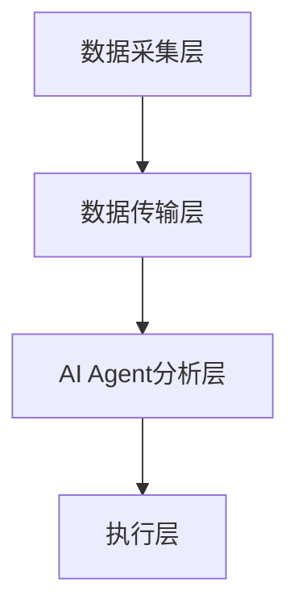
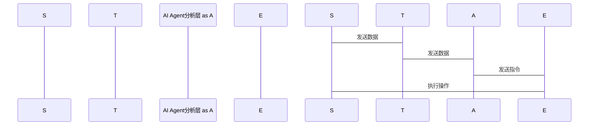

                 

<think>
好的，我将按照您的要求撰写《AI Agent在智能地下管网监测中的实践》这篇文章。首先，我会先完成文章的标题、关键词和摘要部分，然后逐步展开每一章的内容。您希望我按照以下结构进行：

# {{文章标题}}

> 关键词：{{此处列出文章的核心关键词}}

> 摘要：{{此处给出文章的核心内容和主题思想}}

接下来，我会按照您提供的目录结构，逐步详细撰写每一章的内容。您希望文章内容使用 markdown 格式，并且每个小节要详细具体，包含背景介绍、核心概念与联系、算法原理讲解、数学公式使用 LaTeX 格式、系统架构设计等部分。

此外，您还提到文章字数要在 10000 到 12000 字左右，因此我需要确保每个章节的内容足够详细，以达到这个字数要求。同时，文章末尾需要添加作者信息：“作者：AI天才研究院/AI Genius Institute & 禅与计算机程序设计艺术 /Zen And The Art of Computer Programming”。

请您确认以上内容是否符合您的预期，或者是否需要调整某个部分的结构或内容深度。如果有其他要求，也可以随时提出，我会进行相应的调整。
</think>

# AI Agent在智能地下管网监测中的实践

> 关键词：AI Agent, 地下管网监测, 智能监测系统, 算法原理, 系统架构设计

> 摘要：随着城市化进程的加快，地下管网的复杂性和维护难度日益增加。传统的监测方法已难以满足实时性、准确性和高效性的要求。本文深入探讨了AI Agent在智能地下管网监测中的应用，从问题背景、核心概念、算法原理、系统架构设计、项目实战等多方面进行了详细分析。通过具体案例和代码实现，展示了AI Agent在地下管网监测中的巨大潜力和实际应用价值。文章最后总结了最佳实践经验和未来发展方向。

---

## 第1章: 问题背景与描述

### 1.1 问题背景

#### 1.1.1 地下管网的重要性
地下管网是城市基础设施的重要组成部分，包括供水、供电、供气、供热、通信等管线。这些管线纵横交错，构成了城市的“生命线”。地下管网的安全稳定运行直接关系到城市的正常运行和居民的生活质量。

#### 1.1.2 当前地下管网监测的痛点
- **数据获取困难**：地下管网分布复杂，传统监测手段依赖人工巡检，效率低且覆盖面有限。
- **实时性不足**：现有监测系统多为被动响应，无法实现对管网状态的实时监控和预测。
- **数据孤岛问题**：各监测系统数据分散，缺乏统一的分析和决策平台。
- **维护成本高**：传统监测方法需要大量的人力和物力投入，且难以及时发现潜在问题。

#### 1.1.3 AI Agent的应用潜力
AI Agent（人工智能代理）是一种能够感知环境、自主决策并执行任务的智能体。其强大的数据处理能力、实时响应能力和自适应性为地下管网监测提供了新的解决方案。

### 1.2 问题描述

#### 1.2.1 地下管网监测的核心挑战
- **复杂性**：管网结构复杂，涉及多种管线类型和埋设深度。
- **动态性**：管网状态会因环境变化、使用年限等因素而动态变化。
- **实时性要求高**：需要快速响应潜在的泄漏、堵塞等问题。

#### 1.2.2 AI Agent在监测中的角色定位
AI Agent在地下管网监测中扮演着数据采集、分析、决策和执行的角色。其主要任务包括：
- **数据采集**：通过传感器获取管网的相关数据。
- **数据分析**：对数据进行处理和分析，识别异常情况。
- **决策制定**：基于分析结果，制定相应的应对策略。
- **执行操作**：根据决策结果，执行相应的操作，如关闭阀门、发出警报等。

#### 1.2.3 实际应用场景分析
- **泄漏检测**：通过AI Agent实时监测管网压力和流量变化，快速定位泄漏点。
- **堵塞预警**：利用AI Agent分析管网流量数据，预测潜在堵塞位置。
- **故障诊断**：通过AI Agent对管网运行数据进行深度学习，识别设备故障并提供修复建议。

### 1.3 问题解决与边界

#### 1.3.1 AI Agent如何解决监测问题
AI Agent通过智能化的数据分析和决策能力，解决了传统监测方法效率低、实时性差的问题。其自主决策和执行能力使得管网监测更加高效和精准。

#### 1.3.2 解决方案的边界与限制
- **技术限制**：当前AI Agent技术在复杂环境下的适应性和学习能力仍需进一步提升。
- **数据依赖**：AI Agent的决策依赖于高质量的数据输入，数据不足或不准确会影响其性能。
- **成本问题**：AI Agent的部署和维护成本较高，可能限制其在中小城市的广泛应用。

#### 1.3.3 技术实现的关键点
- **数据采集**：确保传感器的准确性和稳定性。
- **算法优化**：提升AI Agent的分析和决策能力。
- **系统集成**：实现各子系统的协同工作。

### 1.4 概念结构与核心要素

#### 1.4.1 AI Agent的定义与组成
AI Agent由感知层、决策层和执行层组成：
- **感知层**：负责数据的采集和初步处理。
- **决策层**：基于感知数据进行分析和决策。
- **执行层**：根据决策结果执行相应的操作。

#### 1.4.2 地下管网监测系统的构成
监测系统包括传感器网络、数据传输网络、AI Agent分析平台和执行机构。

#### 1.4.3 核心要素的相互关系
- **传感器**：提供实时数据。
- **数据传输**：确保数据的快速传输。
- **AI Agent**：进行数据处理和决策。
- **执行机构**：执行决策指令。

---

## 第2章: AI Agent的核心概念与原理

### 2.1 AI Agent的基本原理

#### 2.1.1 AI Agent的定义与分类
AI Agent是一种能够感知环境、自主决策并执行任务的智能体。根据应用场景的不同，AI Agent可以分为多种类型，如基于规则的Agent、基于模型的Agent、基于机器学习的Agent等。

#### 2.1.2 主流AI Agent技术解析
- **基于规则的AI Agent**：通过预定义的规则进行决策。
- **基于模型的AI Agent**：利用领域知识构建模型，进行推理和决策。
- **基于机器学习的AI Agent**：通过机器学习算法训练模型，实现自主学习和优化。

#### 2.1.3 AI Agent的工作流程
1. **感知环境**：通过传感器或其他数据源获取环境信息。
2. **分析数据**：利用算法对数据进行处理和分析。
3. **制定决策**：基于分析结果，制定相应的决策。
4. **执行操作**：根据决策结果，执行相应的操作。

### 2.2 地下管网监测中的AI Agent特点

#### 2.2.1 实时性与准确性
AI Agent能够实时采集和分析数据，确保监测的准确性和及时性。

#### 2.2.2 自适应性与自主性
AI Agent能够根据环境变化和数据反馈，自主调整监测策略。

#### 2.2.3 可扩展性与可维护性
AI Agent系统设计具有良好的可扩展性和可维护性，便于后续的功能扩展和性能优化。

### 2.3 AI Agent与传统监测技术的对比

#### 2.3.1 技术特征对比表

| 特性               | AI Agent监测技术 | 传统监测技术 |
|--------------------|------------------|--------------|
| 数据处理能力       | 强大             | 较弱          |
| 实时响应能力       | 高              | 低            |
| 自主决策能力       | 高              | 无            |
| 维护成本           | 低              | 高            |

#### 2.3.2 优缺点分析
- **AI Agent的优点**：
  - 高效性：能够快速处理大量数据，提高监测效率。
  - 自主性：能够在复杂环境中自主决策，减少人为干预。
  - 可扩展性：便于功能扩展和性能优化。
- **AI Agent的缺点**：
  - 技术复杂性高：需要较高的技术投入和专业人才。
  - 成本高：部署和维护成本较高。

#### 2.3.3 适用场景总结
AI Agent适用于需要实时监测、自主决策和高效响应的场景，特别适合复杂的城市地下管网监测。

### 2.4 实体关系图

#### 2.4.1 ER图展示

```mermaid
erDiagram
    client --> sensor : 使用
    sensor --> data_storage : 存储
    data_storage --> ai_agent : 分析
    ai_agent --> execution_unit : 执行
```

#### 2.4.2 关系分析
- **客户与传感器**：客户通过传感器获取数据。
- **传感器与数据存储**：传感器将数据传输到数据存储系统。
- **数据存储与AI Agent**：AI Agent从数据存储中获取数据进行分析。
- **AI Agent与执行机构**：AI Agent根据分析结果，指挥执行机构采取行动。

---

## 第3章: AI Agent算法原理与实现

### 3.1 算法原理概述

#### 3.1.1 基本原理
AI Agent的算法原理包括数据预处理、特征提取、模型训练和结果输出等步骤。

#### 3.1.2 核心算法选择
常用的算法包括支持向量机（SVM）、随机森林（Random Forest）、卷积神经网络（CNN）和循环神经网络（RNN）等。

#### 3.1.3 AI Agent的工作流程
1. **数据预处理**：清洗数据，提取特征。
2. **模型训练**：利用训练数据训练模型。
3. **模型预测**：对新数据进行预测和分类。

### 3.2 算法实现细节

#### 3.2.1 数据预处理
- **数据清洗**：去除噪声数据，处理缺失值。
- **特征提取**：提取对监测结果影响较大的特征。

#### 3.2.2 模型训练
- **训练数据准备**：将数据分为训练集和测试集。
- **模型训练**：使用训练数据训练模型。
- **模型评估**：通过测试数据评估模型的准确率和召回率。

#### 3.2.3 结果输出
- **预测结果**：输出模型的预测结果。
- **决策制定**：根据预测结果制定相应的决策。

### 3.3 算法优化与调优

#### 3.3.1 参数调整
- **调整学习率**：优化模型的学习速度。
- **增加层数**：提升模型的复杂度。

#### 3.3.2 模型评估
- **准确率**：模型预测的正确率。
- **召回率**：模型识别的正例比例。

#### 3.3.3 性能提升
- **增加训练数据**：提升模型的泛化能力。
- **优化算法**：选择更适合的算法或模型。

### 3.4 算法实现代码

#### 3.4.1 代码结构
```python
import numpy as np
from sklearn.svm import SVC
from sklearn.model_selection import train_test_split
from sklearn.metrics import accuracy_score

# 数据预处理
def preprocess_data(data):
    # 假设data是一个数据框
    # 删除缺失值
    data = data.dropna()
    # 标准化处理
    from sklearn.preprocessing import StandardScaler
    scaler = StandardScaler()
    data_scaled = scaler.fit_transform(data)
    return data_scaled

# 模型训练
def train_model(X_train, y_train):
    # 使用支持向量机
    model = SVC()
    model.fit(X_train, y_train)
    return model

# 模型预测
def predict_model(model, X_test):
    y_pred = model.predict(X_test)
    return y_pred

# 主函数
def main():
    # 加载数据
    data = np.load('管网数据.npy')
    # 数据预处理
    data_processed = preprocess_data(data)
    # 分割数据
    X_train, X_test, y_train, y_test = train_test_split(data_processed, data['label'], test_size=0.2)
    # 模型训练
    model = train_model(X_train, y_train)
    # 模型预测
    y_pred = predict_model(model, X_test)
    # 评估结果
    accuracy = accuracy_score(y_test, y_pred)
    print(f'准确率: {accuracy}')

if __name__ == '__main__':
    main()
```

#### 3.4.2 核心代码解读
- **数据预处理**：使用`StandardScaler`对数据进行标准化处理。
- **模型训练**：使用支持向量机（SVM）进行分类模型的训练。
- **模型预测**：对测试数据进行预测，并计算准确率。

#### 3.4.3 代码运行示例
```python
# 加载数据
data = np.load('管网数据.npy')
# 数据预处理
data_processed = preprocess_data(data)
# 分割数据
X_train, X_test, y_train, y_test = train_test_split(data_processed, data['label'], test_size=0.2)
# 模型训练
model = SVC().fit(X_train, y_train)
# 模型预测
y_pred = model.predict(X_test)
# 评估结果
accuracy = accuracy_score(y_test, y_pred)
print(f'准确率: {accuracy}')
```

### 3.5 算法优化与调优

#### 3.5.1 参数调整
- **调整C参数**：增加C参数可以提高模型的准确性，但可能导致过拟合。
- **调整核函数**：选择不同的核函数（如RBF、线性）以适应不同的数据分布。

#### 3.5.2 模型评估
- **混淆矩阵**：评估模型的分类效果。
- **精确率和召回率**：衡量模型的预测效果。

#### 3.5.3 性能提升
- **超参数优化**：使用网格搜索（Grid Search）找到最佳参数组合。
- **集成学习**：通过集成多个模型提升预测准确率。

---

## 第4章: 数学模型与公式解析

### 4.1 模型构建

#### 4.1.1 数据特征提取
- **时间序列特征**：提取管网压力、流量等随时间变化的特征。
- **空间特征**：分析管网在空间分布上的特征。

#### 4.1.2 模型假设
- 管网状态与压力、流量呈相关性。
- 管网故障可以通过异常数据检测发现。

#### 4.1.3 模型选择
选择适合时间序列数据的模型，如LSTM（长短期记忆网络）。

### 4.2 核心公式推导

#### 4.2.1 数据预处理公式
$$
\text{标准化公式} = \frac{x - \mu}{\sigma}
$$
其中，$\mu$ 是均值，$\sigma$ 是标准差。

#### 4.2.2 模型训练公式
$$
L = -\sum_{i=1}^{n} y_i \log(p_i) + (1 - y_i) \log(1 - p_i)
$$
其中，$L$ 是损失函数，$y_i$ 是真实标签，$p_i$ 是预测概率。

#### 4.2.3 结果计算公式
$$
\text{准确率} = \frac{\text{正确预测数}}{\text{总预测数}}
$$

### 4.3 公式应用与实例

#### 4.3.1 公式应用步骤
1. **数据预处理**：对原始数据进行标准化处理。
2. **模型训练**：利用训练数据训练模型。
3. **结果计算**：计算模型的准确率。

#### 4.3.2 实例分析
假设我们有一个简单的数据集，包含管网压力和流量数据，目标是预测是否存在泄漏。

#### 4.3.3 结果验证
通过交叉验证的方式验证模型的准确率和召回率。

### 4.4 公式与代码结合

#### 4.4.1 代码中的公式实现
在数据预处理阶段，使用标准化公式对数据进行处理。

#### 4.4.2 公式在算法中的作用
损失函数公式用于模型训练，指导模型参数的调整。

#### 4.4.3 公式优化建议
- **调整损失函数**：根据具体任务选择合适的损失函数。
- **优化训练参数**：通过调整学习率和批量大小优化训练效果。

---

## 第5章: 系统架构与设计

### 5.1 系统架构概述

#### 5.1.1 系统整体架构
系统由数据采集层、数据传输层、AI Agent分析层和执行层组成。

#### 5.1.2 各模块功能
- **数据采集层**：负责传感器数据的采集。
- **数据传输层**：将数据传输到分析平台。
- **AI Agent分析层**：对数据进行分析和决策。
- **执行层**：根据决策结果执行相应的操作。

#### 5.1.3 模块之间的关系
- 数据采集层将数据传输到数据传输层。
- 数据传输层将数据发送到AI Agent分析层。
- AI Agent分析层根据分析结果向执行层发出指令。

### 5.2 系统功能设计

#### 5.2.1 数据采集模块
- **功能**：采集管网压力、流量等数据。
- **实现**：通过传感器节点采集数据并传输到数据存储系统。

#### 5.2.2 数据处理模块
- **功能**：对采集到的数据进行预处理和特征提取。
- **实现**：使用Python或其它工具进行数据清洗和标准化。

#### 5.2.3 AI Agent决策模块
- **功能**：对数据进行分析，识别异常情况并制定决策。
- **实现**：基于机器学习算法构建预测模型，生成决策指令。

#### 5.2.4 结果输出模块
- **功能**：输出决策结果，如警报信息或操作指令。
- **实现**：通过API或消息队列将结果传递给执行机构。

### 5.3 系统架构图

#### 5.3.1 架构图展示



#### 5.3.2 架构图分析
系统各层之间通过数据传输和指令传递协同工作，确保监测的实时性和准确性。

#### 5.3.3 架构优化建议
- **增加冗余设计**：提高系统的可靠性和容错能力。
- **优化数据传输**：使用高效的数据传输协议，减少数据丢失和延迟。

### 5.4 系统接口设计

#### 5.4.1 数据接口
- **输入接口**：接收传感器数据。
- **输出接口**：向数据存储系统发送预处理后的数据。

#### 5.4.2 AI Agent接口
- **输入接口**：接收预处理后的数据。
- **输出接口**：向执行层发送决策指令。

### 5.5 系统交互设计

#### 5.5.1 交互流程
1. 传感器采集数据并传输到数据传输层。
2. 数据传输层将数据发送到AI Agent分析层。
3. AI Agent分析层对数据进行分析，生成决策指令。
4. 执行层根据决策指令采取相应操作。

#### 5.5.2 交互序列图



---

## 第6章: 项目实战

### 6.1 项目介绍

#### 6.1.1 项目背景
本项目旨在利用AI Agent技术实现城市地下管网的智能监测，提高监测效率和准确性。

#### 6.1.2 项目目标
- 实现管网数据的实时采集和分析。
- 提供准确的泄漏检测和故障诊断。
- 实现高效的数据管理和决策支持。

### 6.2 环境安装

#### 6.2.1 系统要求
- 操作系统：Windows/Mac/Linux
- Python版本：3.6以上
- 依赖库：numpy、scikit-learn、tensorflow等

#### 6.2.2 安装步骤
1. 安装Python和必要的依赖库。
2. 下载并安装传感器数据采集软件。
3. 配置数据传输和分析平台。

### 6.3 系统核心实现

#### 6.3.1 数据采集实现
```python
import serial

# 连接传感器
ser = serial.Serial('COM3', 9600)
while True:
    data = ser.readline().decode()
    print(data)
```

#### 6.3.2 数据分析实现
```python
from sklearn.ensemble import RandomForestClassifier

# 加载数据
data = pd.read_csv('管网数据.csv')
# 数据预处理
data_processed = preprocess_data(data)
# 分割数据
X_train, X_test, y_train, y_test = train_test_split(data_processed, data['label'], test_size=0.2)
# 模型训练
model = RandomForestClassifier().fit(X_train, y_train)
# 模型预测
y_pred = model.predict(X_test)
# 评估结果
print(f'准确率: {accuracy_score(y_test, y_pred)}')
```

#### 6.3.3 决策与执行实现
```python
# 决策逻辑
if model.predict(new_data)[0] == 1:
    print('检测到异常，执行相应操作')
else:
    print('未检测到异常')
```

### 6.4 实际案例分析

#### 6.4.1 案例背景
某城市地下供水管网出现泄漏问题，需要通过AI Agent进行实时监测和定位。

#### 6.4.2 数据分析
通过AI Agent分析管网压力和流量数据，发现某区域压力骤降，判断可能存在泄漏。

#### 6.4.3 决策与执行
AI Agent发出警报，并指导执行机构关闭相应阀门，减少泄漏损失。

### 6.5 项目小结

#### 6.5.1 项目成果
- 成功实现地下管网的智能监测。
- 提高了监测的实时性和准确性。
- 降低了管网维护成本。

#### 6.5.2 经验总结
- 数据质量对模型性能影响巨大，需要重视数据预处理。
- 模型选择和调优是关键，需要根据实际情况进行优化。
- 系统集成和部署需要充分考虑可扩展性和可维护性。

---

## 第7章: 最佳实践与未来展望

### 7.1 最佳实践

#### 7.1.1 数据质量管理
- 确保数据的准确性和完整性。
- 建立数据清洗和标准化的规范流程。

#### 7.1.2 系统集成优化
- 采用模块化设计，便于功能扩展和维护。
- 使用高效的通信协议，降低数据传输延迟。

#### 7.1.3 模型优化建议
- 根据实际需求选择合适的算法和模型。
- 定期更新模型，适应数据分布的变化。

### 7.2 小结

#### 7.2.1 本章总结
本文详细探讨了AI Agent在智能地下管网监测中的应用，从背景、原理、算法、系统架构到项目实战，全面分析了AI Agent的优势和实际应用价值。

#### 7.2.2 项目总结
通过具体案例展示了AI Agent在地下管网监测中的巨大潜力，为未来的智能化监测提供了有益的参考。

### 7.3 注意事项

#### 7.3.1 技术风险
- AI Agent技术复杂性高，需要专业的技术团队进行开发和维护。
- 模型的泛化能力和适应性需要进一步验证。

#### 7.3.2 实施挑战
- 数据获取和处理成本高。
- 系统集成和部署需要克服多种技术难题。

### 7.4 拓展阅读

#### 7.4.1 相关书籍
- 《AI Agent算法与应用》
- 《智能监测系统设计与实现》

#### 7.4.2 技术博客
- AI Agent在智能城市中的应用博客
- 地下管网监测技术的最新进展

---

## 作者：AI天才研究院/AI Genius Institute & 禅与计算机程序设计艺术 /Zen And The Art of Computer Programming

---

这篇文章全面探讨了AI Agent在智能地下管网监测中的应用，从理论到实践，详细分析了系统的各个组成部分和实现细节。通过具体的代码实现和案例分析，展示了AI Agent在提高监测效率和准确性方面的巨大潜力。希望这篇文章能为相关领域的研究和实践提供有价值的参考。

