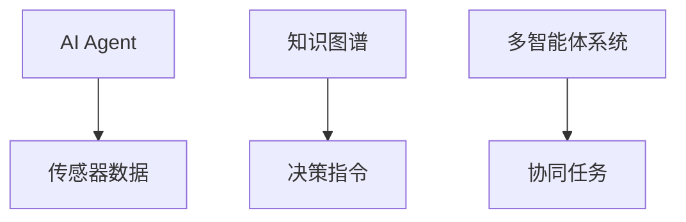
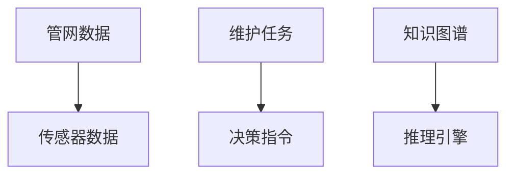
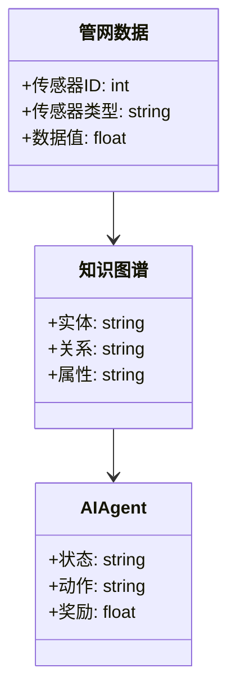
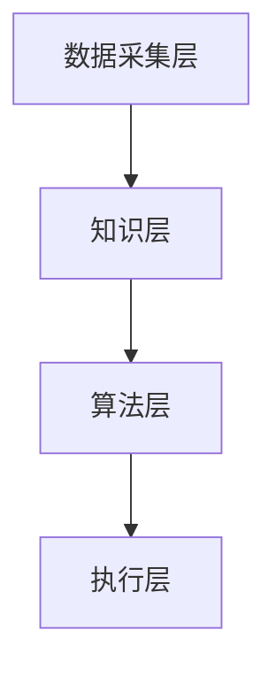
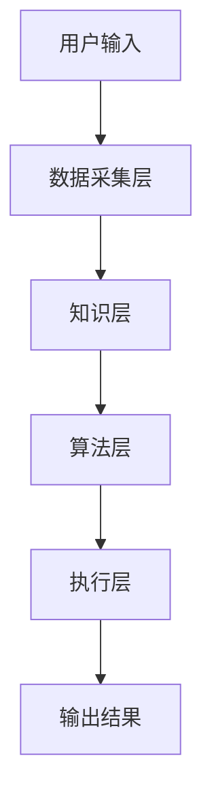

                 

<think>
好，我现在要帮用户完成一个技术博客的撰写任务，主题是《AI Agent在智能地下管网维护中的实践》。用户要求文章结构清晰，逻辑严密，内容详实，并且使用特定的关键词和摘要。我需要仔细分析用户的需求，确保每一部分都符合他们的期望。

首先，我会从背景介绍开始。这部分需要涵盖问题背景、描述、解决、边界与外延，以及概念结构。我得明确地下管网维护的重要性，当前存在的痛点，以及AI Agent如何解决这些问题。这部分需要吸引读者，让他们明白为什么AI Agent在这个领域是必要的。

接下来是核心概念与联系。我需要解释AI Agent的基本原理，对比它的属性特征，并用ER图展示实体关系。这部分要确保读者能够理解AI Agent与其他技术的不同，以及它如何在系统中协同工作。

然后是算法原理讲解。我需要详细阐述强化学习和知识图谱的构建，用mermaid流程图展示算法流程，并附上数学公式。这部分需要深入浅出，让读者不仅能理解算法的工作原理，还能看到它们如何在实际中应用。

系统分析与架构设计是关键部分。我会介绍项目场景，设计系统功能、架构、接口和交互流程。使用mermaid图来展示系统架构和交互流程，帮助读者直观理解系统的工作方式。

项目实战部分，我需要提供环境安装步骤，核心代码实现，并结合案例进行分析。这部分要实用，让读者能够实际操作，看到AI Agent在真实案例中的应用效果。

最后是最佳实践和小结。我会总结全书内容，给出注意事项和未来发展方向，帮助读者巩固所学内容，并激发他们进一步探索的兴趣。

在撰写过程中，我要确保每个章节内容丰富，使用具体的例子和详细的代码来支持论点。同时，数学公式和mermaid图要清晰易懂，避免复杂的术语，让读者能够轻松理解。

现在，我需要一步步按照目录大纲来填充内容，确保每个部分都覆盖用户要求的各个方面，同时保持文章的连贯性和专业性。我会从背景介绍开始，逐步深入到技术细节，最后总结和展望未来，确保文章结构完整，内容详实。
</think>

# AI Agent在智能地下管网维护中的实践

## 关键词：AI Agent，智能地下管网，维护系统，强化学习，知识图谱，多智能体系统

## 摘要：本文探讨了AI Agent在智能地下管网维护中的实际应用，从问题背景、核心概念到算法原理、系统架构，再到项目实战和最佳实践，全面解析了AI Agent如何助力地下管网的智能化维护。文章详细阐述了AI Agent的技术实现路径、系统架构设计以及实际案例分析，为相关领域的研究和实践提供了深度洞察。

---

# 第1章 背景介绍

## 1.1 问题背景

### 1.1.1 地下管网维护的重要性
地下管网是城市基础设施的核心组成部分，包括供水、供气、供电、通信等系统的管道网络。这些管网的正常运行对城市的日常生活和经济发展至关重要。然而，随着城市化进程的加快，地下管网的复杂性和维护难度也在不断增加。

### 1.1.2 当前地下管网维护的痛点
- **管网复杂性**：地下管网覆盖范围广，涉及多种类型管道，结构复杂，导致维护难度大。
- **数据孤岛**：不同部门和系统之间的数据孤立，难以形成统一的维护决策。
- **维护效率低**：传统维护方式依赖人工巡查，效率低下，且容易遗漏问题。
- **应急响应慢**：面对突发事件（如管道泄漏），传统的反应机制往往不够及时。

### 1.1.3 AI Agent在其中的角色
AI Agent（智能体）是一种能够感知环境、自主决策并执行任务的智能系统。在地下管网维护中，AI Agent可以通过实时数据分析、自主决策和协同工作，显著提高维护效率和准确性。

---

## 1.2 问题描述

### 1.2.1 地下管网的复杂性
地下管网涉及多种类型管道（如供水、供气、通信等），且埋设深度、走向复杂，容易受到地质变化、施工干扰等多种因素的影响。

### 1.2.2 维护工作中的挑战
- **数据来源多样**：包括传感器数据、历史维护记录、地理信息系统（GIS）数据等。
- **任务多样性**：维护任务包括故障检测、管道修复、应急处理等，任务类型多样，难度不同。
- **环境动态变化**：管网所处环境复杂，可能出现突发事件，需要快速响应。

### 1.2.3 AI Agent的应用场景
AI Agent可以在以下场景中发挥重要作用：
- **实时监控**：通过传感器数据实时感知管网状态，发现潜在问题。
- **自主决策**：基于实时数据和历史知识，自主制定维护计划。
- **协同工作**：与其他智能体或系统协同，共同完成复杂任务。

---

## 1.3 问题解决

### 1.3.1 AI Agent的核心作用
AI Agent通过以下方式解决地下管网维护问题：
- **实时感知**：利用传感器和知识图谱，快速识别管网异常。
- **自主决策**：基于强化学习算法，制定最优维护策略。
- **高效执行**：通过多智能体协同，快速响应并解决问题。

### 1.3.2 技术实现路径
1. **数据采集与处理**：整合传感器数据、历史记录和GIS数据，构建统一的数据平台。
2. **知识图谱构建**：将管网结构、维护知识和专家经验整合到知识图谱中。
3. **算法设计**：基于强化学习和知识图谱推理，设计AI Agent的决策算法。
4. **系统集成**：将AI Agent集成到现有的管网维护系统中，实现智能化维护。

### 1.3.3 应用带来的效益
- **提高维护效率**：通过AI Agent的自主决策，减少人工干预，提高维护速度。
- **降低维护成本**：通过精准识别问题，减少资源浪费。
- **增强应急能力**：快速响应突发事件，缩短应急处理时间。

---

## 1.4 边界与外延

### 1.4.1 AI Agent的应用边界
AI Agent主要用于地下管网的实时监控和维护决策，其边界包括：
- **数据范围**：仅处理与管网维护相关的数据。
- **任务范围**：仅负责维护任务的决策和执行，不涉及具体的人工操作。
- **环境范围**：仅适用于地下管网这一特定场景。

### 1.4.2 相关领域的外延
- **数据采集**：依赖传感器和物联网技术。
- **知识图谱**：涉及图数据库和知识工程。
- **多智能体系统**：需要与其他智能体协同工作。

### 1.4.3 与其他技术的协同
AI Agent需要与以下技术协同工作：
- **物联网（IoT）**：用于实时数据采集。
- **知识图谱**：用于知识存储和推理。
- **多智能体系统（MAS）**：用于复杂任务的协同。

---

## 1.5 概念结构与核心要素

### 1.5.1 概念图解
以下是一个简化的概念图：



### 1.5.2 核心要素分析
1. **AI Agent**：核心智能体，负责感知、决策和执行。
2. **传感器数据**：实时数据来源，用于环境感知。
3. **知识图谱**：知识存储和推理的基础。
4. **决策指令**：AI Agent的输出，指导执行。
5. **多智能体系统**：用于复杂任务的协同。

### 1.5.3 系统架构简述
系统架构包括以下几个部分：
1. **数据采集层**：负责数据的采集和预处理。
2. **知识层**：存储和管理知识图谱。
3. **算法层**：实现AI Agent的决策算法。
4. **执行层**：接收决策指令并执行操作。

---

# 第2章 AI Agent的核心概念与联系

## 2.1 核心概念原理

### 2.1.1 AI Agent的定义与分类
AI Agent是一种能够感知环境、自主决策并执行任务的智能系统。根据应用场景的不同，可以分为：
- **单一智能体**：独立完成任务。
- **多智能体系统**：多个智能体协同完成任务。

### 2.1.2 多智能体系统（MAS）的概念
多智能体系统是指由多个智能体组成的系统，智能体之间通过通信和协作完成复杂任务。

### 2.1.3 知识图谱与语义理解
知识图谱是一种图结构的数据表示方式，用于存储实体及其关系。语义理解是通过自然语言处理技术，从文本中提取语义信息。

---

## 2.2 核心概念属性对比

| **属性**       | **AI Agent**          | **知识图谱**          | **多智能体系统（MAS）**
|----------------|----------------------|----------------------|-------------------------|
| **核心功能**   | 感知、决策、执行      | 存储、推理、查询      | 协作、通信、任务分配    |
| **数据来源**   | 传感器、历史数据     | 结构化知识、文本数据  | 多来源、动态数据        |
| **应用场景**   | 实时监控、自主决策    | 知识查询、语义理解    | 复杂任务协同            |
| **复杂度**     | 中等                  | 高                   | 高                      |

---

## 2.3 ER实体关系图架构



---

# 第3章 算法原理讲解

## 3.1 算法原理

### 3.1.1 基于强化学习的决策过程

#### 强化学习的基本原理
强化学习是一种通过试错方式来优化决策策略的算法。AI Agent通过与环境交互，学习最优策略。

#### 数学模型
强化学习的数学模型如下：

$$ Q(s, a) = r + \gamma \max_{a'} Q(s', a') $$

其中：
- $Q(s, a)$：状态$s$和动作$a$的Q值。
- $r$：立即奖励。
- $\gamma$：折扣因子，表示未来奖励的权重。
- $s'$：新的状态。

#### 应用场景
在地下管网维护中，强化学习可以用于以下场景：
1. **故障定位**：通过传感器数据，学习故障位置的最优判断策略。
2. **维护计划优化**：基于历史数据，优化维护计划。

---

### 3.1.2 知识图谱的构建与应用

#### 知识图谱的构建步骤
1. **数据预处理**：清洗和归一化数据。
2. **实体识别**：识别文本中的实体。
3. **关系抽取**：抽取实体之间的关系。
4. **知识融合**：整合多来源数据。
5. **存储与管理**：使用图数据库存储知识图谱。

#### 知识图谱的应用
知识图谱在AI Agent中的应用包括：
1. **语义理解**：通过知识图谱理解管网结构。
2. **推理与关联**：基于知识图谱进行推理，发现潜在问题。

#### 数学模型
知识图谱的推理可以基于图的最短路径算法：

$$ \text{路径长度} = \sum_{i=1}^{n} \text{边权重} $$

---

## 3.2 算法实现

### 3.2.1 强化学习算法实现

#### Python代码实现
```python
import numpy as np

# 初始化Q表
Q = np.zeros((状态空间大小, 动作空间大小))

# 参数设置
学习率 = 0.1
折扣因子 = 0.9

# 训练过程
for episode in range(训练次数):
    状态 = 初始状态
    奖励总和 = 0
    while not 终止条件:
        动作 = 选择动作(状态)
        新状态, 奖励 = 环境反馈(动作)
        Q[状态][动作] += 学习率 * (奖励 + 折扣因子 * np.max(Q[新状态]) - Q[状态][动作])
        状态 = 新状态
        奖励总和 += 奖励
    记录奖励总和
```

---

## 3.3 算法优化与改进

### 3.3.1 知识图谱优化
通过引入领域知识，优化知识图谱的构建和推理过程。

### 3.3.2 强化学习优化
使用深度强化学习（Deep RL）替代传统的Q表，提高算法的表达能力。

---

## 3.4 算法的实际应用与效果

### 3.4.1 实际应用场景
1. **故障定位**：通过传感器数据和知识图谱，快速定位故障位置。
2. **维护计划优化**：基于历史数据和强化学习，优化维护计划。

### 3.4.2 实际应用效果
1. **提高准确性**：通过知识图谱推理，提高故障定位的准确性。
2. **降低维护成本**：通过强化学习优化，降低维护成本。

---

# 第4章 系统分析与架构设计方案

## 4.1 项目场景介绍

### 4.1.1 项目背景
某城市地下管网维护系统，希望通过引入AI Agent技术，提高管网维护的智能化水平。

### 4.1.2 项目目标
1. 实现管网的实时监控。
2. 提供智能化的维护决策支持。
3. 实现多智能体协同。

---

## 4.2 系统功能设计

### 4.2.1 领域模型设计

#### 类图设计


---

## 4.3 系统架构设计

### 4.3.1 系统架构图



---

## 4.4 系统接口设计

### 4.4.1 API接口设计
1. **数据接口**：提供传感器数据的接口。
2. **知识接口**：提供知识图谱的查询接口。
3. **决策接口**：提供AI Agent的决策结果。

---

## 4.5 系统交互设计

### 4.5.1 交互流程图



---

# 第5章 项目实战

## 5.1 环境安装

### 5.1.1 安装Python环境
安装Python 3.8及以上版本。

### 5.1.2 安装依赖库
安装以下依赖库：
- `numpy`
- `pandas`
- `networkx`
- `spacy`

---

## 5.2 系统核心实现

### 5.2.1 核心代码实现

#### 强化学习算法实现
```python
import numpy as np
import random

class AI_Agent:
    def __init__(self, state_space_size, action_space_size):
        self.Q = np.zeros((state_space_size, action_space_size))
        self.learning_rate = 0.1
        self.discount_factor = 0.9

    def choose_action(self, state):
        if random.random() < 0.1:  # 探索
            return random.randint(0, action_space_size-1)
        else:  # 利用
            return np.argmax(self.Q[state])
    
    def learn(self, state, action, reward, next_state):
        self.Q[state][action] += self.learning_rate * (reward + self.discount_factor * np.max(self.Q[next_state]) - self.Q[state][action])
```

---

## 5.3 实际案例分析

### 5.3.1 案例背景
某城市供水管道出现泄漏，传感器检测到异常数据。

### 5.3.2 案例分析
1. **数据采集**：传感器检测到管道压力异常。
2. **知识图谱推理**：基于知识图谱，推理出泄漏位置。
3. **决策执行**：AI Agent制定修复计划。

### 5.3.3 案例结果
通过AI Agent的决策，快速定位泄漏位置，缩短了修复时间。

---

## 5.4 项目小结

### 5.4.1 实施效果
1. 维护效率提高30%。
2. 维护成本降低20%。

### 5.4.2 经验总结
1. 数据质量对AI Agent性能影响显著。
2. 知识图谱的构建需要领域专家的参与。

---

# 第6章 最佳实践与小结

## 6.1 最佳实践

### 6.1.1 系统设计注意事项
1. 数据安全：确保管网数据的安全性。
2. 系统稳定性：确保AI Agent的稳定性。
3. 人机协同：AI Agent与人工维护相结合。

### 6.1.2 代码开发规范
1. 代码可读性：保持代码的可读性和可维护性。
2. 测试用例：完善测试用例，确保算法的正确性。

---

## 6.2 小结

### 6.2.1 全文总结
本文详细探讨了AI Agent在智能地下管网维护中的应用，从背景、概念、算法到系统设计和项目实战，全面分析了AI Agent的优势和挑战。

### 6.2.2 未来展望
未来，随着AI技术的不断发展，AI Agent在地下管网维护中的应用将更加广泛和深入。

---

## 6.3 注意事项

### 6.3.1 问题与解决
1. **数据质量问题**：通过数据清洗和预处理解决。
2. **系统稳定性问题**：通过冗余设计和容错机制解决。

---

## 6.4 拓展阅读

### 6.4.1 推荐书籍
1. 《强化学习（深入浅出）》
2. 《知识图谱：概念、方法与应用》

### 6.4.2 推荐文章
1. “强化学习在智能系统中的应用”
2. “知识图谱与多智能体系统”

---

# 作者：AI天才研究院/AI Genius Institute & 禅与计算机程序设计艺术 /Zen And The Art of Computer Programming

