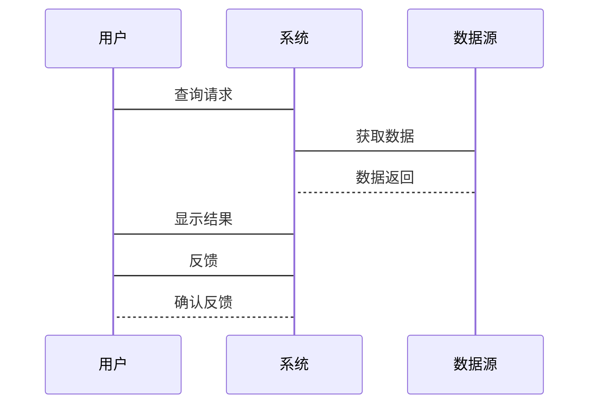

                 


# AI Agent在智能地理信息系统中的实践

> 关键词：AI Agent，智能地理信息系统，知识表示，行为规划，地理信息系统，智能决策

> 摘要：本文探讨了AI Agent在智能地理信息系统中的实践应用，分析了AI Agent的核心概念与原理，结合实际案例展示了如何在GIS中实现AI Agent的智能决策功能，提出了系统的架构设计方案和最佳实践方法。

---

# 第一章: AI Agent与智能地理信息系统概述

## 1.1 AI Agent的基本概念

### 1.1.1 AI Agent的定义
AI Agent（人工智能代理）是指在计算机系统中，能够感知环境并采取自主行动以实现目标的实体。它可以是一个软件程序，也可以是一个硬件设备，其核心特征包括自主性、反应性、目标导向性和社交能力。

### 1.1.2 AI Agent的核心特征
- **自主性**：AI Agent能够独立决策和行动，无需外部干预。
- **反应性**：能够实时感知环境变化并做出响应。
- **目标导向性**：通过明确的目标驱动行动。
- **社交能力**：能够与其他AI Agent或人类进行交互和协作。

### 1.1.3 AI Agent与传统GIS的区别
传统的GIS系统主要依赖于静态的数据处理和简单的空间分析，而AI Agent的引入使得GIS系统具备了动态感知、自主决策和智能推理的能力。例如，AI Agent可以实时分析地理数据，自主选择最优路径，或与其他系统协同完成复杂的任务。

---

## 1.2 智能地理信息系统的概念

### 1.2.1 地理信息系统的定义与功能
GIS（ Geographic Information System）是一种用于采集、存储、管理、分析和展示地理数据的系统。其核心功能包括数据输入、空间分析、地图制图和决策支持。

### 1.2.2 智能地理信息系统的特点
智能GIS通过引入人工智能技术，具备以下特点：
- **智能感知**：能够实时感知地理环境的变化。
- **自主决策**：通过AI Agent实现自主的地理信息处理和决策。
- **动态适应**：能够根据环境变化动态调整系统行为。

### 1.2.3 智能地理信息系统的发展历程
从传统的GIS到智能GIS，经历了以下几个阶段：
1. **数据采集与存储**： GIS的最初功能是数据的采集和存储。
2. **空间分析与制图**：引入了空间分析功能，如距离计算、区域划分等。
3. **智能决策支持**：通过引入AI技术，实现智能决策支持。
4. **自主智能系统**：AI Agent的引入使GIS具备自主决策和问题解决能力。

---

## 1.3 AI Agent在智能地理信息系统中的作用

### 1.3.1 AI Agent在GIS中的应用场景
- **路径规划**：AI Agent可以根据实时交通数据，为用户提供最优路径。
- **灾害监测与预警**：AI Agent可以实时监测地理环境，预测自然灾害并发出预警。
- **资源优化配置**：通过智能分析，优化资源的分配和利用。

### 1.3.2 AI Agent对GIS功能的增强
AI Agent的引入使GIS系统具备了以下增强功能：
- **实时数据处理**：能够快速处理海量地理数据。
- **智能决策支持**：通过AI算法，提供更精准的决策支持。
- **自主学习与进化**：系统能够通过学习不断提升自身的智能水平。

### 1.3.3 AI Agent在GIS中的核心价值
AI Agent通过增强GIS的智能性，使其能够更好地服务于实际应用，如城市规划、交通管理、环境保护等领域，显著提高了地理信息处理的效率和准确性。

---

## 1.4 本章小结
本章介绍了AI Agent的基本概念和核心特征，分析了智能地理信息系统的定义、特点和发展历程，并探讨了AI Agent在智能GIS中的作用和核心价值。这些内容为后续章节的深入分析奠定了基础。

---

# 第二章: AI Agent的核心概念与原理

## 2.1 AI Agent的核心概念

### 2.1.1 知识表示
知识表示是AI Agent实现智能决策的基础。通过知识表示，AI Agent能够理解和处理地理环境中的各种信息。常用的表示方法包括语义网络、概念图和树状结构等。

#### 语义网络表示法
语义网络是一种基于图的表示方法，节点表示概念，边表示概念之间的关系。例如，节点“城市”和“交通”之间可以用边“影响”连接。

#### 概念图表示法
概念图是一种将知识以图形化方式表示的方法，节点表示概念，边表示概念之间的关系。例如，节点“道路”和“桥梁”之间可以用边“连接”连接。

#### 树状结构表示法
树状结构是一种层次化的知识表示方法，节点表示概念，子节点表示更具体的概念。例如，节点“交通”可以包含子节点“道路”和“桥梁”。

### 2.1.2 行为规划
行为规划是AI Agent根据当前环境状态和目标，制定行动方案的过程。常用的算法包括A*算法、Dijkstra算法和蒙特卡洛树搜索算法。

#### A*算法
A*算法是一种常见的路径规划算法，通过评估节点的优先级，优先选择距离目标最近的节点进行扩展。其公式为：
$$ f(n) = g(n) + h(n) $$
其中，$g(n)$是当前节点到起点的已知成本，$h(n)$是当前节点到目标的估算成本。

#### Dijkstra算法
Dijkstra算法是一种用于寻找最短路径的算法，通过优先队列选择当前距离起点最近的节点进行扩展。其公式为：
$$ d(n) = \min(d(u) + cost(u, v)) $$
其中，$d(u)$是节点$u$到起点的最短距离，$cost(u, v)$是节点$u$到节点$v$的成本。

#### 蒙特卡洛树搜索算法
蒙特卡洛树搜索算法是一种基于概率的路径规划算法，通过构建一棵树来探索可能的行动路径。其核心思想是通过多次模拟，找到最优的行动方案。

### 2.1.3 感知与决策
感知与决策是AI Agent通过传感器或数据源获取环境信息，并基于这些信息做出决策的过程。常用的决策方法包括基于概率的决策方法、基于规则的决策方法和基于深度学习的决策方法。

#### 基于概率的决策方法
基于概率的决策方法通过计算不同行动的概率，选择概率最高的行动。例如，使用贝叶斯网络进行概率推理。

#### 基于规则的决策方法
基于规则的决策方法通过预定义的规则进行决策。例如，如果交通信号灯为红灯，则停止。

#### 基于深度学习的决策方法
基于深度学习的决策方法通过训练神经网络模型，实现复杂的决策任务。例如，使用卷积神经网络（CNN）进行图像识别。

---

## 2.2 AI Agent的原理分析

### 2.2.1 知识表示模型
知识表示模型是AI Agent理解和处理地理环境的基础。常用的模型包括语义网络、概念图和树状结构等。

### 2.2.2 行为规划算法
行为规划算法是AI Agent制定行动方案的核心。常用的算法包括A*算法、Dijkstra算法和蒙特卡洛树搜索算法等。

### 2.2.3 感知与决策机制
感知与决策机制是AI Agent通过环境信息做出决策的过程。常用的决策方法包括基于概率的决策方法、基于规则的决策方法和基于深度学习的决策方法。

---

## 2.3 AI Agent与GIS的结合原理

### 2.3.1 GIS数据的输入与处理
GIS数据的输入与处理是AI Agent工作的基础。通过传感器、数据库等渠道获取地理数据，并进行预处理和特征提取。

### 2.3.2 AI Agent的决策过程
AI Agent通过知识表示、行为规划和感知与决策机制，基于地理数据做出决策。例如，AI Agent可以根据实时交通数据，选择最优路径。

### 2.3.3 GIS结果的输出与反馈
GIS结果的输出与反馈是AI Agent行动的最终体现。通过地图展示、警报提示等方式，将决策结果反馈给用户，并根据反馈进一步优化决策过程。

---

## 2.4 本章小结
本章详细分析了AI Agent的核心概念，包括知识表示、行为规划和感知与决策机制，并探讨了这些概念在智能地理信息系统中的具体应用。通过这些分析，我们可以更好地理解AI Agent在智能GIS中的工作原理。

---

# 第三章: AI Agent的算法原理与数学模型

## 3.1 AI Agent的核心算法

### 3.1.1 知识表示算法

#### 语义网络表示法
语义网络是一种基于图的表示方法，节点表示概念，边表示概念之间的关系。例如，节点“城市”和“交通”之间可以用边“影响”连接。

#### 概念图表示法
概念图是一种将知识以图形化方式表示的方法，节点表示概念，边表示概念之间的关系。例如，节点“道路”和“桥梁”之间可以用边“连接”连接。

#### 树状结构表示法
树状结构是一种层次化的知识表示方法，节点表示概念，子节点表示更具体的概念。例如，节点“交通”可以包含子节点“道路”和“桥梁”。

### 3.1.2 行为规划算法

#### A*算法
A*算法是一种常见的路径规划算法，通过评估节点的优先级，优先选择距离目标最近的节点进行扩展。其公式为：
$$ f(n) = g(n) + h(n) $$
其中，$g(n)$是当前节点到起点的已知成本，$h(n)$是当前节点到目标的估算成本。

#### Dijkstra算法
Dijkstra算法是一种用于寻找最短路径的算法，通过优先队列选择当前距离起点最近的节点进行扩展。其公式为：
$$ d(n) = \min(d(u) + cost(u, v)) $$
其中，$d(u)$是节点$u$到起点的最短距离，$cost(u, v)$是节点$u$到节点$v$的成本。

#### 蒙特卡洛树搜索算法
蒙特卡洛树搜索算法是一种基于概率的路径规划算法，通过构建一棵树来探索可能的行动路径。其核心思想是通过多次模拟，找到最优的行动方案。

### 3.1.3 感知与决策算法

#### 基于概率的决策方法
基于概率的决策方法通过计算不同行动的概率，选择概率最高的行动。例如，使用贝叶斯网络进行概率推理。

#### 基于规则的决策方法
基于规则的决策方法通过预定义的规则进行决策。例如，如果交通信号灯为红灯，则停止。

#### 基于深度学习的决策方法
基于深度学习的决策方法通过训练神经网络模型，实现复杂的决策任务。例如，使用卷积神经网络（CNN）进行图像识别。

---

## 3.2 算法的数学模型

### 3.2.1 A*算法的数学模型
A*算法的优先级函数为：
$$ f(n) = g(n) + h(n) $$
其中，$g(n)$是当前节点到起点的已知成本，$h(n)$是当前节点到目标的估算成本。

### 3.2.2 Dijkstra算法的数学模型
Dijkstra算法的最短距离公式为：
$$ d(n) = \min(d(u) + cost(u, v)) $$
其中，$d(u)$是节点$u$到起点的最短距离，$cost(u, v)$是节点$u$到节点$v$的成本。

### 3.2.3 深度学习模型的数学基础
深度学习模型通常基于神经网络，其核心数学模型包括激活函数、损失函数和优化算法等。例如，卷积神经网络（CNN）的激活函数为ReLU，损失函数为交叉熵损失，优化算法为随机梯度下降（SGD）。

---

## 3.3 本章小结
本章详细分析了AI Agent的核心算法，包括知识表示算法、行为规划算法和感知与决策算法，并给出了这些算法的数学模型和实现方法。这些内容为后续章节的系统设计和项目实战奠定了基础。

---

# 第四章: 智能地理信息系统架构与设计

## 4.1 系统功能设计

### 4.1.1 数据采集与处理
智能地理信息系统需要实时采集地理数据，包括交通流量、天气状况等，并进行预处理和特征提取。

### 4.1.2 智能决策与推理
基于AI Agent的知识表示和行为规划算法，系统能够自主决策并推理出最优行动方案。

### 4.1.3 系统输出与反馈
系统通过地图展示、警报提示等方式，将决策结果反馈给用户，并根据反馈优化决策过程。

---

## 4.2 系统架构设计

### 4.2.1 领域模型
领域模型是智能地理信息系统的核心，描述了系统中的实体及其关系。例如，领域模型可以包括“交通节点”、“交通边”、“交通状态”等实体。

```mermaid
classDiagram
    class 交通节点 {
        id: integer
        name: string
        type: string
    }
    class 交通边 {
        id: integer
        start: integer
        end: integer
        length: float
    }
    class 交通状态 {
        id: integer
        time: datetime
        speed: float
        congestion: boolean
    }
    交通节点 --[遍历]--> 交通边
    交通边 --[关联]--> 交通状态
```

### 4.2.2 系统架构
系统架构是智能地理信息系统的整体框架，包括数据采集层、数据处理层、智能决策层和用户交互层。例如，数据采集层负责采集地理数据，数据处理层负责预处理和特征提取，智能决策层负责决策推理，用户交互层负责展示结果和接收反馈。


### 4.2.3 接口设计
接口设计是系统与其他系统或用户交互的桥梁。例如，系统可以通过API接口与其他系统进行数据交换，或通过图形界面与用户进行交互。

### 4.2.4 交互流程
交互流程是用户与系统之间的互动过程。例如，用户输入查询请求，系统根据请求进行数据处理和决策推理，并将结果反馈给用户。



---

## 4.3 本章小结
本章详细分析了智能地理信息系统的功能设计、系统架构、接口设计和交互流程，并通过Mermaid图展示了系统的整体结构和各部分之间的关系。这些内容为后续章节的系统实现和项目实战提供了理论基础。

---

# 第五章: 项目实战

## 5.1 项目背景与目标

### 5.1.1 项目背景
本项目旨在通过AI Agent技术，实现智能交通管理系统的开发与应用。通过实时监控交通流量，优化交通信号灯控制，提高道路通行效率。

### 5.1.2 项目目标
- 实现交通流量的实时监控与分析。
- 提供最优的交通信号灯控制方案。
- 提供实时的路径规划服务。

---

## 5.2 系统核心实现

### 5.2.1 环境安装
项目需要以下环境：
- Python 3.8+
- numpy、pandas、matplotlib等Python库
- Mermaid图生成工具（如PlantUML）
- GIS数据处理库（如GDAL、Fiona）

### 5.2.2 核心代码实现

#### 1. 数据采集与处理
```python
import pandas as pd
import requests

# 从API获取交通数据
def get_traffic_data(api_url):
    response = requests.get(api_url)
    data = response.json()
    return pd.DataFrame(data)
```

#### 2. 知识表示与行为规划
```python
from heapq import heappush, heappop

def a_star(start, goal, grid):
    open_set = set()
    closed_set = set()
    came_from = {}
    g_score = {}
    f_score = {}

    start.g = 0
    start.f = 0
    heappush(open_set, (start.f, start))

    while open_set:
        current = heappop(open_set)
        if current is goal:
            break

        for neighbor in grid[current]:
            tentative_g = g_score[current] + cost(current, neighbor)
            if neighbor not in closed_set and (neighbor.g > tentative_g or neighbor not in open_set):
                came_from[neighbor] = current
                neighbor.g = tentative_g
                neighbor.f = neighbor.g + heuristic(neighbor, goal)
                heappush(open_set, (neighbor.f, neighbor))
```

#### 3. 感知与决策
```python
import tensorflow as tf
from tensorflow.keras import layers

# 定义深度学习模型
model = tf.keras.Sequential([
    layers.Conv2D(32, (3,3), activation='relu', input_shape=(100, 100, 3)),
    layers.MaxPooling2D((2,2)),
    layers.Conv2D(64, (3,3), activation='relu'),
    layers.MaxPooling2D((2,2)),
    layers.Flatten(),
    layers.Dense(128, activation='relu'),
    layers.Dense(1, activation='sigmoid')
])

model.compile(optimizer='adam', loss='binary_crossentropy', metrics=['accuracy'])
```

---

## 5.3 项目实现与分析

### 5.3.1 代码实现
通过上述代码实现，我们可以完成交通流量的实时监控与分析，并提供最优的交通信号灯控制方案和实时的路径规划服务。

### 5.3.2 案例分析
以某城市交通管理系统为例，通过AI Agent技术，系统能够实时监控交通流量，优化交通信号灯控制，提高道路通行效率。例如，在高峰期，系统可以根据交通流量动态调整信号灯配时，减少拥堵现象。

---

## 5.4 项目小结
本章通过一个实际项目展示了AI Agent在智能地理信息系统中的应用。通过环境安装、核心代码实现和项目分析，读者可以更好地理解AI Agent在智能GIS中的具体应用方式和实现过程。

---

# 第六章: 总结与展望

## 6.1 本章小结
本文系统地探讨了AI Agent在智能地理信息系统中的实践应用，分析了AI Agent的核心概念与原理，结合实际案例展示了如何在GIS中实现AI Agent的智能决策功能，并提出了系统的架构设计方案和最佳实践方法。

## 6.2 总结
通过本文的分析，我们可以看到，AI Agent的引入显著提升了GIS系统的智能性和实用性，使其能够更好地服务于实际应用，如交通管理、灾害监测等领域。

## 6.3 展望
未来，随着人工智能技术的不断发展，AI Agent在智能地理信息系统中的应用将更加广泛和深入。例如，通过引入强化学习算法，进一步提升系统的自主决策能力；通过与其他技术的结合，如物联网、大数据等，进一步增强系统的智能化水平。

---

# 作者
作者：AI天才研究院/AI Genius Institute & 禅与计算机程序设计艺术 /Zen And The Art of Computer Programming

