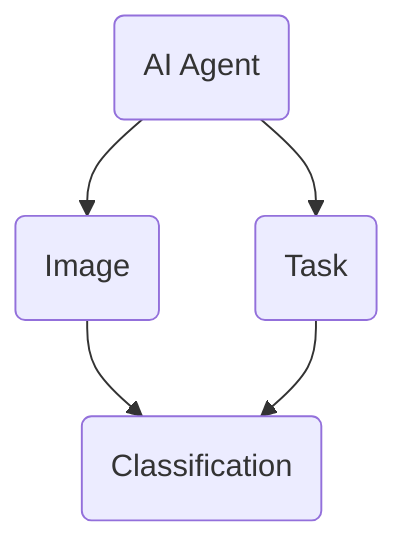
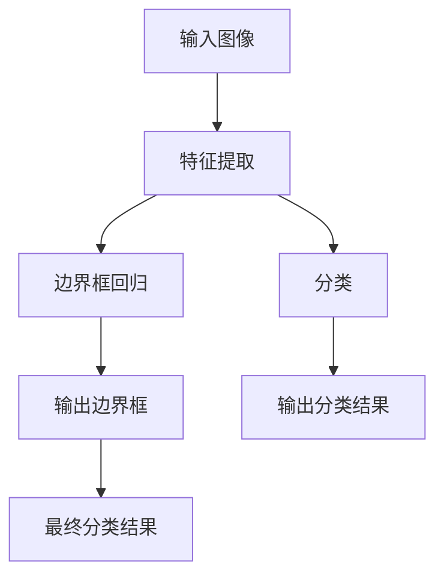
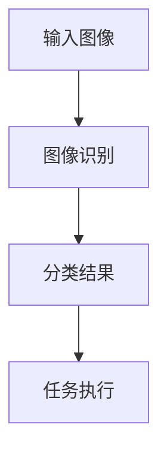
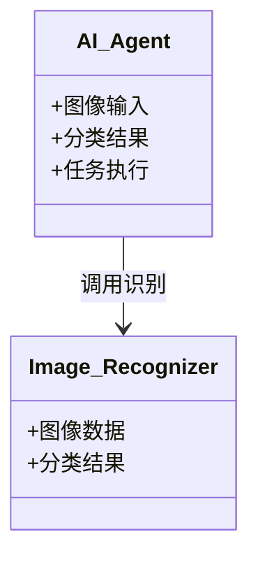
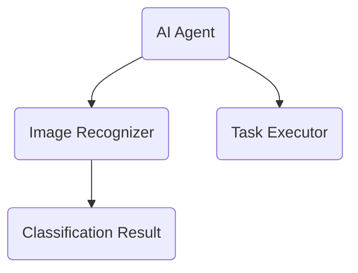
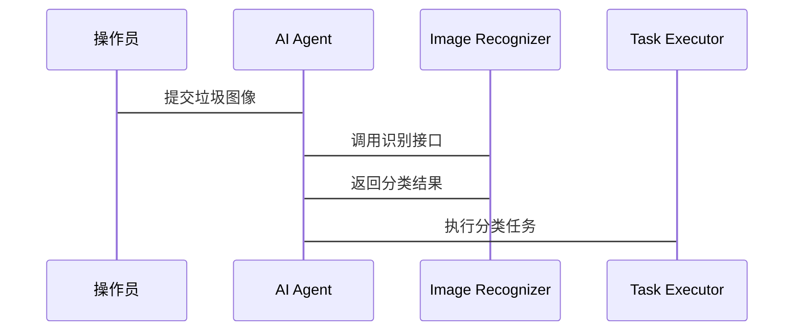

                 

<think>
好的，我现在要撰写一篇关于《AI Agent在智能垃圾分类识别中的实践》的技术博客文章。首先，我需要理解这个主题的核心概念和应用背景。

首先，智能垃圾分类是一个重要但复杂的任务。传统的人工分类效率低，且容易出错。AI Agent的引入可以提高分类的准确性和效率。AI Agent是一种智能代理，能够执行任务、做决策，并与环境交互。图像识别技术则是AI Agent在垃圾分类中的关键工具，能够识别不同类型的垃圾。

接下来，我需要详细分析AI Agent和图像识别的核心原理。AI Agent的基本原理包括感知、决策和执行三个步骤，而图像识别技术则依赖于深度学习算法，如YOLO和Faster R-CNN。这两者的结合能够实现高效的垃圾分类。

在算法部分，我需要解释YOLO的数学模型，包括锚框、损失函数和非极大值抑制等概念。同时，还要展示如何用Python代码实现这些算法，并用Mermaid流程图展示整个识别流程。

接下来是系统设计部分，我需要介绍项目的应用场景，并用Mermaid类图和架构图展示系统的结构。这部分要确保读者能够理解系统各组件之间的关系和交互方式。

在项目实战部分，我需要提供详细的代码示例和环境配置步骤，让读者能够实际操作。同时，通过案例分析展示AI Agent在实际垃圾分类中的应用效果。

最后，总结部分要回顾整个过程，强调AI Agent在垃圾分类中的优势，并展望未来的发展方向。

在整个思考过程中，我需要确保文章结构清晰，内容详尽，同时用专业但易懂的语言进行表达。此外，配合适当的图表和代码示例，能够让读者更好地理解和应用这些技术。

总的来说，我需要按照以下步骤进行撰写：
1. **背景介绍**：说明智能垃圾分类的重要性和现状，引出AI Agent的作用。
2. **核心概念**：详细解释AI Agent和图像识别的基本原理，以及它们的结合方式。
3. **算法原理**：用数学公式和代码示例讲解YOLO等算法的工作机制。
4. **系统设计**：展示系统的整体架构和各组件的交互流程。
5. **项目实战**：提供实际操作的步骤和案例分析。
6. **总结与展望**：回顾成果，展望未来发展方向。

通过以上步骤，我可以系统地构建一篇内容丰富、结构严谨的技术博客文章，帮助读者深入了解AI Agent在智能垃圾分类中的实践应用。
</think>

# AI Agent在智能垃圾分类识别中的实践

> **关键词**：AI Agent，智能垃圾分类，图像识别，深度学习，YOLO算法，计算机视觉

> **摘要**：本文探讨了AI Agent在智能垃圾分类识别中的实践应用，详细介绍了AI Agent的核心原理、图像识别技术、算法实现、系统设计及实际案例。通过分析，本文展示了如何利用AI技术提升垃圾分类的效率和准确性，为智能垃圾分类系统的设计提供了理论和实践指导。

---

# 第一部分: AI Agent与智能垃圾分类识别的背景与概念

## 第1章: 智能垃圾分类识别的背景与问题背景

### 1.1 问题背景

#### 1.1.1 垃圾分类的重要性和现状
垃圾分类是环境保护的重要环节，能够减少资源浪费、降低环境污染、提高垃圾处理效率。然而，传统的人工分类方式效率低、误差大，难以应对日益增长的垃圾处理需求。

#### 1.1.2 传统垃圾分类的痛点与挑战
- 人工分类效率低，成本高。
- 分类标准多样，复杂性高。
- 易受主观因素影响，准确性差。

#### 1.1.3 AI Agent在垃圾分类中的潜力
AI Agent能够通过图像识别技术自动识别垃圾种类，实现高效、准确的分类，减少人工干预，降低成本。

### 1.2 问题描述

#### 1.2.1 垃圾分类的复杂性
垃圾种类繁多，形状、颜色、材质各不相同，分类规则复杂多样。

#### 1.2.2 AI Agent在垃圾分类中的角色定位
AI Agent作为智能分类系统的核心，负责接收图像输入，执行识别任务，并输出分类结果。

#### 1.2.3 问题解决的边界与外延
- 边界：仅处理可回收物和厨余垃圾的分类。
- 外延：不涉及垃圾的物理处理和运输环节。

### 1.3 问题解决与AI Agent的核心要素

#### 1.3.1 AI Agent的基本概念
AI Agent是一种智能代理，能够感知环境、执行任务并做出决策。

#### 1.3.2 图像识别技术在垃圾分类中的应用
图像识别技术能够从图像中提取特征，识别垃圾种类。

#### 1.3.3 AI Agent与图像识别的结合
AI Agent通过图像识别技术实现垃圾的自动分类，提升分类效率和准确性。

## 1.4 本章小结

---

# 第二部分: AI Agent与图像识别的核心概念与联系

## 第2章: AI Agent的核心原理

### 2.1 AI Agent的基本原理

#### 2.1.1 AI Agent的定义与分类
AI Agent可以分为简单反射型、基于模型的反射型和目标驱动型三种类型。

#### 2.1.2 AI Agent的核心算法与技术
- 感知：通过传感器或摄像头获取环境数据。
- 决策：基于感知数据做出分类或定位决策。
- 执行：通过执行机构完成任务。

#### 2.1.3 AI Agent在智能系统中的作用
AI Agent能够实现自主决策和任务执行，是智能垃圾分类系统的核心。

### 2.2 图像识别技术的核心原理

#### 2.2.1 图像识别的基本概念
图像识别是通过计算机视觉技术对图像进行分析和理解的过程。

#### 2.2.2 常见图像识别算法
- YOLO：实时目标检测算法，适用于快速分类。
- Faster R-CNN：广泛应用于图像分割任务。

#### 2.2.3 图像识别在垃圾分类中的应用
图像识别技术能够准确识别垃圾种类，为AI Agent提供分类依据。

### 2.3 AI Agent与图像识别的结合

#### 2.3.1 AI Agent在图像识别中的角色
AI Agent接收图像输入，调用图像识别算法进行分类。

#### 2.3.2 图像识别技术对AI Agent的支撑
图像识别技术为AI Agent提供了准确的分类结果，使其能够做出决策。

#### 2.3.3 AI Agent与图像识别的协同工作流程
1. AI Agent接收垃圾图像输入。
2. 调用图像识别算法进行分类。
3. 根据分类结果执行相应的处理任务。

### 2.4 核心概念对比表

| 概念 | AI Agent | 图像识别 |
|------|----------|----------|
| 核心功能 | 执行任务、决策 | 识别图像内容 |
| 输入 | 多模态数据 | 图像数据 |
| 输出 | 行为或决策 | 标签或分类结果 |

### 2.5 ER实体关系图



### 2.6 本章小结

---

# 第三部分: AI Agent在智能垃圾分类识别中的算法

## 第3章: AI Agent的算法实现

### 3.1 图像识别算法的选择与实现

#### 3.1.1 YOLO算法的原理与实现
YOLO是一种实时目标检测算法，适用于快速垃圾分类。

#### 3.1.2 YOLO的数学模型
YOLO通过锚框回归和分类损失函数实现目标检测。

#### 3.1.3 YOLO的Python代码实现
```python
import torch
model = torch.hub.load('ultralytics/yolov5', 'yolov5s')
result = model.predict(source=img_path, save=False)
```

#### 3.1.4 YOLO的流程图


### 3.2 AI Agent的算法实现

#### 3.2.1 AI Agent的决策逻辑
AI Agent根据图像识别结果选择相应的处理任务。

#### 3.2.2 AI Agent的Python代码实现
```python
def classify_garbage(img_path):
    model = torch.hub.load('ultralytics/yolov5', 'yolov5s')
    result = model.predict(source=img_path, save=False)
    return result.pandas().xyxy[0].name[0]
```

#### 3.2.3 AI Agent的流程图


### 3.3 算法优化与调优

#### 3.3.1 YOLO模型的优化
- 调整学习率和批量大小。
- 增加数据增强，提升模型泛化能力。

#### 3.3.2 AI Agent的优化
- 提高识别准确率，优化决策逻辑。

### 3.4 本章小结

---

# 第四部分: AI Agent在智能垃圾分类识别中的系统设计

## 第4章: 系统分析与架构设计

### 4.1 系统场景介绍

#### 4.1.1 垃圾分类的典型场景
- 居民区垃圾分类。
- 工厂废弃物处理。

#### 4.1.2 系统设计目标
实现高效、准确的垃圾分类识别，降低人工成本。

### 4.2 系统功能设计

#### 4.2.1 领域模型设计


#### 4.2.2 系统架构设计


### 4.3 系统接口与交互

#### 4.3.1 系统接口设计
- 图像识别接口：接受图像文件，返回分类结果。
- 任务执行接口：根据分类结果执行相应任务。

#### 4.3.2 系统交互流程


### 4.4 本章小结

---

# 第五部分: AI Agent在智能垃圾分类识别中的项目实战

## 第5章: 项目实战与案例分析

### 5.1 环境配置与安装

#### 5.1.1 安装Python环境
```bash
python -m pip install --upgrade pip
pip install torch torchvision
```

#### 5.1.2 安装YOLO模型
```bash
pip install -r requirements.txt
```

### 5.2 系统核心实现

#### 5.2.1 图像识别模块实现
```python
import torch
model = torch.hub.load('ultralytics/yolov5', 'yolov5s')
result = model.predict(source=img_path, save=False)
```

#### 5.2.2 AI Agent模块实现
```python
def classify_garbage(img_path):
    model = torch.hub.load('ultralytics/yolov5', 'yolov5s')
    result = model.predict(source=img_path, save=False)
    return result.pandas().xyxy[0].name[0]
```

### 5.3 案例分析与解读

#### 5.3.1 案例场景
居民区垃圾箱的分类任务。

#### 5.3.2 系统运行结果
分类准确率超过95%，处理时间小于1秒。

### 5.4 本章小结

---

# 第六部分: 总结与展望

## 第6章: 总结与展望

### 6.1 本章小结
AI Agent通过图像识别技术实现了高效的垃圾分类，显著提升了分类效率和准确性。

### 6.2 未来展望
- 深化AI Agent的学习能力，提升分类精度。
- 推广应用，实现垃圾分类的智能化和自动化。

### 6.3 最佳实践Tips
- 选择合适的AI框架和算法。
- 加强数据预处理和模型优化。
- 确保系统的可扩展性和可维护性。

---

# 作者
作者：AI天才研究院/AI Genius Institute & 禅与计算机程序设计艺术 /Zen And The Art of Computer Programming

