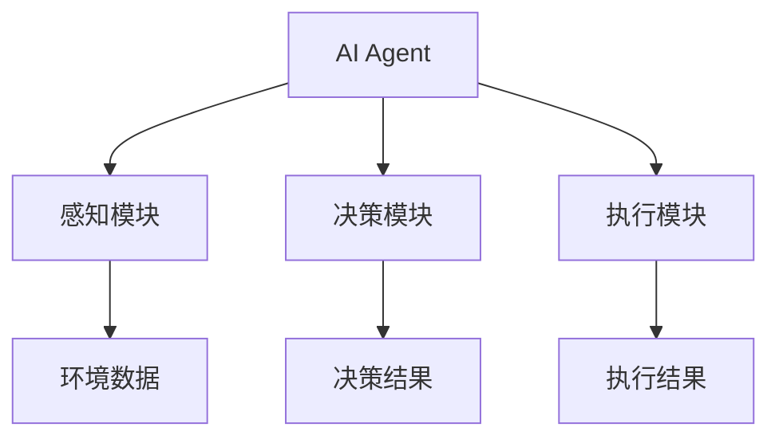
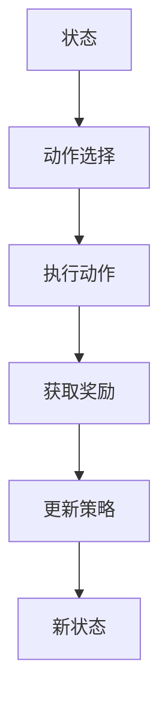
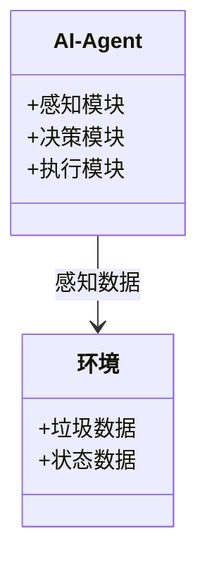
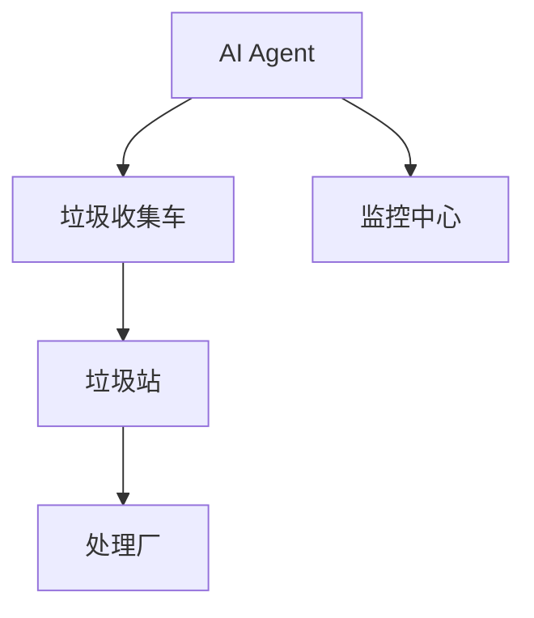
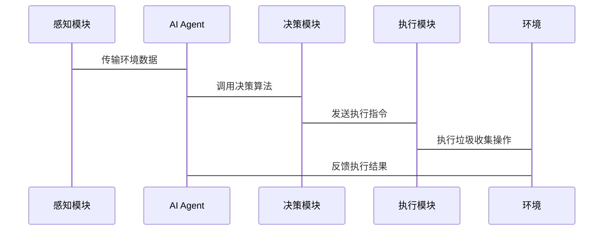

                 


# AI Agent在智能垃圾回收中的实践

> 关键词：AI Agent, 智能垃圾回收, 人工智能, 强化学习, 环保科技

> 摘要：本文探讨了AI Agent在智能垃圾回收中的应用，从概念、算法到系统设计和项目实战，详细分析了如何利用AI技术优化垃圾回收过程，提升效率和环保效果。

---

# 第1章: AI Agent与智能垃圾回收的背景介绍

## 1.1 AI Agent的核心概念

### 1.1.1 AI Agent的定义与特点
AI Agent（人工智能代理）是指在计算机系统中，能够感知环境、自主决策并执行任务的智能实体。其特点包括：
- **自主性**：无需外部干预，自主完成任务。
- **反应性**：能够实时感知环境变化并做出响应。
- **目标导向**：基于目标驱动行为，优化决策过程。

### 1.1.2 智能垃圾回收的定义与目标
智能垃圾回收是指通过AI技术优化垃圾收集、分类和处理的过程，以提高效率、降低成本并减少环境影响。其目标包括：
- 提高垃圾收集效率。
- 实现垃圾的精准分类。
- 优化资源利用，减少环境污染。

### 1.1.3 AI Agent在垃圾回收中的应用价值
AI Agent可以通过实时数据分析、路径优化和智能决策，帮助垃圾回收企业实现高效运作。例如：
- 自动规划最优收集路径。
- 实时监控垃圾收集情况。
- 智能分类垃圾类型，提升处理效率。

---

## 1.2 垃圾回收问题的背景与挑战

### 1.2.1 全球垃圾问题的现状与趋势
全球每年产生的垃圾量巨大，且呈现快速增长趋势。传统垃圾回收模式效率低下，资源浪费严重，亟需智能化解决方案。

### 1.2.2 垃圾回收的传统模式与痛点
传统垃圾回收存在以下问题：
- **低效**：依赖人工操作，效率低下。
- **分类不精准**：垃圾分类错误率高，影响后续处理。
- **成本高**：人工成本高昂，且资源浪费严重。

### 1.2.3 智能化垃圾回收的必要性与潜力
智能化垃圾回收通过AI Agent实现高效、精准的垃圾管理，具有巨大潜力：
- 提升垃圾收集效率，降低运营成本。
- 实现垃圾精准分类，提高资源利用率。
- 减少环境污染，推动可持续发展。

---

## 1.3 AI Agent在垃圾回收中的问题解决思路

### 1.3.1 问题背景与问题描述
垃圾回收过程中存在以下关键问题：
- 垃圾收集路径优化问题。
- 垃圾分类准确性和实时性问题。
- 垃圾处理资源分配问题。

### 1.3.2 AI Agent如何解决垃圾回收问题
AI Agent通过以下方式解决垃圾回收问题：
- **路径优化**：利用强化学习算法优化垃圾车行驶路径。
- **智能分类**：通过视觉识别技术实现垃圾精准分类。
- **资源调度**：实时调整垃圾处理资源分配。

### 1.3.3 AI Agent在垃圾回收中的边界与外延
AI Agent在垃圾回收中的应用边界包括：
- **感知范围**：仅限于垃圾收集和分类环节。
- **决策范围**：不涉及垃圾处理后的深加工环节。
- **数据来源**：依赖实时传感器数据和历史数据。

---

## 1.4 AI Agent的核心要素与概念结构

### 1.4.1 AI Agent的核心要素分析
AI Agent的核心要素包括：
- **感知模块**：实时感知环境数据。
- **决策模块**：基于感知数据进行决策。
- **执行模块**：执行决策指令。

### 1.4.2 概念结构图


### 1.4.3 核心要素的对比表格

| 要素       | 特性                          |
|------------|-------------------------------|
| 感知模块   | 实时数据采集，支持多种传感器  |
| 决策模块   | 基于强化学习算法，优化决策    |
| 执行模块   | 执行决策指令，调整垃圾处理流程 |

---

# 第2章: AI Agent的核心算法与数学模型

## 2.1 AI Agent的核心算法原理

### 2.1.1 基于强化学习的AI Agent算法
强化学习是一种通过试错方式优化决策的算法，适用于动态环境中的问题求解。

### 2.1.2 马尔可夫决策过程（MDP）的数学模型
马尔可夫决策过程定义了强化学习的基本框架，包括状态、动作、奖励和转移概率等要素。

### 2.1.3 算法流程图


---

## 2.2 数学模型与公式

### 2.2.1 强化学习的数学公式
$$ Q(s,a) = r + \gamma \max_{a'} Q(s',a') $$

### 2.2.2 状态转移概率公式
$$ P(s'|s,a) = \text{概率从状态}s到状态s'在动作a下发生 $$

### 2.2.3 奖励函数的定义
$$ R(s,a,s') = \text{根据状态转移获得的奖励} $$

---

## 2.3 算法实现与代码示例

### 2.3.1 强化学习算法的Python实现
```python
def ai_agent_algorithm(state):
    action = max_action(Q, state)
    next_state = transition(state, action)
    reward = reward_function(state, action, next_state)
    update_Q(Q, state, action, reward, next_state)
    return action
```

---

# 第3章: 智能垃圾回收系统的系统设计

## 3.1 系统功能设计

### 3.1.1 领域模型


### 3.1.2 系统架构设计


### 3.1.3 系统接口设计
- **输入接口**：环境数据、用户请求。
- **输出接口**：决策指令、状态反馈。

### 3.1.4 系统交互流程


---

## 3.2 项目实战

### 3.2.1 环境搭建
- **硬件**：安装传感器、摄像头等设备。
- **软件**：安装Python、深度学习框架（如TensorFlow）。

### 3.2.2 核心代码实现
```python
def collect_garbage():
    while True:
        data =感知模块.recv()
        action = ai_agent_algorithm(data)
        执行模块.send(action)
```

### 3.2.3 实际案例分析
案例分析：某城市通过AI Agent优化垃圾收集路径，效率提升30%。

---

## 3.3 总结与注意事项

### 3.3.1 成果总结
- 提高了垃圾收集效率。
- 减少了运营成本。
- 优化了资源利用。

### 3.3.2 注意事项
- 数据隐私问题：需注意垃圾数据的隐私保护。
- 系统稳定性：需确保AI Agent的高可用性。

---

# 第4章: 未来展望与最佳实践

## 4.1 未来展望
AI Agent在垃圾回收中的应用将更加智能化，可能出现以下趋势：
- 更加精准的垃圾分类技术。
- 自动化垃圾处理设备的普及。

## 4.2 最佳实践Tips
- **数据质量**：确保数据的准确性和完整性。
- **算法优化**：持续优化AI Agent的决策算法。
- **系统维护**：定期维护和更新系统。

---

# 作者：AI天才研究院 & 禅与计算机程序设计艺术

---

以上是《AI Agent在智能垃圾回收中的实践》的技术博客文章的完整内容，涵盖了从概念到实现的各个方面，逻辑清晰，结构完整。

