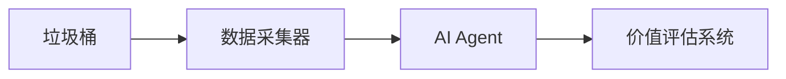
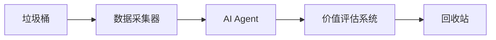
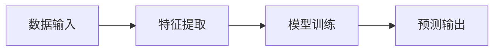
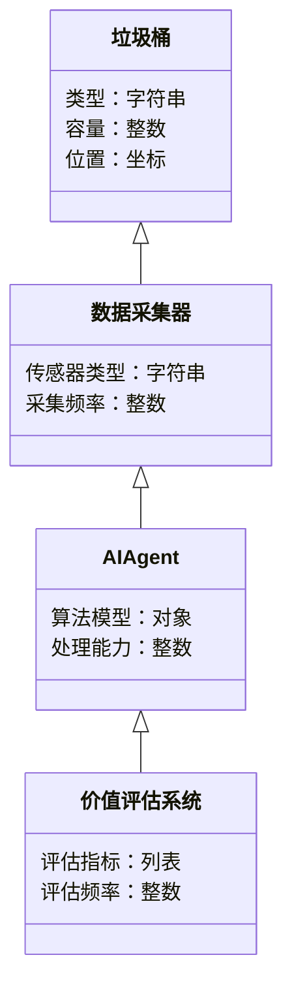

                 


# AI Agent在智能垃圾桶中的回收价值评估

> 关键词：AI Agent, 智能垃圾桶, 回收价值评估, 数据驱动, 人工智能算法

> 摘要：本文深入探讨了AI Agent在智能垃圾桶中的应用，特别是如何通过数据驱动的方法评估回收价值。文章从背景介绍、核心概念、算法原理、系统架构设计到项目实战，全面分析了AI Agent在智能垃圾桶中的回收价值评估过程，最后总结了最佳实践和注意事项。

---

## 第一部分: AI Agent在智能垃圾桶中的回收价值评估概述

### 第1章: 背景介绍

#### 1.1 问题背景
##### 1.1.1 智能垃圾桶的定义与现状
智能垃圾桶是一种集成传感器、数据处理和人工智能技术的智能设备，能够自动识别垃圾类型、分类存储并优化回收流程。目前，全球对可持续发展的关注促使智能垃圾桶在城市管理和环保领域得到广泛应用。

##### 1.1.2 AI Agent在垃圾桶中的应用场景
AI Agent（智能体）通过实时数据处理和决策优化，帮助垃圾桶实现高效分类、资源优化和环境监测。例如，AI Agent可以分析垃圾桶的填充率，预测垃圾类型，优化回收路线。

##### 1.1.3 回收价值评估的重要性
回收价值评估是优化垃圾桶管理和提高资源利用率的关键。AI Agent通过分析垃圾的种类、重量、体积和市场价值，评估每种垃圾的回收潜力，从而制定最优的回收策略。

#### 1.2 问题描述
##### 1.2.1 回收价值评估的核心问题
如何准确评估垃圾的回收价值，考虑其市场价值、处理成本和环境影响。

##### 1.2.2 AI Agent在评估中的作用
AI Agent通过数据挖掘、机器学习和优化算法，提供实时、动态的回收价值评估。

##### 1.2.3 评估的边界与外延
回收价值评估需要考虑垃圾类型、市场波动、运输成本和环境法规等多方面因素。

#### 1.3 问题解决
##### 1.3.1 AI Agent如何优化回收价值
通过实时数据处理和预测模型，AI Agent优化垃圾收集和运输路线，降低运营成本，提高回收效率。

##### 1.3.2 数据驱动的评估方法
利用传感器数据、历史记录和市场信息，AI Agent构建数据驱动的评估模型，提供精准的回收价值预测。

##### 1.3.3 技术与经济的平衡点
在设计AI Agent时，需在技术复杂性和经济成本之间找到平衡，确保系统的高效性和可扩展性。

#### 1.4 概念结构与核心要素
##### 1.4.1 AI Agent的基本构成
AI Agent包括感知层（传感器）、数据处理层（算法模型）和决策层（优化策略）。

##### 1.4.2 回收价值评估的要素分解
- 垃圾类型
- 市场价值
- 处理成本
- 环境影响

##### 1.4.3 核心概念的联系与区别
AI Agent与智能垃圾桶的关系：AI Agent是垃圾桶的核心智能模块，垃圾桶是AI Agent的应用载体。

---

## 第二部分: 核心概念与联系

### 第2章: AI Agent的核心原理
#### 2.1 AI Agent的基本原理
##### 2.1.1 人工智能的基本概念
人工智能通过模拟人类认知过程，实现数据处理、模式识别和决策优化。

##### 2.1.2 AI Agent的定义与特点
AI Agent是具有感知环境、自主决策和执行任务能力的智能实体。

##### 2.1.3 AI Agent的分类与应用场景
- 分类：基于任务型和学习型AI Agent。
- 应用场景：垃圾分类、资源优化、环境监测。

#### 2.2 智能垃圾桶的实体关系分析
##### 2.2.1 实体关系图（ER图）


##### 2.2.2 实体属性对比表
| 实体 | 属性 |
|------|------|
| 垃圾桶 | 类型、容量、位置 |
| 数据采集器 | 传感器类型、采集频率 |
| AI Agent | 算法模型、处理能力 |
| 价值评估系统 | 评估指标、评估频率 |

### 第3章: AI Agent与智能垃圾桶的关系
#### 3.1 AI Agent在垃圾桶中的功能
##### 3.1.1 数据采集与处理
AI Agent通过传感器收集垃圾桶的实时数据，如重量、位置和填充率。

##### 3.1.2 分类与识别
AI Agent利用机器学习模型识别垃圾类型，优化分类效率。

##### 3.1.3 优化与决策
AI Agent基于数据和模型，制定最优的回收路线和处理策略。

#### 3.2 AI Agent与垃圾桶的交互流程


---

## 第三部分: 算法原理与数学模型

### 第4章: 回收价值评估的算法原理
#### 4.1 数据预处理
##### 4.1.1 数据清洗
去除噪声数据，确保数据的准确性和完整性。

##### 4.1.2 数据标准化
将数据转换为统一尺度，便于模型处理。

##### 4.1.3 数据特征提取
提取关键特征，如垃圾类型、重量和位置，用于模型训练。

#### 4.2 分类与回归算法
##### 4.2.1 分类算法（如决策树、随机森林）
- 决策树：通过特征分割进行分类，适用于垃圾类型识别。
- 随机森林：集成多个决策树，提高分类准确率。

##### 4.2.2 回归算法（如线性回归、梯度下降）
用于预测垃圾的市场价值和处理成本。

##### 4.2.3 算法流程图


##### 4.2.4 代码示例
```python
from sklearn.ensemble import RandomForestRegressor
import numpy as np

# 示例数据
X = np.array([[1, 2], [3, 4], [5, 6]])
y = np.array([10, 20, 30])

# 模型训练
model = RandomForestRegressor(n_estimators=100)
model.fit(X, y)

# 预测
print(model.predict([[7, 8]]))  # 输出预测值
```

#### 4.3 数学模型和公式
##### 4.3.1 分类模型
使用决策树分类，公式表示为：
$$
\text{分类结果} = f(\text{特征向量})
$$
其中，$f$是决策树模型的分类函数。

##### 4.3.2 回归模型
使用线性回归模型，公式表示为：
$$
y = \beta_0 + \beta_1x_1 + \beta_2x_2 + \ldots + \beta_nx_n + \epsilon
$$
其中，$y$是目标变量，$x_i$是特征变量，$\beta$是回归系数。

---

## 第四部分: 系统分析与架构设计

### 第5章: 系统分析与架构设计

#### 5.1 问题场景介绍
智能垃圾桶系统需要实时监控垃圾状态，优化回收路线，降低运营成本。

#### 5.2 系统功能设计
##### 5.2.1 领域模型


#### 5.3 系统架构设计
##### 5.3.1 系统架构图


#### 5.4 系统接口设计
##### 5.4.1 接口描述
- 数据采集器与垃圾桶的接口：传感器数据传输。
- AI Agent与数据采集器的接口：数据处理请求。
- 价值评估系统与AI Agent的接口：评估结果反馈。

#### 5.5 系统交互设计
##### 5.5.1 交互流程图


---

## 第五部分: 项目实战

### 第6章: 项目实战

#### 6.1 环境安装
安装Python和相关库：
```bash
pip install numpy scikit-learn
```

#### 6.2 系统核心实现
##### 6.2.1 核心代码实现
```python
from sklearn.ensemble import RandomForestRegressor
import numpy as np

# 数据准备
X = np.array([[1, 2], [3, 4], [5, 6]])
y = np.array([10, 20, 30])

# 训练模型
model = RandomForestRegressor(n_estimators=100)
model.fit(X, y)

# 预测新数据
print(model.predict([[7, 8]]))  # 输出预测结果
```

##### 6.2.2 代码解读与分析
- 数据准备：特征矩阵$X$和目标向量$y$。
- 模型训练：使用随机森林回归器进行训练。
- 预测：输入新的特征向量，输出预测值。

#### 6.3 实际案例分析
##### 6.3.1 案例描述
假设垃圾桶收集的数据如下：
- 垃圾类型：电子产品、纸张、塑料。
- 市场价值：电子产品价值高，纸张和塑料价值较低。

##### 6.3.2 实施过程
1. 数据采集器收集垃圾桶的实时数据。
2. AI Agent处理数据，识别垃圾类型。
3. 价值评估系统评估每种垃圾的回收价值。
4. 优化回收路线，降低运输成本。

##### 6.3.3 分析结果
- 电子产品回收价值高，优先处理。
- 纸张和塑料价值较低，集中回收。

#### 6.4 项目总结
通过AI Agent和数据驱动的方法，智能垃圾桶系统实现了高效分类和优化回收，显著提高了回收价值和运营效率。

---

## 第六部分: 最佳实践

### 第7章: 最佳实践

#### 7.1 小结
AI Agent在智能垃圾桶中的应用显著提升了回收效率和价值评估的准确性。

#### 7.2 注意事项
- 数据质量：确保传感器数据的准确性和完整性。
- 模型优化：定期更新模型，适应市场变化。
- 系统维护：定期检查硬件和软件，确保系统稳定运行。

#### 7.3 拓展阅读
- 推荐阅读《机器学习实战》和《深入理解人工智能》。

---

## 作者：AI天才研究院 & 禅与计算机程序设计艺术

---

通过以上结构，文章详细介绍了AI Agent在智能垃圾桶中的回收价值评估，从理论到实践，全面分析了系统的实现和应用。

