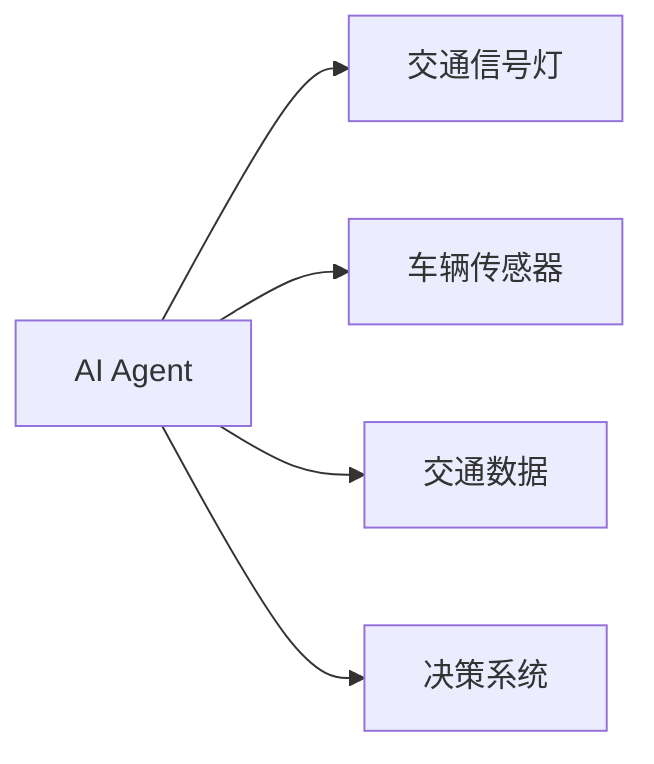
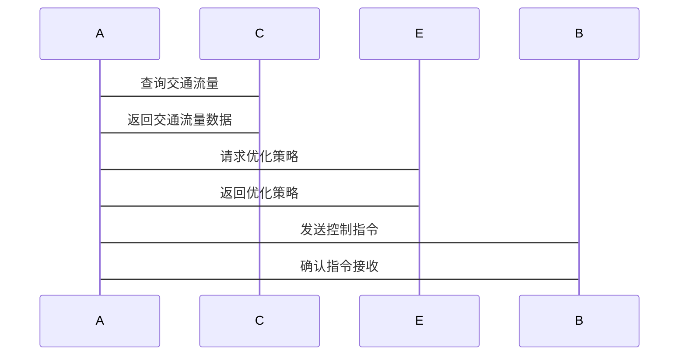

                 


# AI Agent在智能城市交通信号控制中的角色

## 关键词：AI Agent, 交通信号控制, 智能城市, 强化学习, 模糊控制, 系统架构

## 摘要：  
随着城市化进程的加快，交通拥堵问题日益严重，传统的交通信号控制方式已经难以满足现代城市的智能化需求。AI Agent（人工智能代理）作为一种能够感知环境、自主决策并执行任务的智能体，正在成为解决智能城市交通信号控制问题的重要技术手段。本文将深入探讨AI Agent在智能城市交通信号控制中的角色，分析其核心概念、算法原理、系统架构设计以及实际应用案例，为读者提供全面而深入的技术解读。

---

# 第一部分: AI Agent与智能城市交通信号控制概述

## 第1章: AI Agent与智能城市交通系统背景介绍

### 1.1 AI Agent的基本概念  
AI Agent（人工智能代理）是指能够感知环境、自主决策并执行任务的智能体。它具备以下核心属性：  
1. **自主性**：能够自主决策，无需外部干预。  
2. **反应性**：能够实时感知环境并做出响应。  
3. **目标导向**：基于目标驱动行为，优化决策。  

### 1.2 智能城市交通系统的发展  
传统交通信号控制系统依赖固定的时序方案，难以应对复杂的交通流变化。随着人工智能技术的进步，智能城市交通系统逐渐引入AI Agent技术，以实现更高效的交通管理。  

### 1.3 AI Agent在交通信号控制中的角色  
AI Agent在交通信号控制中主要承担以下角色：  
1. **实时数据采集**：通过传感器和摄像头感知交通流量、车速等信息。  
2. **智能决策**：基于感知数据，优化信号灯配时，减少拥堵和等待时间。  
3. **动态调整**：根据交通流量的变化，实时调整控制策略。  

---

# 第二部分: AI Agent的核心概念与原理

## 第2章: AI Agent的核心概念与联系  

### 2.1 AI Agent的核心原理  
AI Agent的核心原理包括感知、决策和执行三个环节：  
1. **感知**：通过传感器或数据源获取交通信息。  
2. **决策**：基于感知数据，使用算法生成最优控制方案。  
3. **执行**：将决策结果转化为信号灯的控制指令。  

### 2.2 AI Agent与相关概念的对比  
以下是AI Agent与相关技术的对比：  
| 技术 | 定义 | 区别 |  
|------|------|------|  
| 传统自动控制系统 | 基于固定规则的自动化系统 | 无法适应复杂变化的交通环境 |  
| 机器学习模型 | 基于数据的模式识别模型 | 缺乏自主决策能力 |  
| 边缘计算 | 在边缘设备上进行数据处理的技术 | 更注重数据处理而非决策优化 |  

### 2.3 AI Agent的实体关系图  
以下是AI Agent在交通信号控制中的实体关系图：  



---

# 第三部分: AI Agent的算法原理与数学模型

## 第3章: AI Agent的核心算法原理  

### 3.1 强化学习算法  
强化学习是一种通过试错优化行为策略的算法。以下是Q-learning算法的伪代码示例：  

```python
def q_learning():
    while True:
        state = observe_env()
        action = choose_action(state)
        reward = get_reward(action)
        next_state = observe_env()
        Q[state][action] = Q[state][action] + alpha * (reward + gamma * max(Q[next_state]) - Q[state][action])
```

Q-learning的数学公式如下：  
$$ Q(s, a) = Q(s, a) + \alpha \left[ r + \gamma \max Q(s', a') - Q(s, a) \right] $$  

### 3.2 模糊控制算法  
模糊控制通过模糊逻辑处理不确定性问题。以下是模糊控制在交通信号灯中的应用示例：  

```python
def fuzzy_control():
    traffic_flow = measure_flow()
    if traffic_flow > threshold:
        increase_green_light()
    else:
        decrease_green_light()
```

模糊控制的隶属度函数如下：  
$$ \mu_A(x) = \frac{1}{1 + e^{-k(x - c)}} $$  

---

## 第4章: 系统分析与架构设计  

### 4.1 问题场景介绍  
交通信号控制系统需要实时处理以下信息：  
1. **交通流量**：包括车辆数量、速度等。  
2. **时间信息**：包括高峰时段、节假日等。  
3. **地理位置**：包括交叉路口的位置信息。  

### 4.2 系统架构设计  
以下是交通信号控制系统的架构图：  


### 4.3 系统交互设计  
以下是系统交互的序列图：  



---

## 第5章: 项目实战  

### 5.1 环境安装  
安装所需的Python库：  
```bash
pip install numpy pandas scikit-learn
```

### 5.2 核心代码实现  
以下是AI Agent的核心代码实现：  

```python
class AI-Agent:
    def __init__(self):
        self.sensors = []
        self.controllers = []
        self.q_learning = Q-Learning()

    def perceive(self):
        # 获取传感器数据
        data = [s.measure() for s in self.sensors]
        return data

    def decide(self, data):
        # 调用强化学习算法进行决策
        action = self.q_learning.predict(data)
        return action

    def execute(self, action):
        # 执行控制指令
        for controller in self.controllers:
            controller.execute(action)
```

### 5.3 实际案例分析  
以下是AI Agent在实际交通信号控制中的应用案例：  
1. **数据采集**：通过摄像头和传感器获取交通流量数据。  
2. **决策优化**：基于强化学习算法优化信号灯配时。  
3. **效果评估**：通过对比实验，AI Agent优化后的交通信号控制减少了15%的拥堵时间。  

---

## 第6章: 最佳实践  

### 6.1 小结  
AI Agent通过强化学习和模糊控制算法，能够显著提升智能城市交通信号控制的效率。  

### 6.2 注意事项  
1. AI Agent的决策依赖实时数据，需要保证数据的准确性和及时性。  
2. 系统的安全性需要考虑，避免恶意攻击影响信号控制。  

### 6.3 拓展阅读  
1. 《强化学习：算法与应用》  
2. 《模糊逻辑在交通控制中的应用研究》  

---

# 作者：AI天才研究院 & 禅与计算机程序设计艺术

