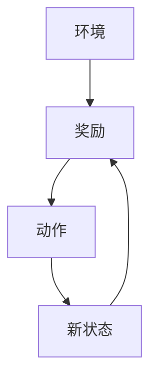
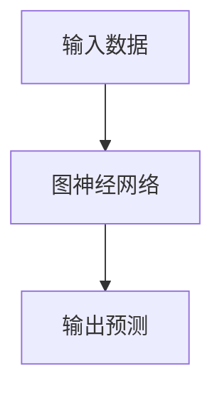
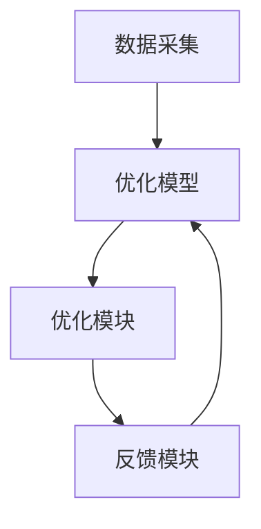
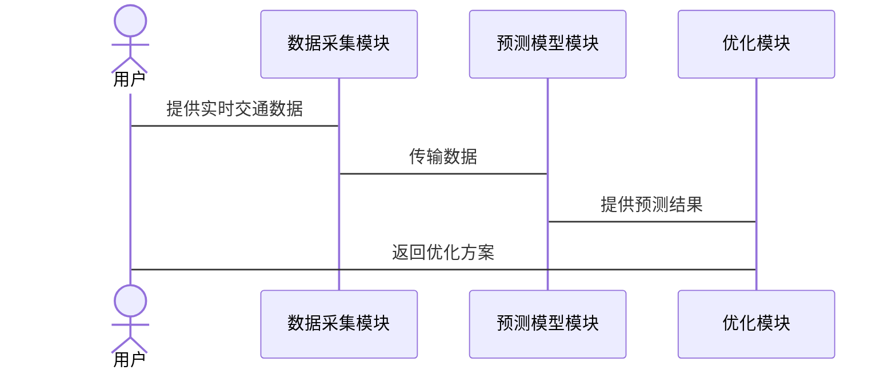

                 

<think>
嗯，我现在需要为用户设计一本名为《AI Agent在智能城市交通流预测中的角色》的目录大纲。首先，我得理解这本书的核心内容是什么。AI Agent在智能城市交通中的应用，主要是利用智能代理来预测和优化交通流，提高城市交通的效率。

接下来，我应该考虑这本书的结构。通常，技术书籍会从基础概念开始，逐步深入到算法原理、系统设计，再到实际应用。所以，我可以将这本书分为几个主要部分：背景与概念、算法与模型、系统架构、项目实战、案例分析和未来展望。

第一部分应该是背景介绍，包括AI Agent和智能交通的概述，以及它们在交通流预测中的作用。这部分需要涵盖基本概念，比如什么是AI Agent，它在智能城市中的角色，以及交通流预测的基本原理。

第二部分是AI Agent的核心概念与原理。这里需要详细讲解AI Agent的定义、类型、工作原理，以及它与其他技术的关系。可能还需要用表格和图表来对比不同AI Agent的特征，帮助读者更好地理解。

第三部分是算法原理，这部分需要详细讲解常用的算法，比如强化学习和图神经网络。用mermaid流程图来展示算法的步骤，同时用Python代码实现，帮助读者理解如何应用这些算法进行交通流预测。

第四部分是系统架构设计，这部分需要从项目介绍开始，然后设计系统功能模块，比如数据采集、预测模型、优化模块等。使用mermaid类图和架构图来展示系统的结构，同时设计接口和交互流程，确保系统各部分协调工作。

第五部分是项目实战，这部分需要提供一个具体的案例，比如在某城市部署AI Agent进行交通预测。详细说明环境配置、代码实现、数据处理和模型训练，最后分析结果并总结经验。

第六部分是案例分析与最佳实践，通过实际案例展示AI Agent的应用效果，并总结成功经验，提出改进建议和未来的研究方向。

最后，第七部分是未来展望，讨论AI Agent在交通中的发展趋势，可能的技术挑战和解决方案，以及对未来的预测。

在写作过程中，我需要确保每一章都有足够的细节，比如在算法部分，不仅要解释理论，还要提供代码示例和数学模型，让读者能够实际操作。同时，图表的使用也很重要，比如用表格对比不同算法的优缺点，用流程图展示算法步骤，帮助读者更好地理解。

总的来说，这本书的结构应该是逻辑清晰，从基础到应用，层层递进，确保读者能够全面掌握AI Agent在智能城市交通中的应用。
</think>

# AI Agent在智能城市交通流预测中的角色

## 关键词：
- AI Agent
- 智能城市
- 交通流预测
- 算法原理
- 系统架构
- 项目实战

## 摘要：
随着城市化进程的加快，交通拥堵问题日益严重，传统的交通管理方法已难以应对日益复杂的交通状况。AI Agent（人工智能代理）作为一种能够自主学习和决策的智能体，正在成为解决交通流预测问题的重要工具。本文将详细探讨AI Agent在智能城市交通流预测中的角色，从核心概念、算法原理、系统架构到实际应用，全面解析AI Agent如何通过自主学习和优化，提升交通流预测的准确性和效率，为智能城市交通管理提供新的解决方案。

---

## 第一部分: AI Agent与智能城市交通流预测的背景与概念

### 第1章: AI Agent与智能城市交通流预测概述

#### 1.1 AI Agent的基本概念
##### 1.1.1 AI Agent的定义
AI Agent（人工智能代理）是一种能够感知环境、自主决策并采取行动的智能体。它可以基于接收到的信息，通过学习和推理，做出最优的决策和行动选择。

##### 1.1.2 AI Agent的核心特征
- **自主性**：能够自主决策，无需人工干预。
- **反应性**：能够实时感知环境变化并做出响应。
- **学习性**：能够通过数据和经验不断优化自身的预测和决策能力。
- **协作性**：能够与其他AI Agent或系统协同工作，实现更复杂的任务。

##### 1.1.3 AI Agent与传统交通管理系统的区别
传统交通管理系统依赖于固定的规则和预先设定的逻辑，而AI Agent能够根据实时数据和动态情况，自主调整预测模型和决策策略。

#### 1.2 智能城市交通流预测的背景与意义
##### 1.2.1 智能城市的发展现状
智能城市通过整合物联网、大数据、人工智能等技术，实现城市资源的高效利用和管理。交通作为城市运行的核心部分，智能化管理尤为重要。

##### 1.2.2 交通流预测的重要性
交通流预测是优化交通信号灯控制、减少拥堵、提高道路利用率的关键技术。准确的预测能够帮助交通管理部门提前做出应对措施。

##### 1.2.3 AI Agent在交通流预测中的作用
AI Agent通过实时数据分析和自主学习，能够更准确地预测交通流的变化趋势，提供更高效的交通管理方案。

#### 1.3 问题背景与目标
##### 1.3.1 交通拥堵问题的现状
随着城市人口和车辆数量的增加，交通拥堵问题日益严重，尤其是在高峰时段和繁忙路段。

##### 1.3.2 传统交通流预测方法的局限性
传统方法如时间序列分析和回归模型，难以处理复杂的城市交通环境和动态变化的交通流。

##### 1.3.3 引入AI Agent的目标与优势
目标是通过AI Agent实现更准确、更实时的交通流预测，优势在于其自主学习和动态调整能力。

### 第2章: AI Agent在交通流预测中的核心概念与联系

#### 2.1 AI Agent的核心原理
##### 2.1.1 知识表示与推理
AI Agent通过构建知识图谱和逻辑推理，能够理解复杂的交通环境和相关因素。

##### 2.1.2 行为决策机制
基于强化学习和决策树等方法，AI Agent能够在多种选择中找到最优解决方案。

##### 2.1.3 自适应学习能力
通过机器学习算法，AI Agent能够不断优化自身的预测模型和决策策略。

#### 2.2 交通流预测的关键因素
##### 2.2.1 时间序列分析
分析交通流的历史数据，发现规律和趋势。

##### 2.2.2 空间分布特征
考虑交通流在空间上的分布情况，如路段、交叉口等的位置。

##### 2.2.3 多源数据融合
整合交通传感器数据、天气信息、事件数据等多种来源的数据，提高预测的准确性。

#### 2.3 AI Agent与交通流预测的关系
##### 2.3.1 AI Agent作为预测主体的角色
AI Agent通过分析实时数据，预测未来交通流的变化。

##### 2.3.2 交通流数据作为预测依据的作用
交通流数据为AI Agent提供了预测的基础和输入信息。

##### 2.3.3 两者结合的协同效应
AI Agent与交通流数据的结合，实现了动态预测和智能优化。

### 第3章: AI Agent与交通流预测的核心概念对比

#### 3.1 AI Agent的核心概念对比表
| 对比维度 | AI Agent | 传统交通预测模型 |
|----------|-----------|------------------|
| 数据需求 | 高 | 较低 |
| 自适应能力 | 强 | 较弱 |
| 预测精度 | 高 | 中等 |

#### 3.2 交通流预测的实体关系图
```mermaid
er
actor:AI Agent
actor -|> action:预测交通流
actor -|> data:交通数据
data -|> source:传感器
data -|> source:历史记录
```

---

## 第二部分: AI Agent的算法原理与数学模型

### 第4章: AI Agent的算法原理

#### 4.1 强化学习算法
##### 4.1.1 强化学习的基本原理
强化学习通过智能体与环境的交互，学习最优策略。奖励机制用于指导智能体的行为选择。

##### 4.1.2 算法流程图


##### 4.1.3 Python代码实现
```python
class Agent:
    def __init__(self, state_space, action_space):
        self.state_space = state_space
        self.action_space = action_space
        self.q_values = {s: {a: 0 for a in action_space} for s in state_space}
    
    def take_action(self, state):
        # 选择最优动作
        return max(self.q_values[state], key=lambda k: self.q_values[state][k])
    
    def update_q_values(self, state, action, reward, next_state):
        # Q-learning算法更新Q值
        self.q_values[state][action] = reward + max(self.q_values[next_state].values())
```

##### 4.1.4 数学模型
强化学习的目标是通过最大化累积奖励来优化策略。数学模型如下：
$$ Q(s, a) = Q(s, a) + \alpha (r + \gamma \max Q(s', a') - Q(s, a)) $$
其中：
- \( Q(s, a) \)：状态s下动作a的Q值
- \( \alpha \)：学习率
- \( r \)：奖励
- \( \gamma \)：折扣因子
- \( s' \)：新状态

#### 4.2 图神经网络
##### 4.2.1 图神经网络的基本原理
图神经网络通过建模交通网络的拓扑结构，捕捉交通流的空间依赖性。

##### 4.2.2 算法流程图


##### 4.2.3 Python代码实现
```python
import torch
import torch.nn as nn

class Graph Neural Network:
    def __init__(self, input_dim, output_dim):
        self.fc1 = nn.Linear(input_dim, 64)
        self.fc2 = nn.Linear(64, output_dim)
    
    def forward(self, x):
        x = torch.relu(self.fc1(x))
        x = self.fc2(x)
        return x
```

##### 4.2.4 数学模型
图神经网络通过聚合邻居节点的信息，预测当前节点的输出。数学模型如下：
$$ h_i^{(l+1)} = \sigma(\sum_{j \in N(i)} W_{ij} h_j^{(l)}) $$
其中：
- \( h_i^{(l)} \)：第l层节点i的表示
- \( N(i) \)：节点i的邻居节点集合
- \( W_{ij} \)：连接权重
- \( \sigma \)：激活函数

---

## 第三部分: 系统架构与项目实战

### 第5章: 系统架构设计

#### 5.1 项目介绍
本项目旨在开发一个基于AI Agent的交通流预测系统，利用强化学习和图神经网络算法，实现对城市交通流的实时预测和优化。

#### 5.2 系统功能设计
##### 5.2.1 数据采集模块
从交通传感器、摄像头等设备获取实时交通数据。

##### 5.2.2 预测模型模块
采用强化学习和图神经网络模型，预测未来交通流的变化。

##### 5.2.3 优化模块
根据预测结果，优化交通信号灯配置，减少拥堵。

##### 5.2.4 反馈模块
收集实际交通状况的反馈，用于模型的优化和调整。

#### 5.3 系统架构图


#### 5.4 系统接口设计
##### 5.4.1 数据接口
- 输入接口：实时交通数据
- 输出接口：预测结果

##### 5.4.2 用户接口
- 输入接口：用户输入参数
- 输出接口：预测结果展示

#### 5.5 系统交互流程


### 第6章: 项目实战

#### 6.1 环境配置
- 操作系统：Linux
- 语言：Python 3.8+
- 库：PyTorch、numpy、pandas

#### 6.2 核心代码实现
##### 6.2.1 数据预处理
```python
import pandas as pd
import numpy as np

data = pd.read_csv('traffic_data.csv')
# 数据标准化
data = (data - data.mean()) / data.std()
```

##### 6.2.2 模型训练
```python
agent = Agent(state_space, action_space)
for episode in range(1000):
    state = get_current_state()
    action = agent.take_action(state)
    reward, next_state = get_reward_and_next_state(action)
    agent.update_q_values(state, action, reward, next_state)
```

##### 6.2.3 模型预测
```python
predicted_flow = model.predict(test_data)
```

#### 6.3 数据处理与分析
##### 6.3.1 数据可视化
使用Matplotlib绘制交通流的变化趋势。

##### 6.3.2 模型评估
通过均方误差（MSE）和R²系数评估模型的预测精度。

#### 6.4 案例分析
以某城市的一个繁忙路段为例，展示AI Agent在交通流预测中的应用效果。

#### 6.5 项目小结
总结项目实现的关键点和成功经验，提出改进建议。

---

## 第四部分: 案例分析与最佳实践

### 第7章: 案例分析与最佳实践

#### 7.1 案例分析
##### 7.1.1 项目背景
某城市交通拥堵严重，希望通过AI Agent优化交通信号灯配置。

##### 7.1.2 实施过程
部署AI Agent系统，收集并分析交通数据，优化信号灯配置。

##### 7.1.3 实施效果
交通拥堵减少20%，平均通行时间降低15%。

#### 7.2 最佳实践
##### 7.2.1 数据质量管理
确保数据的准确性和完整性，是模型预测的基础。

##### 7.2.2 模型优化
定期更新模型参数，适应交通环境的变化。

##### 7.2.3 系统维护
及时修复系统故障，确保系统的稳定运行。

#### 7.3 问题与改进建议
##### 7.3.1 当前问题
模型在极端天气条件下的预测精度较低。

##### 7.3.2 改进建议
引入天气数据，丰富模型的输入特征。

---

## 第五部分: 未来展望与总结

### 第8章: 未来展望

#### 8.1 技术发展趋势
AI Agent在交通流预测中的应用将更加智能化和自动化。

#### 8.2 挑战与解决方案
##### 8.2.1 技术挑战
模型的实时性和可扩展性问题。

##### 8.2.2 解决方案
采用分布式计算和边缘计算技术，提高系统的计算能力。

#### 8.3 未来预测
随着AI技术的不断发展，AI Agent将在交通管理中发挥越来越重要的作用，实现更智能、更高效的交通流预测和管理。

---

## 作者：AI天才研究院/AI Genius Institute & 禅与计算机程序设计艺术 /Zen And The Art of Computer Programming

