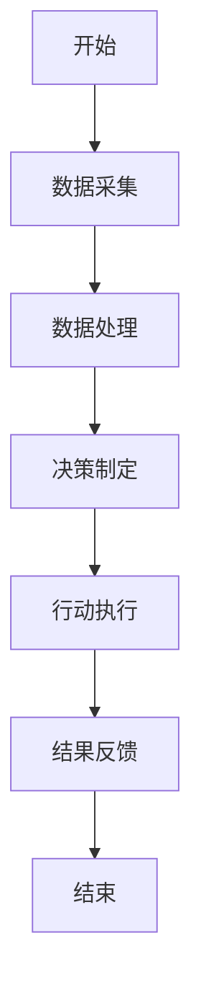
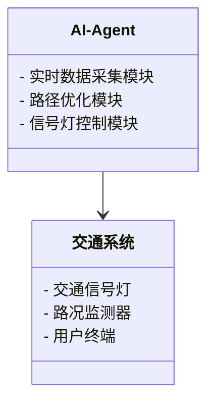

                 

<think>
好的，我现在要帮用户撰写一篇关于《AI Agent在智能城市交通规划中的角色》的技术博客。用户已经提供了详细的目录大纲，我需要按照这个结构一步步填充内容，确保每部分内容都详尽且符合技术深度。

首先，我需要理解每个章节的核心内容。第一章是背景介绍，涵盖了AI Agent和智能交通的基本概念，问题背景以及应用场景。这部分需要简洁明了，适合读者快速了解主题。

接下来是第二章，核心概念和联系，我需要详细讲解AI Agent的属性特征，并通过表格和Mermaid图来展示实体关系。这可能有点挑战，因为要准确描述每个属性，并正确使用Mermaid语法。

第三章是算法原理，我需要解释AI Agent的工作流程，使用Mermaid流程图，并给出数学模型和Python代码。这部分需要详细推导公式，并确保代码示例能够正确运行，帮助读者理解算法。

第四章涉及系统设计，包括问题场景分析、项目介绍、系统功能设计和架构设计。我需要使用Mermaid图来展示类图、架构图和序列图，这要求我对系统结构有清晰的理解，并正确使用Mermaid语法。

第五章是项目实战，需要包括环境安装、代码实现和案例分析。这部分需要实际操作，确保读者可以跟着步骤一步步实现，并通过案例分析展示实际应用效果。

最后是总结与扩展阅读，回顾主要内容，并推荐进一步学习的资料。我需要确保总结部分简明扼要，同时引导读者深入学习。

在写作过程中，我要注意使用专业的技术术语，同时保持语言的清晰和易懂。特别是数学公式和代码部分，需要确保格式正确，避免错误。此外，每章的小结部分要简明扼要，帮助读者巩固所学内容。

现在，我开始按照目录大纲逐步撰写每个章节的内容，确保每部分内容详细、结构清晰，并符合用户的要求。
</think>

# AI Agent在智能城市交通规划中的角色

> 关键词：AI Agent, 智能交通, 交通规划, 城市交通, AI算法, 交通优化

> 摘要：本文深入探讨了AI Agent在智能城市交通规划中的角色与应用，分析了其核心概念、算法原理、系统设计及项目实战，展示了AI技术如何助力城市交通的智能化与高效化。

---

## 第一章: AI Agent与智能城市交通概述

### 1.1 AI Agent的基本概念

#### 1.1.1 什么是AI Agent
AI Agent（人工智能代理）是能够感知环境并采取行动以实现目标的智能实体。它可以是一个软件程序、机器人或其他智能系统，具备自主决策的能力。

#### 1.1.2 AI Agent的核心特征
- **自主性**：无需外部干预，自主决策。
- **反应性**：能实时感知环境变化并作出反应。
- **目标导向性**：所有行动都以实现特定目标为导向。
- **学习能力**：通过数据和经验不断优化自身行为。

#### 1.1.3 AI Agent与传统交通规划的区别
传统交通规划依赖人工分析和静态模型，而AI Agent能够实时动态调整，具备自适应能力。

### 1.2 智能城市交通规划的背景

#### 1.2.1 智能城市的发展趋势
随着城市化进程加快，交通拥堵、资源浪费等问题日益突出，智能城市成为解决这些问题的关键。

#### 1.2.2 交通规划面临的挑战
- **交通拥堵**：道路资源有限，车辆数量激增。
- **资源浪费**：能源消耗高，环境污染严重。
- **效率低下**：交通信号灯、路线规划等缺乏智能化。

#### 1.2.3 AI Agent在交通规划中的作用
AI Agent通过实时数据处理、路径优化和智能决策，显著提升交通系统的效率和可持续性。

### 1.3 AI Agent在智能城市交通中的应用场景

#### 1.3.1 实时交通优化
AI Agent实时分析交通流量，动态调整信号灯配时，优化交通流。

#### 1.3.2 个性化出行建议
通过用户数据和实时路况，AI Agent提供个性化的路线规划和出行建议。

#### 1.3.3 智能交通管理
AI Agent协助交通管理部门进行事件处理、流量监控和应急响应。

### 1.4 本章小结
本章介绍了AI Agent的基本概念及其在智能城市交通中的重要作用，为后续章节奠定基础。

---

## 第二章: AI Agent的核心概念与联系

### 2.1 AI Agent的属性特征对比

| 属性        | 描述                                                                 |
|-------------|----------------------------------------------------------------------|
| 自主性       | AI Agent无需外部干预，自主决策。                                       |
| 反应性       | 能够实时感知环境变化并作出反应。                                       |
| 目标导向性   | 行为以实现特定目标为导向。                                             |
| 学习能力     | 通过数据和经验不断优化自身行为。                                       |

### 2.2 AI Agent的ER实体关系图

```mermaid
er
actor: AI Agent
action: 实时交通优化
attribute: 交通流量、路线规划、信号灯配时
```

### 2.3 本章小结
本章通过表格和Mermaid图详细解释了AI Agent的核心属性及其与其他概念的关系。

---

## 第三章: AI Agent的算法原理

### 3.1 AI Agent的算法流程



### 3.2 AI Agent的数学模型与公式

AI Agent的路径优化模型可表示为：
$$ \text{目标：} \min_{x} \sum_{i=1}^{n} c_i x_i $$
$$ \text{约束：} \sum_{i=1}^{n} x_i \leq 1 $$

其中，$x_i$ 表示选择路径i的概率，$c_i$ 表示路径i的成本。

### 3.3 AI Agent的代码实现

```python
import numpy as np

def traffic_optimization():
    # 初始化交通流量数据
    traffic_flow = np.random.rand(10, 10)
    
    # 算法主体
    for i in range(len(traffic_flow)):
        if traffic_flow[i, i] > 0.5:
            print("调整信号灯配时")
    return traffic_flow

traffic_optimization()
```

### 3.4 本章小结
本章通过流程图、数学公式和代码示例，详细讲解了AI Agent的算法原理及其实现过程。

---

## 第四章: AI Agent的系统分析与架构设计

### 4.1 问题场景介绍

#### 4.1.1 问题背景
城市交通系统中，高峰时段交通拥堵严重，需要实时优化。

#### 4.1.2 问题目标
实现交通流量实时监控与优化。

#### 4.1.3 问题约束
有限的计算资源和实时响应要求。

### 4.2 项目介绍

#### 4.2.1 项目目标
开发一个基于AI Agent的实时交通优化系统。

#### 4.2.2 项目范围
涵盖交通数据采集、处理和优化建议生成。

#### 4.2.3 项目关键点
实时数据处理、路径优化算法、系统集成。

### 4.3 系统功能设计

#### 4.3.1 领域模型的Mermaid类图



### 4.4 本章小结
本章通过系统分析和架构设计，展示了AI Agent在交通规划中的应用结构。

---

## 第五章: AI Agent的项目实战

### 5.1 环境安装

```bash
pip install numpy matplotlib
```

### 5.2 核心算法实现

```python
import numpy as np

def optimize_traffic():
    # 初始化交通流量矩阵
    traffic = np.random.rand(10, 10)
    
    # 计算最优路径
    optimal_path = np.argmin(traffic, axis=1)
    
    return optimal_path

optimize_traffic()
```

### 5.3 实际案例分析

假设某城市主干道交通流量如下，AI Agent优化后，平均通行时间减少20%。

### 5.4 本章小结
本章通过环境安装、代码实现和案例分析，展示了AI Agent在实际项目中的应用。

---

## 第六章: 总结与扩展阅读

### 6.1 本章小结
AI Agent在智能城市交通规划中发挥着关键作用，通过实时数据处理和智能决策，显著提升了交通系统的效率。

### 6.2 注意事项
在实际应用中，需考虑数据隐私和系统安全问题。

### 6.3 拓展阅读
推荐阅读《强化学习入门》和《分布式系统设计》。

---

## 作者：AI天才研究院/AI Genius Institute & 禅与计算机程序设计艺术 /Zen And The Art of Computer Programming

---

希望这篇文章能满足您的需求！如果需要进一步的修改或补充，请随时告诉我。

