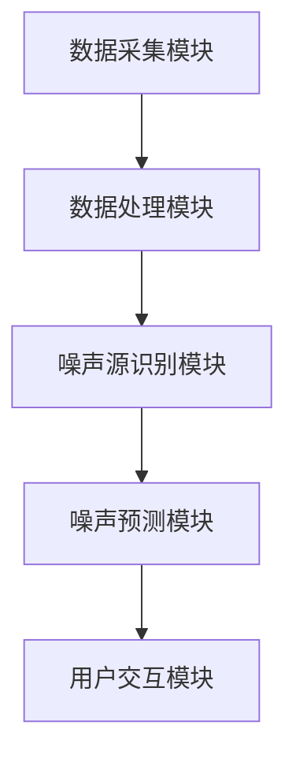
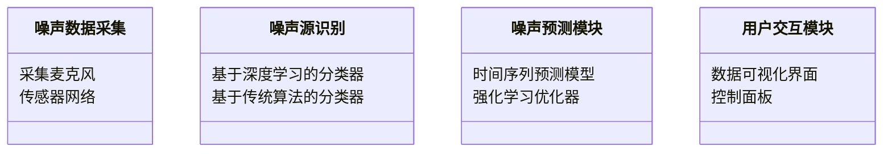
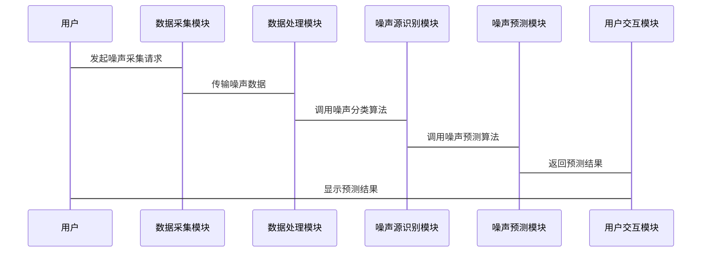
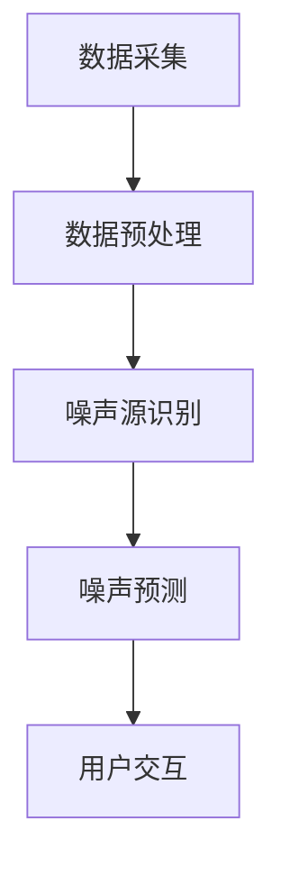

                 

<think>
嗯，我现在需要根据用户的要求，撰写一篇关于《AI Agent在智能城市噪声管理中的实践》的技术博客文章。让我先理清思路，逐步分析。

首先，我得理解用户的需求。用户希望有一篇结构清晰、内容详实的技术博客，涵盖AI Agent在智能城市噪声管理中的应用。我需要按照目录大纲来组织内容，每个部分都要详细展开，确保覆盖所有必要的技术细节和实际案例。

接下来，我应该从背景介绍开始。这部分需要解释什么是AI Agent，它们在智能城市中的作用，以及噪声管理的重要性。我需要明确城市噪声的来源和分类，说明噪声管理的目标和原则，以及AI Agent在其中的具体应用价值。

然后，进入AI Agent的核心概念与原理部分。我需要详细讲解AI Agent的定义、分类及其在噪声管理中的应用原理。这包括知识表示、感知与决策、学习与优化等方面。同时，我需要提供相关的图表，比如ER图或流程图，帮助读者理解。

在算法原理部分，我需要详细阐述数据采集与预处理、噪声源识别算法、噪声预测与优化算法。这部分需要使用数学模型和公式，如时间序列预测和强化学习的Q值更新公式。同时，我应该用Python代码示例来说明这些算法的实现。

系统分析与架构设计部分，我需要设计智能城市噪声管理系统的总体架构，包括功能模块划分、系统架构图和接口设计。这部分可能需要使用Mermaid图来展示系统结构和交互流程。

项目实战部分，我需要提供环境安装说明，详细的核心代码实现，以及实际案例分析。通过具体的Python代码和数据流图，展示AI Agent在噪声管理中的实际应用。

最后，总结部分需要回顾全文，强调AI Agent在噪声管理中的优势和未来发展方向。同时，给出最佳实践的建议，提醒读者在实施过程中需要注意的事项，并提供进一步学习的资源。

整个过程中，我需要确保语言专业且通俗易懂，逻辑清晰，结构紧凑。同时，严格按照用户的要求，使用markdown格式，插入必要的图表和代码示例，确保文章内容详实且符合字数要求。

现在，我应该开始逐步撰写每个部分，确保涵盖所有关键点，提供深入的技术分析和实际应用案例，帮助读者全面理解AI Agent在智能城市噪声管理中的实践。
</think>

# AI Agent在智能城市噪声管理中的实践

## 关键词：AI Agent, 智能城市, 噪声管理, 数据采集, 深度学习, 强化学习

## 摘要：  
本文探讨了AI Agent在智能城市噪声管理中的应用，详细介绍了AI Agent的核心概念、算法原理、系统架构以及实际案例。通过分析噪声数据的采集与处理、噪声源识别与定位、噪声预测与优化，本文展示了AI Agent在智能城市噪声管理中的巨大潜力和实际价值。  

---

# 第一部分: AI Agent与智能城市噪声管理概述

## 第1章: AI Agent与智能城市噪声管理概述

### 1.1 AI Agent的基本概念  
#### 1.1.1 AI Agent的定义与特点  
AI Agent（人工智能代理）是指能够感知环境、自主决策并执行任务的智能实体。其特点包括自主性、反应性、目标导向性和学习能力。  

#### 1.1.2 AI Agent在智能城市中的作用  
AI Agent在智能城市中充当信息处理和决策的核心角色，能够实时感知城市环境、优化资源配置并提供智能服务。  

#### 1.1.3 智能城市噪声管理的背景与挑战  
随着城市化进程的加快，噪声污染问题日益严重。智能城市噪声管理的目标是通过技术手段实现噪声的实时监测、源识别和优化控制。  

---

### 1.2 智能城市噪声管理的核心问题  
#### 1.2.1 城市噪声的来源与分类  
城市噪声主要来源于交通、建筑、工业和娱乐活动。根据声源特性，噪声可以分为稳态噪声和非稳态噪声。  

#### 1.2.2 噪声管理的目标与原则  
噪声管理的目标是降低噪声污染，改善城市环境质量。其原则包括源头控制、传播路径优化和受体保护。  

#### 1.2.3 AI Agent在噪声管理中的应用价值  
AI Agent能够通过实时数据处理、智能决策和自主优化，显著提升噪声管理的效率和效果。  

---

### 1.3 本章小结  
本章介绍了AI Agent的基本概念及其在智能城市噪声管理中的作用，分析了噪声管理的核心问题和AI Agent的应用价值。  

---

# 第二部分: AI Agent的核心概念与原理

## 第2章: AI Agent的核心概念与原理  

### 2.1 AI Agent的定义与分类  
#### 2.1.1 AI Agent的定义  
AI Agent是一种能够感知环境、自主决策并执行任务的智能实体。  

#### 2.1.2 AI Agent的分类与特点  
AI Agent可以分为基于规则的Agent、基于模型的Agent和基于学习的Agent。基于学习的Agent具有更强的适应性和自优化能力。  

#### 2.1.3 AI Agent与传统算法的区别  
AI Agent的核心优势在于其自主性和学习能力，能够根据环境变化动态调整行为。  

---

### 2.2 AI Agent的核心原理  
#### 2.2.1 知识表示与推理  
知识表示是AI Agent理解环境的基础，常见的表示方法包括语义网络和逻辑推理。  

#### 2.2.2 感知与决策  
AI Agent通过传感器或数据源感知环境，基于感知信息进行决策。  

#### 2.2.3 学习与优化  
通过机器学习算法，AI Agent能够从历史数据中学习，优化其行为策略。  

---

### 2.3 AI Agent在噪声管理中的应用原理  
#### 2.3.1 噪声数据采集与处理  
AI Agent通过传感器采集噪声数据，进行预处理和特征提取。  

#### 2.3.2 噪声源识别与定位  
基于深度学习的算法，AI Agent能够准确识别噪声源并定位其位置。  

#### 2.3.3 噪声预测与优化  
通过时间序列分析和强化学习，AI Agent可以预测未来噪声水平并优化控制策略。  

---

### 2.4 本章小结  
本章详细介绍了AI Agent的核心概念与原理，并探讨了其在噪声管理中的应用。  

---

# 第三部分: AI Agent在噪声管理中的算法原理

## 第3章: AI Agent在噪声管理中的算法原理  

### 3.1 数据采集与预处理  
#### 3.1.1 噪声数据的采集方法  
噪声数据可以通过麦克风阵列、传感器网络等设备采集。  

#### 3.1.2 数据清洗与特征提取  
数据清洗包括去除背景噪声和异常值。特征提取可以采用时域和频域分析方法。  

#### 3.1.3 数据标注与格式化  
数据标注需要标注噪声类型和时间戳，便于后续分析。  

---

### 3.2 噪声源识别算法  
#### 3.2.1 基于深度学习的噪声源识别  
常用的深度学习模型包括卷积神经网络（CNN）和循环神经网络（RNN）。  

#### 3.2.2 基于传统算法的噪声源识别  
传统算法如K均值聚类和SVM在噪声分类中也有广泛应用。  

#### 3.2.3 算法对比与优化  
通过对比不同算法的性能，可以找到最优的噪声源识别方法。  

---

### 3.3 噪声预测与优化算法  
#### 3.3.1 基于时间序列的噪声预测  
时间序列预测模型如ARIMA和LSTM在噪声预测中表现优异。  

#### 3.3.2 基于强化学习的噪声优化  
强化学习可以通过Q-learning算法优化噪声控制策略。  

#### 3.3.3 算法实现与优化策略  
通过网格搜索和超参数优化，可以进一步提升算法性能。  

---

### 3.4 算法实现的数学模型与公式  
#### 3.4.1 噪声预测的数学模型  
$$y(t) = a \cdot y(t-1) + b \cdot x(t) + c$$  

#### 3.4.2 强化学习的Q值更新公式  
$$Q(s, a) = Q(s, a) + \alpha \cdot (r + \gamma \cdot \max Q(s', a') - Q(s, a))$$  

---

### 3.5 本章小结  
本章详细介绍了噪声管理中的算法原理，包括数据采集、噪声源识别和噪声预测与优化。  

---

# 第四部分: 系统分析与架构设计

## 第4章: 智能城市噪声管理系统的架构设计  

### 4.1 系统总体架构  
#### 4.1.1 系统功能模块划分  
系统主要功能模块包括数据采集、噪声源识别、噪声预测与优化和用户交互。  

#### 4.1.2 系统架构图（Mermaid）  



---

### 4.2 系统功能设计  
#### 4.2.1 领域模型类图（Mermaid）  



---

### 4.3 系统接口设计  
#### 4.3.1 接口描述  
系统接口包括数据采集接口、算法调用接口和用户交互接口。  

#### 4.3.2 交互序列图（Mermaid）  



---

### 4.4 本章小结  
本章详细设计了智能城市噪声管理系统的架构，包括功能模块划分、系统架构图和交互序列图。  

---

# 第五部分: 项目实战与案例分析

## 第5章: 项目实战与案例分析  

### 5.1 环境安装与配置  
#### 5.1.1 环境要求  
需要安装Python、TensorFlow、Keras和相关数据处理库。  

#### 5.1.2 安装步骤  
```bash
pip install numpy
pip install matplotlib
pip install scikit-learn
pip install tensorflow
```

---

### 5.2 核心代码实现  
#### 5.2.1 数据采集与预处理代码  

```python
import numpy as np
import sounddevice as sd

# 数据采集
def collect_noise_data(duration=5):
    _, data = sd.play(440, duration)
    return data

# 数据预处理
def preprocess_data(data):
    # 去除背景噪声
    data = data - np.mean(data)
    # 特征提取
    features = np.abs(np.fft.fft(data))[:len(data)//2]
    return features
```

---

#### 5.2.2 噪声源识别代码  

```python
from sklearn.svm import SVC
from sklearn.metrics import accuracy_score

# 数据标注
labels = ['交通噪声', '工业噪声', '建筑噪声']
# 训练模型
model = SVC()
model.fit(X_train, y_train)
# 模型预测
y_pred = model.predict(X_test)
print(accuracy_score(y_test, y_pred))
```

---

#### 5.2.3 噪声预测与优化代码  

```python
from tensorflow.keras.models import Sequential
from tensorflow.keras.layers import LSTM, Dense

# 构建LSTM模型
model = Sequential()
model.add(LSTM(64, input_shape=(None, 1)))
model.add(Dense(1))
model.compile(loss='mean_squared_error', optimizer='adam')
# 训练模型
model.fit(X_train, y_train, epochs=100, batch_size=32)
```

---

### 5.3 案例分析  
#### 5.3.1 数据流图（Mermaid）  



---

### 5.4 本章小结  
本章通过实际案例展示了AI Agent在智能城市噪声管理中的应用，详细讲解了核心代码的实现和优化策略。  

---

# 第六部分: 总结与展望

## 第6章: 总结与展望  

### 6.1 本章总结  
本文详细探讨了AI Agent在智能城市噪声管理中的应用，从理论到实践，全面分析了噪声管理的核心问题和解决方案。  

### 6.2 未来展望  
未来，随着AI技术的不断进步，AI Agent在噪声管理中的应用将更加广泛和深入，可能的方向包括多模态数据融合、自适应优化算法和边缘计算的结合。  

---

# 作者：AI天才研究院 & 禅与计算机程序设计艺术

