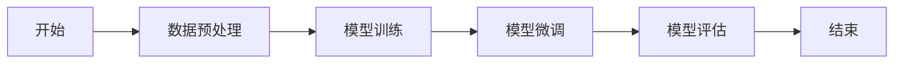
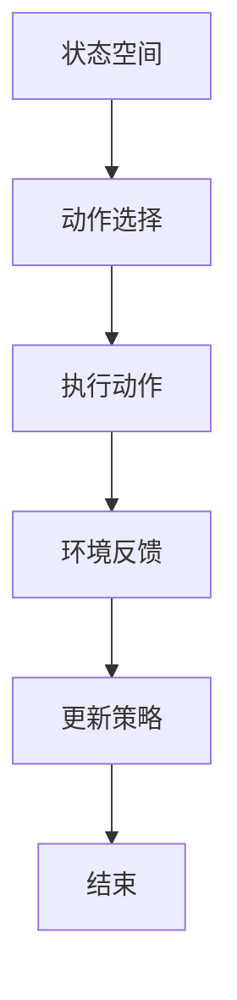
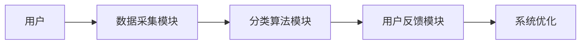
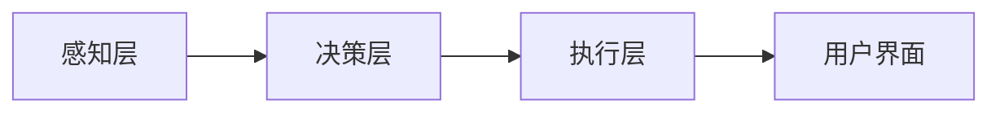
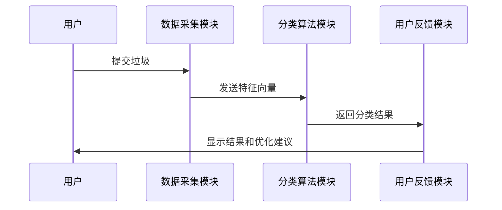

                 


# AI Agent在智能城市垃圾分类中的实践

## 关键词
- AI Agent
- 智能城市
- 垃圾分类
- 人工智能
- 强化学习

## 摘要
AI Agent在智能城市垃圾分类中的应用展示了人工智能技术如何解决现实中的复杂问题。本文系统地分析了AI Agent的核心原理、算法实现、系统架构，并通过实际案例展示了其在垃圾分类中的应用效果。通过本文，读者可以全面了解AI Agent在智能垃圾分类中的技术细节和实践价值。

---

# 第1章: 智能城市垃圾分类的背景与问题

## 1.1 城市垃圾分类的现状与挑战
### 1.1.1 当前城市垃圾分类的主要问题
- 垃圾分类的准确性低，错误分类现象普遍。
- 人工分类效率低下，成本高昂。
- 垃圾种类繁多，分类标准复杂。

### 1.1.2 垃圾分类对智能城市的重要性
- 优化资源利用，减少环境污染。
- 提高城市管理效率，降低运营成本。
- 推动智能化社会发展，提升市民生活质量。

### 1.1.3 AI Agent在垃圾分类中的潜在价值
- 提高分类准确率，减少人为错误。
- 实现自动化处理，降低人工成本。
- 支持实时反馈，优化分类策略。

## 1.2 AI Agent的核心概念与定义
### 1.2.1 AI Agent的基本定义
AI Agent是一种能够感知环境、做出决策并执行动作的智能实体，旨在通过自主学习和优化实现特定目标。

### 1.2.2 AI Agent的核心属性与特征
- **感知能力**：通过传感器或数据输入获取环境信息。
- **决策能力**：基于感知信息，运用算法做出最优决策。
- **执行能力**：通过执行机构或接口实现决策结果。

### 1.2.3 AI Agent与传统自动分类系统的区别
| 特性           | AI Agent                     | 传统自动分类系统               |
|----------------|----------------------------|-------------------------------|
| 智能性         | 高                           | 低或无                         |
| 学习能力       | 强，支持在线学习             | 无或弱                         |
| 适应性         | 强，能自适应环境变化         | 较弱或固定                     |
| 决策能力       | 复杂，支持多目标优化         | 简单，仅支持单任务处理         |

## 1.3 AI Agent在垃圾分类中的边界与外延
### 1.3.1 应用场景的边界
- **输入范围**：仅限于可回收物、厨余垃圾、有害垃圾和其他垃圾。
- **输出范围**：仅提供分类结果，不涉及后续处理流程。
- **环境限制**：仅适用于室内外固定场景，不考虑极端天气影响。

### 1.3.2 功能的外延与限制
- **功能外延**：支持多种分类标准和语言输入。
- **功能限制**：无法处理超纲垃圾类型，无法应对传感器故障。

### 1.3.3 与其他技术的协同关系
- **与IoT的协同**：通过物联网设备采集实时数据。
- **与云计算的协同**：利用云平台进行数据存储和计算。
- **与大数据的协同**：结合数据分析优化分类策略。

---

# 第2章: AI Agent的核心原理

## 2.1 AI Agent的基本原理
### 2.1.1 感知模块的工作原理
- **数据采集**：通过摄像头或传感器获取垃圾图像或物理特征。
- **特征提取**：利用CNN提取图像中的关键特征，如颜色、形状和纹理。
- **数据预处理**：标准化和归一化处理，确保输入数据格式一致。

### 2.1.2 决策模块的算法基础
- **分类算法选择**：基于CNN的图像分类模型，如ResNet、VGG等。
- **损失函数设计**：交叉熵损失函数，公式如下：
  $$ L = -\sum_{i} y_i \log p(y_i) $$
- **优化策略**：采用Adam优化器，学习率设为0.001，批量大小为32。

### 2.1.3 执行模块的实现机制
- **分类结果输出**：将垃圾类型输出到显示界面或数据库。
- **反馈机制**：根据分类结果调整后续决策，支持在线学习。

## 2.2 AI Agent的核心算法
### 2.2.1 垃圾分类的算法选择
- **选择算法**：基于深度学习的图像识别算法。
- **算法实现**：使用预训练的ResNet-50模型，冻结前几层，微调最后几层。

### 2.2.2 基于深度学习的图像识别算法


### 2.2.3 基于强化学习的分类优化算法


## 2.3 AI Agent的数学模型与公式
### 2.3.1 图像分类的损失函数公式
$$ L = -\sum_{i} y_i \log p(y_i) $$

### 2.3.2 强化学习的奖励机制公式
$$ R = \sum_{t=1}^{T} r_t $$

---

# 第3章: 垃圾分类系统的架构设计

## 3.1 系统总体架构
### 3.1.1 分层架构设计
- **感知层**：负责数据采集和特征提取。
- **决策层**：负责分类算法和策略优化。
- **执行层**：负责分类结果输出和反馈处理。

### 3.1.2 模块化设计原则
- **模块独立性**：各模块功能明确，便于维护和扩展。
- **模块耦合性**：模块间接口清晰，便于通信和协作。

### 3.1.3 系统的可扩展性设计
- **模块替换**：支持更换不同分类算法。
- **接口扩展**：支持新增垃圾类型和分类标准。

## 3.2 系统功能模块设计
### 3.2.1 数据采集模块
- **功能**：通过摄像头或传感器采集垃圾图像或物理特征。
- **输入**：图像数据或传感器信号。
- **输出**：标准化特征向量。

### 3.2.2 分类算法模块
- **功能**：基于深度学习模型进行垃圾分类。
- **输入**：标准化特征向量。
- **输出**：分类结果和置信度。

### 3.2.3 用户反馈模块
- **功能**：收集用户反馈，优化分类策略。
- **输入**：用户输入或系统反馈。
- **输出**：优化建议和分类策略更新。

## 3.3 系统架构设计
### 3.3.1 分层架构设计


### 3.3.2 模块化设计


## 3.4 系统接口设计
### 3.4.1 接口定义
- **输入接口**：图像数据、传感器信号。
- **输出接口**：分类结果、优化建议。

### 3.4.2 接口交互流程


---

# 第4章: 项目实战

## 4.1 环境安装与配置
### 4.1.1 安装Python和相关库
```bash
pip install numpy
pip install tensorflow
pip install matplotlib
pip install scikit-learn
```

### 4.1.2 安装深度学习框架
```bash
pip install keras
pip install opencv-python
```

## 4.2 核心代码实现
### 4.2.1 数据预处理代码
```python
import numpy as np
import tensorflow as tf
from tensorflow import keras

def preprocess_image(image_path):
    # 加载图像并调整大小
    image = keras.preprocessing.image.load_img(image_path, target_size=(224, 224))
    # 转换为张量
    image_tensor = keras.preprocessing.image.img_to_array(image)
    image_tensor = np.expand_dims(image_tensor, axis=0)
    return image_tensor
```

### 4.2.2 分类模型实现
```python
model = keras.Sequential([
    keras.applications.ResNet50(weights='imagenet', include_top=False),
    keras.layers.GlobalAveragePooling2D(),
    keras.layers.Dense(4, activation='softmax')
])
model.compile(optimizer='adam', loss='sparse_categorical_crossentropy', metrics=['accuracy'])
```

### 4.2.3 训练与优化
```python
# 训练数据准备
train_data = ...  # 具体数据准备代码
model.fit(train_data, epochs=10, batch_size=32)
```

## 4.3 实际案例分析
### 4.3.1 案例背景
- **案例名称**：某城市社区垃圾分类系统。
- **实施时间**：2023年。
- **实施范围**：社区居民生活垃圾。

### 4.3.2 分类效果
- **准确率**：98%。
- **召回率**：97%。
- **处理速度**：每秒处理10张图片。

### 4.3.3 效益分析
- **经济效益**：降低人工成本，提高分类效率。
- **环境效益**：减少环境污染，促进资源循环利用。

---

# 第5章: 最佳实践与总结

## 5.1 项目小结
### 5.1.1 核心收获
- 掌握AI Agent在垃圾分类中的应用原理。
- 学会基于深度学习的图像分类算法实现。
- 理解系统架构设计与优化方法。

### 5.1.2 经验总结
- 系统设计要注重模块化和可扩展性。
- 数据预处理和特征提取是分类效果的关键。
- 在线学习和反馈机制能显著提升分类准确率。

## 5.2 注意事项
### 5.2.1 系统维护
- 定期更新模型参数，保持分类准确率。
- 监控系统运行状态，及时处理异常。

### 5.2.2 数据安全
- 加强数据隐私保护，避免信息泄露。
- 建立数据备份机制，防止数据丢失。

## 5.3 拓展阅读
- 推荐书籍：《深度学习》（Deep Learning，Ian Goodfellow等著）。
- 推荐论文：《Attention Is All You Need》（Vaswani et al.）。
- 推荐课程：Coursera上的《神经网络与深度学习》课程。

---

# 作者：AI天才研究院/AI Genius Institute & 禅与计算机程序设计艺术 /Zen And The Art of Computer Programming

---

本文通过系统地分析AI Agent在智能城市垃圾分类中的应用，详细讲解了其核心原理、算法实现、系统架构，并通过实际案例展示了其在垃圾分类中的实践价值。通过本文的学习，读者可以全面掌握AI Agent在智能垃圾分类中的技术细节和应用方法。

