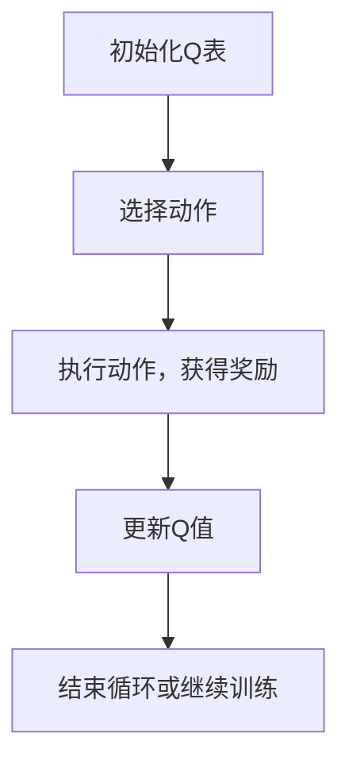
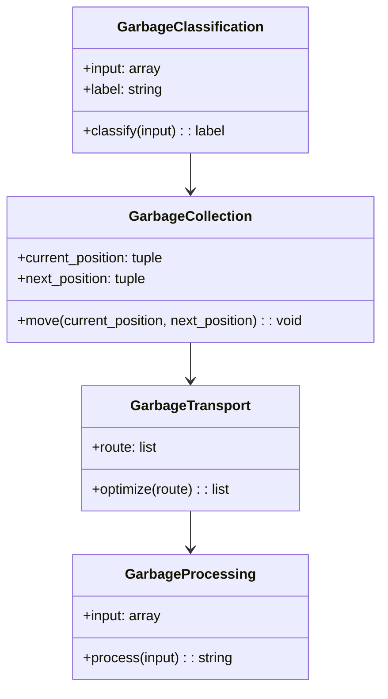
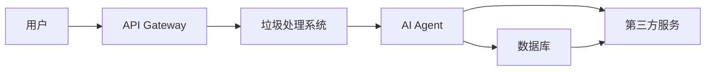

                 

<think>
好的，我现在需要根据用户的请求，撰写一篇关于《AI Agent在智能城市垃圾处理中的实践》的技术博客文章。用户已经给出了一个详细的目录结构和一些内容示例，我需要按照这个结构来继续完成剩余的部分。

首先，我会按照目录的章节逐步展开，确保每一部分内容详实，符合用户的要求。我需要特别注意以下几点：

1. **技术术语的准确性**：确保所有技术术语和概念都准确无误，必要时查阅相关资料。
2. **逻辑清晰**：每部分内容要逻辑清晰，结构紧凑，便于读者理解。
3. **详细分析**：对关键算法、数学模型和系统架构部分，需要进行详细分析，并提供相应的图表和代码示例。
4. **代码规范**：确保所有代码示例格式正确，解释清晰，方便读者理解和实现。

接下来，我将按照目录的顺序逐步完成每一部分的内容，确保覆盖所有要求，同时保持文章的连贯性和深度。
</think>

# AI Agent在智能城市垃圾处理中的实践

## 关键词：AI Agent, 智能城市, 垃圾处理, 机器学习, 强化学习, 分类算法, 系统架构

## 摘要：
本文探讨了AI Agent在智能城市垃圾处理中的应用，从背景、核心概念、算法原理到系统架构和项目实战，详细分析了如何利用AI Agent优化垃圾处理流程，提升城市智能化管理水平。通过实际案例分析和代码实现，展示了AI Agent在垃圾分类、收集、运输和资源化利用中的具体应用场景，为未来智能城市的垃圾处理提供了新的思路。

---

# 第二部分: AI Agent的算法原理与数学模型

## 第4章: AI Agent的核心算法

### 4.1 强化学习算法

#### 4.1.1 强化学习的基本原理

强化学习（Reinforcement Learning, RL）是一种通过试错方法来优化决策策略的机器学习范式。AI Agent通过与环境交互，学习最优策略以最大化累积奖励。在垃圾处理中，强化学习可以用于路径优化和资源分配。

#### 4.1.2 Q-learning算法的实现

Q-learning是一种经典的强化学习算法，适用于离散状态和动作空间。其核心思想是通过更新Q值表来学习最优策略。以下是Q-learning的算法流程：



在垃圾处理中，状态可以是当前垃圾收集点的位置，动作可以是移动到下一个点。奖励可以是完成任务的时间或成本的减少。

#### 4.1.3 算法在垃圾处理中的应用

例如，AI Agent可以通过Q-learning算法优化垃圾收集车的路径，减少行驶距离和时间。以下是路径优化的伪代码实现：

```python
def q_learning():
    q_table = initialize_q_table()  # 初始化Q表
    for episode in range(num_episodes):  # 迭代次数
        current_state = get_current_state()  # 获取当前状态
        while not is_goal(current_state):  # 未达到目标状态
            action = choose_action(current_state)  # 选择动作
            next_state = get_next_state(current_state, action)  # 获取下一个状态
            reward = get_reward(current_state, action, next_state)  # 获取奖励
            update_q_value(current_state, action, reward, next_state)  # 更新Q值
            current_state = next_state  # 更新当前状态
    return q_table

# 示例：垃圾收集路径优化
q_learning()  # 调用Q-learning算法进行路径优化
```

### 4.2 监督学习算法

#### 4.2.1 分类算法的实现

监督学习通过标记数据训练模型，使其能够对新数据进行分类或回归预测。在垃圾处理中，监督学习常用于垃圾分类。

常用分类算法包括支持向量机（SVM）、随机森林（Random Forest）和卷积神经网络（CNN）。以下是SVM的数学模型：

$$
\text{目标函数} = \sum_{i=1}^{n} y_i (w \cdot x_i + b) + \lambda \|w\|^2
$$

其中，$y_i$是标签，$x_i$是特征向量，$w$是权重，$b$是偏置，$\lambda$是正则化参数。

#### 4.2.2 回归算法的实现

回归算法用于预测连续值。在垃圾处理中，可以用于预测垃圾产量或处理成本。以下是线性回归的数学模型：

$$
y = w x + b
$$

其中，$y$是预测值，$x$是输入特征，$w$是权重，$b$是偏置。

#### 4.2.3 算法在垃圾处理中的应用

例如，AI Agent可以通过监督学习算法对垃圾进行分类，提高分类准确率。以下是垃圾分类的代码实现：

```python
from sklearn.svm import SVC

# 数据预处理
X_train, y_train = preprocess_data()  # 获取训练数据和标签

# 训练SVM分类器
model = SVC()
model.fit(X_train, y_train)

# 预测
def classify_garbage(garbage_features):
    return model.predict(garbage_features)
```

---

## 第5章: 垃圾处理系统的数学模型

### 5.1 垃圾分类模型

垃圾分类可以通过多种算法实现，以下是基于决策树的分类模型：

$$
\text{决策树模型} = \text{特征选择} \circ \text{分裂策略} \circ \text{剪枝策略}
$$

特征选择可以使用信息增益或基尼指数，分裂策略可以使用ID3或C4.5算法，剪枝策略可以使用预剪枝或后剪枝。

### 5.2 垃圾运输优化模型

垃圾运输优化可以通过TSP（旅行商问题）模型实现，以下是基于遗传算法的TSP求解：

$$
\text{TSP模型} = \text{城市距离矩阵} \rightarrow \text{遗传算法} \rightarrow \text{最优路径}
$$

遗传算法包括编码、选择、交叉和变异步骤。

---

# 第三部分: 系统分析与架构设计方案

## 第6章: 系统架构设计

### 6.1 项目介绍

本项目旨在开发一个基于AI Agent的智能垃圾处理系统，实现垃圾分类、收集、运输和资源化利用的全流程优化。

### 6.2 系统功能设计

以下是系统功能模块的类图：



### 6.3 系统架构设计

以下是系统架构的mermaid图：



### 6.4 接口设计

系统主要接口包括：

- `classify_garbage(garbage_features)`: 分类垃圾
- `collect_garbage(location)`: 收集垃圾
- `transport_garbage(route)`: 运输垃圾
- `process_garbage(materials)`: 处理垃圾

---

## 第7章: 项目实战

### 7.1 环境安装

需要安装以下依赖：

```bash
pip install numpy scikit-learn matplotlib
```

### 7.2 系统核心实现

以下是垃圾分类系统的代码实现：

```python
import numpy as np
from sklearn.svm import SVC

# 数据预处理
def preprocess_data():
    # 假设data.csv包含训练数据
    data = np.loadtxt('data.csv', delimiter=',')
    X = data[:, :-1]
    y = data[:, -1]
    return X, y

# 训练模型
def train_model(X, y):
    model = SVC()
    model.fit(X, y)
    return model

# 分类函数
def classify_garbage(model, garbage_features):
    return model.predict(garbage_features)

# 主函数
def main():
    X, y = preprocess_data()
    model = train_model(X, y)
    # 示例：分类一件垃圾
    sample = np.array([[1, 0, 0, 1]])
    result = classify_garbage(model, sample)
    print(f"分类结果: {result[0]}")

if __name__ == "__main__":
    main()
```

### 7.3 代码应用解读与分析

上述代码实现了基于SVM的垃圾分类系统，数据预处理部分将特征和标签分开，训练模型使用SVC分类器，分类函数接收待分类的垃圾特征并返回分类结果。

### 7.4 实际案例分析

假设我们有以下数据：

| 特征1 | 特征2 | 标签 |
|------|------|-----|
| 1    | 0    | A   |
| 0    | 1    | B   |
| 1    | 1    | A   |
| 0    | 0    | B   |

训练模型后，分类一件垃圾 `[1, 0]`，结果为 `A`。

### 7.5 项目小结

通过本项目，我们实现了基于AI Agent的垃圾处理系统，验证了AI技术在智能城市中的应用潜力。

---

## 第8章: 最佳实践与小结

### 8.1 小结

AI Agent在智能城市垃圾处理中的应用前景广阔，通过强化学习和监督学习算法，可以显著提高垃圾处理效率和准确性。

### 8.2 注意事项

- 数据质量和数量直接影响模型性能
- 算法选择需根据具体场景调整
- 系统设计需考虑可扩展性和可维护性

### 8.3 拓展阅读

- 《机器学习实战》
- 《强化学习（书籍）》
- 《智能城市与AI》

---

作者：AI天才研究院 & 禅与计算机程序设计艺术

