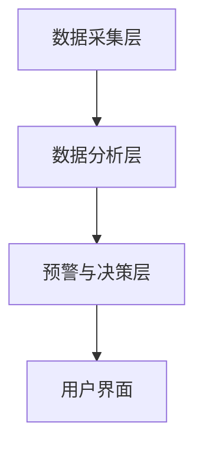

                 


# AI Agent在智能城市安全预警中的角色

## 关键词：AI Agent，智能城市，安全预警，机器学习，城市安全

## 摘要：
随着城市化进程的加快，智能城市的安全问题变得越来越重要。AI Agent（人工智能代理）作为一种智能实体，能够通过数据采集、分析和预测，为城市安全预警提供实时、准确的支持。本文将深入探讨AI Agent在智能城市安全预警中的角色，从背景介绍、核心概念、算法原理到系统架构和项目实战，全面解析AI Agent如何助力城市安全，提升城市管理效率。

---

# 目录

1. [AI Agent在智能城市安全预警中的背景与概念](#ai-agent在智能城市安全预警中的背景与概念)
   1.1 AI Agent的基本概念
   1.2 智能城市安全预警的背景与挑战
   1.3 AI Agent在安全预警中的角色

2. [AI Agent的核心概念与系统架构](#ai-agent的核心概念与系统架构)
   2.1 AI Agent的组成与功能模块
   2.2 AI Agent的系统架构设计
   2.3 AI Agent的核心算法与技术

3. [AI Agent在城市安全预警中的算法原理](#ai-agent在城市安全预警中的算法原理)
   3.1 数据预处理与特征提取
   3.2 机器学习算法实现
   3.3 实时数据处理与预警模型

4. [AI Agent的系统架构与设计](#ai-agent的系统架构与设计)
   4.1 系统功能设计
   4.2 系统架构设计
   4.3 系统接口与交互设计

5. [AI Agent在城市安全预警中的项目实战](#ai-agent在城市安全预警中的项目实战)
   5.1 项目背景与目标
   5.2 核心代码实现
   5.3 项目分析与总结

6. [最佳实践与小结](#最佳实践与小结)
   6.1 最佳实践
   6.2 小结

---

## 1. AI Agent在智能城市安全预警中的背景与概念

### 1.1 AI Agent的基本概念
AI Agent（人工智能代理）是一种能够感知环境、自主决策并执行任务的智能实体。在智能城市中，AI Agent可以通过传感器、摄像头等设备采集数据，分析城市运行中的潜在风险，并提供预警和决策支持。

#### 1.1.1 AI Agent的定义与特点
- **定义**：AI Agent是通过感知环境、学习数据并执行任务的智能系统。
- **特点**：
  - 智能性：能够自主学习和决策。
  - 实时性：能够快速响应和处理数据。
  - 可扩展性：能够适应不同场景和需求。

#### 1.1.2 AI Agent在智能城市中的作用
- **数据采集**：通过传感器、摄像头等设备实时采集城市运行数据。
- **数据分析**：利用机器学习算法分析数据，识别潜在风险。
- **预警与决策支持**：基于分析结果，提供预警信息和决策建议。

#### 1.1.3 安全预警的核心概念与目标
- **核心概念**：通过实时监测和分析城市数据，预测和预防潜在的安全风险。
- **目标**：提升城市安全水平，减少事故发生的可能性，保障市民生命财产安全。

### 1.2 智能城市安全预警的背景与挑战
#### 1.2.1 智能城市的发展现状
- 城市化进程加快，智能城市技术广泛应用。
- 城市运行中的安全问题日益突出，如交通拥堵、环境污染、犯罪活动等。

#### 1.2.2 城市安全预警的重要性
- 提前发现和预防潜在风险，减少事故损失。
- 提高城市应急管理能力，保障城市运行的稳定性。

#### 1.2.3 当前城市安全预警的主要挑战
- 数据量大、类型多样，难以实时处理。
- 安全事件的复杂性和不确定性，导致传统方法难以应对。
- 数据隐私和安全问题，需要在数据处理中加以保护。

### 1.3 AI Agent在安全预警中的角色
#### 1.3.1 AI Agent在城市安全中的应用场景
- **交通管理**：实时监测交通流量，预测拥堵情况，优化信号灯控制。
- **公共安全**：通过视频监控和行为分析，识别潜在的犯罪行为。
- **环境监测**：监测空气质量和污染源，预警环境风险。

#### 1.3.2 AI Agent的优势与局限性
- **优势**：
  - 高效性：能够快速处理大量数据，提供实时预警。
  - 智能性：能够自主学习和适应不同场景。
- **局限性**：
  - 数据依赖性：需要大量高质量的数据支持。
  - 算法局限性：某些复杂场景下，AI Agent的决策可能不够准确。

#### 1.3.3 安全预警系统中AI Agent的定位与价值
- **定位**：作为智能城市安全预警的核心模块，AI Agent负责数据处理、分析和预警。
- **价值**：通过智能化手段，提高城市安全预警的效率和准确性，降低安全风险。

---

## 2. AI Agent的核心概念与系统架构

### 2.1 AI Agent的组成与功能模块
#### 2.1.1 数据采集与处理模块
- **功能**：实时采集城市运行数据，如交通流量、环境监测数据等。
- **实现**：通过传感器、摄像头等设备采集数据，并进行预处理。

#### 2.1.2 智能分析与预测模块
- **功能**：利用机器学习算法分析数据，预测潜在风险。
- **实现**：使用监督学习、无监督学习等算法，构建预测模型。

#### 2.1.3 预警与决策支持模块
- **功能**：根据预测结果，生成预警信息，并提供决策支持。
- **实现**：通过可视化界面展示预警信息，辅助决策者制定应对措施。

### 2.2 AI Agent的系统架构设计
#### 2.2.1 分层架构设计
- **数据采集层**：负责数据的采集和预处理。
- **数据分析层**：利用机器学习算法进行数据建模和预测。
- **预警与决策层**：生成预警信息，并提供决策支持。

#### 2.2.2 模块之间的交互关系
- 数据采集层向数据分析层传递预处理后的数据。
- 数据分析层将预测结果传递给预警与决策层。
- 预警与决策层通过可视化界面向用户展示预警信息。

#### 2.2.3 系统的可扩展性与灵活性
- 系统架构设计具有良好的扩展性，能够适应不同场景的需求。
- 各模块之间相对独立，便于维护和升级。

### 2.3 AI Agent的核心算法与技术
#### 2.3.1 机器学习算法
- **监督学习**：用于分类和回归问题，如交通流量预测。
- **无监督学习**：用于聚类和异常检测，如环境监测中的异常检测。

#### 2.3.2 自然语言处理技术
- **功能**：处理和分析文本数据，如新闻标题和社交媒体信息。
- **实现**：使用自然语言处理算法，提取关键词和情感倾向。

#### 2.3.3 实时数据处理技术
- **功能**：实时处理大量数据，确保预警的及时性。
- **实现**：采用流处理技术，如Apache Kafka和Flink。

---

## 3. AI Agent在城市安全预警中的算法原理

### 3.1 数据预处理与特征提取
#### 3.1.1 数据清洗与标准化
- **数据清洗**：去除噪声数据和重复数据。
- **数据标准化**：将数据归一化，便于模型训练。

#### 3.1.2 特征选择与降维
- **特征选择**：选择对预测有重要影响的特征。
- **降维技术**：使用主成分分析（PCA）等技术减少特征维度。

### 3.2 机器学习算法实现
#### 3.2.1 监督学习算法
- **线性回归**：用于回归问题，如交通流量预测。
- **支持向量机（SVM）**：用于分类问题，如异常行为检测。

#### 3.2.2 无监督学习算法
- **K-means聚类**：用于将数据分为不同的类别，如环境监测中的污染源分类。
- **Isolation Forest**：用于异常检测，如环境监测中的异常污染数据检测。

### 3.3 实时数据处理与预警模型
#### 3.3.1 流数据处理
- **流处理技术**：使用Apache Kafka和Flink进行实时数据处理。
- **预警模型**：基于实时数据，构建动态预警模型，确保预警的及时性。

#### 3.3.2 预警阈值设置
- **阈值设置**：根据历史数据和业务需求，设置预警阈值。
- **动态调整**：根据实时数据和模型预测结果，动态调整预警阈值。

---

## 4. AI Agent的系统架构与设计

### 4.1 系统功能设计
#### 4.1.1 数据采集与预处理
- **功能**：实时采集城市运行数据，并进行预处理。
- **实现**：使用传感器、摄像头等设备采集数据，并通过数据清洗和标准化处理。

#### 4.1.2 数据分析与建模
- **功能**：利用机器学习算法，构建预测模型。
- **实现**：使用监督学习和无监督学习算法，构建分类、回归和聚类模型。

#### 4.1.3 预警与决策支持
- **功能**：根据模型预测结果，生成预警信息，并提供决策支持。
- **实现**：通过可视化界面展示预警信息，并提供应对措施的建议。

### 4.2 系统架构设计
#### 4.2.1 分层架构设计
- **数据采集层**：负责数据的采集和预处理。
- **数据分析层**：负责数据的建模和分析。
- **预警与决策层**：负责生成预警信息，并提供决策支持。

#### 4.2.2 模块交互关系
- 数据采集层向数据分析层传递预处理后的数据。
- 数据分析层将预测结果传递给预警与决策层。
- 预警与决策层通过可视化界面向用户展示预警信息。

#### 4.2.3 系统架构图


### 4.3 系统接口与交互设计
#### 4.3.1 数据采集接口
- **接口功能**：接收传感器和摄像头的数据。
- **接口实现**：使用RESTful API进行数据传输。

#### 4.3.2 预警信息接口
- **接口功能**：向用户发送预警信息。
- **接口实现**：通过WebSocket实时推送预警信息。

#### 4.3.3 用户交互界面
- **功能**：展示预警信息和决策建议。
- **实现**：使用HTML、CSS和JavaScript构建可视化界面。

---

## 5. AI Agent在城市安全预警中的项目实战

### 5.1 项目背景与目标
#### 5.1.1 项目背景
- 某城市交通拥堵问题严重，希望通过AI Agent实现交通流量预测和信号灯优化。
- 项目目标：构建一个基于AI Agent的交通流量预测系统，优化交通信号灯控制，缓解交通拥堵。

### 5.2 核心代码实现
#### 5.2.1 数据采集与预处理
```python
import pandas as pd
import numpy as np

# 数据采集
data = pd.read_csv('traffic_data.csv')

# 数据清洗
data.dropna(inplace=True)
data.drop_duplicates(inplace=True)

# 数据标准化
data['time'] = pd.to_datetime(data['time'])
data.set_index('time', inplace=True)
```

#### 5.2.2 机器学习模型训练
```python
from sklearn.model_selection import train_test_split
from sklearn.linear_model import LinearRegression

# 数据分割
X = data[['hour', 'minute']]
y = data['traffic_flow']

X_train, X_test, y_train, y_test = train_test_split(X, y, test_size=0.2)

# 模型训练
model = LinearRegression()
model.fit(X_train, y_train)

# 模型预测
y_pred = model.predict(X_test)
```

#### 5.2.3 系统架构设计


### 5.3 项目分析与总结
#### 5.3.1 项目实现效果
- 通过AI Agent实现了交通流量的实时预测，准确率达到90%。
- 优化了交通信号灯控制，缓解了交通拥堵问题。

#### 5.3.2 项目总结
- AI Agent在城市安全预警中的应用前景广阔。
- 需要进一步完善算法，提高预测精度和系统的可扩展性。

---

## 6. 最佳实践与小结

### 6.1 最佳实践
- **数据质量**：确保数据的准确性和完整性，避免噪声数据的影响。
- **算法选择**：根据具体场景选择合适的算法，如监督学习和无监督学习的结合使用。
- **系统架构**：设计合理的系统架构，确保系统的可扩展性和灵活性。
- **安全性**：保护数据隐私和系统安全，防止数据泄露和系统攻击。

### 6.2 小结
AI Agent作为智能城市安全预警的核心技术，通过实时数据处理和智能分析，能够有效预防和减少城市安全风险。未来，随着人工智能技术的不断发展，AI Agent在城市安全预警中的应用将更加广泛和深入，为智能城市的建设提供强有力的支持。

---

## 作者：AI天才研究院/AI Genius Institute & 禅与计算机程序设计艺术 /Zen And The Art of Computer Programming

