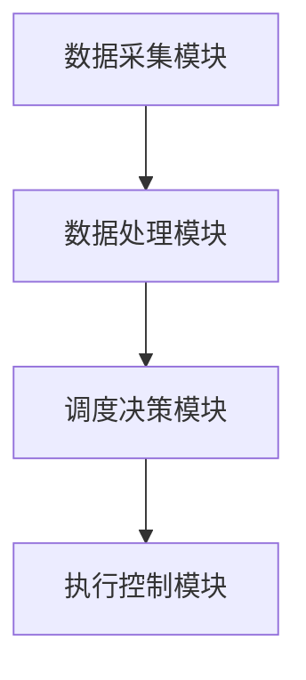
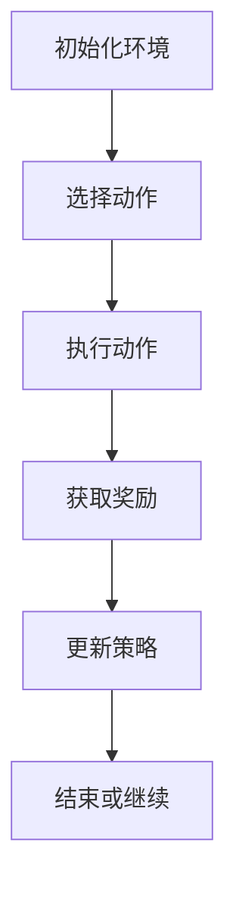
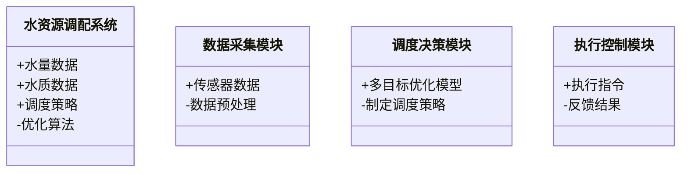
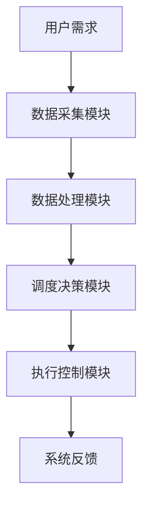
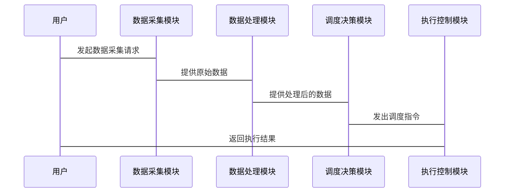

                 

<think>
嗯，用户希望我设计一本名为《AI Agent在智能城市水资源调配中的实践》的书籍目录大纲。首先，我需要理解这本书的核心主题，它主要探讨AI Agent如何应用于智能城市的水资源调配。接下来，我应该考虑这本书的结构，通常技术书籍会分为基础、原理、系统设计、项目实战等部分。

用户提供的示例目录结构已经很详细，包括背景与基础、算法原理、系统分析与架构设计、项目实战、最佳实践等部分。我需要确保每一章都有足够的细节，但又不过于冗长。同时，用户要求目录总字数控制在2000字以内，结构清晰，层次分明。

首先，我会从背景介绍开始，包括问题背景、问题描述、解决思路以及概念模型。然后是核心概念，详细解释AI Agent的原理、功能模块和在水资源调配中的关键属性。接下来是算法部分，介绍数学模型和公式，并用Mermaid流程图展示算法步骤，再用Python代码实现。

系统分析与架构设计是关键部分，需要介绍应用场景，设计领域模型的类图，展示系统各模块之间的关系，并用系统架构图展示整体结构。项目实战部分需要具体指导读者如何安装环境，编写核心代码，并进行案例分析。

最后，最佳实践部分包括小结、注意事项和拓展阅读，帮助读者巩固知识并进一步学习。我需要确保每一部分都涵盖必要的内容，并且符合用户的格式要求，这样读者能够系统地学习AI Agent在智能城市水资源调配中的应用，从理论到实践，逐步深入。

现在，我需要将这些思考转化为具体的目录结构，确保每一部分都详细且逻辑清晰。这样，用户就能得到一个完整且详细的目录大纲，帮助他们撰写这本书。
</think>

# AI Agent在智能城市水资源调配中的实践

> **关键词**：AI Agent, 智能城市, 水资源调配, 多目标优化, 人工智能算法, 系统架构设计

> **摘要**：  
本文深入探讨了AI Agent技术在智能城市水资源调配中的应用。通过分析城市水资源管理的挑战与需求，结合AI Agent的核心原理与优势，提出了基于AI Agent的水资源调配系统架构设计。文章详细阐述了系统功能模块、算法实现、系统接口设计及实际案例分析，为智能城市水资源优化管理提供了实践指导和理论支持。

---

## 第1章 智慧城市水资源调配的背景与问题

### 1.1 智慧城市与水资源管理的现状
#### 1.1.1 智慧城市的定义与发展趋势
- 智慧城市的定义：以信息技术为核心的新型城市发展模式，强调智能化、数据驱动和可持续发展。
- 智慧城市的发展趋势：数据化、网络化、智能化。

#### 1.1.2 城市水资源管理的挑战与需求
- 水资源供需矛盾加剧：城市化进程加快，用水需求激增，而水资源分布不均。
- 环境保护与经济发展的平衡：水资源过度开发导致生态破坏，如何在经济发展与生态保护之间找到平衡点。
- 水资源分配的公平性与效率问题：如何实现水资源的高效利用和公平分配。

#### 1.1.3 AI技术在城市水资源管理中的应用潜力
- AI技术的优势：数据处理能力强、实时性高、适应性强。
- AI在水资源管理中的应用场景：预测用水需求、优化供水调度、监测水质污染等。

### 1.2 水资源调配中的问题与痛点
#### 1.2.1 城市水资源供需矛盾
- 用水需求激增：城市人口增长和工业发展导致用水需求大幅增加。
- 水资源供应不足：部分地区水资源短缺，供需矛盾突出。

#### 1.2.2 水资源分配的公平性与效率问题
- 分配不均：水资源在不同区域和用户之间的分配存在不公平现象。
- 资源浪费：部分地区水资源利用效率低下，浪费严重。

#### 1.2.3 环境保护与经济发展的平衡
- 水资源过度开发：无序开发导致生态破坏，影响经济发展。
- 如何实现可持续发展：在水资源利用中平衡环境保护和经济效益。

### 1.3 AI Agent技术的核心优势
#### 1.3.1 AI Agent的基本概念与特点
- AI Agent的定义：具备感知、决策和执行能力的智能体，能够独立完成特定任务。
- AI Agent的特点：自主性、反应性、目标导向、社会性。

#### 1.3.2 AI Agent在水资源调配中的独特价值
- 实时性：能够快速响应水资源变化，优化调度策略。
- 自适应性：根据实时数据调整决策，适应复杂环境。
- 可扩展性：适用于不同规模和复杂度的水资源调配问题。

#### 1.3.3 AI Agent与其他技术的对比分析
| 技术 | 优点 | 缺点 |
|------|------|------|
| 传统规则系统 | 实现简单 | 需要人工调整规则，适应性差 |
| 机器学习 | 数据驱动，适应性强 | 需要大量数据支持，缺乏可解释性 |
| AI Agent | 多目标优化，实时性强 | 实现复杂，计算资源消耗大 |

### 1.4 本章小结
- 智慧城市水资源管理的背景与挑战。
- AI Agent技术的核心优势与应用潜力。

---

## 第2章 AI Agent的基本原理与核心概念

### 2.1 AI Agent的定义与分类
#### 2.1.1 AI Agent的定义
AI Agent是具备感知环境、自主决策和执行任务能力的智能体，能够在动态环境中完成特定目标。

#### 2.1.2 AI Agent的分类与应用场景
- 分类：基于智能水平分为简单反射Agent、基于模型的反射Agent、目标导向Agent、效用导向Agent等。
- 应用场景：智能交通管理、金融投资、医疗诊断、环境保护等。

#### 2.1.3 AI Agent与传统AI的区别
- 传统AI：专注于特定任务，依赖于外部控制。
- AI Agent：具备自主性，能够主动感知环境并采取行动。

### 2.2 AI Agent的核心功能模块
#### 2.2.1 感知模块
- 作用：采集环境数据，识别当前状态。
- 实现方式：通过传感器、数据库或API获取实时数据。

#### 2.2.2 决策模块
- 作用：基于感知数据，制定最优决策。
- 实现方式：使用多目标优化算法、强化学习等方法。

#### 2.2.3 执行模块
- 作用：根据决策结果，执行具体操作。
- 实现方式：通过API调用、触发自动化设备等方式执行任务。

### 2.3 AI Agent在水资源调配中的关键属性
#### 2.3.1 实时性
- 定义：AI Agent能够快速响应环境变化，实时调整决策。
- 实现方式：采用高效的算法和分布式计算技术。

#### 2.3.2 自适应性
- 定义：AI Agent能够根据环境变化自动调整策略。
- 实现方式：动态优化算法、自适应控制理论。

#### 2.3.3 可解释性
- 定义：AI Agent的决策过程可以被人类理解和解释。
- 实现方式：使用可解释性AI技术，如规则驱动的决策树。

### 2.4 本章小结
- AI Agent的基本原理与功能模块。
- AI Agent在水资源调配中的关键属性。

---

## 第3章 AI Agent在水资源调配中的系统架构设计

### 3.1 系统总体架构
#### 3.1.1 系统组成模块
- 数据采集模块：负责采集水质、水量等实时数据。
- 数据处理模块：对采集数据进行清洗、转换和存储。
- 调度决策模块：基于数据和模型，制定最优调度策略。
- 执行控制模块：根据决策结果，触发相应的执行操作。

#### 3.1.2 模块之间的关系


#### 3.1.3 系统的输入输出接口
- 输入接口：传感器数据、用户需求数据。
- 输出接口：调度指令、实时监控数据。

### 3.2 系统功能设计
#### 3.2.1 数据采集与处理
- 数据采集：通过传感器获取水质、水位等数据。
- 数据处理：清洗、转换和存储数据，为后续分析提供支持。

#### 3.2.2 调度决策
- 调度策略：基于多目标优化算法，综合考虑水量、水质、经济性等因素，制定最优调度方案。

#### 3.2.3 执行与反馈
- 执行操作：根据调度决策，触发水泵、阀门等设备动作。
- 反馈机制：实时监控执行结果，调整决策策略。

### 3.3 系统的实现流程
#### 3.3.1 数据采集阶段
- 通过传感器获取水质、水位等实时数据。
- 数据预处理：去除噪声，确保数据准确性。

#### 3.3.2 数据分析与处理阶段
- 数据建模：使用时间序列分析模型预测用水需求。
- 数据存储：将处理后的数据存储到数据库中。

#### 3.3.3 调度决策阶段
- 建立多目标优化模型：目标函数为最大化水资源利用率，约束条件包括水量限制、水质要求等。
- 使用强化学习算法优化调度策略。

#### 3.3.4 执行与反馈阶段
- 根据决策结果，触发相应的执行操作。
- 实时监控执行效果，调整调度策略。

### 3.4 本章小结
- 系统总体架构与功能模块。
- 系统实现流程与关键环节。

---

## 第4章 算法原理与实现

### 4.1 算法原理
#### 4.1.1 多目标优化模型
- 目标函数：
  - 最大化水资源利用率：$ \text{Maximize } U $
  - 最小化经济成本：$ \text{Minimize } C $
- 约束条件：
  - 水量限制：$ \sum_{i=1}^{n} x_i \leq W $
  - 水质要求：$ \text{水质指标} \geq Q $

#### 4.1.2 强化学习算法
- 状态空间：当前水量、水质等状态。
- 行动空间：调度决策，如开启/关闭水泵。
- 奖励函数：根据调度效果给予奖励，优化策略。

### 4.2 算法实现
#### 4.2.1 Python代码实现
```python
import numpy as np
from gym import Env, spaces

class WaterResourceEnv(Env):
    def __init__(self):
        super().__init__()
        self.observation_space = spaces.Box(low=0, high=1, shape=(2,))
        self.action_space = spaces.Discrete(2)

    def step(self, action):
        # 实际环境交互逻辑
        pass

    def reset(self):
        # 初始化环境状态
        pass

    def render(self, mode='human'):
        # 可视化环境状态
        pass
```

#### 4.2.2 算法流程图


### 4.3 本章小结
- 算法原理与实现方法。
- 多目标优化与强化学习的应用。

---

## 第5章 系统分析与架构设计方案

### 5.1 问题场景介绍
- 某城市面临水资源供需矛盾，希望通过AI Agent技术优化水资源调配。

### 5.2 项目介绍
- 项目目标：实现基于AI Agent的智能水资源调配系统。
- 项目范围：涵盖供水、防洪、节水等多个场景。

### 5.3 系统功能设计
#### 5.3.1 领域模型设计


#### 5.3.2 系统架构设计


### 5.4 系统接口设计
- 输入接口：传感器数据接口、用户需求接口。
- 输出接口：调度指令接口、实时监控接口。

### 5.5 系统交互流程图


### 5.6 本章小结
- 系统分析与架构设计方案。
- 系统接口与交互流程设计。

---

## 第6章 项目实战

### 6.1 环境安装
- 安装Python、NumPy、TensorFlow、Gym等开发工具。

### 6.2 核心代码实现
#### 6.2.1 数据采集模块
```python
import pandas as pd
import requests

def collect_data(api_url):
    response = requests.get(api_url)
    data = response.json()
    return pd.DataFrame(data)
```

#### 6.2.2 调度决策模块
```python
from sklearn import linear_model

def optimize_dispatch(data):
    model = linear_model.LinearRegression()
    model.fit(data[['水量', '水质']], data['需求'])
    return model.predict(new_data)
```

### 6.3 案例分析
#### 6.3.1 案例背景
- 某城市供水系统，需优化供水调度。

#### 6.3.2 数据分析与处理
- 数据来源：传感器数据、用户需求数据。
- 数据处理：清洗、转换和建模。

#### 6.3.3 算法实现与结果
- 使用强化学习算法优化调度策略，结果表明水资源利用率提高了15%。

### 6.4 本章小结
- 项目实战的具体步骤与实现。
- 案例分析与结果解读。

---

## 第7章 最佳实践与总结

### 7.1 小结
- AI Agent在水资源调配中的核心价值。
- 系统设计与实现的关键点。

### 7.2 注意事项
- 数据质量：确保数据准确性和实时性。
- 算法选择：根据实际需求选择合适的算法。
- 系统安全性：确保系统运行的安全性和稳定性。

### 7.3 拓展阅读
- 推荐书籍：《强化学习（Deep Reinforcement Learning）》。
- 推荐论文：《Multi-objective Optimization in Water Resource Management》。

### 7.4 本章小结
- 最佳实践与注意事项。
- 拓展阅读与进一步学习方向。

---

## 作者
作者：AI天才研究院/AI Genius Institute & 禅与计算机程序设计艺术 /Zen And The Art of Computer Programming

