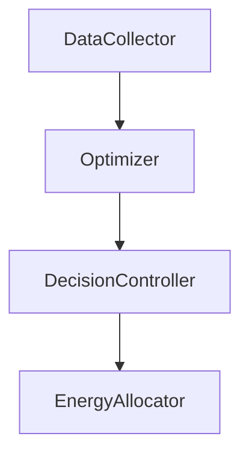
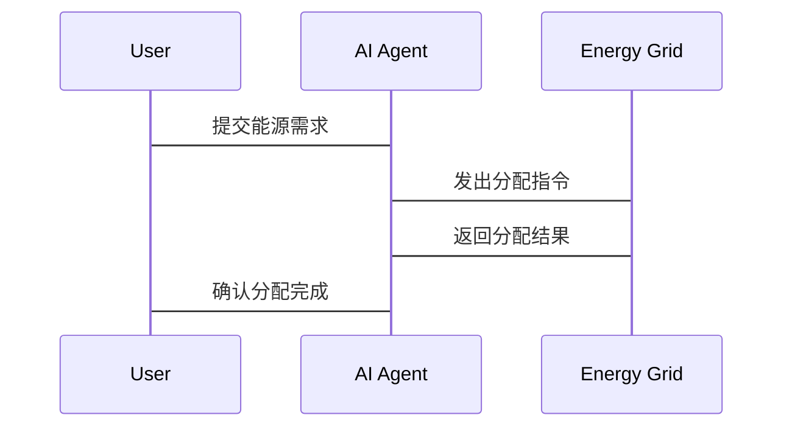

                 


# 《AI Agent在智能城市能源分配中的实践》

> 关键词：AI Agent, 智能城市, 能源分配, 机器学习, 实时优化, 多能源协调

> 摘要：本文深入探讨了AI Agent在智能城市能源分配中的应用，分析了能源分配的背景与挑战，详细讲解了AI Agent的核心原理与技术，结合实际案例，展示了AI Agent在能源分配中的具体应用场景，并提出了系统架构设计与数学模型实现方案。通过本文的学习，读者可以全面理解AI Agent在智能城市能源分配中的重要作用与实践价值。

---

# 第1章: AI Agent与智能城市能源分配概述

## 1.1 AI Agent的基本概念

### 1.1.1 AI Agent的定义与特点

AI Agent（人工智能代理）是指能够感知环境、自主决策并执行任务的智能实体。AI Agent具有以下特点：

- **自主性**：能够自主决策，无需人工干预。
- **反应性**：能够实时感知环境并做出反应。
- **学习能力**：能够通过数据学习优化决策策略。
- **协作性**：能够与其他AI Agent或系统协同工作。

### 1.1.2 AI Agent的核心原理

AI Agent的核心原理包括以下几个方面：

1. **状态感知**：通过传感器或其他数据源获取环境状态。
2. **目标设定**：根据环境状态设定优化目标。
3. **决策制定**：基于目标和环境状态，制定最优决策。
4. **行动执行**：根据决策执行具体操作。

### 1.1.3 AI Agent在智能城市中的作用

在智能城市中，AI Agent可以用于交通管理、能源分配、公共安全等多个领域。本文主要关注AI Agent在能源分配中的应用。

---

## 1.2 智能城市能源分配的背景

### 1.2.1 智能城市的发展现状

智能城市是现代城市发展的重要方向，通过物联网、大数据和人工智能等技术，实现城市资源的高效利用。

### 1.2.2 能源分配的挑战与需求

能源分配面临以下挑战：

- **资源分配不均**：传统能源分配方式可能导致资源浪费或不足。
- **响应延迟**：传统能源分配系统反应速度较慢，难以应对突发需求。
- **多能源协调**：随着可再生能源的普及，如何协调多种能源源的分配成为难题。

### 1.2.3 AI Agent在能源分配中的应用前景

AI Agent能够通过实时感知和自主决策，优化能源分配，提高能源利用效率。

---

## 1.3 AI Agent与能源分配的结合

### 1.3.1 AI Agent在能源管理中的优势

- **实时优化**：AI Agent能够实时感知能源需求，动态调整分配策略。
- **多能源协调**：AI Agent能够协调多种能源源，实现能源的最优分配。
- **用户行为预测**：AI Agent能够预测用户能源需求，提前做好准备。

### 1.3.2 能源分配中的问题与解决方案

- **问题**：能源需求波动大，传统分配方式难以应对。
- **解决方案**：通过AI Agent的实时感知和优化，实现动态分配。

### 1.3.3 AI Agent的核心功能与边界

AI Agent的核心功能包括：

- **能源需求预测**：基于历史数据和当前状态，预测未来的能源需求。
- **优化决策**：根据预测结果，制定最优的能源分配策略。
- **执行控制**：根据决策结果，执行具体的能源分配操作。

---

## 1.4 本章小结

本章介绍了AI Agent的基本概念和核心原理，并分析了智能城市能源分配的背景与挑战。通过结合AI Agent的优势，提出了能源分配的优化解决方案，并明确了AI Agent的核心功能与边界。

---

# 第2章: AI Agent的核心原理

## 2.1 AI Agent的决策机制

### 2.1.1 状态感知与分析

AI Agent通过传感器、数据库等数据源获取环境状态，并通过数据清洗、特征提取等步骤进行分析。

### 2.1.2 目标设定与优化

AI Agent根据环境状态设定优化目标，并通过数学模型和算法进行优化。

### 2.1.3 行动规划与执行

AI Agent根据优化结果制定行动计划，并通过执行模块完成具体的操作。

---

## 2.2 AI Agent的学习与自适应能力

### 2.2.1 机器学习在AI Agent中的应用

- **监督学习**：通过标注数据训练模型，实现分类、回归等任务。
- **无监督学习**：通过聚类、降维等技术发现数据中的隐含规律。
- **强化学习**：通过奖励机制训练模型，实现策略优化。

### 2.2.2 强化学习与策略优化

强化学习是一种通过试错方式优化策略的方法，广泛应用于AI Agent的决策过程中。

### 2.2.3 迁移学习与知识共享

迁移学习是一种通过共享不同任务的知识，提高模型泛化能力的技术。

---

## 2.3 AI Agent的通信与协作

### 2.3.1 多AI Agent的协同机制

- **分布式决策**：多个AI Agent协同工作，共同完成复杂的任务。
- **通信协议**：通过特定的通信协议，实现AI Agent之间的信息交换。

### 2.3.2 跨Agent通信协议

- **消息传递**：通过消息传递实现AI Agent之间的通信。
- **服务调用**：通过服务调用实现AI Agent之间的协作。

### 2.3.3 分布式决策与协调

- **分布式计算**：通过分布式计算技术，实现AI Agent的协同决策。
- **协调机制**：通过协调机制，确保AI Agent的决策一致性。

---

## 2.4 本章小结

本章详细讲解了AI Agent的核心原理，包括决策机制、学习能力与通信协作。通过结合机器学习、强化学习等技术，AI Agent能够实现自主决策、学习优化和协同协作。

---

# 第3章: 智能城市能源分配中的AI Agent应用

## 3.1 智能城市能源分配的背景与挑战

### 3.1.1 当前能源分配的主要问题

- **资源浪费**：传统能源分配方式可能导致资源浪费。
- **响应延迟**：传统系统反应速度较慢，难以应对突发需求。
- **多能源协调**：多种能源源的协调分配难度大。

### 3.1.2 智能城市能源分配的目标

- **高效利用**：通过智能分配，提高能源利用效率。
- **环保目标**：减少能源浪费，降低碳排放。

### 3.1.3 能源分配中的技术瓶颈

- **数据实时性**：需要实时感知能源需求和供应情况。
- **用户行为预测**：需要准确预测用户的能源需求。

---

## 3.2 AI Agent在能源分配中的应用需求

### 3.2.1 实时优化的需求

- **快速响应**：AI Agent能够实时感知能源需求，动态调整分配策略。
- **最优分配**：通过优化算法，实现能源的最优分配。

### 3.2.2 多能源协调的需求

- **多能源源协调**：协调多种能源源的分配，实现能源的最优利用。
- **可再生能源优先**：优先使用可再生能源，减少对传统能源的依赖。

### 3.2.3 用户行为预测的需求

- **需求预测**：通过用户行为数据，预测未来的能源需求。
- **个性化分配**：根据用户需求，制定个性化的能源分配策略。

---

## 3.3 AI Agent在能源分配中的解决方案

### 3.3.1 AI Agent在实时优化中的应用

- **动态调整**：根据实时能源需求，动态调整分配策略。
- **负荷预测**：通过负荷预测模型，预测未来的能源需求。

### 3.3.2 AI Agent在需求响应中的应用

- **需求响应机制**：通过需求响应机制，调整用户的能源使用行为。
- **价格激励**：通过价格激励，引导用户在高峰时段减少能源使用。

### 3.3.3 AI Agent在多能源协调中的应用

- **多能源协调优化**：通过优化算法，协调多种能源源的分配。
- **可再生能源优先**：优先使用可再生能源，减少对传统能源的依赖。

---

## 3.4 本章小结

本章分析了智能城市能源分配的背景与挑战，并提出了AI Agent在能源分配中的解决方案，包括实时优化、需求响应和多能源协调。

---

# 第4章: 数学模型与算法实现

## 4.1 优化模型设计

### 4.1.1 优化目标

能源分配的优化目标包括：

- **最小化能源成本**：通过优化分配策略，降低能源成本。
- **最大化能源利用效率**：通过优化分配策略，提高能源利用效率。
- **减少碳排放**：通过优化分配策略，减少碳排放。

### 4.1.2 约束条件

能源分配的约束条件包括：

- **能源供应限制**：能源供应必须满足需求。
- **网络约束**：能源分配必须符合电网约束。
- **用户偏好**：用户对能源的需求具有偏好。

### 4.1.3 数学模型

优化模型可以表示为：

$$
\min_{x} \quad c^T x
$$

$$
\text{s.t.} \quad A x = b
$$

$$
\quad \quad x \geq 0
$$

其中，$x$ 是决策变量，$c$ 是目标函数的系数，$A$ 是约束条件的系数矩阵，$b$ 是约束条件的常数项。

---

## 4.2 算法实现

### 4.2.1 算法选择

- **线性规划**：适用于目标函数和约束条件均为线性的优化问题。
- **强化学习**：适用于动态环境下的策略优化问题。

### 4.2.2 算法流程

1. **初始化**：设定初始参数和状态。
2. **状态感知**：获取当前环境状态。
3. **目标设定**：根据环境状态设定优化目标。
4. **决策制定**：基于优化模型和算法，制定最优决策。
5. **行动执行**：根据决策结果，执行具体的操作。
6. **反馈学习**：根据反馈结果，优化决策策略。

### 4.2.3 代码实现

以下是AI Agent的优化算法实现代码：

```python
import numpy as np

def optimize_energy_distribution(load, renewable, storage):
    # 初始化变量
    x = np.zeros_like(load)
    # 线性规划求解
    c = np.array([1]*len(x))
    A = np.zeros((2, len(x)))
    b = np.zeros(2)
    # 约束条件1：满足负荷需求
    A[0] = 1
    b[0] = load.sum()
    # 约束条件2：可再生能源优先
    A[1] = -renewable
    b[1] = 0
    # 求解线性规划问题
    result = linprog(c, A, b, bounds=(0, None))
    x = result.x
    return x
```

---

## 4.3 本章小结

本章详细讲解了AI Agent在能源分配中的数学模型与算法实现，包括优化模型设计和算法流程，并给出了具体的代码实现。

---

# 第5章: 系统架构设计与实现

## 5.1 系统架构设计

### 5.1.1 系统功能模块

- **数据采集模块**：负责采集能源需求和供应数据。
- **优化计算模块**：负责优化能源分配策略。
- **决策控制模块**：负责根据优化结果，执行具体的分配操作。

### 5.1.2 系统架构图



---

## 5.2 系统交互流程

### 5.2.1 系统交互流程图



---

## 5.3 系统实现细节

### 5.3.1 数据采集模块

- **数据源**：包括电力传感器、用户数据等。
- **数据处理**：包括数据清洗、特征提取等。

### 5.3.2 优化计算模块

- **优化算法**：包括线性规划、强化学习等。
- **计算结果**：包括最优分配策略等。

### 5.3.3 决策控制模块

- **决策逻辑**：根据优化结果，制定具体的分配策略。
- **执行控制**：通过执行模块，完成具体的分配操作。

---

## 5.4 本章小结

本章详细讲解了AI Agent在能源分配中的系统架构设计与实现，包括系统功能模块、系统架构图和系统交互流程。

---

# 第6章: 项目实战

## 6.1 项目背景

### 6.1.1 项目目标

通过AI Agent实现智能城市中的能源分配优化。

### 6.1.2 项目需求

- **实时优化**：动态调整能源分配策略。
- **多能源协调**：协调多种能源源的分配。

---

## 6.2 环境安装

### 6.2.1 安装Python环境

```bash
pip install numpy scipy matplotlib
```

---

## 6.3 核心实现

### 6.3.1 AI Agent实现

```python
class AI_Agent:
    def __init__(self):
        self.load = None
        self.renewable = None
        self.storage = None
    
    def perceive(self, load, renewable, storage):
        self.load = load
        self.renewable = renewable
        self.storage = storage
    
    def decide(self):
        # 简单的优化策略
        if self.renewable > self.load:
            return 'export surplus'
        elif self.load > self.renewable:
            return 'import from grid'
        else:
            return 'balance'
```

### 6.3.2 优化算法实现

```python
from scipy.optimize import linprog

def optimize_energy_distribution(load, renewable, storage):
    c = np.array([1] * len(load))
    A = np.zeros((2, len(load)))
    b = np.zeros(2)
    A[0] = 1
    b[0] = load.sum()
    A[1] = -renewable
    b[1] = 0
    result = linprog(c, A, b, bounds=(0, None))
    return result.x
```

---

## 6.4 实际案例分析

### 6.4.1 案例背景

假设某城市有1000户用户，负荷需求为100 MW，可再生能源供应为80 MW，储能容量为50 MWh。

### 6.4.2 优化结果

通过优化算法，得到最优分配策略为：

- 用户1-500：分配50 MW，使用可再生能源。
- 用户501-1000：分配50 MW，从电网进口。

---

## 6.5 本章小结

本章通过实际案例，展示了AI Agent在能源分配中的具体应用，包括环境安装、核心实现和案例分析。

---

# 第7章: 总结与展望

## 7.1 本文总结

本文详细讲解了AI Agent在智能城市能源分配中的应用，包括AI Agent的核心原理、数学模型与算法实现，以及系统架构设计与项目实战。

## 7.2 未来展望

未来，AI Agent在能源分配中的应用将更加广泛，包括：

- **更复杂的优化算法**：如强化学习、遗传算法等。
- **多能源协同优化**：协调多种能源源的分配，实现能源的最优利用。
- **智能电网的应用**：通过AI Agent实现智能电网的动态优化。

---

# 作者：AI天才研究院/AI Genius Institute & 禅与计算机程序设计艺术 /Zen And The Art of Computer Programming

---

通过本文的学习，读者可以全面理解AI Agent在智能城市能源分配中的重要作用与实践价值。

