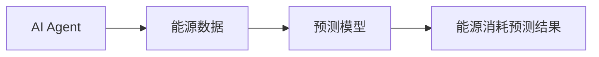
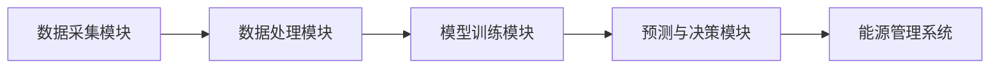
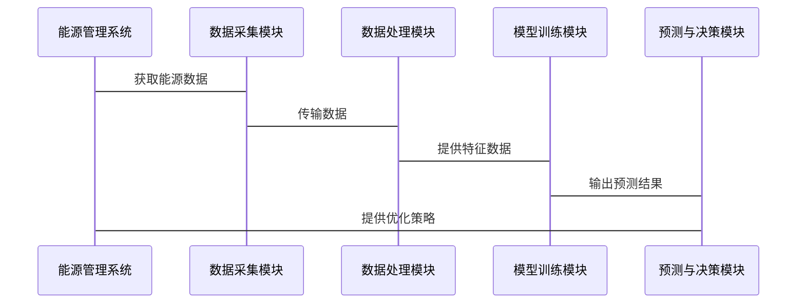

                 


# AI Agent在智能城市能源消耗预测中的实践

## 关键词：AI Agent，智能城市，能源消耗预测，时间序列分析，LSTM，机器学习

## 摘要：本文探讨了AI Agent在智能城市能源消耗预测中的应用，结合理论分析和实际案例，详细讲解了AI Agent的核心概念、算法原理、系统架构设计以及项目实战。通过时间序列分析和LSTM算法，展示了AI Agent如何有效预测能源消耗，为智能城市能源管理提供科学依据。

---

# 第1章: 智能城市能源消耗预测的背景与问题

## 1.1 智能城市的发展与挑战

### 1.1.1 智能城市的定义与核心特征

智能城市是指通过信息技术的集成应用，推动城市规划、建设和管理的智能化，提升城市运行效率和居民生活质量。其核心特征包括：

- **数据驱动**：依赖传感器和物联网设备实时采集城市运行数据。
- **智能化决策**：利用人工智能技术优化资源配置和决策过程。
- **可持续发展**：通过节能减排实现绿色城市目标。

### 1.1.2 智能城市中的能源消耗问题

随着城市化进程的加快，能源消耗量急剧增加。如何有效预测和管理能源消耗，避免资源浪费和环境污染，成为智能城市建设中的重要挑战。

### 1.1.3 能源消耗预测的现实意义

能源消耗预测是城市能源管理的基础，能够帮助城市优化能源分配，减少浪费，降低碳排放，推动可持续发展。

## 1.2 AI Agent的基本概念与作用

### 1.2.1 AI Agent的定义与特点

AI Agent（人工智能代理）是指能够感知环境、自主决策并执行任务的智能实体。其特点包括：

- **自主性**：能够在没有外部干预的情况下运行。
- **反应性**：能够实时感知环境并做出反应。
- **学习能力**：能够通过数据学习和优化决策模型。

### 1.2.2 AI Agent在智能城市中的应用场景

AI Agent在智能城市中的应用场景包括交通管理、能源消耗预测、公共安全监控等领域。本文重点探讨其在能源消耗预测中的应用。

### 1.2.3 AI Agent与能源消耗预测的关系

AI Agent通过实时数据采集和智能分析，能够有效提高能源消耗预测的准确性和及时性，为城市能源管理提供科学依据。

## 1.3 问题背景与目标

### 1.3.1 能源消耗预测的必要性

能源消耗预测是优化能源管理的重要手段，能够帮助城市提前规划能源需求，减少能源浪费和环境污染。

### 1.3.2 AI Agent在能源消耗预测中的优势

AI Agent具有实时感知、自主决策和学习优化的特点，能够显著提高能源消耗预测的准确性和效率。

### 1.3.3 本课题的研究目标与范围

本课题旨在研究AI Agent在智能城市能源消耗预测中的应用，探讨其技术实现和实际效果，为智能城市能源管理提供参考。

---

# 第2章: AI Agent与能源消耗预测的核心概念

## 2.1 AI Agent的基本原理

### 2.1.1 AI Agent的感知与决策机制

AI Agent通过传感器和数据采集设备感知环境信息，利用机器学习算法进行数据分析和预测，做出决策并执行任务。

### 2.1.2 AI Agent的学习与优化方法

AI Agent通过监督学习、强化学习等方法优化预测模型，提高预测准确性和决策效率。

### 2.1.3 AI Agent的通信与协作能力

AI Agent能够与其他Agent或系统进行通信和协作，实现信息共享和任务协同。

## 2.2 能源消耗预测的数学模型

### 2.2.1 时间序列分析的基本概念

时间序列分析是一种基于时间数据的预测方法，广泛应用于能源消耗预测。其核心是通过历史数据识别趋势和规律，预测未来值。

### 2.2.2 能源消耗预测的常用模型

常用的能源消耗预测模型包括ARIMA、LSTM、随机森林等。其中，LSTM（长短期记忆网络）因其优秀的长序列记忆能力，特别适合时间序列预测。

### 2.2.3 能源消耗预测的特征提取方法

特征提取是时间序列分析的重要步骤，常见的特征包括均值、方差、趋势、周期性等。

## 2.3 AI Agent与能源消耗预测的结合

### 2.3.1 AI Agent在能源数据采集中的作用

AI Agent能够实时采集和处理能源消耗数据，为预测模型提供高质量输入。

### 2.3.2 AI Agent在能源消耗预测中的算法选择

AI Agent可以选择适合的算法，如LSTM，构建预测模型，并通过反馈机制优化模型性能。

### 2.3.3 AI Agent在能源管理中的决策优化

AI Agent能够根据预测结果优化能源分配策略，提高能源利用效率。

## 2.4 核心概念与联系

### 2.4.1 AI Agent与能源消耗预测的关系图



### 2.4.2 能源消耗预测的特征对比表格

| 特征 | 描述 |
|------|------|
| 时间序列 | 数据按时间顺序排列 |
| 季节性 | 数据呈现周期性变化 |
| 趋势性 | 数据呈现长期上升或下降趋势 |
| 随机性 | 数据中的不可预测部分 |

---

# 第3章: AI Agent的算法原理

## 3.1 数据预处理与特征工程

### 3.1.1 数据清洗与标准化

数据清洗包括去除异常值、填充缺失值等。标准化是将数据归一化，方便模型训练。

### 3.1.2 时间序列数据的特征提取

特征提取包括计算均值、方差、趋势、周期性等特征，为模型提供更有意义的输入。

### 3.1.3 数据的分训练集与测试集划分

将数据划分为训练集和测试集，训练集用于模型训练，测试集用于模型验证。

## 3.2 AI Agent的预测算法

### 3.2.1 基于LSTM的时间序列预测

LSTM（长短期记忆网络）是一种特殊的RNN（循环神经网络），能够有效处理长序列依赖问题。

#### LSTM的基本结构

LSTM的核心是细胞状态和门控机制：

- **细胞状态**：$c_t$，用于存储长期信息。
- **遗忘门**：$f_t$，控制哪些信息保留。
- **输入门**：$i_t$，控制哪些新信息加入。
- **输出门**：$o_t$，控制输出。

数学公式：

$$
f_t = \sigma(W_f \cdot [h_{t-1}, x_t] + b_f)
$$

$$
i_t = \sigma(W_i \cdot [h_{t-1}, x_t] + b_i)
$$

$$
c_t = f_t \cdot c_{t-1} + i_t \cdot tanh(W_c \cdot [h_{t-1}, x_t] + b_c)
$$

$$
o_t = \sigma(W_o \cdot [h_{t-1}, x_t] + b_o)
$$

$$
h_t = o_t \cdot tanh(c_t)
$$

其中，$\sigma$是sigmoid函数，$tanh$是双曲正切函数。

#### LSTM的实现代码示例

```python
import numpy as np
from tensorflow.keras import layers

# 定义LSTM模型
model = tf.keras.Sequential()
model.add(layers.LSTM(64, input_shape=(timesteps, features)))
model.add(layers.Dense(1))
model.compile(optimizer='adam', loss='mean_squared_error')
```

## 3.3 算法实现与优化

### 3.3.1 模型训练与调优

通过训练数据优化模型参数，调整学习率、批量大小等超参数，提高预测准确率。

### 3.3.2 模型评估与验证

使用测试集评估模型性能，常用指标包括均方误差（MSE）、平均绝对误差（MAE）等。

### 3.3.3 模型部署与应用

将训练好的模型部署到实际系统中，实时预测能源消耗，指导能源管理。

---

# 第4章: 系统分析与架构设计

## 4.1 系统功能设计

### 4.1.1 数据采集模块

通过传感器和物联网设备采集能源消耗数据。

### 4.1.2 数据处理模块

对采集的数据进行清洗、特征提取和格式转换。

### 4.1.3 模型训练模块

基于训练数据训练AI Agent的预测模型。

### 4.1.4 预测与决策模块

利用训练好的模型实时预测能源消耗，优化能源分配策略。

## 4.2 系统架构设计

### 4.2.1 系统架构图



### 4.2.2 接口设计

系统接口包括数据接口、模型接口和决策接口，确保各模块协同工作。

### 4.2.3 交互流程图



---

# 第5章: 项目实战

## 5.1 项目背景与目标

本项目旨在利用AI Agent预测某城市能源消耗，优化能源管理。

## 5.2 环境安装与配置

安装必要的Python库，如TensorFlow、Keras、Mermaid等。

## 5.3 核心代码实现

```python
import numpy as np
import tensorflow as tf
from tensorflow.keras import layers

# 数据准备
data = ...  # 获取能源消耗数据
timesteps = ...  # 时间步数
features = ...  # 特征数

# 数据预处理
# 数据标准化
scaler = MinMaxScaler()
scaled_data = scaler.fit_transform(data)

# 划分训练集和测试集
train_data = scaled_data[:training_size]
test_data = scaled_data[training_size:]

# 构建LSTM模型
model = tf.keras.Sequential()
model.add(layers.LSTM(64, input_shape=(timesteps, features)))
model.add(layers.Dense(1))
model.compile(optimizer='adam', loss='mean_squared_error')

# 训练模型
model.fit(train_data, epochs=10, batch_size=32)

# 预测测试集
predictions = model.predict(test_data)

# 反标准化预测结果
inv_predictions = scaler.inverse_transform(predictions)
```

## 5.4 案例分析与结果解读

通过实际案例分析，展示AI Agent在能源消耗预测中的应用效果。

## 5.5 项目小结

总结项目经验，提出改进建议，展望未来发展方向。

---

# 第6章: 最佳实践与总结

## 6.1 最佳实践

- **数据质量**：确保数据的完整性和准确性。
- **模型优化**：合理选择模型参数，避免过拟合。
- **系统集成**：确保各模块协同工作，提高系统效率。

## 6.2 小结

本文详细探讨了AI Agent在智能城市能源消耗预测中的应用，通过理论分析和实际案例，展示了AI Agent的优势和实际效果。

## 6.3 注意事项

- 定期更新模型，适应数据变化。
- 注意数据隐私和安全问题。
- 优化系统架构，提高运行效率。

## 6.4 拓展阅读

- 建议阅读《深度学习》（Deep Learning）和《时间序列分析》（Time Series Analysis）等书籍，深入学习相关知识。

---

# 作者

作者：AI天才研究院/AI Genius Institute  
& 禅与计算机程序设计艺术/Zen And The Art of Computer Programming

---

以上是《AI Agent在智能城市能源消耗预测中的实践》的完整目录大纲和部分内容展示，您可以根据需要进一步扩展每一部分的内容。

