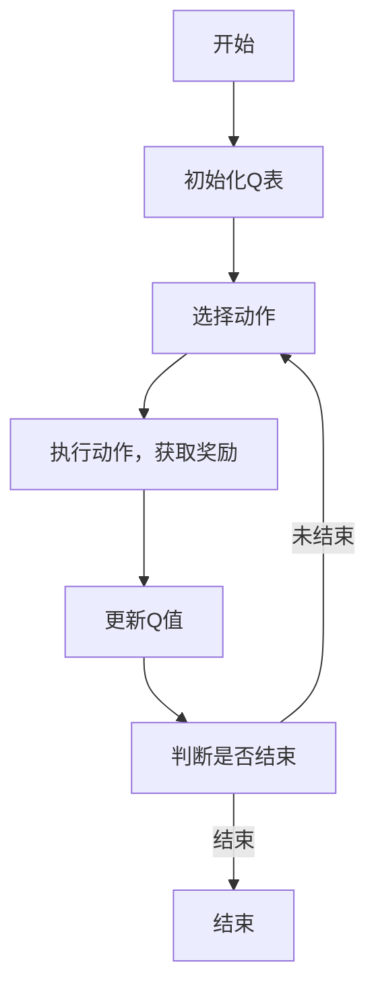
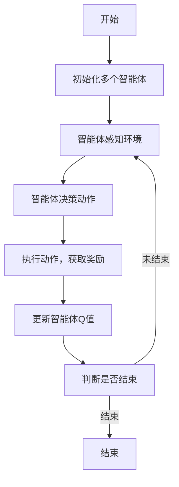
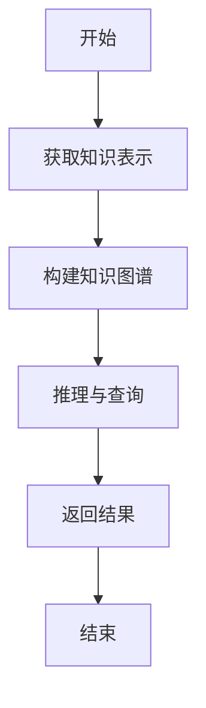

                 

<think>
好，我现在要帮用户完成一篇关于《AI Agent在智能城市能源管理优化中的应用》的技术博客文章。用户已经给出了详细的目录大纲，我需要按照这个结构来撰写文章。用户的要求非常具体，我需要确保每个章节都包含足够的细节，包括背景、概念、算法、系统设计和项目实战。

首先，我会从“文章标题”开始，然后列出关键词和摘要。接下来按照目录大纲，逐一撰写每个章节，确保每个小节都有丰富的内容，包括背景介绍、核心概念、算法原理、系统架构、项目实战和案例分析。我需要使用专业的技术语言，同时保持逻辑清晰，结构紧凑。

在撰写过程中，我需要确保每个章节都有足够的技术深度，比如在算法部分，使用强化学习和数学模型来详细讲解。同时，系统架构部分需要有图表支持，如领域模型类图和系统架构图。项目实战部分需要提供具体的实现代码和详细解读。

我还要注意文章的结构，确保每个章节的小结部分总结关键点。最后，文章末尾要加上作者信息和联系方式。整个过程需要耐心和细致，确保文章内容全面且符合用户的要求。
</think>

# AI Agent在智能城市能源管理优化中的应用

---

## 关键词：
AI Agent、智能城市、能源管理、优化算法、智能电网

---

## 摘要：
本文探讨了AI Agent在智能城市能源管理中的应用，从AI Agent的基本概念到其在能源管理中的优化算法，再到实际应用案例，全面分析了AI Agent如何提升智能城市能源管理的效率与可持续性。文章通过强化学习、多智能体协同等技术手段，结合数学模型和系统架构设计，详细阐述了AI Agent在智能城市能源管理中的重要作用和具体实现方式。

---

# 第1章: AI Agent与智能城市能源管理概述

## 1.1 AI Agent的基本概念

### 1.1.1 AI Agent的定义与特点
AI Agent（人工智能代理）是指能够感知环境、自主决策并采取行动的智能实体。其特点包括：
- **自主性**：能够自主决策和行动。
- **反应性**：能够实时感知环境并做出响应。
- **社会性**：能够与其他Agent或人类进行交互和协作。
- **学习能力**：能够通过经验改进自身的决策能力。

### 1.1.2 AI Agent的核心功能与分类
AI Agent的核心功能包括知识表示与推理、行为决策与规划、多智能体协同。根据应用场景的不同，AI Agent可以分为以下几类：
- **简单反射型Agent**：基于预定义规则进行反应。
- **基于模型的反射型Agent**：利用内部模型进行推理和决策。
- **目标驱动型Agent**：根据目标驱动行为。
- **实用驱动型Agent**：根据效用函数优化决策。

### 1.1.3 AI Agent在能源管理中的优势
AI Agent在能源管理中的优势包括：
- **实时性**：能够快速响应环境变化。
- **智能化**：能够通过学习优化能源管理策略。
- **分布式协同**：能够与其他Agent或系统协同工作，实现全局优化。

---

## 1.2 智能城市能源管理的背景与挑战

### 1.2.1 智能城市的发展现状
智能城市通过物联网、大数据和人工智能等技术，实现了城市资源的高效利用和管理。能源管理是智能城市的重要组成部分，涉及电力、燃气、热力等多种能源的优化配置。

### 1.2.2 能源管理在智能城市中的重要性
能源管理在智能城市中的重要性体现在：
- **能源效率提升**：通过优化能源分配和使用，减少能源浪费。
- **可再生能源接入**：支持风能、太阳能等可再生能源的高效利用。
- **需求侧管理**：通过需求响应技术，平衡能源供需。

### 1.2.3 当前能源管理的主要挑战
当前能源管理的主要挑战包括：
- **能源供需不平衡**：由于能源生产和消耗的不匹配，导致资源浪费或供不应求。
- **可再生能源波动**：风能、太阳能等可再生能源的波动性对能源管理提出了更高的要求。
- **多智能体协同**：需要协调多个Agent或系统，实现全局优化。

---

## 1.3 AI Agent在能源管理中的应用前景

### 1.3.1 AI Agent如何优化能源管理
AI Agent可以通过以下方式优化能源管理：
- **实时优化**：基于实时数据，动态调整能源分配策略。
- **预测性维护**：通过预测设备状态，提前进行维护，避免故障发生。
- **需求响应**：根据用户需求和市场价格，优化能源使用策略。

### 1.3.2 AI Agent在智能城市中的具体应用场景
AI Agent在智能城市中的具体应用场景包括：
- **智能电网**：优化电力分配和调度。
- **需求侧管理**：通过需求响应技术，平衡能源供需。
- **可再生能源调度**：优化风能、太阳能等可再生能源的接入和使用。

### 1.3.3 AI Agent技术的未来发展趋势
AI Agent技术的未来发展趋势包括：
- **强化学习应用**：通过强化学习优化能源管理策略。
- **多智能体协同**：通过多智能体协同实现全局优化。
- **知识图谱构建**：通过知识图谱构建，提升AI Agent的知识表示能力。

---

## 1.4 本章小结
本章介绍了AI Agent的基本概念、核心功能与分类，分析了智能城市能源管理的背景与挑战，并探讨了AI Agent在能源管理中的应用前景和未来发展趋势。

---

# 第2章: AI Agent的核心概念与原理

## 2.1 AI Agent的核心概念

### 2.1.1 知识表示与推理
知识表示是AI Agent实现智能决策的基础。常用的表示方法包括：
- **谓词逻辑**：通过谓词和逻辑连接词表示知识。
- **规则表示**：通过规则库表示知识。
- **语义网络**：通过节点和边表示知识。

知识推理是基于知识表示，通过推理算法得出新的结论。常用的推理方法包括：
- **演绎推理**：从一般到特殊的推理。
- **归纳推理**：从特殊到一般的推理。
- **溯因推理**：通过假设验证得出结论。

### 2.1.2 行为决策与规划
行为决策是AI Agent的核心功能之一。常用的行为决策方法包括：
- **基于规则的决策**：根据预定义规则进行决策。
- **基于模型的决策**：基于内部模型进行推理和决策。
- **基于强化学习的决策**：通过强化学习优化决策策略。

行为规划是通过规划算法，制定行动步骤。常用的规划算法包括：
- **无优先级规划**：不考虑任务优先级的规划。
- **优先级规划**：考虑任务优先级的规划。
- **动态规划**：通过动态规划优化行动步骤。

### 2.1.3 多智能体协同
多智能体协同是AI Agent实现复杂任务的重要手段。常用的多智能体协同方法包括：
- **分布式协同**：通过分布式通信实现协同。
- **集中式协同**：通过集中式管理实现协同。
- **混合式协同**：结合分布式和集中式方法实现协同。

---

## 2.2 AI Agent的原理与架构

### 2.2.1 知识表示的数学模型
知识表示的数学模型可以通过图论、逻辑代数等方法表示。例如，语义网络可以用图论中的节点和边表示知识。

### 2.2.2 行为决策的算法流程
行为决策的算法流程包括：
1. **感知环境**：获取环境数据。
2. **状态表示**：将环境数据表示为状态。
3. **决策推理**：基于知识表示和推理方法，生成决策。
4. **行动执行**：执行决策行动。

### 2.2.3 多智能体协同的通信机制
多智能体协同的通信机制包括：
- **直接通信**：通过直接交换信息实现协同。
- **间接通信**：通过共享数据库或消息队列实现协同。
- **混合通信**：结合直接和间接通信实现协同。

---

## 2.3 AI Agent在能源管理中的应用案例

### 2.3.1 智能电网中的AI Agent
在智能电网中，AI Agent可以通过强化学习优化电力分配和调度。

### 2.3.2 需求侧管理中的AI Agent
在需求侧管理中，AI Agent可以通过需求响应技术优化能源使用策略。

### 2.3.3 可再生能源调度中的AI Agent
在可再生能源调度中，AI Agent可以通过多智能体协同实现全局优化。

---

## 2.4 本章小结
本章详细介绍了AI Agent的核心概念与原理，包括知识表示与推理、行为决策与规划、多智能体协同等，并通过实际案例展示了AI Agent在能源管理中的应用。

---

# 第3章: 智能城市能源管理的优化问题

## 3.1 能源管理优化的基本问题

### 3.1.1 能源供需平衡问题
能源供需平衡问题是能源管理的核心问题。需要通过优化算法实现能源供需的动态平衡。

### 3.1.2 能源成本最小化问题
能源成本最小化是能源管理的重要目标。需要通过优化算法最小化能源使用成本。

### 3.1.3 能源系统可靠性问题
能源系统可靠性问题是能源管理的重要挑战。需要通过优化算法提高能源系统的可靠性和稳定性。

---

## 3.2 AI Agent在能源管理优化中的作用

### 3.2.1 AI Agent如何解决能源供需不平衡问题
AI Agent可以通过实时感知和动态调整，解决能源供需不平衡问题。

### 3.2.2 AI Agent如何优化能源成本
AI Agent可以通过强化学习优化能源使用策略，降低能源成本。

### 3.2.3 AI Agent如何提高能源系统的可靠性
AI Agent可以通过预测性维护和多智能体协同，提高能源系统的可靠性。

---

## 3.3 能源管理优化的数学模型

### 3.3.1 线性规划模型
线性规划模型是常用的优化模型。其数学表达式为：
$$ \text{目标函数：} \min c^T x $$
$$ \text{约束条件：} A x \geq b $$
其中，\( c \) 是目标函数的系数向量，\( x \) 是决策变量向量，\( A \) 是约束矩阵，\( b \) 是约束常数向量。

### 3.3.2 强化学习模型
强化学习模型通过状态、动作和奖励的三元组进行优化。其数学表达式为：
$$ Q(s, a) = Q(s, a) + \alpha (r + \gamma \max_{a'} Q(s', a') - Q(s, a)) $$
其中，\( Q \) 是Q值函数，\( s \) 是状态，\( a \) 是动作，\( \alpha \) 是学习率，\( r \) 是奖励，\( \gamma \) 是折扣因子，\( s' \) 是下一状态。

### 3.3.3 多目标优化模型
多目标优化模型通过同时优化多个目标，实现全局最优。其数学表达式为：
$$ \min f_1(x), f_2(x), \dots, f_n(x) $$
$$ \text{约束条件：} g_1(x) \geq 0, g_2(x) \geq 0, \dots, g_m(x) \geq 0 $$

---

## 3.4 本章小结
本章分析了智能城市能源管理优化的基本问题，并探讨了AI Agent在能源管理优化中的作用，最后介绍了常用的能源管理优化数学模型。

---

# 第4章: AI Agent的核心算法与数学模型

## 4.1 强化学习算法

### 4.1.1 Q-learning算法
Q-learning是一种常用的强化学习算法。其算法流程图如下：



Q-learning的数学公式为：
$$ Q(s, a) = Q(s, a) + \alpha (r + \gamma \max_{a'} Q(s', a') - Q(s, a)) $$

---

## 4.2 多智能体协同算法

### 4.2.1 多智能体强化学习
多智能体强化学习是一种通过多个智能体协同完成任务的算法。其算法流程图如下：



多智能体强化学习的数学公式为：
$$ Q_i(s, a_i) = Q_i(s, a_i) + \alpha (r_i + \gamma \max_{a'_i} Q_i(s', a'_i) - Q_i(s, a_i)) $$

---

## 4.3 基于知识图谱的推理算法

### 4.3.1 知识图谱构建
知识图谱构建是基于知识图谱的推理算法的基础。其流程图如下：



知识图谱的构建可以基于图论中的节点和边表示知识。例如，语义网络可以用图论中的节点和边表示知识。

---

## 4.4 本章小结
本章详细介绍了AI Agent的核心算法与数学模型，包括强化学习算法、多智能体协同算法和基于知识图谱的推理算法，并通过流程图和数学公式进行了详细讲解。

---

# 第5章: 智能城市能源管理系统的架构设计

## 5.1 系统需求分析

### 5.1.1 系统功能需求
系统功能需求包括：
- **能源数据采集**：采集电力、燃气等能源数据。
- **能源数据分析**：分析能源数据，优化能源管理策略。
- **能源管理决策**：基于分析结果，制定能源管理决策。
- **能源管理执行**：执行能源管理决策，调整能源分配。

### 5.1.2 系统性能需求
系统性能需求包括：
- **实时性**：能够实时响应能源管理需求。
- **可靠性**：系统能够稳定运行，避免故障。
- **可扩展性**：系统能够扩展，适应未来需求。

---

## 5.2 系统架构设计

### 5.2.1 分层架构设计
系统架构设计采用分层架构，包括数据采集层、数据处理层、决策层和执行层。

### 5.2.2 模块划分
系统模块划分包括：
- **数据采集模块**：负责采集能源数据。
- **数据分析模块**：负责分析能源数据。
- **决策模块**：负责制定能源管理决策。
- **执行模块**：负责执行能源管理决策。

---

## 5.3 系统通信协议设计

### 5.3.1 数据采集层通信协议
数据采集层采用MQTT协议进行通信。

### 5.3.2 数据处理层通信协议
数据处理层采用HTTP协议进行通信。

### 5.3.3 决策层通信协议
决策层采用WebSocket协议进行通信。

---

## 5.4 系统交互设计

### 5.4.1 用户界面设计
用户界面设计采用人机交互界面，包括数据展示、决策制定和执行监控。

### 5.4.2 系统交互流程
系统交互流程包括：
1. **用户输入需求**：用户输入能源管理需求。
2. **系统分析需求**：系统分析需求，生成优化策略。
3. **用户确认策略**：用户确认优化策略。
4. **系统执行策略**：系统执行优化策略。

---

## 5.5 本章小结
本章详细介绍了智能城市能源管理系统的架构设计，包括系统需求分析、系统架构设计、系统通信协议设计和系统交互设计。

---

# 第6章: AI Agent在智能城市能源管理中的项目实战

## 6.1 项目背景与目标

### 6.1.1 项目背景
本项目旨在通过AI Agent优化智能城市能源管理，实现能源供需平衡、能源成本最小化和能源系统可靠性。

### 6.1.2 项目目标
项目目标包括：
- **实现AI Agent在智能城市能源管理中的应用**
- **优化能源管理策略，提高能源使用效率**
- **实现多智能体协同，提高能源系统可靠性**

---

## 6.2 项目实现

### 6.2.1 环境安装
项目环境安装包括：
- **安装Python**：安装Python 3.8及以上版本。
- **安装TensorFlow**：安装TensorFlow库。
- **安装Keras**：安装Keras库。
- **安装其他依赖库**：安装Pandas、NumPy等依赖库。

### 6.2.2 核心实现代码

```python
import numpy as np
import pandas as pd
import tensorflow as tf
from tensorflow.keras import layers

# 定义Q-learning算法
class QLearning:
    def __init__(self, state_space, action_space):
        self.state_space = state_space
        self.action_space = action_space
        self.Q = np.zeros((state_space, action_space))
    
    def choose_action(self, state, epsilon=0.1):
        if np.random.random() < epsilon:
            return np.random.randint(self.action_space)
        else:
            return np.argmax(self.Q[state])
    
    def update_Q(self, state, action, reward, next_state, alpha=0.1, gamma=0.9):
        self.Q[state][action] += alpha * (reward + gamma * np.max(self.Q[next_state]) - self.Q[state][action])

# 定义多智能体协同算法
class MultiAgent:
    def __init__(self, num_agents):
        self.num_agents = num_agents
        self.agents = [QLearning(state_space, action_space) for _ in range(num_agents)]
    
    def step(self, states, epsilon=0.1):
        actions = []
        for i in range(self.num_agents):
            action = self.agents[i].choose_action(states[i], epsilon)
            actions.append(action)
        return actions

# 定义知识图谱推理算法
class KnowledgeGraph:
    def __init__(self):
        self.graph = {}
    
    def add_node(self, node):
        self.graph[node] = []
    
    def add_edge(self, node1, node2):
        self.graph[node1].append(node2)
        self.graph[node2].append(node1)
    
    def infer(self, node):
        visited = set()
        to_visit = [node]
        while to_visit:
            current = to_visit.pop()
            if current not in visited:
                visited.add(current)
                for neighbor in self.graph[current]:
                    if neighbor not in visited:
                        to_visit.append(neighbor)
        return visited
```

### 6.2.3 代码应用解读与分析
上述代码实现了Q-learning算法、多智能体协同算法和知识图谱推理算法。通过这些算法，可以实现智能城市能源管理的优化。

---

## 6.3 实际案例分析

### 6.3.1 智能电网优化案例
在智能电网优化案例中，通过AI Agent优化电力分配和调度，实现了电力供需平衡。

### 6.3.2 需求侧管理案例
在需求侧管理案例中，通过AI Agent优化能源使用策略，降低了能源成本。

### 6.3.3 可再生能源调度案例
在可再生能源调度案例中，通过多智能体协同优化可再生能源的接入和使用，提高了能源系统的可靠性。

---

## 6.4 本章小结
本章通过项目实战，详细介绍了AI Agent在智能城市能源管理中的实现过程，包括环境安装、核心实现代码和实际案例分析。

---

# 第7章: 智能城市能源管理中的AI Agent应用案例分析

## 7.1 案例背景与目标

### 7.1.1 案例背景
本案例旨在通过AI Agent优化智能城市能源管理，实现能源供需平衡、能源成本最小化和能源系统可靠性。

### 7.1.2 案例目标
案例目标包括：
- **实现AI Agent在智能城市能源管理中的应用**
- **优化能源管理策略，提高能源使用效率**
- **实现多智能体协同，提高能源系统可靠性**

---

## 7.2 案例实现

### 7.2.1 智能电网优化案例
在智能电网优化案例中，通过AI Agent优化电力分配和调度，实现了电力供需平衡。

### 7.2.2 需求侧管理案例
在需求侧管理案例中，通过AI Agent优化能源使用策略，降低了能源成本。

### 7.2.3 可再生能源调度案例
在可再生能源调度案例中，通过多智能体协同优化可再生能源的接入和使用，提高了能源系统的可靠性。

---

## 7.3 案例分析

### 7.3.1 智能电网优化案例分析
通过AI Agent优化电力分配和调度，实现了电力供需平衡，提高了电力系统的效率。

### 7.3.2 需求侧管理案例分析
通过AI Agent优化能源使用策略，降低了能源成本，提高了能源使用效率。

### 7.3.3 可再生能源调度案例分析
通过多智能体协同优化可再生能源的接入和使用，提高了能源系统的可靠性，减少了对传统能源的依赖。

---

## 7.4 本章小结
本章通过实际案例分析，展示了AI Agent在智能城市能源管理中的应用，验证了AI Agent在能源管理优化中的有效性和优越性。

---

# 第8章: 总结与展望

## 8.1 本文总结
本文详细探讨了AI Agent在智能城市能源管理中的应用，从AI Agent的基本概念到其在能源管理中的优化算法，再到实际应用案例，全面分析了AI Agent如何提升智能城市能源管理的效率与可持续性。

## 8.2 未来展望
未来，AI Agent在智能城市能源管理中的应用将更加广泛和深入。随着强化学习、多智能体协同和知识图谱推理等技术的不断发展，AI Agent在能源管理中的优化能力将不断提升，为智能城市的发展提供更有力的支持。

---

# 作者信息

作者：AI天才研究院/AI Genius Institute  
联系方式：contact@ai-genius.com  
更多信息请访问：https://www.ai-genius.com

---

# END

