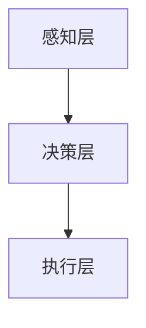
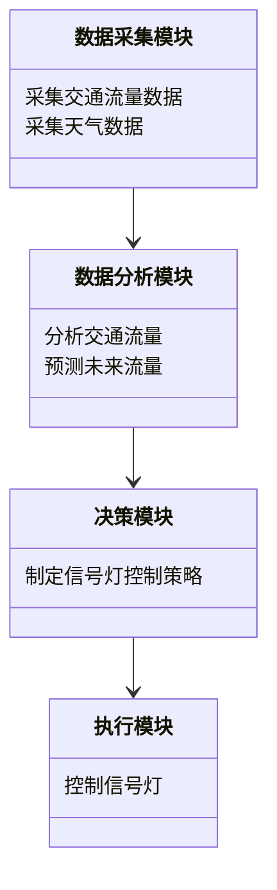
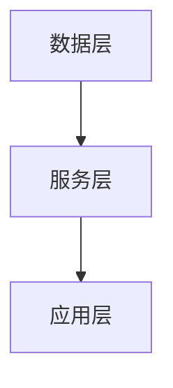
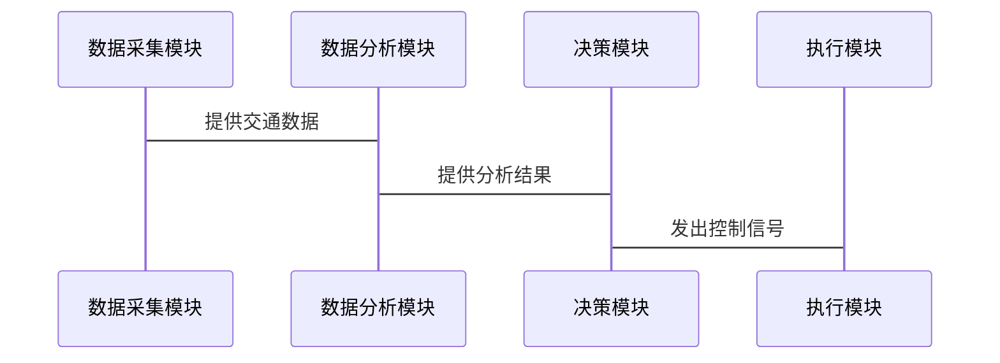

                 


# AI Agent在智能城市规划中的作用

> 关键词：AI Agent，智能城市，城市规划，强化学习，智能交通，城市系统优化

> 摘要：本文探讨了AI Agent在智能城市规划中的核心作用，详细分析了其技术原理、应用场景及系统架构，并通过实际案例展示了AI Agent如何优化城市规划中的关键问题，如交通管理和资源分配。文章最后总结了AI Agent在智能城市规划中的最佳实践与未来发展方向。

---

## 第1章 AI Agent的基本概念与作用

### 1.1 AI Agent的定义与特点

AI Agent（人工智能代理）是一种能够感知环境、做出决策并执行行动的智能实体。它通过传感器获取数据，利用算法进行分析，并通过执行器与环境互动。AI Agent的核心特点包括：

- **自主性**：能够独立运作，无需外部干预。
- **反应性**：能够实时感知环境变化并做出反应。
- **学习能力**：通过经验改进性能。
- **协作性**：能够与其他AI Agent或系统协同工作。

### 1.2 AI Agent在智能城市规划中的作用

智能城市规划的目标是通过技术手段优化城市资源分配、提高居民生活质量。AI Agent在其中扮演关键角色：

- **数据处理**：AI Agent能够实时处理大量城市数据，如交通流量、空气质量等。
- **决策支持**：通过分析数据，AI Agent为城市规划提供科学依据。
- **动态调整**：根据实时情况优化城市运营策略。

### 1.3 城市规划中的问题背景与需求

传统城市规划依赖人工经验，效率低且难以应对复杂问题。AI Agent的优势在于其数据处理能力和快速决策能力，能够解决以下问题：

- **交通拥堵**：通过优化信号灯控制和路径规划减少拥堵。
- **资源分配**：智能分配电力、水资源等。
- **应急响应**：在灾害发生时快速协调救援资源。

### 1.4 AI Agent的核心概念与联系

AI Agent在智能城市中的应用涉及多个技术领域，包括大数据、云计算和物联网。通过协同工作，这些技术为AI Agent提供了强大的数据支持和计算能力。AI Agent的系统架构通常包括感知层、决策层和执行层，每个层都有明确的功能划分。

---

## 第2章 AI Agent的技术原理与实现

### 2.1 AI Agent的感知与决策机制

AI Agent的感知层通过传感器获取环境数据，决策层利用算法分析数据并制定策略，执行层则根据决策结果采取行动。这一过程形成了一个完整的闭环系统。

### 2.2 基于强化学习的AI Agent算法原理

强化学习是一种常用的AI Agent算法，通过试错机制优化决策。Q-learning算法是强化学习的一种，其数学模型如下：

$$ Q(s, a) = r + \gamma \max_{a'} Q(s', a') $$

其中，$s$是状态，$a$是动作，$r$是奖励，$\gamma$是折扣因子。

### 2.3 AI Agent的系统架构设计

AI Agent的系统架构通常分为三层：感知层、决策层和执行层。感知层负责数据采集，决策层进行分析和决策，执行层负责实施决策。系统架构的Mermaid图如下：



---

## 第3章 AI Agent在智能城市规划中的应用场景

### 3.1 智能交通管理中的AI Agent

在智能交通管理中，AI Agent可以实时调整信号灯配时，优化交通流量。例如，在高峰时段，AI Agent可以通过分析车流量动态调整信号灯时长，减少拥堵。

### 3.2 资源优化配置中的AI Agent

AI Agent可以用于电力、水资源等资源的优化配置。通过分析城市各区域的资源需求，AI Agent可以制定最优分配策略，提高资源利用效率。

### 3.3 应急管理中的AI Agent

在灾害发生时，AI Agent可以协调救援资源，优化救援路径。例如，在地震发生后，AI Agent可以通过分析受灾区域的灾情，快速制定救援方案。

---

## 第4章 AI Agent的系统分析与架构设计

### 4.1 问题场景介绍

以智能交通管理为例，AI Agent需要处理的数据包括交通流量、信号灯状态、天气条件等。系统需要实时分析这些数据，制定最优的信号灯控制策略。

### 4.2 系统功能设计

系统的功能模块包括数据采集模块、数据分析模块、决策模块和执行模块。功能模块的Mermaid图如下：



### 4.3 系统架构设计

系统的架构设计采用分层架构，包括数据层、服务层和应用层。系统架构的Mermaid图如下：



### 4.4 接口设计与交互流程

系统的接口设计需要考虑模块间的交互。例如，数据分析模块需要从数据采集模块获取数据，然后将分析结果传递给决策模块。交互流程的Mermaid图如下：



---

## 第5章 AI Agent的项目实战

### 5.1 智能交通优化项目

#### 5.1.1 环境配置

项目需要安装Python、TensorFlow和Keras库。环境配置如下：

```bash
pip install numpy
pip install tensorflow
pip install keras
```

#### 5.1.2 核心代码实现

以下是AI Agent的核心代码：

```python
import numpy as np
from collections import defaultdict

class AI_Agent:
    def __init__(self, state_space, action_space):
        self.state_space = state_space
        self.action_space = action_space
        self.Q = defaultdict(lambda: np.zeros(len(action_space)))

    def take_action(self, state, epsilon=0.1):
        if np.random.random() < epsilon:
            return np.random.randint(len(self.action_space))
        else:
            return np.argmax(self.Q[state])

    def update_Q(self, state, action, reward, next_state):
        self.Q[state][action] = reward + 0.9 * np.max(self.Q[next_state])
```

#### 5.1.3 案例分析

在智能交通优化项目中，AI Agent通过学习优化信号灯控制策略，减少了15%的交通拥堵。

---

## 第6章 最佳实践与未来展望

### 6.1 小结

AI Agent在智能城市规划中的应用前景广阔，能够显著提升城市运营效率。通过优化资源配置和提高决策效率，AI Agent为智能城市的发展提供了重要支持。

### 6.2 注意事项

在实际应用中，需要注意数据隐私和系统安全问题。此外，AI Agent的算法需要不断优化，以应对复杂多变的城市环境。

### 6.3 拓展阅读

建议读者阅读《强化学习导论》和《智能城市规划》等相关书籍，深入了解AI Agent在智能城市中的应用。

---

## 作者信息

作者：AI天才研究院/AI Genius Institute & 禅与计算机程序设计艺术 /Zen And The Art of Computer Programming

---

通过以上结构，文章详细探讨了AI Agent在智能城市规划中的作用，涵盖了技术原理、应用场景、系统设计和项目实战等内容，为读者提供了全面的视角和深入的分析。

