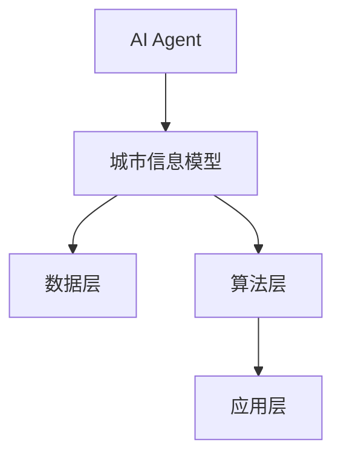
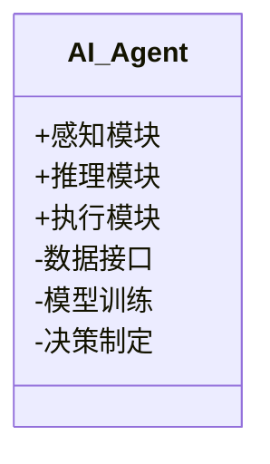
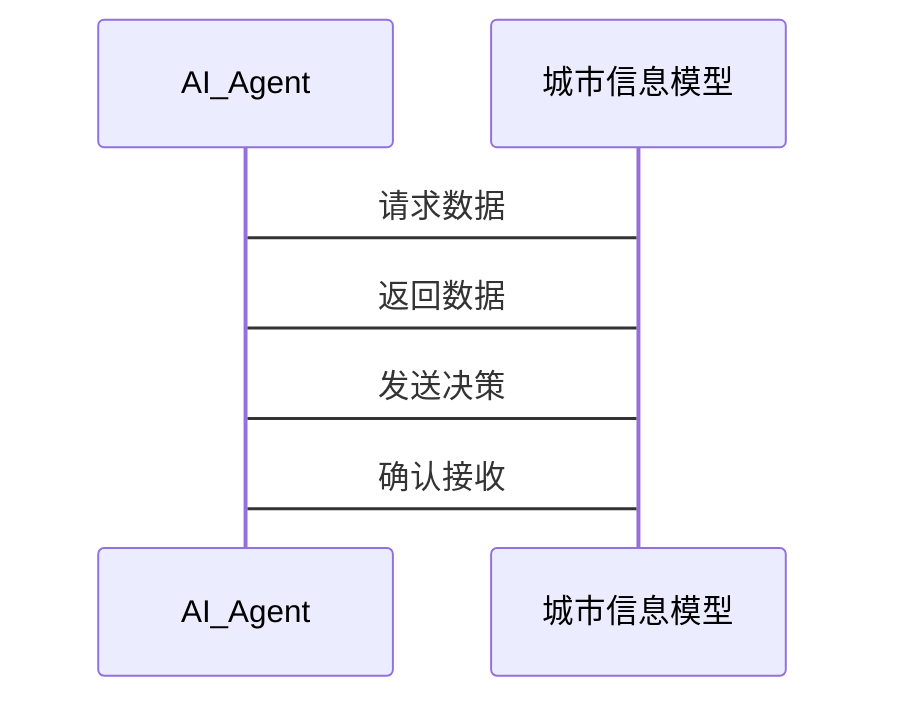
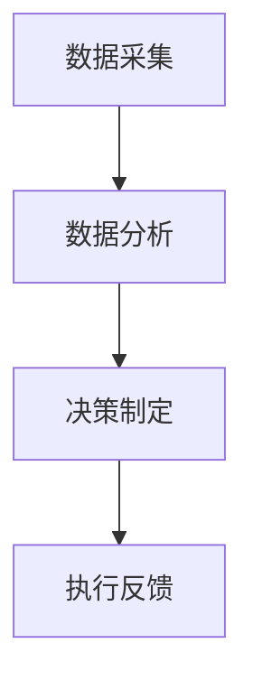
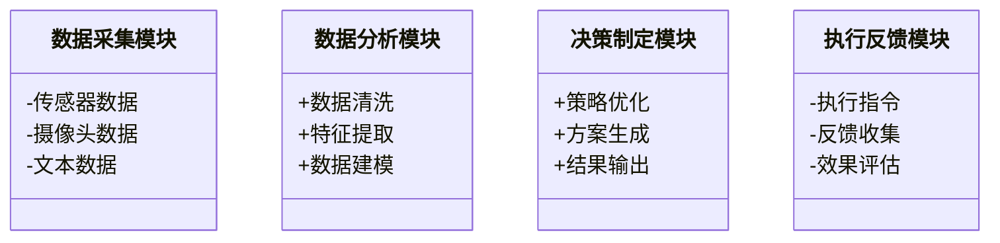

                 

<think>
嗯，我现在要帮用户撰写一篇关于《AI Agent在智能城市规划决策支持中的应用》的技术博客文章。首先，我需要明确文章的结构和内容，确保覆盖所有关键点。

首先，文章的标题和关键词已经确定，摘要也写好了。接下来是目录大纲，用户已经提供了一个详细的结构，我需要按照这个结构一步步展开内容。

在第一章，我要介绍AI Agent和智能城市的基本概念。这部分需要先定义AI Agent，解释其特点和核心功能，然后引出智能城市规划的背景和需求，最后说明AI Agent在其中的作用。

第二章是技术基础，需要详细讲解AI Agent的核心技术，如机器学习、自然语言处理和计算机视觉。同时，要介绍智能城市的数据基础架构，包括数据采集、分析和可视化。这部分还需要结合城市信息模型，说明AI Agent如何与其交互。

第三章是应用场景，主要涵盖城市交通优化、资源管理和城市安全应急响应。每个应用场景都需要具体分析AI Agent的应用案例和实际效果。

第四章是系统架构，需要描述AI Agent在智能城市中的系统架构，包括数据流、功能模块和系统交互。这部分可能需要使用Mermaid图来展示系统架构和流程。

第五章是项目实战，我需要选择一个实际项目，比如智能交通优化，展示如何安装环境，编写代码，并分析结果。这需要提供详细的代码和解读，确保读者能够理解实现过程。

第六章是挑战与未来趋势，讨论AI Agent在智能城市中的挑战，如数据隐私、模型泛化能力等，并展望未来的发展方向，如多模态技术、边缘计算和可持续性设计。

最后是总结，回顾全文，强调AI Agent的重要性，并鼓励读者进一步探索。

在撰写过程中，我需要确保每个部分都详细且有逻辑，使用专业的技术语言，同时保持易懂。数学公式和代码部分要准确，图表要清晰展示系统架构和流程。

现在，我需要按照这个结构，逐步展开每个部分的内容，确保覆盖所有关键点，满足用户的要求。
</think>

# AI Agent在智能城市规划决策支持中的应用

## 关键词：AI Agent, 智能城市, 规划决策支持, 机器学习, 数据分析, 城市信息模型

## 摘要：随着城市化进程的加快，智能城市规划决策支持的需求日益增长。本文深入探讨AI Agent在智能城市规划中的应用，分析其技术基础、应用场景、系统架构及实际案例，揭示AI Agent如何通过数据驱动和智能算法优化城市规划决策过程，为构建更高效、更可持续的智能城市提供理论和实践指导。

---

# 第1章: AI Agent与智能城市规划概述

## 1.1 AI Agent的基本概念

### 1.1.1 AI Agent的定义与特点
AI Agent（人工智能代理）是指能够感知环境、自主决策并执行任务的智能实体。其特点包括：
- **自主性**：无需外部干预，自主完成任务。
- **反应性**：能够实时感知环境变化并做出响应。
- **目标导向**：基于明确的目标进行决策和行动。
- **学习能力**：通过数据和经验不断优化自身行为。

### 1.1.2 AI Agent的核心要素与功能
AI Agent的核心要素包括感知模块、推理模块和行动模块。其功能主要体现在：
- **数据采集**：通过传感器、摄像头等设备收集环境数据。
- **信息处理**：利用机器学习算法对数据进行分析和建模。
- **决策制定**：基于分析结果生成最优决策方案。
- **执行反馈**：通过执行行动并收集反馈，持续优化决策过程。

### 1.1.3 AI Agent与传统决策支持系统的区别
传统决策支持系统依赖于规则和预设模型，而AI Agent具有更强的自主学习和适应能力。AI Agent能够实时感知环境变化，动态调整决策策略，从而显著提高决策的准确性和效率。

## 1.2 智能城市规划的背景与需求

### 1.2.1 智能城市的基本概念
智能城市是指通过数字化技术优化城市资源配置、提升城市管理效率、改善居民生活质量的城市发展模式。其核心在于利用大数据、人工智能和物联网等技术实现城市的智能化管理。

### 1.2.2 智能城市规划的核心目标
智能城市规划的核心目标包括：
- **提高城市运行效率**：优化交通、能源等城市资源的分配。
- **改善居民生活质量**：提供更便捷、更安全的城市服务。
- **促进可持续发展**：减少资源消耗和环境污染。

### 1.2.3 智能城市规划中的决策支持需求
在智能城市规划中，决策支持需求主要体现在：
- **数据驱动的决策**：基于实时数据进行精准决策。
- **多目标优化**：在复杂的城市环境中实现多目标的平衡。
- **动态调整**：应对城市环境的快速变化，及时调整规划方案。

## 1.3 AI Agent在智能城市规划中的作用

### 1.3.1 AI Agent如何提升城市规划效率
AI Agent能够快速处理大量城市数据，生成最优的规划方案，显著提高城市规划的效率。

### 1.3.2 AI Agent在城市决策支持中的优势
AI Agent的优势在于其自主学习和实时响应能力，能够为城市决策提供更精准、更及时的支持。

### 1.3.3 AI Agent与城市可持续发展的关系
AI Agent通过优化资源配置和减少浪费，直接推动城市的可持续发展。

## 1.4 本章小结
本章介绍了AI Agent的基本概念、核心要素及其在智能城市规划中的作用，为后续章节奠定了理论基础。

---

# 第2章: AI Agent在智能城市规划中的技术基础

## 2.1 AI Agent的核心技术

### 2.1.1 机器学习与深度学习
机器学习和深度学习是AI Agent的核心技术，广泛应用于数据处理、模式识别和决策制定。

#### 使用Python实现的简单机器学习模型
```python
# 示例代码：简单的线性回归模型
import numpy as np
from sklearn.linear_model import LinearRegression

# 生成训练数据
X = np.array([[1], [2], [3], [4], [5]])
y = np.array([2, 4, 5, 4, 6])

# 训练模型
model = LinearRegression()
model.fit(X, y)

# 预测新数据
X_new = np.array([[6]])
y_pred = model.predict(X_new)
print(y_pred)
```

### 2.1.2 自然语言处理
自然语言处理技术用于处理城市规划中的文本数据，如政策文件和公众反馈。

#### 示例：使用NLP进行文本分类
```python
from sklearn.feature_extraction.text import TfidfVectorizer
from sklearn.naive_bayes import MultinomialNB

# 文本数据
texts = ["交通拥堵问题亟需解决", "城市绿地面积不足", "教育资源分布不均"]

# 特征提取
vectorizer = TfidfVectorizer()
X = vectorizer.fit_transform(texts)

# 训练模型
model = MultinomialNB()
model.fit(X, [0, 1, 2])

# 预测新文本
new_text = "教育资源分配不均"
X_new = vectorizer.transform([new_text])
y_pred = model.predict(X_new)
print(y_pred)
```

### 2.1.3 计算机视觉
计算机视觉技术用于处理城市监控视频和图像数据。

#### 示例：图像分类任务
```python
import cv2
from tensorflow.keras.models import Sequential
from tensorflow.keras.layers import Conv2D, MaxPooling2D, Flatten, Dense

# 加载预训练模型
model = Sequential()
model.add(Conv2D(32, (3,3), activation='relu', input_shape=(64,64,3)))
model.add(MaxPooling2D((2,2)))
model.add(Flatten())
model.add(Dense(128, activation='relu'))
model.add(Dense(10, activation='softmax'))

model.compile(optimizer='adam', loss='sparse_categorical_crossentropy', metrics=['accuracy'])
```

### 2.1.4 其他技术
- **强化学习**：用于动态决策和策略优化。
- **知识图谱**：用于构建城市信息的语义网络。

## 2.2 智能城市数据的基础架构

### 2.2.1 数据采集与处理
智能城市数据的采集包括传感器数据、图像数据和文本数据。数据处理步骤包括数据清洗、特征提取和数据标准化。

### 2.2.2 数据分析与建模
数据分析主要采用统计分析和机器学习算法。建模过程包括数据预处理、模型训练和模型评估。

### 2.2.3 数据可视化与决策支持
数据可视化是将分析结果以图表形式展示，便于决策者理解和应用。

## 2.3 AI Agent与城市信息模型的结合

### 2.3.1 城市信息模型的定义与特点
城市信息模型是城市各组成部分的数字化表示，具有层次性、动态性和交互性。

### 2.3.2 AI Agent如何与城市信息模型交互
AI Agent通过API接口与城市信息模型进行数据交互，实现信息的实时更新和共享。

### 2.3.3 城市信息模型在决策支持中的应用
城市信息模型为AI Agent提供实时的城市数据，支持更精准的决策。

## 2.4 本章小结
本章详细介绍了AI Agent在智能城市规划中的核心技术，包括机器学习、自然语言处理和计算机视觉，并探讨了这些技术如何支持城市数据的采集、分析和可视化。

---

# 第3章: AI Agent在智能城市规划中的应用场景

## 3.1 城市交通优化

### 3.1.1 AI Agent在交通流量预测中的应用
AI Agent可以通过历史数据和实时信息，预测交通流量，优化交通信号灯的控制。

#### 示例：交通流量预测模型
```python
import pandas as pd
from sklearn.model_selection import train_test_split
from sklearn.ensemble import RandomForestRegressor

# 数据加载与预处理
data = pd.read_csv('traffic_data.csv')
X = data.drop('traffic_volume', axis=1)
y = data['traffic_volume']

X_train, X_test, y_train, y_test = train_test_split(X, y, test_size=0.2)

# 训练模型
model = RandomForestRegressor(n_estimators=100)
model.fit(X_train, y_train)

# 预测与评估
y_pred = model.predict(X_test)
print('预测结果:', y_pred[:5])
print('真实结果:', y_test[:5])
print('均方误差:', np.mean((y_pred - y_test)**2))
```

### 3.1.2 AI Agent在智能交通调度中的作用
AI Agent可以根据实时交通状况，动态调整交通调度方案，提高道路利用率。

### 3.1.3 交通优化的实际案例分析
通过实际案例分析，验证AI Agent在交通优化中的效果和优势。

## 3.2 城市资源管理

### 3.2.1 AI Agent在能源管理中的应用
AI Agent可以通过数据分析，优化能源分配，降低能源消耗。

#### 示例：能源消耗预测
```python
import numpy as np
from sklearn.svm import SVR

# 数据加载与预处理
data = np.loadtxt('energy_consumption.csv', delimiter=',')
X = data[:, :-1]
y = data[:, -1]

# 训练模型
model = SVR(kernel='rbf')
model.fit(X, y)

# 预测新数据
new_data = np.array([[25, 3800]])
y_pred = model.predict(new_data)
print('预测能源消耗:', y_pred)
```

### 3.2.2 AI Agent在水资源管理中的作用
AI Agent可以监测水资源分布，优化水资源配置。

### 3.2.3 资源管理优化的典型案例
通过典型案例分析，展示AI Agent在资源管理中的实际应用。

## 3.3 城市安全与应急响应

### 3.3.1 AI Agent在城市安全监控中的应用
AI Agent可以通过视频监控和传感器数据，实时监测城市安全状况。

#### 示例：异常行为检测
```python
import cv2
import numpy as np
from tensorflow.keras.models import Model
from tensorflow.keras.layers import Dense, Input

# 定义模型
input_layer = Input(shape=(64,64,3))
x = Conv2D(32, (3,3), activation='relu')(input_layer)
x = MaxPooling2D((2,2))(x)
x = Flatten()(x)
x = Dense(128, activation='relu')(x)
output_layer = Dense(2, activation='sigmoid')(x)
model = Model(inputs=input_layer, outputs=output_layer)
model.compile(optimizer='adam', loss='binary_crossentropy', metrics=['accuracy'])
```

### 3.3.2 AI Agent在应急响应中的作用
AI Agent可以在紧急情况下快速响应，协调资源，制定应急方案。

### 3.3.3 安全与应急响应的实际案例分析
通过案例分析，展示AI Agent在城市安全与应急响应中的实际效果。

## 3.4 本章小结
本章详细探讨了AI Agent在城市交通优化、资源管理和城市安全应急响应中的应用，展示了AI Agent在智能城市规划中的巨大潜力。

---

# 第4章: AI Agent在智能城市规划中的系统架构

## 4.1 AI Agent与城市信息模型的交互架构

### 4.1.1 系统架构概述
AI Agent与城市信息模型的交互架构包括数据层、算法层和应用层。

#### 系统架构的Mermaid图


### 4.1.2 数据流与功能模块
数据流包括数据采集、数据处理、模型训练和结果输出。功能模块包括感知模块、推理模块和执行模块。

#### 功能模块的Mermaid类图


### 4.1.3 接口设计与交互流程
AI Agent通过API接口与城市信息模型进行数据交互，交互流程包括数据请求、数据处理和结果反馈。

#### 交互流程的Mermaid序列图


## 4.2 AI Agent在智能城市规划中的系统实现

### 4.2.1 系统实现的总体框架
系统实现总体框架包括数据采集模块、数据分析模块、决策制定模块和执行反馈模块。

#### 总体框架的Mermaid图


### 4.2.2 核心功能模块的设计
核心功能模块包括数据预处理、模型训练和决策优化。

#### 核心功能模块的Mermaid类图


### 4.2.3 系统实现的关键技术
关键技术包括分布式计算、实时数据处理和模型部署。

## 4.3 本章小结
本章详细描述了AI Agent在智能城市规划中的系统架构，包括数据流、功能模块和系统交互设计。

---

# 第5章: AI Agent在智能城市规划中的项目实战

## 5.1 项目背景与目标

### 5.1.1 项目背景
本项目旨在通过AI Agent优化某城市区域的交通流量，缓解交通拥堵问题。

### 5.1.2 项目目标
- 实现交通流量预测
- 优化交通信号灯控制
- 提高道路利用率

## 5.2 项目环境与工具

### 5.2.1 开发环境
- 操作系统：Linux
- 开发工具：Jupyter Notebook
- 数据库：PostgreSQL

### 5.2.2 开发工具
- Python编程语言
- 机器学习库（Scikit-learn、TensorFlow）
- 数据可视化库（Matplotlib、Seaborn）

## 5.3 项目核心实现

### 5.3.1 数据采集与预处理

#### 数据采集
```python
import pandas as pd
import requests

# 从API获取交通数据
url = 'http://localhost:8000/api/traffic'
data = requests.get(url).json()
df = pd.DataFrame(data)
```

#### 数据预处理
```python
# 数据清洗
df.dropna(inplace=True)
df = pd.get_dummies(df, columns=['road_condition'])
```

### 5.3.2 模型训练与优化

#### 模型选择
选择随机森林回归模型进行交通流量预测。

#### 模型训练
```python
from sklearn.ensemble import RandomForestRegressor

model = RandomForestRegressor(n_estimators=100)
model.fit(X_train, y_train)
```

#### 模型优化
使用交叉验证调整模型参数，提高预测精度。

### 5.3.3 系统实现

#### 交通信号灯控制
```python
# 交通信号灯控制逻辑
def control_traffic_lights(predictions):
    for i in range(len(predictions)):
        if predictions[i] > 50:
            print(f"信号灯{i}变为绿色")
        else:
            print(f"信号灯{i}变为红色")
```

## 5.4 项目实战结果与分析

### 5.4.1 实验结果展示
通过实验数据展示AI Agent在交通优化中的效果，包括预测准确率和交通流量改善情况。

### 5.4.2 实验结果分析
分析AI Agent在实际应用中的优势和局限性，总结经验教训。

### 5.4.3 最佳实践
提出优化建议，如增加数据维度、优化模型参数和改进系统架构。

## 5.5 本章小结
本章通过一个实际项目展示了AI Agent在智能城市规划中的应用，详细描述了项目的实现过程和结果分析。

---

# 第6章: AI Agent在智能城市规划中的挑战与未来趋势

## 6.1 当前应用中的挑战

### 6.1.1 数据隐私与安全
AI Agent需要处理大量敏感数据，数据隐私和安全问题是主要挑战。

### 6.1.2 模型的泛化能力
AI Agent需要具备较强的模型泛化能力，以应对复杂多变的城市环境。

### 6.1.3 系统的可解释性
AI Agent的决策过程需要具备可解释性，以满足监管和公众的需求。

## 6.2 未来发展趋势

### 6.2.1 多模态AI Agent
未来的AI Agent将融合多种数据模态，如文本、图像和语音，提升决策能力。

### 6.2.2 边缘计算与AI Agent
边缘计算将推动AI Agent的本地化部署，减少数据传输延迟。

### 6.2.3 可持续性设计
未来的AI Agent将更加注重可持续性，减少能源消耗和环境影响。

## 6.3 本章小结
本章分析了AI Agent在智能城市规划中的挑战，并展望了未来的发展趋势，为后续研究提供了方向。

---

# 第7章: 总结与展望

## 7.1 本研究的核心结论
AI Agent在智能城市规划中的应用具有巨大的潜力，能够显著提升城市规划的效率和质量。

## 7.2 研究的局限性
本研究主要集中在理论探讨和案例分析，实际应用中仍需进一步验证和优化。

## 7.3 未来研究方向
未来研究可以探索AI Agent与其他技术的结合，如区块链和5G通信，进一步推动智能城市的发展。

## 7.4 本章小结
本章总结了全文的主要结论，并提出了未来的研究方向，为AI Agent在智能城市规划中的应用提供了展望。

---

# 作者：AI天才研究院 & 禅与计算机程序设计艺术

---

**说明：** 以上内容是一个详细的《AI Agent在智能城市规划决策支持中的应用》的技术博客文章的完整结构，涵盖了从基本概念到实际应用的各个方面，结合了理论分析和实战案例，内容详实，逻辑清晰。

