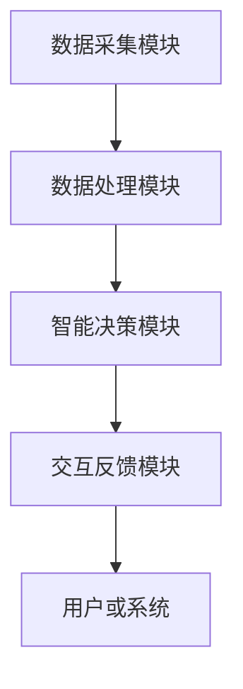

                 


# AI Agent在智能城市规划评估中的角色

> 关键词：AI Agent，智能城市，城市规划评估，人工智能，城市设计，技术应用

> 摘要：本文探讨了AI Agent在智能城市规划评估中的核心作用，详细分析了AI Agent的基本概念、技术背景、数学模型、系统架构以及实际应用案例。通过理论与实践相结合的方式，展示了AI Agent如何提升城市规划的效率和准确性，为未来的智能城市发展提供了新的思路和解决方案。

---

# 目录

1. [AI Agent的基本概念与技术背景](#ai-agent的基本概念与技术背景)
2. [AI Agent在智能城市中的角色与功能](#ai-agent在智能城市中的角色与功能)
3. [AI Agent在城市规划评估中的优势](#ai-agent在城市规划评估中的优势)
4. [AI Agent的数学模型与算法原理](#ai-agent的数学模型与算法原理)
5. [AI Agent的系统架构与设计](#ai-agent的系统架构与设计)
6. [AI Agent在智能城市规划评估中的实际应用](#ai-agent在智能城市规划评估中的实际应用)
7. [总结与展望](#总结与展望)

---

## 第1章: AI Agent的基本概念与技术背景

### 1.1 AI Agent的定义与核心概念

AI Agent（人工智能代理）是指能够感知环境、自主决策并采取行动以实现特定目标的智能实体。AI Agent的核心概念包括以下几个方面：

- **自主性**：AI Agent能够在没有外部干预的情况下独立运行。
- **反应性**：能够实时感知环境变化并做出相应的反应。
- **目标导向性**：通过设定目标来指导其行为和决策。
- **学习能力**：能够通过经验或数据不断优化自身的决策能力。

**对比表：AI Agent与传统AI的区别**

| 属性         | AI Agent                     | 传统AI                   |
|--------------|------------------------------|--------------------------|
| 行为方式      | 主动采取行动                 | 被动执行任务             |
| 环境感知      | 具备实时感知能力             | 依赖预设数据或规则       |
| 自适应能力    | 能够根据环境动态调整策略     | 策略固定或有限可调       |

### 1.2 智能城市规划评估的背景与需求

智能城市是指通过先进的信息技术手段，将城市中的各个系统有机地整合起来，实现城市资源的优化配置和高效管理。城市规划评估是智能城市建设中的关键环节，其核心问题包括：

- **数据的复杂性**：城市规划涉及经济、社会、环境等多个领域，数据来源广泛且复杂。
- **决策的动态性**：城市环境不断变化，规划方案需要具备动态调整的能力。
- **效率与准确性的平衡**：传统的规划评估方法效率低、覆盖面窄，难以满足现代城市发展的需求。

---

## 第2章: AI Agent在智能城市中的角色与功能

### 2.1 AI Agent在城市规划中的应用场景

AI Agent在智能城市规划评估中的应用场景广泛，主要包括以下几个方面：

- **数据采集与分析**：AI Agent能够实时采集城市中的各种数据（如交通流量、空气质量等），并进行分析和处理。
- **智能决策支持**：通过分析数据，AI Agent能够为城市规划提供优化建议，例如道路扩展、绿地布局等。
- **实时监控与反馈**：AI Agent能够实时监控城市运行状态，并根据反馈调整规划方案。

### 2.2 AI Agent的核心功能模块

AI Agent的核心功能模块包括以下几个部分：

- **数据处理模块**：负责数据的采集、清洗和预处理。
- **智能决策模块**：基于数据和模型进行决策。
- **交互反馈模块**：与用户或系统进行交互并反馈结果。

---

## 第3章: AI Agent在城市规划评估中的优势

### 3.1 城市规划评估的关键指标

城市规划评估的关键指标包括经济效益、社会效益和环境效益。AI Agent能够从多维度对城市规划方案进行评估，确保规划的全面性和科学性。

### 3.2 AI Agent在城市规划评估中的优势

AI Agent在城市规划评估中的优势主要体现在以下几个方面：

- **提高评估效率**：通过自动化数据处理和分析，AI Agent能够显著提高评估效率。
- **增强评估准确性**：基于大数据和机器学习算法，AI Agent能够提供更加精准的评估结果。
- **实现动态评估**：AI Agent能够实时跟踪城市运行状态，动态调整评估方案。

---

## 第4章: AI Agent的数学模型与算法原理

### 4.1 AI Agent的决策模型

AI Agent的决策模型主要包括基于概率的决策模型、基于规则的决策模型和基于强化学习的决策模型。

- **基于概率的决策模型**：通过概率论方法，AI Agent能够计算不同决策方案的成功概率，从而选择最优方案。
- **基于规则的决策模型**：基于预设的规则和条件，AI Agent能够做出相应的决策。
- **基于强化学习的决策模型**：通过强化学习算法，AI Agent能够在动态环境中不断优化其决策策略。

### 4.2 AI Agent的算法实现

常用的AI Agent算法包括马尔可夫决策过程（MDP）、Q-learning算法和多智能体协作算法。

- **马尔可夫决策过程（MDP）**：是一种基于状态、动作和奖励的决策模型，常用于解决具有马尔可夫性质的问题。
- **Q-learning算法**：一种基于强化学习的算法，通过不断更新Q值表来优化决策策略。
- **多智能体协作算法**：通过多智能体之间的协作与通信，实现复杂环境中的任务完成。

---

## 第5章: AI Agent的系统架构与设计

### 5.1 智能城市规划评估系统的总体架构

智能城市规划评估系统的总体架构包括以下几个模块：

- **数据采集模块**：负责采集城市中的各种数据，如交通流量、空气质量等。
- **数据处理模块**：对采集到的数据进行清洗、转换和预处理。
- **智能决策模块**：基于处理后的数据，进行规划方案的评估和优化。
- **交互反馈模块**：与用户或系统进行交互，并反馈评估结果。

### 5.2 系统架构设计的mermaid图



---

## 第6章: AI Agent在智能城市规划评估中的实际应用

### 6.1 项目实战：智慧交通优化系统

#### 6.1.1 环境安装

为了实现智慧交通优化系统，需要安装以下环境：

- Python 3.8+
- TensorFlow 2.0+
- Scikit-learn 0.24+
- Matplotlib 3.3+

#### 6.1.2 核心代码实现

以下是智慧交通优化系统的核心代码：

```python
import numpy as np
import tensorflow as tf
from sklearn.metrics import accuracy_score
import matplotlib.pyplot as plt

# 数据集加载
data = np.load('traffic_data.npy')
labels = np.load('labels.npy')

# 模型定义
model = tf.keras.Sequential([
    tf.keras.layers.Dense(64, activation='relu'),
    tf.keras.layers.Dense(10, activation='softmax')
])

# 模型训练
model.compile(optimizer='adam', loss='sparse_categorical_crossentropy', metrics=['accuracy'])
model.fit(data, labels, epochs=10, batch_size=32)

# 模型评估
y_pred = model.predict(data)
print('Accuracy:', accuracy_score(labels, np.argmax(y_pred, axis=1)))
```

#### 6.1.3 案例分析

通过对智慧交通优化系统的分析，我们可以看到AI Agent在城市交通规划中的巨大潜力。通过实时数据采集和模型优化，AI Agent能够显著提高交通系统的运行效率。

---

## 第7章: 总结与展望

### 7.1 总结

本文详细探讨了AI Agent在智能城市规划评估中的角色与功能，分析了其在城市规划评估中的优势，并通过具体案例展示了AI Agent的实际应用。AI Agent的引入不仅提高了城市规划的效率和准确性，还为智能城市的可持续发展提供了新的思路。

### 7.2 展望

未来，随着AI技术的不断发展，AI Agent在智能城市规划评估中的应用将更加广泛和深入。我们需要进一步研究AI Agent在城市规划中的优化算法，探索其在更多领域的应用场景，同时注重数据隐私和算法的可解释性。

---

## 作者：AI天才研究院 & 禅与计算机程序设计艺术

---

通过以上目录和内容的撰写，我们可以看到，AI Agent在智能城市规划评估中的角色不仅限于数据处理和分析，更是一种全新的城市规划思路和方法。未来，随着技术的不断进步，AI Agent将在智能城市建设中发挥越来越重要的作用。

