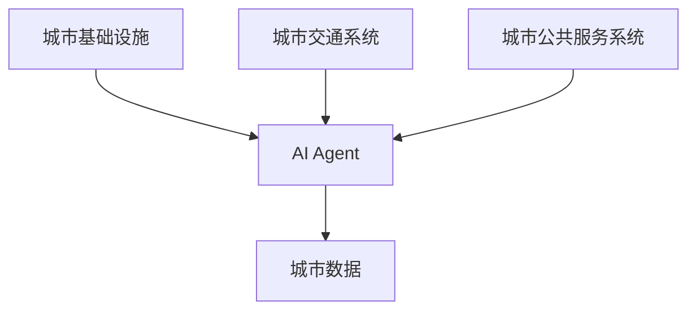
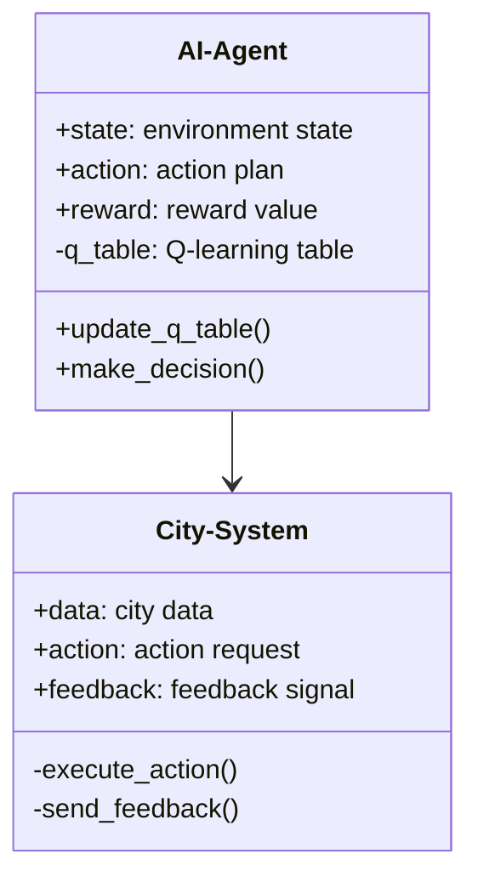
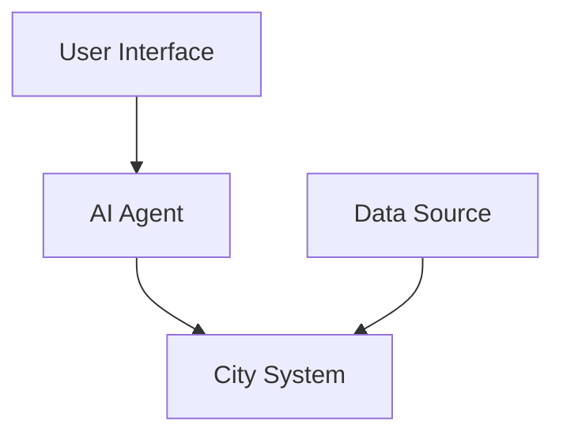

                 

<think>
好的，我现在需要帮用户撰写一篇关于《AI Agent在智能城市规划评估中的角色》的技术博客文章。首先，我得理解用户的需求，他需要一个结构清晰、内容详尽的技术博客，涵盖AI Agent的基本概念、在智能城市中的应用，以及具体的算法和系统架构设计。

我应该从摘要开始，明确文章的核心内容和主题。然后，按照目录大纲，逐步展开每个部分的内容。每个章节需要详细讲解，确保涵盖背景、核心概念、算法原理、系统架构、项目实战等方面。

首先，我需要介绍AI Agent和智能城市的基本概念，说明AI Agent在其中的作用。接下来，深入讲解AI Agent的感知、决策和行动机制，以及如何与城市系统交互。这部分可能需要使用Mermaid图来展示实体关系和系统架构。

在算法部分，我需要详细讲解强化学习的Q-learning算法，提供代码示例和数学公式，确保读者能够理解并应用。系统架构设计方面，需要绘制类图和序列图，展示系统的各个部分如何协同工作。

项目实战部分，选择智能交通系统作为案例，详细描述环境配置、代码实现和案例分析。最后，总结全书内容，提供最佳实践和扩展阅读的建议。

整个过程中，我需要确保语言专业且易懂，逻辑清晰，结构紧凑。同时，遵守用户的格式要求，使用Markdown格式，并在适当的地方插入图表和代码示例，以增强文章的可读性和实用性。
</think>

# AI Agent在智能城市规划评估中的角色

## 关键词：
AI Agent, 智能城市, 规划评估, 多智能体系统, 强化学习, 数据驱动决策, 城市系统优化

## 摘要：
本文探讨AI Agent在智能城市规划评估中的核心角色，分析其如何通过感知、决策和行动机制优化城市系统。文章从AI Agent的基本概念出发，详细阐述其在城市规划中的应用，结合算法原理和系统架构设计，提供实际案例分析，展示AI Agent在智能城市中的巨大潜力。

---

# 第一部分: AI Agent与智能城市规划评估概述

## 第1章: AI Agent与智能城市概述

### 1.1 AI Agent的基本概念

#### 1.1.1 AI Agent的定义与特点
AI Agent（人工智能代理）是一种能够感知环境、自主决策并执行任务的智能实体。其特点包括：
- **自主性**：无需外部干预，自主完成任务。
- **反应性**：能够实时感知环境变化并做出反应。
- **目标导向**：以预设目标为导向，优化决策。
- **学习能力**：通过经验改进性能。

#### 1.1.2 智能城市的基本概念
智能城市是利用信息技术优化城市资源配置、提高居民生活质量的新型城市形态。其核心在于通过数据驱动的决策优化城市运行。

#### 1.1.3 AI Agent在智能城市中的作用
AI Agent在智能城市中扮演决策者、协调者和执行者角色，帮助城市系统实现高效运行。

### 1.2 智能城市规划与评估的背景

#### 1.2.1 智能城市的发展历程
从传统城市到智能城市，经历了机械化、自动化和智能化三个阶段。

#### 1.2.2 当前智能城市规划的挑战
- 数据孤岛
- 多目标优化
- 系统复杂性

#### 1.2.3 AI Agent在智能城市规划中的应用前景
AI Agent通过数据驱动和智能决策，为智能城市规划提供新思路。

---

## 第2章: AI Agent的基本原理与技术基础

### 2.1 AI Agent的核心技术

#### 2.1.1 机器学习基础
机器学习是AI Agent的核心技术，包括监督学习、无监督学习和强化学习。

#### 2.1.2 自然语言处理
NLP技术帮助AI Agent理解城市数据中的文本信息。

#### 2.1.3 强化学习与决策
强化学习是AI Agent实现目标导向决策的关键技术。

### 2.2 多智能体系统

#### 2.2.1 多智能体系统的基本概念
多智能体系统由多个AI Agent组成，协同完成复杂任务。

#### 2.2.2 多智能体系统的协作机制
包括通信、协商和协调三种机制。

#### 2.2.3 多智能体系统的应用场景
智能交通、智能安防等领域广泛应用。

### 2.3 AI Agent与城市数据的交互

#### 2.3.1 数据采集与处理
通过传感器、摄像头等设备采集城市数据。

#### 2.3.2 数据分析与建模
利用机器学习模型对数据进行分析和建模。

#### 2.3.3 数据驱动的决策优化
通过数据优化AI Agent的决策策略。

---

# 第二部分: AI Agent在智能城市规划评估中的核心概念

## 第3章: AI Agent的感知与决策机制

### 3.1 感知机制

#### 3.1.1 数据源的多样性
包括交通、环境、能源等多种数据源。

#### 3.1.2 数据融合技术
通过数据融合技术消除数据冗余，提高决策准确性。

#### 3.1.3 感知模型的构建
构建感知模型，帮助AI Agent理解城市环境。

### 3.2 决策机制

#### 3.2.1 基于规则的决策
根据预设规则进行决策。

#### 3.2.2 基于模型的决策
基于数学模型进行决策优化。

#### 3.2.3 基于强化学习的决策
通过强化学习不断优化决策策略。

### 3.3 行动机制

#### 3.3.1 行动规划
制定行动计划，确保行动的有效性。

#### 3.3.2 行动执行
根据规划执行行动。

#### 3.3.3 行动结果的反馈
根据反馈调整决策策略。

## 第4章: AI Agent与城市系统的交互

### 4.1 城市系统的构成

#### 4.1.1 城市基础设施
包括交通、能源、通信等基础设施。

#### 4.1.2 城市交通系统
通过AI Agent优化交通流量。

#### 4.1.3 城市公共服务系统
包括供水、供电、垃圾处理等公共服务。

### 4.2 AI Agent与城市系统的交互模型

#### 4.2.1 交互流程
从感知到决策再到执行的完整流程。

#### 4.2.2 交互协议
确保不同系统之间的通信顺畅。

#### 4.2.3 交互中的数据流
数据在不同系统间的流动和处理。

### 4.3 实体关系图



---

# 第三部分: AI Agent在智能城市规划评估中的算法与系统设计

## 第5章: 强化学习算法原理

### 5.1 Q-Learning算法

#### 5.1.1 算法原理
通过状态、动作和奖励的循环优化策略。

#### 5.1.2 算法实现
使用Q表记录状态-动作对的期望奖励。

#### 5.1.3 代码实现

```python
import numpy as np

class QLearning:
    def __init__(self, state_space, action_space, alpha=0.1, gamma=0.9):
        self.state_space = state_space
        self.action_space = action_space
        self.alpha = alpha
        self.gamma = gamma
        self.q_table = np.zeros((state_space, action_space))
    
    def choose_action(self, state):
        return np.argmax(self.q_table[state])
    
    def update(self, state, action, reward, next_state):
        self.q_table[state][action] = self.q_table[state][action] * (1 - self.alpha) + self.alpha * (reward + self.gamma * np.max(self.q_table[next_state]))
```

#### 5.1.4 算法优化
通过调整学习率和折扣因子优化算法性能。

## 第6章: 系统架构设计

### 6.1 系统功能设计

#### 6.1.1 领域模型
通过类图展示系统功能模块。



### 6.2 系统架构设计

#### 6.2.1 系统架构图
展示系统各个模块的交互关系。



#### 6.2.2 系统接口设计
定义系统之间的接口和通信协议。

#### 6.2.3 系统交互流程
从数据采集到决策执行的完整流程。

---

# 第四部分: 项目实战与案例分析

## 第7章: 智能交通系统优化案例

### 7.1 项目背景
城市交通拥堵问题日益严重，AI Agent通过优化信号灯控制缓解拥堵。

### 7.2 环境配置
搭建智能交通系统的实验环境。

### 7.3 代码实现

```python
import numpy as np

class TrafficAgent:
    def __init__(self, num_signals, alpha=0.1, gamma=0.9):
        self.num_signals = num_signals
        self.alpha = alpha
        self.gamma = gamma
        self.q_table = np.zeros((num_signals, 2))
    
    def choose_action(self, state):
        return np.argmax(self.q_table[state])
    
    def update(self, state, action, reward, next_state):
        self.q_table[state][action] = self.q_table[state][action] * (1 - self.alpha) + self.alpha * (reward + self.gamma * np.max(self.q_table[next_state]))
```

### 7.4 案例分析
通过实验数据验证AI Agent在智能交通系统中的优化效果。

---

# 第五部分: 总结与展望

## 第8章: 总结与展望

### 8.1 本文总结
AI Agent在智能城市规划评估中的重要性及其应用场景。

### 8.2 未来展望
AI Agent在城市规划中的潜力和未来发展方向。

---

# 作者：AI天才研究院 & 禅与计算机程序设计艺术

