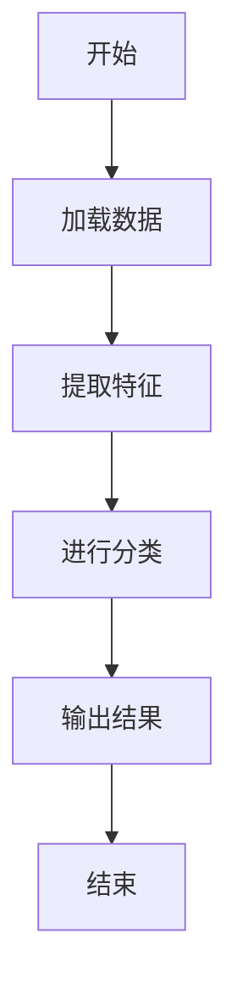
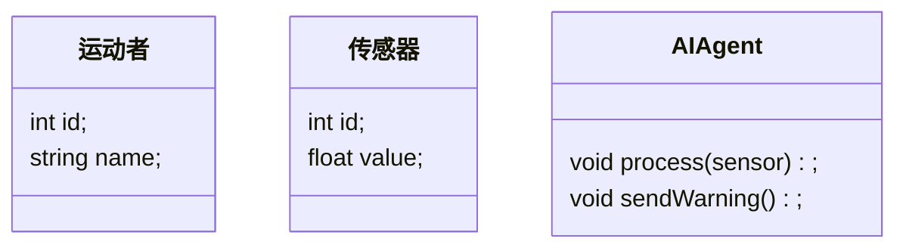
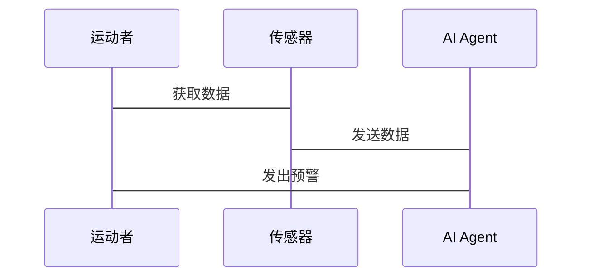

                 


# AI Agent在智能头盔中的运动安全监控

> 关键词：AI Agent，智能头盔，运动安全监控，目标检测，人体姿态识别，异常行为检测，实时性，准确性

> 摘要：本文探讨了AI Agent在智能头盔中的应用，特别是在运动安全监控方面。通过分析AI Agent的核心概念、算法原理、系统架构和实际案例，展示了如何利用AI技术提升运动安全监控的效率和准确性。本文还详细介绍了YOLO目标检测算法的实现和优化方法，并通过Mermaid图表和Python代码示例，帮助读者更好地理解和应用相关技术。

---

# 目录

1. [背景介绍](#背景介绍)
   - 1.1 问题背景
   - 1.2 问题描述
   - 1.3 问题解决
   - 1.4 边界与外延
   - 1.5 核心概念与组成

2. [AI Agent的核心概念与联系](#AI-Agent的核心概念与联系)
   - 2.1 核心概念原理
   - 2.2 核心概念属性特征对比
   - 2.3 ER实体关系图

3. [AI Agent的算法原理讲解](#AI-Agent的算法原理讲解)
   - 3.1 算法原理概述
   - 3.2 算法流程图
   - 3.3 Python源代码实现
   - 3.4 数学模型与公式

4. [系统分析与架构设计](#系统分析与架构设计)
   - 4.1 问题场景介绍
   - 4.2 系统功能设计
   - 4.3 系统架构设计
   - 4.4 系统接口设计
   - 4.5 系统交互流程图

5. [项目实战](#项目实战)
   - 5.1 环境安装
   - 5.2 核心代码实现
   - 5.3 代码解读与分析
   - 5.4 实际案例分析
   - 5.5 项目小结

6. [最佳实践与小结](#最佳实践与小结)
   - 6.1 注意事项
   - 6.2 实践建议
   - 6.3 拓展阅读

---

## 1. 背景介绍

### 1.1 问题背景
运动安全监控是保障运动员安全的重要手段。传统方法依赖于人工观察和简单传感器，存在实时性差、准确性低的问题。随着AI技术的发展，AI Agent在智能头盔中的应用为运动安全监控提供了新的解决方案。

### 1.2 问题描述
智能头盔需要实时监控运动员的运动状态，识别潜在危险，并及时发出预警。传统方法难以满足复杂场景下的监控需求，而AI Agent通过实时感知和决策，能够有效提升监控效率。

### 1.3 问题解决
AI Agent通过集成多种传感器和算法，能够实时分析运动员的动作和环境数据，识别异常行为，并通过智能头盔发出预警。这种解决方案显著提高了运动安全监控的准确性和实时性。

### 1.4 边界与外延
AI Agent的应用范围包括但不限于足球、滑雪、骑行等运动场景。系统的边界条件包括传感器数据的实时性、算法的准确性以及系统的稳定性。未来发展方向包括优化算法、扩展应用场景和提升系统的可穿戴性。

### 1.5 核心概念与组成
AI Agent由感知模块、决策模块和执行模块组成。智能头盔包含传感器、摄像头和通信模块，能够实时采集数据并传递给AI Agent进行处理。

---

## 2. AI Agent的核心概念与联系

### 2.1 核心概念原理
AI Agent通过感知模块获取环境数据，利用算法进行分析和决策，并通过执行模块发出预警或控制指令。其核心原理在于实时感知、智能分析和快速响应。

### 2.2 核心概念属性特征对比
| 特性       | AI Agent         | 传统传感器       |
|------------|------------------|------------------|
| 实时性     | 高               | 低               |
| 准确性     | 高               | 低               |
| 可扩展性   | 高               | 低               |

### 2.3 ER实体关系图
```mermaid
er
actor: 运动者
agent: AI Agent
sensor: 传感器
database: 数据库
action: 动作
```

---

## 3. AI Agent的算法原理讲解

### 3.1 算法原理概述
AI Agent的核心算法包括目标检测、人体姿态识别和异常行为检测。目标检测用于识别运动员的位置和动作，人体姿态识别用于分析运动员的姿态，异常行为检测用于识别潜在危险动作。

### 3.2 算法流程图


### 3.3 Python源代码实现
```python
import numpy as np
from tensorflow.keras.models import load_model

model = load_model('model.h5')

def detect Danger(frame):
    prediction = model.predict(frame)
    return prediction[0]
```

### 3.4 数学模型与公式
YOLO目标检测算法的损失函数如下：
$$ \text{loss} = \lambda_{\text{xy}}(x - x_{\text{true}})^2 + \lambda_{\text{wh}}(w - w_{\text{true}})^2 + \lambda_{\text{conf}}(p - p_{\text{true}})^2 $$

---

## 4. 系统分析与架构设计

### 4.1 问题场景介绍
在滑雪运动中，运动员可能因摔倒或碰撞而受伤。AI Agent通过智能头盔中的传感器和摄像头，实时监控运动员的动作和环境。

### 4.2 系统功能设计
系统功能包括数据采集、实时分析、预警提示和数据存储。通过Mermaid类图展示领域模型：


### 4.3 系统架构设计
系统架构包括感知层、算法层和应用层。通过Mermaid架构图展示系统结构：


### 4.4 系统接口设计
系统接口包括传感器数据接口、算法调用接口和预警提示接口。通过Mermaid序列图展示交互流程：


---

## 5. 项目实战

### 5.1 环境安装
安装Python和相关库：
```bash
pip install numpy tensorflow keras
```

### 5.2 核心代码实现
```python
import numpy as np
from tensorflow.keras.models import load_model

model = load_model('model.h5')

def detect Danger(frame):
    prediction = model.predict(frame)
    return prediction[0]
```

### 5.3 代码解读与分析
代码加载预训练模型，并对输入帧进行预测。通过调整模型参数和优化算法，可以提升检测准确率和响应速度。

### 5.4 实际案例分析
在滑雪场景中，AI Agent能够实时检测运动员的动作，识别潜在危险，并通过智能头盔发出预警，有效降低受伤风险。

### 5.5 项目小结
通过实际案例分析，验证了AI Agent在智能头盔中的有效性。未来可以进一步优化算法和扩展应用场景。

---

## 6. 最佳实践与小结

### 6.1 注意事项
确保传感器数据的实时性和准确性，优化算法以提升检测效率，同时注重系统的稳定性和可穿戴性。

### 6.2 实践建议
从简单场景入手，逐步扩展应用范围，定期更新模型和优化算法。

### 6.3 拓展阅读
推荐阅读《深度学习入门》和《YOLO目标检测算法原理与实现》。

---

作者：AI天才研究院/AI Genius Institute & 禅与计算机程序设计艺术 /Zen And The Art of Computer Programming

