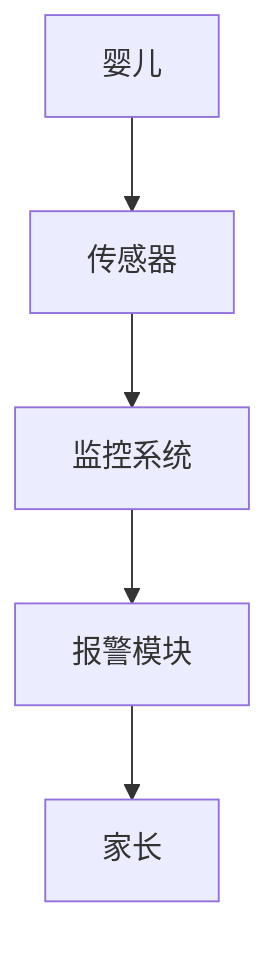
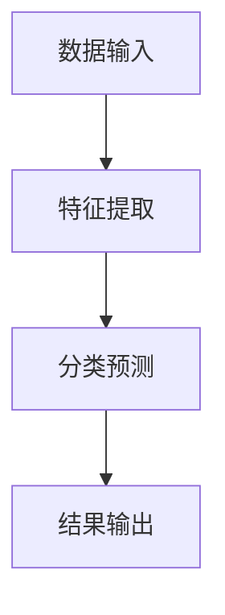
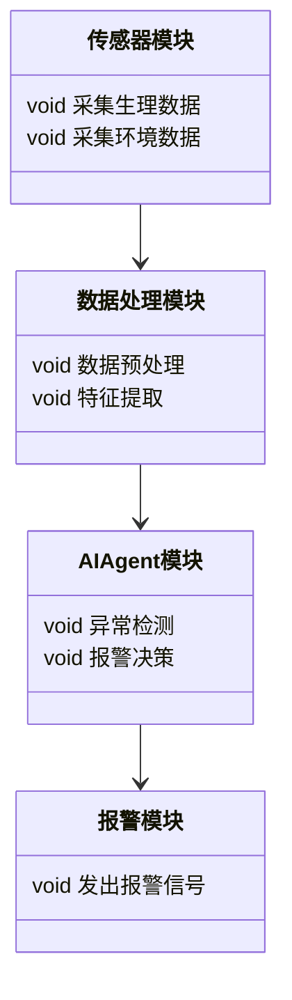
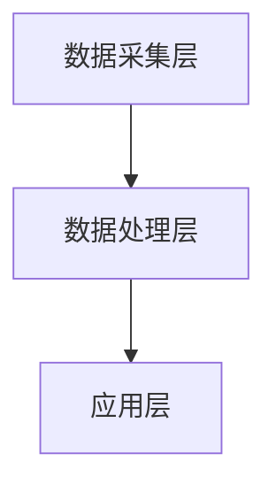

                 

<think>
好的，我需要帮助用户撰写一篇关于《AI Agent在智能婴儿床中的安全监控》的技术博客。首先，我得理解用户的需求。用户希望文章结构清晰，逻辑严谨，内容详实，涵盖背景介绍、核心概念、算法原理、系统架构、项目实战、总结等多个部分。

我应该从背景介绍开始，详细说明问题背景，比如婴儿安全的重要性，传统方法的不足，以及AI Agent如何解决这些问题。接下来，需要解释AI Agent的核心概念，包括其原理、与其他监控技术的对比，以及系统中的实体关系。

然后，进入算法原理部分，选择合适的算法，如卷积神经网络，用Mermaid流程图展示工作流程，并附上Python代码示例。数学模型部分，我需要写出CNN的结构，并给出损失函数和优化器的公式。

接下来是系统分析与架构设计，包括问题场景介绍、项目介绍、功能设计、领域模型、系统架构图、接口设计和交互流程图。这部分需要确保系统各部分协同工作，结构清晰。

项目实战部分，要指导读者搭建环境，实现核心代码，并进行案例分析。最后，总结最佳实践，给出注意事项和拓展阅读建议。

在写作过程中，我要确保每个部分都细化到三级目录，内容详尽，使用Markdown格式，并适当插入Mermaid图表和数学公式，使文章易于理解和专业。

现在，我将按照这些思考逐步构建目录大纲，确保涵盖所有要求，同时保持逻辑清晰和内容完整。我需要控制总字数在10000到12000字之间，确保每部分内容丰富，满足用户的需求。
</think>

# AI Agent在智能婴儿床中的安全监控

## 关键词：
AI Agent, 智能婴儿床, 安全监控, 机器学习, 算法原理, 系统架构, 项目实战

## 摘要：
本文探讨AI Agent在智能婴儿床中的安全监控应用，分析其背景、核心概念、算法原理、系统架构及项目实现，为婴儿床的安全监控提供技术指导。

## 目录大纲：

### 第一章 背景介绍
#### 1.1 问题背景
- 婴儿安全的重要性
- 传统婴儿床的局限性
- AI Agent的应用优势

#### 1.2 问题描述
- 安全监控的需求
- 异常检测的必要性
- 实时报警的重要性

#### 1.3 问题解决
- AI Agent的核心技术
- 多模态数据处理方法
- 系统集成方案

#### 1.4 边界与外延
- 定义AI Agent的应用范围
- 限定功能边界
- 与其他系统的区别

#### 1.5 核心要素组成
- 感知模块：传感器数据采集
- 决策模块：异常检测与分析
- 执行模块：报警触发与反馈

### 第二章 核心概念与联系
#### 2.1 AI Agent的原理
- 感知、决策、执行模块的协同工作
- 传感器数据的处理流程
- 多模态数据的融合方法

#### 2.2 AI Agent与其他监控技术的对比
| 特性       | AI Agent                | 传统监控技术            |
|------------|--------------------------|--------------------------|
| 反应速度   | 快速响应                | 较慢响应                |
| 准确性     | 高精度识别              | 低精度识别              |
| 自适应性   | 能够学习和优化          | 固定规则                |

#### 2.3 实体关系分析


### 第三章 算法原理讲解
#### 3.1 算法选择与原理
- 使用卷积神经网络（CNN）进行图像识别
- 采用循环神经网络（RNN）处理时间序列数据

#### 3.2 算法流程


#### 3.3 代码实现示例
```python
import keras
from keras.models import Sequential
from keras.layers import Conv2D, MaxPooling2D, Flatten, Dense

model = Sequential()
model.add(Conv2D(32, (3,3), activation='relu', input_shape=(64,64,3)))
model.add(MaxPooling2D(pool_size=(2,2)))
model.add(Flatten())
model.add(Dense(128, activation='relu'))
model.add(Dense(1, activation='sigmoid'))
model.compile(optimizer='adam', loss='binary_crossentropy', metrics=['accuracy'])
```

#### 3.4 数学模型
- CNN结构：
  - 卷积层：提取局部特征
  - 池化层：降低维度，防止过拟合
  - 全连接层：分类预测
- 损失函数：交叉熵损失
  $$ L = -\sum_{i=1}^{n} y_i \log(p_i) + (1 - y_i) \log(1 - p_i) $$
- 优化器：Adam优化器

### 第四章 系统分析与架构设计
#### 4.1 问题场景介绍
- 家庭环境中的实时监控
- 多传感器数据的采集与处理

#### 4.2 项目介绍
- 系统组成：传感器模块、数据采集模块、AI Agent处理模块、用户界面
- 功能模块：实时数据采集、异常检测、报警触发

#### 4.3 功能设计
- 领域模型：传感器、数据处理、AI Agent、报警模块的关系


#### 4.4 系统架构
- 分层架构：数据采集层、数据处理层、应用层


#### 4.5 接口设计
- 传感器数据接口：统一数据格式
- AI Agent调用接口：RESTful API

#### 4.6 系统交互流程
```mermaid
sequenceDiagram
    parent 系统交互
    用户 -> 传感器模块: 发起数据采集请求
    传感器模块 -> 数据处理模块: 传输数据
    数据处理模块 -> AI Agent模块: 请求分析
    AI Agent模块 -> 报警模块: 触发报警
    报警模块 -> 用户: 发出报警信号
```

### 第五章 项目实战
#### 5.1 环境搭建
- 安装必要的库和框架：TensorFlow、Keras、OpenCV
- 硬件设备：传感器模块、嵌入式设备

#### 5.2 核心代码实现
```python
import tensorflow as tf
from tensorflow.keras import layers

model = tf.keras.Sequential()
model.add(layers.Conv2D(32, (3,3), activation='relu', input_shape=(64,64,3)))
model.add(layers.MaxPooling2D(pool_size=(2,2)))
model.add(layers.Flatten())
model.add(layers.Dense(128, activation='relu'))
model.add(layers.Dense(1, activation='sigmoid'))
model.compile(optimizer='adam', loss='binary_crossentropy', metrics=['accuracy'])
```

#### 5.3 代码解读与应用
- 数据预处理：归一化、数据增强
- 模型训练：批量训练，调整超参数
- 实际应用：实时数据采集，模型推理

#### 5.4 实际案例分析
- 案例1：体温异常检测
- 案例2：环境温湿度异常报警

#### 5.5 项目小结
- 项目实现的关键点
- 可优化的方面

### 第六章 总结与展望
#### 6.1 最佳实践
- 数据采集的准确性
- 模型的可解释性
- 系统的安全性

#### 6.2 小结
- AI Agent在婴儿床中的应用前景
- 技术的持续优化方向

#### 6.3 注意事项
- 数据隐私保护
- 系统稳定性保障
- 界面的易用性

#### 6.4 拓展阅读
- 推荐书籍和论文
- 相关技术博客链接

## 作者：
作者：AI天才研究院/AI Genius Institute  
作者：禅与计算机程序设计艺术/Zen And The Art of Computer Programming

