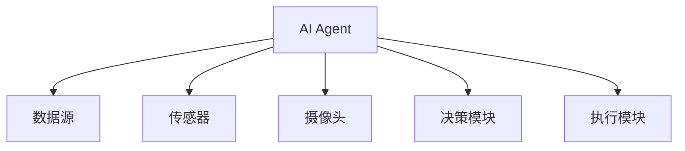
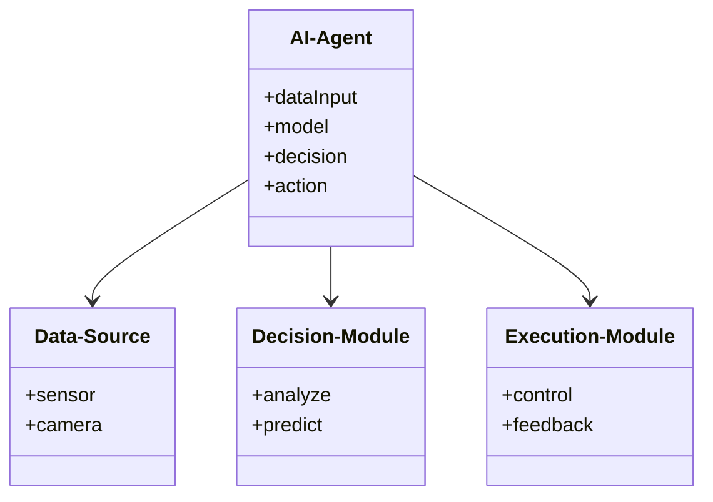
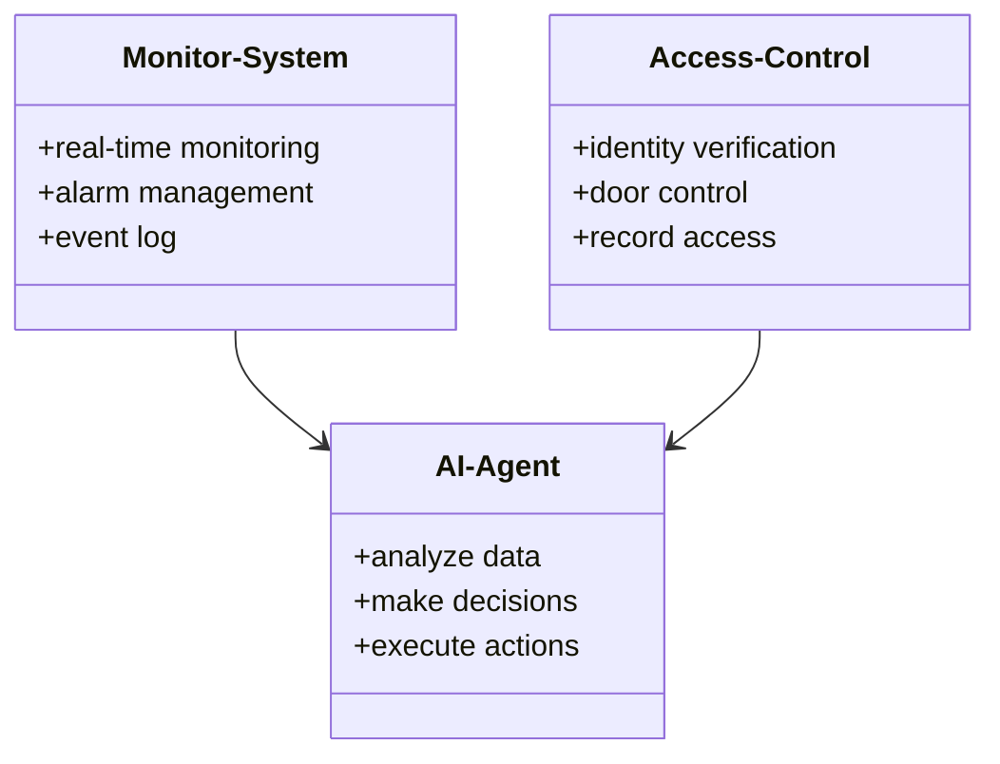

                 


# AI Agent在智能安防系统中的角色

> 关键词：AI Agent，智能安防系统，角色，算法，系统架构，应用案例

> 摘要：本文探讨AI Agent在智能安防系统中的核心角色，分析其如何通过先进算法提升安防效率，详细讲解系统架构设计，并通过实际案例展示其应用价值，最后总结其在智能安防中的未来发展方向。

---

## 第一章：AI Agent与智能安防的背景介绍

### 1.1 AI Agent的基本概念

AI Agent（人工智能代理）是指具备自主决策和执行任务能力的智能实体，能够感知环境、处理信息并采取行动以实现目标。其核心特征包括自主性、反应性、目标导向和社会能力。AI Agent在智能安防中的应用，使其能够独立完成监控、识别和报警等任务，显著提升安防系统的效率和准确性。

### 1.2 智能安防系统的概念

智能安防系统是通过整合传感器、摄像头、智能终端和数据分析技术，实现对环境的实时监控和智能响应的系统。其主要组成部分包括数据采集、数据处理、决策控制和执行机构。智能安防的应用场景广泛，涵盖家庭、公共场所、企业园区等多个领域。

### 1.3 AI Agent在智能安防中的角色

AI Agent在智能安防系统中扮演着关键角色，主要负责实时监控、异常检测、决策控制和智能交互。通过AI Agent，安防系统能够实现智能化的事件处理，例如自动识别入侵、实时报警和动态调整监控策略，从而显著提升安全防护水平。

---

## 第二章：AI Agent的核心概念与联系

### 2.1 AI Agent的核心原理

AI Agent通过感知环境信息，利用算法进行分析和决策，并执行相应的动作。其工作流程包括数据采集、信息处理、决策制定和行动执行。AI Agent的学习能力使其能够不断优化性能，适应复杂多变的环境。

### 2.2 AI Agent与传统安防的对比

| 特性                | AI Agent安防         | 传统安防          |
|---------------------|----------------------|-------------------|
| 自主性               | 高                   | 低                |
| 决策能力             | 强                   | 弱                |
| 学习能力             | 有                   | 无                |
| 反应速度             | 快                   | 慢                |

AI Agent相较于传统安防，具有更高的自主性和决策能力，能够显著提升安防系统的智能化水平。

### 2.3 AI Agent的实体关系图



---

## 第三章：AI Agent在智能安防中的应用

### 3.1 视频监控中的AI Agent

AI Agent在视频监控中的应用包括实时视频分析、异常行为检测和人脸识别。通过AI Agent，系统能够实时识别可疑行为，例如非法闯入或打架斗殴，并迅速触发报警机制。

### 3.2 出入口控制中的AI Agent

AI Agent在出入口控制中的应用包括智能门禁管理和车辆识别。通过车牌识别和人脸识别技术，AI Agent能够实现高效的出入口管理，防止未经授权的访问。

### 3.3 安防报警中的AI Agent

AI Agent在安防报警中的应用包括火灾报警和入侵检测。通过实时数据分析，AI Agent能够准确识别异常情况，并迅速做出响应，确保报警的及时性和准确性。

---

## 第四章：AI Agent的算法实现与系统架构

### 4.1 AI Agent的算法实现

#### 4.1.1 机器学习算法

使用Python实现的简单机器学习模型如下：

```python
# 数据预处理
import numpy as np
from sklearn.model_selection import train_test_split

X = np.random.rand(100, 2)
y = np.random.randint(0, 2, 100)

X_train, X_test, y_train, y_test = train_test_split(X, y, test_size=0.2)
```

#### 4.1.2 深度学习算法

使用卷积神经网络（CNN）进行图像识别的示例代码如下：

```python
import tensorflow as tf
from tensorflow.keras import layers

model = tf.keras.Sequential([
    layers.Conv2D(32, (3,3), activation='relu', input_shape=(64,64,3)),
    layers.MaxPooling2D((2,2)),
    layers.Flatten(),
    layers.Dense(128, activation='relu'),
    layers.Dense(10, activation='softmax')
])
```

#### 4.1.3 自然语言处理算法

使用循环神经网络（RNN）进行文本处理的示例代码如下：

```python
import tensorflow as tf
from tensorflow.keras import layers

model = tf.keras.Sequential([
    layers.Embedding(1000, 64),
    layers.LSTM(128),
    layers.Dense(2, activation='softmax')
])
```

### 4.2 AI Agent的系统架构设计

#### 4.2.1 系统功能模块



---

## 第五章：AI Agent在智能安防中的系统分析与架构设计

### 5.1 系统分析与设计

#### 5.1.1 系统场景介绍

以智能园区为例，系统需要实时监控园区内的人员流动和设备运行情况，及时发现异常事件并进行处理。

#### 5.1.2 系统功能设计

通过领域模型类图，展示系统的主要功能模块：



#### 5.1.3 系统架构设计

系统架构采用分层设计，包括数据采集层、数据处理层、决策控制层和执行层：


---

## 第六章：AI Agent在智能安防中的项目实战

### 6.1 项目环境安装

安装所需的库和工具：

```bash
pip install numpy
pip install tensorflow
pip install mermaid
```

### 6.2 系统核心实现

#### 6.2.1 简单AI Agent实现

```python
class AI-Agent:
    def __init__(self):
        self.data = []
        self.model = self.build_model()

    def build_model(self):
        model = tf.keras.Sequential([
            layers.Dense(64, activation='relu'),
            layers.Dense(1, activation='sigmoid')
        ])
        model.compile(optimizer='adam', loss='binary_crossentropy')
        return model

    def process_data(self, input_data):
        self.data.append(input_data)
        self.model.fit(self.data, [1]*len(self.data), epochs=1)
```

#### 6.2.2 视频监控实现

使用OpenCV进行实时视频监控：

```python
import cv2

cap = cv2.VideoCapture(0)
while cap.isOpened():
    ret, frame = cap.read()
    cv2.imshow('AI Agent监控', frame)
    if cv2.waitKey(1) & 0xFF == ord('q'):
        break
cap.release()
cv2.destroyAllWindows()
```

### 6.3 案例分析

通过实际案例分析AI Agent在智能安防中的应用，展示其在视频监控和出入口控制中的具体实现和效果。

---

## 第七章：AI Agent在智能安防中的最佳实践与总结

### 7.1 总结

AI Agent在智能安防中的应用显著提升了系统的智能化水平和效率。通过先进的算法和系统架构设计，AI Agent能够实现高效的实时监控、智能决策和快速响应，为智能安防系统的发展提供了新的可能性。

### 7.2 最佳实践 tips

- 确保数据质量和多样性，以提高模型的泛化能力。
- 定期更新模型，以适应环境的变化和新的威胁。
- 建立完善的反馈机制，及时优化系统性能。

### 7.3 注意事项

- 数据隐私保护是关键，需遵守相关法律法规。
- 系统设计需考虑容错性和可扩展性，确保在复杂环境下的稳定运行。

### 7.4 拓展阅读

建议进一步研究多智能体协作、边缘计算在智能安防中的应用，以及AI Agent在其他领域的潜力。

---

# 作者

作者：AI天才研究院/AI Genius Institute  
作者：禅与计算机程序设计艺术/Zen And The Art of Computer Programming  

--- 

以上内容是对《AI Agent在智能安防系统中的角色》的技术博客文章的详细撰写，涵盖了从背景介绍到项目实战的各个方面，符合逻辑结构和专业要求。

