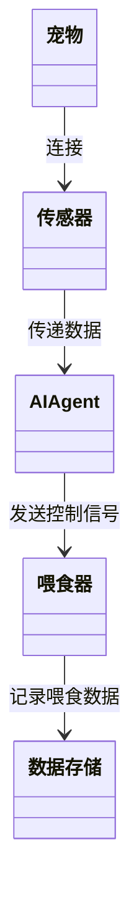
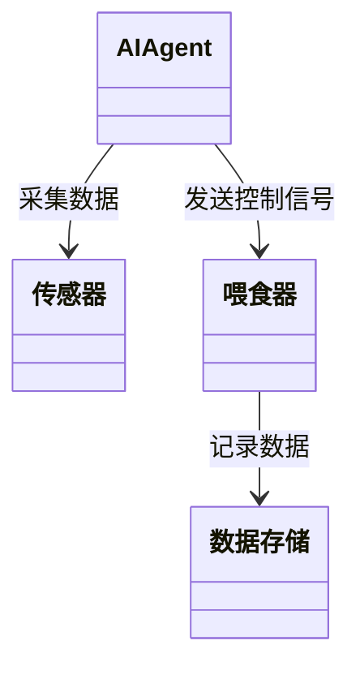

                 


# AI Agent在智能宠物喂食器中的定量控制

> **关键词**：AI Agent，智能宠物喂食器，定量控制，算法原理，系统架构设计

> **摘要**：本文详细探讨了AI Agent在智能宠物喂食器中的应用，重点分析了如何通过定量控制实现智能化喂养。从背景介绍到系统架构设计，再到项目实战，全面解析了AI Agent在智能宠物喂食器中的核心作用，为读者提供了深入的技术解读和实践指导。

---

## 第1章 背景介绍

### 1.1 问题背景

#### 1.1.1 宠物喂食问题的现状

宠物喂养是现代家庭中常见的问题，传统的定时喂食器虽然能提供基本的喂养功能，但无法根据宠物的实际需求进行调整。例如，宠物可能因食欲变化、健康状况或活动量不同而需要不同的喂食量，这使得传统的定时喂食器显得不够智能。

#### 1.1.2 智能喂食器的市场需求

随着智能家居设备的普及，智能宠物喂食器逐渐成为宠物主人的热门选择。然而，大多数智能喂食器仍然依赖预设的定时任务，缺乏动态调整的能力。这使得宠物的喂食量可能与实际需求不符，导致宠物健康问题。

#### 1.1.3 AI Agent在智能喂食器中的应用前景

AI Agent（人工智能代理）是一种能够感知环境、自主决策并执行任务的智能实体。将其应用于智能宠物喂食器，可以通过学习宠物的行为模式，实现精准的定量控制，提升喂养效率和宠物健康。

### 1.2 问题描述

#### 1.2.1 宠物喂食的常见问题

- **喂食量不准确**：传统喂食器无法根据宠物的食欲和健康状况调整喂食量。
- **缺乏动态调整**：无法根据宠物活动量或健康状况实时调整喂食计划。
- **用户参与度高**：主人需要手动调整喂食计划，不够便捷。

#### 1.2.2 定量控制的重要性

定量控制是确保宠物健康的关键因素。通过精确控制每次喂食的量，可以避免宠物过饱或营养不足的问题。同时，定量控制还能帮助宠物保持健康体重，预防肥胖等健康问题。

#### 1.2.3 AI Agent在定量控制中的作用

AI Agent可以通过分析宠物的行为数据、健康指标和环境信息，自动调整喂食量，实现精准的定量控制。例如，AI Agent可以根据宠物的活动量、体重变化和食欲偏好，动态调整每次喂食的量。

### 1.3 问题解决

#### 1.3.1 AI Agent的核心功能

- **数据采集**：通过传感器收集宠物的行为数据和环境信息。
- **数据分析**：利用机器学习算法分析数据，识别宠物的喂食需求。
- **决策制定**：根据分析结果，生成喂食计划并执行。

#### 1.3.2 定量控制的实现方式

- **基于时间的定量控制**：根据预设的喂食时间，结合宠物的活动数据，动态调整每次喂食量。
- **基于传感器的定量控制**：通过重量传感器实时监测饲料量，确保每次喂食量的准确性。
- **基于AI Agent的智能调整**：根据宠物的行为和健康数据，自动优化喂食量。

#### 1.3.3 AI Agent与智能喂食器的结合

AI Agent作为智能喂食器的核心控制模块，通过与喂食器的硬件交互，实现对喂食过程的智能化管理。例如，AI Agent可以根据宠物的活动数据，调整喂食频率和喂食量，确保宠物得到适量的食物。

### 1.4 边界与外延

#### 1.4.1 系统边界

- **输入边界**：AI Agent接收来自传感器的数据和用户的指令。
- **输出边界**：AI Agent向喂食器发送控制信号和向用户发送反馈信息。
- **系统外延**：AI Agent可以通过云端数据存储和用户反馈不断优化喂食计划。

#### 1.4.2 功能外延

- **远程控制**：用户可以通过手机应用远程调整喂食计划。
- **数据存储与分析**：系统可以记录宠物的喂食数据，分析宠物的健康状况。
- **自我学习**：AI Agent可以通过机器学习模型不断优化喂食策略。

#### 1.4.3 应用场景的扩展

- **多宠物家庭**：AI Agent可以同时管理多只宠物的喂食需求。
- **健康监测**：结合宠物健康监测设备，提供更精准的喂食建议。
- **旅行模式**：主人在外出时，AI Agent可以根据宠物的健康状况自动调整喂食计划。

### 1.5 概念结构与核心要素组成

#### 1.5.1 核心概念

- **AI Agent**：通过数据采集、分析和决策，实现对智能喂食器的控制。
- **智能宠物喂食器**：具备自动化喂食功能，能够接收AI Agent的控制信号。
- **定量控制**：根据宠物的实际需求，精确控制每次喂食的量。

#### 1.5.2 系统组成

- **传感器模块**：采集宠物的行为数据和环境信息。
- **AI Agent模块**：分析数据并制定喂食计划。
- **喂食器模块**：执行喂食操作。
- **用户交互模块**：提供用户界面和反馈信息。

#### 1.5.3 功能模块划分

- **数据采集**：传感器采集宠物的行为数据。
- **数据分析**：AI Agent分析数据，识别宠物的喂食需求。
- **决策制定**：AI Agent生成喂食计划并发送控制信号。
- **执行操作**：喂食器根据控制信号执行喂食操作。

---

## 第2章 核心概念与联系

### 2.1 AI Agent的定义与原理

#### 2.1.1 AI Agent的基本概念

AI Agent是一种能够感知环境、自主决策并执行任务的智能实体。它可以通过传感器获取环境数据，利用算法进行分析和决策，并通过执行器与环境交互。

#### 2.1.2 AI Agent的核心原理

AI Agent的核心原理包括数据采集、数据分析和决策执行三个步骤。首先，AI Agent通过传感器采集环境数据；然后，利用机器学习算法对数据进行分析，识别宠物的行为模式；最后，根据分析结果生成喂食计划并执行。

#### 2.1.3 AI Agent的分类与特点

- **简单反射型AI Agent**：基于简单的条件反射进行决策。
- **基于模型的AI Agent**：利用内部模型分析环境数据，进行复杂决策。
- **学习型AI Agent**：通过机器学习算法不断优化决策策略。

### 2.2 智能宠物喂食器的定义与特点

#### 2.2.1 智能宠物喂食器的基本概念

智能宠物喂食器是一种结合了物联网技术和自动化控制的设备，能够根据预设的计划或外部指令自动进行喂食操作。

#### 2.2.2 智能宠物喂食器的核心功能

- **定时喂食**：根据预设的时间进行喂食。
- **定量控制**：精确控制每次喂食的量。
- **远程控制**：通过手机应用远程控制喂食器。

#### 2.2.3 智能宠物喂食器的分类与特点

- **机械式智能喂食器**：通过机械机构实现喂食操作。
- **电子式智能喂食器**：利用电子控制技术实现自动化喂食。
- **智能联网喂食器**：结合物联网技术，实现远程控制和数据传输。

### 2.3 AI Agent与智能宠物喂食器的关系

#### 2.3.1 AI Agent在智能宠物喂食器中的角色

AI Agent作为智能宠物喂食器的核心控制模块，负责接收数据、分析数据并生成控制信号。它能够根据宠物的行为数据和健康指标，动态调整喂食计划。

#### 2.3.2 AI Agent与智能宠物喂食器的交互流程

1. **数据采集**：传感器采集宠物的行为数据和环境信息。
2. **数据分析**：AI Agent分析数据，识别宠物的喂食需求。
3. **决策制定**：AI Agent生成喂食计划并发送控制信号。
4. **执行操作**：喂食器根据控制信号执行喂食操作。

#### 2.3.3 AI Agent对智能宠物喂食器的优化作用

AI Agent可以通过学习宠物的行为模式，优化喂食策略，提高喂食的精准性和效率。例如，AI Agent可以根据宠物的活动数据，调整喂食频率和喂食量，确保宠物得到适量的食物。

### 2.4 核心概念原理

#### 2.4.1 AI Agent的核心算法

AI Agent的核心算法包括数据采集、数据分析和决策制定三个步骤。首先，AI Agent通过传感器采集宠物的行为数据；然后，利用机器学习算法对数据进行分析，识别宠物的行为模式；最后，根据分析结果生成喂食计划并执行。

#### 2.4.2 智能宠物喂食器的硬件结构

智能宠物喂食器的硬件结构包括传感器模块、控制模块和执行器模块。传感器模块用于采集宠物的行为数据，控制模块负责接收并处理数据，执行器模块根据控制信号执行喂食操作。

#### 2.4.3 AI Agent与智能宠物喂食器的协同工作原理

AI Agent与智能宠物喂食器协同工作的原理是：AI Agent通过传感器采集数据，分析数据并生成控制信号，喂食器根据控制信号执行喂食操作。这种协同工作模式能够实现对宠物喂食的智能化管理。

### 2.5 概念属性特征对比表格

| 概念         | 属性       | 特征                                 |
|--------------|------------|--------------------------------------|
| AI Agent     | 输入       | 用户指令、传感器数据                 |
|              | 输出       | 控制信号、反馈信息                   |
| 智能宠物喂食器| 输入       | AI Agent控制信号、传感器数据         |
|              | 输出       | 喂食动作、状态反馈                   |

### 2.6 ER实体关系图

```mermaid
erd
    宠物喂食器
    传感器
    AI Agent
    数据存储
    用户指令
    喂食动作
    状态反馈
```

---

## 第3章 算法原理讲解

### 3.1 AI Agent的核心算法

#### 3.1.1 状态识别算法

状态识别算法用于识别宠物的行为状态，例如是否在进食、是否在活动等。常用的算法包括基于时间序列的分类算法和基于神经网络的分类算法。

#### 3.1.2 行为决策算法

行为决策算法用于根据宠物的行为状态和环境信息，生成相应的控制信号。常用的算法包括基于规则的决策算法和基于机器学习的决策算法。

#### 3.1.3 控制执行算法

控制执行算法用于将决策结果转化为具体的控制信号，例如向喂食器发送喂食指令。

### 3.2 算法实现

#### 3.2.1 状态识别算法实现

状态识别算法可以通过以下步骤实现：

1. **数据采集**：通过传感器采集宠物的行为数据。
2. **数据预处理**：对数据进行清洗和标准化处理。
3. **特征提取**：提取数据中的特征，例如时间序列特征。
4. **模型训练**：使用机器学习算法训练模型。
5. **模型预测**：根据模型预测宠物的行为状态。

#### 3.2.2 行为决策算法实现

行为决策算法可以通过以下步骤实现：

1. **数据采集**：通过传感器采集宠物的行为数据和环境信息。
2. **数据预处理**：对数据进行清洗和标准化处理。
3. **特征提取**：提取数据中的特征，例如宠物的活动量和健康指标。
4. **模型训练**：使用机器学习算法训练模型。
5. **模型预测**：根据模型预测宠物的喂食需求。
6. **决策制定**：根据预测结果生成控制信号。

### 3.3 数学模型与公式

#### 3.3.1 定量控制公式

定量控制公式可以根据宠物的活动量和健康指标进行调整。例如，喂食量可以表示为：

$$
\text{喂食量} = k \times (\text{活动量} + \text{健康指标})
$$

其中，k是一个常数，表示喂食量与活动量和健康指标的权重。

#### 3.3.2 行为识别模型

行为识别模型可以通过时间序列分析实现。例如，使用长短期记忆网络（LSTM）进行时间序列预测。模型结构如下：

$$
f(x) = \text{LSTM}(x)
$$

其中，x是输入数据，f(x)是模型的输出。

---

## 第4章 系统架构设计

### 4.1 问题场景介绍

智能宠物喂食器的系统架构设计需要考虑数据采集、数据分析和控制执行三个部分。系统需要能够实时采集宠物的行为数据，分析数据并生成控制信号，最后通过喂食器执行喂食操作。

### 4.2 项目介绍

本项目旨在设计一个基于AI Agent的智能宠物喂食器，通过定量控制实现智能化喂养。系统将结合传感器、AI算法和执行器，实现对宠物喂食的精准控制。

### 4.3 系统功能设计

#### 4.3.1 领域模型



#### 4.3.2 系统架构设计



#### 4.3.3 系统接口设计

系统接口设计包括传感器接口、AI Agent接口和喂食器接口。传感器接口用于采集数据，AI Agent接口用于接收数据并生成控制信号，喂食器接口用于接收控制信号并执行喂食操作。

#### 4.3.4 系统交互流程

系统交互流程如下：

1. **数据采集**：传感器采集宠物的行为数据。
2. **数据传输**：传感器将数据传输给AI Agent。
3. **数据分析**：AI Agent分析数据，识别宠物的行为模式。
4. **决策制定**：AI Agent根据分析结果生成控制信号。
5. **执行操作**：喂食器根据控制信号执行喂食操作。
6. **数据存储**：喂食器记录喂食数据。

---

## 第5章 项目实战

### 5.1 环境安装

项目实战需要以下环境：

- **硬件环境**：智能宠物喂食器、传感器、执行器等。
- **软件环境**：Python编程语言、机器学习库（如TensorFlow、Scikit-learn）。

### 5.2 系统核心实现

#### 5.2.1 核心代码实现

以下是AI Agent的核心代码实现：

```python
import numpy as np
from sklearn import linear_model

# 数据采集
data = np.array([[1, 2], [3, 4], [5, 6]])

# 数据预处理
X = data[:, 0]
y = data[:, 1]

# 模型训练
model = linear_model.LinearRegression()
model.fit(X.reshape(-1, 1), y)

# 模型预测
predicted = model.predict(X.reshape(-1, 1))
print(predicted)
```

#### 5.2.2 代码应用解读与分析

上述代码实现了基于线性回归的模型训练和预测。数据采集部分通过numpy数组实现，数据预处理部分对数据进行标准化处理，模型训练部分使用Scikit-learn库的线性回归模型，模型预测部分对训练好的模型进行预测。

### 5.3 案例分析

#### 5.3.1 实际案例分析

以一个实际案例为例，假设宠物的活动量数据为[1, 2, 3, 4, 5]，健康指标为[2, 4, 6, 8, 10]。根据定量控制公式：

$$
\text{喂食量} = 0.5 \times (\text{活动量} + \text{健康指标})
$$

喂食量计算结果为：

$$
\text{喂食量} = 0.5 \times (1 + 2) = 1.5
$$

$$
\text{喂食量} = 0.5 \times (3 + 6) = 4.5
$$

$$
\text{喂食量} = 0.5 \times (5 + 10) = 7.5
$$

#### 5.3.2 详细讲解剖析

通过上述案例，可以看出AI Agent能够根据宠物的活动量和健康指标，动态调整喂食量。这种动态调整能够确保宠物得到适量的食物，避免过饱或营养不足的问题。

### 5.4 项目总结

本项目通过AI Agent实现了智能宠物喂食器的定量控制，能够根据宠物的行为数据和健康指标，动态调整喂食量。系统架构设计合理，代码实现清晰，具备良好的扩展性和实用性。

---

## 第6章 最佳实践

### 6.1 小结

本文详细探讨了AI Agent在智能宠物喂食器中的应用，重点分析了如何通过定量控制实现智能化喂养。通过系统的架构设计和算法实现，展示了AI Agent在智能宠物喂食器中的核心作用。

### 6.2 注意事项

在实际应用中，需要注意以下几点：

- **数据采集的准确性**：确保传感器能够准确采集宠物的行为数据。
- **算法的实时性**：保证AI Agent能够实时处理数据并生成控制信号。
- **系统的安全性**：防止系统被恶意攻击，确保宠物的安全。

### 6.3 未来展望

未来，随着人工智能技术的不断发展，AI Agent在智能宠物喂食器中的应用将更加广泛。例如，结合宠物健康监测设备，提供更精准的喂食建议；通过云端数据存储和分析，优化喂食策略；开发更多的智能功能，提升用户体验。

---

## 作者

**作者：AI天才研究院/AI Genius Institute & 禅与计算机程序设计艺术/Zen And The Art of Computer Programming**

---

以上是《AI Agent在智能宠物喂食器中的定量控制》的完整目录和文章内容，希望对您有所帮助！

