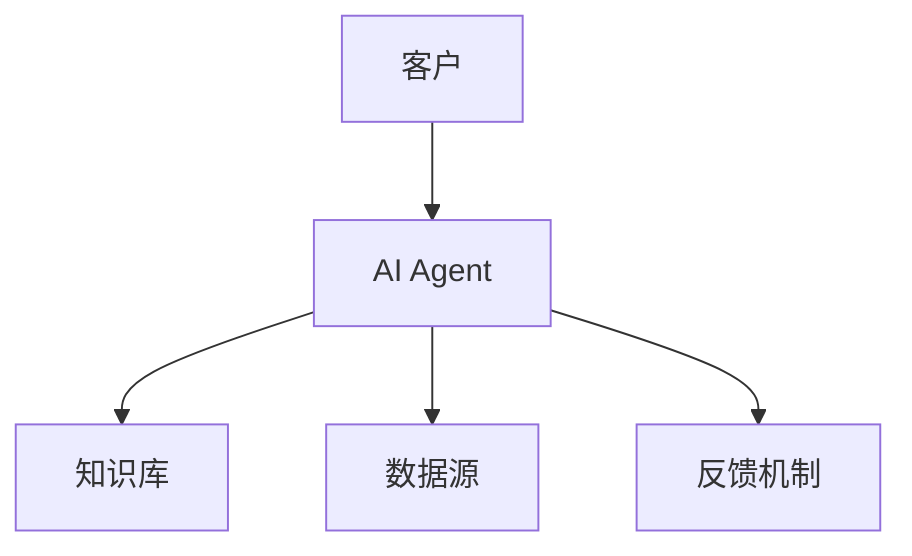

                 


```markdown
# AI Agent在智能客户服务中的角色

> 关键词：AI Agent, 智能客服, 人工智能, 机器学习, 强化学习

> 摘要：本文探讨了AI Agent在智能客户服务中的角色，从背景介绍、核心概念、算法原理、系统架构到项目实战，全面分析了AI Agent如何提升智能客户服务的效率和质量。文章通过详细的数学模型、算法实现和系统设计，展示了AI Agent在智能客户服务中的技术细节和实际应用。

---

## 第一部分: AI Agent在智能客户服务中的背景与概念

### 第1章: AI Agent的基本概念与背景

#### 1.1 AI Agent的定义与核心概念
AI Agent（人工智能代理）是指能够感知环境并采取行动以实现目标的智能实体。它具备以下核心特征：
- **自主性**：能够在没有外部干预的情况下独立运行。
- **反应性**：能够根据环境变化实时调整行为。
- **目标导向**：所有行动均以实现特定目标为导向。
- **学习能力**：通过数据和经验不断优化自身行为。

AI Agent在智能客户服务中的作用可以概括为：
- 提供24/7的实时客服支持。
- 根据客户需求主动推荐解决方案。
- 通过数据分析优化服务流程。

#### 1.2 AI Agent在智能客户服务中的作用
智能客户服务的定义与现状：
- 智能客户服务是指利用人工智能技术，通过自动化手段为客户提供高效、个性化的服务。
- 当前，智能客户服务主要应用于在线客服、语音助手、智能推荐等领域。

AI Agent与传统客服系统的区别：
| 特性 | AI Agent | 传统客服系统 |
|------|-----------|---------------|
| 响应时间 | 实时响应 | 人工响应较慢 |
| 服务范围 | 全球7x24小时 | 仅限工作时间 |
| 服务质量 | 高度个性化 | 标准化服务 |

### 第2章: AI Agent的核心概念与联系

#### 2.1 AI Agent的核心原理
AI Agent的决策机制：
- 基于规则的决策：通过预定义的规则进行判断和选择。
- 基于机器学习的决策：利用数据训练模型进行预测和决策。
- 基于强化学习的决策：通过不断试错优化决策策略。

AI Agent的学习与优化：
- 监督学习：通过标记数据训练模型。
- 无监督学习：从无标记数据中发现模式。
- 强化学习：通过奖励机制优化决策。

AI Agent的交互方式：
- 文本交互：通过自然语言处理技术实现。
- 语音交互：通过语音识别和合成技术实现。
- 图形交互：通过可视化界面与用户交互。

#### 2.2 AI Agent与相关技术的对比
AI Agent与传统客服系统的对比：
- AI Agent能够实现7x24小时的实时响应，而传统客服系统仅能在工作时间提供服务。
- AI Agent能够根据客户需求实时调整行为，而传统客服系统则需要依赖人工判断。

AI Agent与规则引擎的区别：
- AI Agent具备学习能力，能够通过数据优化决策，而规则引擎则依赖于预定义的规则。

AI Agent与机器学习模型的联系：
- AI Agent可以看作是一个基于机器学习模型的智能体，通过模型实现决策和行动。

#### 2.3 AI Agent的实体关系图


---

## 第二部分: AI Agent的算法原理与数学模型

### 第3章: AI Agent的算法原理

#### 3.1 AI Agent的决策算法
- 基于规则的决策算法：
  ```python
  def rule_based_decision(state):
      if state == 'customer_query':
          return 'provide_answer'
      elif state == 'problem_report':
          return 'log_issue'
  ```

- 基于机器学习的决策算法：
  ```python
  import numpy as np
  from sklearn.tree import DecisionTreeClassifier

  model = DecisionTreeClassifier()
  model.fit(X, y)
  prediction = model.predict(X_new)
  ```

- 基于强化学习的决策算法：
  ```python
  def reinforce_learning_decision(state):
      action = policy_network.predict(state)
      return action
  ```

#### 3.2 AI Agent的数学模型
- 决策树模型：
  ```mermaid
  graph TD
      A[客户输入] --> B[特征提取]
      B --> C[决策树]
      C --> D[输出结果]
  ```

- 马尔可夫决策过程：
  - 状态空间S：所有可能的客户状态。
  - 行动空间A：所有可能的客服行动。
  - 转移概率P：从状态s到状态s'的概率。
  - 奖励函数R：执行行动a后的奖励。

- 强化学习的数学公式：
  $$ Q(s,a) = Q(s,a) + \alpha (r + \gamma \max Q(s',a') - Q(s,a)) $$

### 第4章: AI Agent的数学模型与公式

#### 4.1 决策树模型
- 决策树的构建过程：
  ```python
  from sklearn.tree import DecisionTreeClassifier
  model = DecisionTreeClassifier()
  model.fit(X, y)
  ```

- 决策树的分类算法：
  - ID3算法：基于信息增益。
  - C4.5算法：基于信息增益率。
  - C5.0算法：基于正则化信息增益。

- 决策树的数学公式：
  $$ \text{信息增益} = \text{熵}(S) - \sum \text{熵}(S_i) $$

### 第5章: AI Agent的算法实现

#### 5.1 AI Agent的Python实现
- 基于规则的AI Agent实现：
  ```python
  class RuleBasedAgent:
      def __init__(self):
          self.rules = []

      def add_rule(self, condition, action):
          self.rules.append((condition, action))

      def decide(self, state):
          for condition, action in self.rules:
              if condition(state):
                  return action
          return default_action
  ```

- 基于机器学习的AI Agent实现：
  ```python
  class MachineLearningAgent:
      def __init__(self):
          self.model = DecisionTreeClassifier()

      def train(self, X, y):
          self.model.fit(X, y)

      def predict(self, X_new):
          return self.model.predict(X_new)
  ```

- 基于强化学习的AI Agent实现：
  ```python
  import numpy as np
  import gym

  class ReinforcementLearningAgent:
      def __init__(self, env):
          self.env = env
          self.Q = np.zeros((env.observation_space.n, env.action_space.n))

      def train(self, episodes=1000):
          for _ in range(episodes):
              state = self.env.reset()
              done = False
              while not done:
                  action = np.argmax(self.Q[state])
                  next_state, reward, done, _ = self.env.step(action)
                  self.Q[state][action] += reward
  ```

---

## 第三部分: 系统分析与架构设计方案

### 第6章: 系统分析与架构设计

#### 6.1 问题场景介绍
智能客户服务系统需要处理以下问题：
- 多渠道客户请求的接入与处理。
- 客户需求的准确识别与分类。
- 复杂问题的自动解决与人工协作。

#### 6.2 系统功能设计
- **领域模型**：
  ```mermaid
  classDiagram
      class Customer {
          id: int
          name: str
          query: str
      }
      class AI-Agent {
          state: State
          action: Action
      }
      class Knowledge-Base {
          data: dict
      }
      Customer --> AI-Agent
      AI-Agent --> Knowledge-Base
  ```

- **系统架构**：
  ```mermaid
  architecture
      Client --> API Gateway
      API Gateway --> AI-Agent
      AI-Agent --> Knowledge-Base
      Knowledge-Base --> Database
  ```

- **系统接口设计**：
  ```mermaid
  sequenceDiagram
      Customer ->+ API Gateway: 发起请求
      API Gateway ->+ AI-Agent: 转发请求
      AI-Agent ->+ Knowledge-Base: 查询知识库
      Knowledge-Base --> AI-Agent: 返回结果
      AI-Agent ->+ Customer: 返回响应
  ```

---

## 第四部分: 项目实战

### 第7章: 项目实战

#### 7.1 环境安装
- 安装Python和相关库：
  ```bash
  pip install numpy scikit-learn gym
  ```

#### 7.2 系统核心实现
- AI Agent的实现：
  ```python
  class AI-Agent:
      def __init__(self):
          self.model = DecisionTreeClassifier()

      def train(self, X, y):
          self.model.fit(X, y)

      def predict(self, X_new):
          return self.model.predict(X_new)
  ```

- 知识库的实现：
  ```python
  class KnowledgeBase:
      def __init__(self):
          self.data = {}

      def store(self, key, value):
          self.data[key] = value

      def retrieve(self, key):
          return self.data.get(key, None)
  ```

#### 7.3 实际案例分析
- 案例：客户咨询产品问题。
  - 输入：客户问题描述。
  - 处理：AI Agent通过知识库检索相关信息。
  - 输出：提供解决方案。

---

## 第五部分: 最佳实践与总结

### 第8章: 最佳实践与总结

#### 8.1 最佳实践
- 定期更新知识库，确保信息准确性。
- 监控AI Agent的运行状态，及时优化算法。
- 结合人工客服，实现人机协作。

#### 8.2 小结
AI Agent在智能客户服务中扮演了至关重要的角色，它不仅能够提高服务效率，还能为客户提供更加个性化的体验。

#### 8.3 注意事项
- 确保数据隐私和安全。
- 定期评估AI Agent的性能。
- 提供客户反馈渠道，优化服务流程。

#### 8.4 拓展阅读
- 推荐阅读《人工智能：一种现代方法》。
- 参考GitHub上的AI Agent开源项目。

---

## 作者：AI天才研究院/AI Genius Institute & 禅与计算机程序设计艺术 /Zen And The Art of Computer Programming
```

