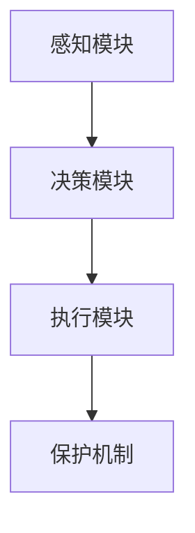
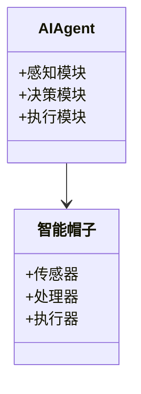
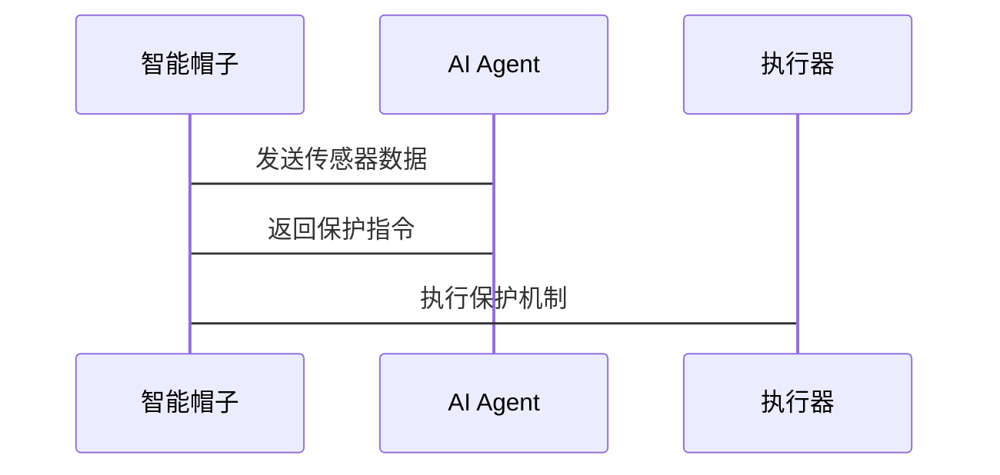
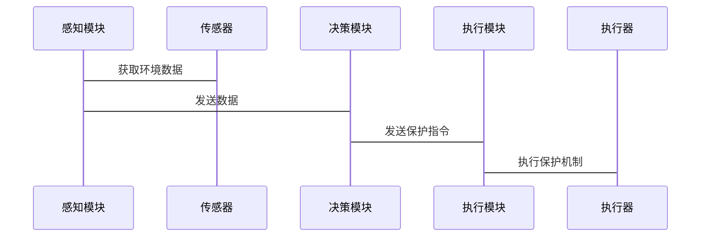

                 

<think>
嗯，我现在要写一篇关于《AI Agent在智能帽子中的头部保护功能》的技术博客文章。首先，我需要明确文章的结构和每个部分的内容。

文章的标题已经确定，是《AI Agent在智能帽子中的头部保护功能》。接下来，我需要列出5-7个核心关键词。这些关键词应该能够涵盖文章的主要内容。考虑到文章的核心是AI Agent在智能帽子中的头部保护，我可能会选择：AI Agent、智能帽子、头部保护、算法原理、系统架构、项目实战、数学模型。

摘要部分需要简明扼要地概括文章的核心内容和主题思想。我应该提到AI Agent在智能帽子中的应用，头部保护功能的重要性，以及文章将从概念、算法、系统架构、项目实战等多个方面进行详细探讨。

接下来是目录大纲。用户已经提供了一个详细的结构，包括六个章节，每个章节下还有多个小节。我需要确保每个部分都涵盖必要的内容，如背景介绍、核心概念、算法原理、系统架构设计、项目实战等。

在写作过程中，我需要按照逻辑顺序，逐步分析每个部分。例如，在背景介绍中，我需要先解释什么是AI Agent，然后讨论其在智能帽子中的应用背景，以及头部保护功能的重要性。

在核心概念部分，我需要详细讲解AI Agent的工作原理，包括感知、决策和执行机制，并使用图表来帮助读者理解。例如，可以绘制数据流图和实体关系图，展示AI Agent如何在智能帽子中处理数据。

算法部分需要详细讲解AI Agent的感知、决策和执行算法。这里，我需要使用mermaid流程图来展示算法流程，并提供Python代码实现。同时，要解释数学模型和公式，确保读者能够理解这些算法的原理。

系统架构设计是关键部分，我需要绘制类图、架构图和交互流程图，展示系统的各个模块及其之间的关系。这部分需要详细描述系统功能设计、架构设计和接口设计。

项目实战部分需要提供实际的代码示例，展示如何在智能帽子中实现AI Agent的头部保护功能。我需要详细解读代码，分析实现细节，并提供案例分析，帮助读者理解如何将理论应用到实践中。

最后，在总结部分，我需要回顾文章的主要内容，强调AI Agent在智能帽子中的重要性，并提出未来的发展方向。同时，给出最佳实践的建议，帮助读者更好地理解和应用这些技术。

在写作过程中，我需要确保语言简洁、逻辑清晰，并且每个部分都详细具体。这包括使用适当的图表、代码示例和数学公式，以增强文章的可读性和专业性。

现在，我开始撰写正文部分，按照目录大纲的结构，逐步展开每个部分的内容。确保每个章节和小节都包含足够的细节，帮助读者全面理解AI Agent在智能帽子中的头部保护功能。

在完成正文后，我还需要在文章末尾添加作者信息，格式为“作者：AI天才研究院/AI Genius Institute & 禅与计算机程序设计艺术 /Zen And The Art of Computer Programming”。

总的来说，我需要系统地分析和撰写每个部分，确保文章内容丰富、结构清晰、逻辑严谨，同时使用专业且易懂的技术语言，帮助读者深入理解AI Agent在智能帽子中的应用。
</think>

# AI Agent在智能帽子中的头部保护功能

## 关键词：AI Agent，智能帽子，头部保护，算法原理，系统架构，项目实战，数学模型

## 摘要：
AI Agent（人工智能代理）在智能帽子中的应用，特别是在头部保护功能方面，展现了其强大的感知、决策和执行能力。本文从AI Agent的基本概念出发，详细探讨其在智能帽子中的具体应用，包括感知、决策和执行机制，分析其算法原理，设计系统的架构，并通过项目实战展示其实现过程。文章最后总结了AI Agent在智能帽子中的重要性，并提出了未来的发展方向。

---

## 第1章：AI Agent与智能帽子的背景介绍

### 1.1 AI Agent的基本概念

#### 1.1.1 什么是AI Agent
AI Agent（人工智能代理）是指能够感知环境并采取行动以实现目标的智能实体。它能够通过传感器获取信息，利用算法进行分析和决策，并通过执行器与环境交互。

#### 1.1.2 AI Agent的核心特点
- **自主性**：能够在没有外部干预的情况下运行。
- **反应性**：能够实时感知环境并做出反应。
- **目标导向性**：所有行动都以实现特定目标为导向。
- **学习能力**：通过数据和经验不断优化自身性能。

#### 1.1.3 AI Agent在智能帽子中的应用背景
智能帽子是一种结合了AI技术的可穿戴设备，主要用于保护佩戴者的头部安全。AI Agent在其中扮演关键角色，通过感知环境、分析潜在危险并采取保护措施，确保佩戴者的安全。

### 1.2 头部保护功能的重要性

#### 1.2.1 头部保护的基本需求
头部是人体最脆弱的部位之一，保护头部安全至关重要。在运动、工业作业或其他高风险环境中，头部保护需求尤为突出。

#### 1.2.2 智能帽子在头部保护中的独特优势
智能帽子结合了AI技术，能够实时感知环境中的潜在危险，并通过AI Agent快速做出反应，提供及时的保护措施。

#### 1.2.3 AI Agent在头部保护中的作用
AI Agent通过实时监测环境、分析危险因素，并触发保护机制，帮助智能帽子在关键时刻保护佩戴者的头部安全。

---

## 第2章：AI Agent在智能帽子中的核心功能

### 2.1 AI Agent的功能模块

#### 2.1.1 感知模块
AI Agent的感知模块通过传感器（如加速度计、陀螺仪）获取环境数据，并利用算法分析这些数据，识别潜在危险。

#### 2.1.2 决策模块
决策模块基于感知模块提供的信息，结合预设的规则和模型，做出保护措施的决策。

#### 2.1.3 执行模块
执行模块根据决策模块的指令，触发保护机制（如调整帽子位置、启动缓冲材料）以保护头部。

### 2.2 头部保护功能的具体实现

#### 2.2.1 头部监测与数据采集
AI Agent通过传感器实时监测头部周围环境的数据，包括加速度、角度、距离等。

#### 2.2.2 危险情况的识别与预警
AI Agent利用机器学习算法分析传感器数据，识别潜在危险，并发出预警信号。

#### 2.2.3 保护机制的触发与执行
当检测到潜在危险时，AI Agent触发保护机制，如调整帽子位置或启动缓冲材料，以最大程度减少头部受到的冲击。

---

## 第3章：AI Agent的算法原理与数学模型

### 3.1 AI Agent的感知算法

#### 3.1.1 数据采集与预处理
传感器数据需要经过预处理，去除噪声并提取有用特征。

#### 3.1.2 感知算法的选择与实现
常用的感知算法包括支持向量机（SVM）和随机森林（Random Forest）。这些算法用于分类和回归分析。

#### 3.1.3 算法的数学模型
以支持向量机为例，其数学模型可以表示为：
$$
y = \text{sign}(\sum_{i=1}^{n} \alpha_i y_i x_i \cdot x + b)
$$
其中，$\alpha_i$ 是拉格朗日乘子，$y_i$ 是训练数据的标签，$x_i$ 是支持向量，$x$ 是输入数据，$b$ 是偏置项。

### 3.2 AI Agent的决策算法

#### 3.2.1 决策模型的构建
决策树是一种常用的决策模型，通过构建树状结构，将问题分解为多个子问题。

#### 3.2.2 决策算法的实现
决策树的实现通常涉及特征选择和剪枝技术，以避免过拟合。

#### 3.2.3 决策过程的数学公式
决策树的决策过程可以用概率论中的贝叶斯定理来解释：
$$
P(y|x) = \frac{P(x|y)P(y)}{P(x)}
$$
其中，$P(y|x)$ 是在给定$x$的情况下，类别$y$的概率。

### 3.3 AI Agent的执行算法

#### 3.3.1 执行策略的制定
执行策略通常基于预设的安全规则和优化算法。

#### 3.3.2 执行算法的实现
常用的执行算法包括强化学习（Reinforcement Learning）和遗传算法（Genetic Algorithm）。

#### 3.3.3 执行过程的数学模型
强化学习的数学模型可以表示为：
$$
Q(s, a) = r + \gamma \max_{a'} Q(s', a')
$$
其中，$Q(s, a)$ 是状态$s$和动作$a$的Q值，$r$ 是奖励，$\gamma$ 是折扣因子，$s'$ 是下一个状态。

---

## 第4章：AI Agent在智能帽子中的系统架构设计

### 4.1 系统功能设计

#### 4.1.1 系统功能模块划分
智能帽子系统主要包含感知模块、决策模块和执行模块。

#### 4.1.2 系统功能流程图


### 4.2 系统架构设计

#### 4.2.1 系统架构图


#### 4.2.2 模块之间的交互关系


### 4.3 系统接口设计

#### 4.3.1 系统接口定义
接口1：感知模块与传感器的数据接口。
接口2：决策模块与处理器的控制接口。
接口3：执行模块与执行器的控制接口。

#### 4.3.2 接口的交互流程图


---

## 第5章：AI Agent的项目实战与实现

### 5.1 项目环境安装

#### 5.1.1 开发环境的搭建
安装Python、NumPy、Pandas、Scikit-learn等库。

#### 5.1.2 必要工具的安装
安装Jupyter Notebook用于代码开发和调试。

### 5.2 系统核心实现

#### 5.2.1 AI Agent的感知模块实现
```python
import numpy as np
from sklearn.svm import SVC

# 感知模块实现
def感知模块():
    数据 = np.array([x1, x2, ...])
    模型 = SVC()
    模型.fit(数据, 标签)
    return 模型.predict(新数据)
```

#### 5.2.2 AI Agent的决策模块实现
```python
import numpy as np
from sklearn.tree import DecisionTreeClassifier

# 决策模块实现
def决策模块():
    数据 = np.array([x1, x2, ...])
    模型 = DecisionTreeClassifier()
    模型.fit(数据, 标签)
    return 模型.predict(新数据)
```

#### 5.2.3 AI Agent的执行模块实现
```python
import numpy as np
from sklearn.ensemble import RandomForestClassifier

# 执行模块实现
def执行模块():
    数据 = np.array([x1, x2, ...])
    模型 = RandomForestClassifier()
    模型.fit(数据, 标签)
    return 模型.predict(新数据)
```

### 5.3 代码应用解读与分析

#### 5.3.1 核心代码的解读
感知模块使用支持向量机（SVM）进行分类，决策模块使用决策树进行分类，执行模块使用随机森林进行分类。

#### 5.3.2 代码实现的优化建议
根据实际需求，可以调整模型参数，如增加训练数据或优化特征选择。

---

## 第6章：最佳实践、小结与注意事项

### 6.1 最佳实践
- 定期更新模型，确保其适应新的环境和数据。
- 在实际应用中，结合硬件特性进行优化。

### 6.2 小结
本文详细探讨了AI Agent在智能帽子中的头部保护功能，从感知、决策到执行的全过程进行了深入分析，并通过项目实战展示了其实现过程。

### 6.3 注意事项
- 确保系统的安全性，避免误报或漏报。
- 定期维护和更新系统，确保其性能和可靠性。

### 6.4 拓展阅读
建议读者进一步阅读关于强化学习和深度学习在智能帽子中的应用，探索更高级的保护机制。

---

作者：AI天才研究院/AI Genius Institute & 禅与计算机程序设计艺术 /Zen And The Art of Computer Programming

