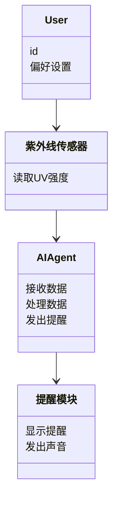
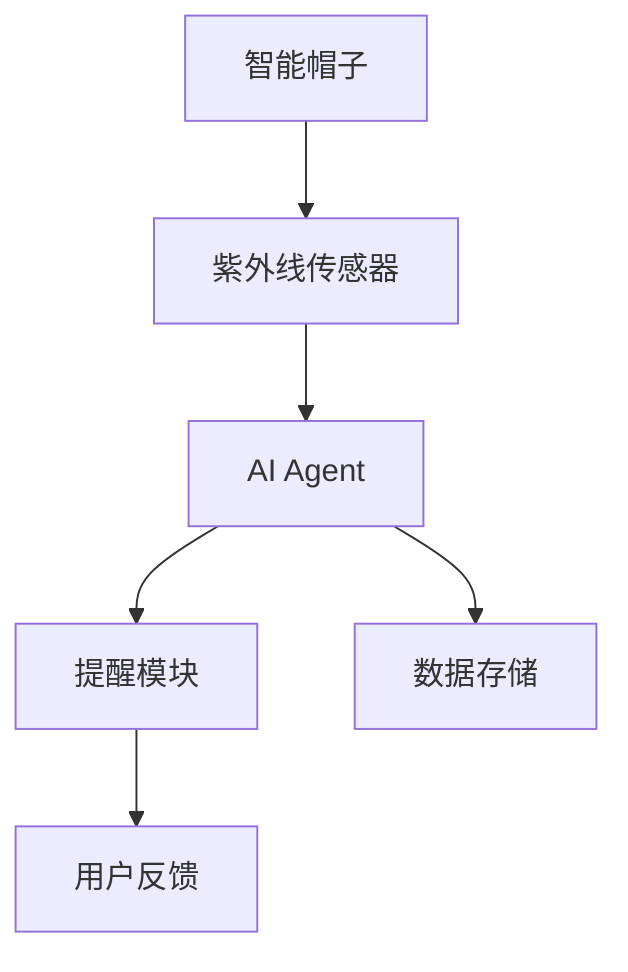
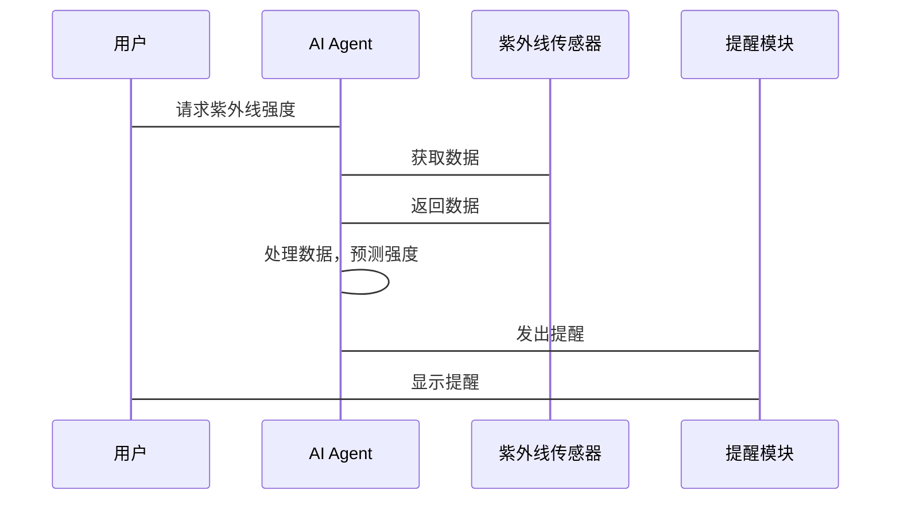

                 


# AI Agent在智能帽子中的紫外线防护提醒

> **关键词**：AI Agent, 智能帽子, 紫外线防护, 紫外线强度预测, 事件驱动机制

> **摘要**：  
本文探讨了AI Agent在智能帽子中的应用，重点分析紫外线防护提醒系统的设计与实现。通过详细讲解AI Agent的核心算法、系统架构设计以及实际案例，本文为读者提供从理论到实践的全面解析，展示了AI技术在智能硬件领域的创新应用。

---

## 第一部分：背景介绍

### 第1章：紫外线防护与智能帽子概述

#### 1.1 紫外线防护的重要性

紫外线（UV）是太阳辐射中的一部分，分为UV-A、UV-B和UV-C三种类型。其中，UV-B是导致皮肤晒伤、晒黑和皮肤癌的主要原因。随着全球气候变化和臭氧层破坏，紫外线强度逐年增加，对人类健康构成严重威胁。

**紫外线防护的传统方法**包括使用防晒霜、遮阳伞和帽子。然而，这些方法依赖于用户的主动意识和行为，存在以下局限性：  
1. **被动性**：用户需要主动涂抹防晒霜或携带遮阳工具。  
2. **不准确性**：防晒霜的防护效果受使用方法和环境因素影响，用户难以准确判断紫外线强度。  
3. **缺乏实时反馈**：传统方法无法实时监测紫外线强度并提供及时提醒。  

**智能帽子**作为一种新兴的可穿戴设备，结合了硬件和软件技术，能够实时监测环境紫外线强度，并通过AI Agent提供智能提醒。这种解决方案不仅提升了紫外线防护的效率，还为用户提供了更加便捷和精准的防护体验。

---

### 第2章：AI Agent与紫外线防护系统的核心概念

#### 2.1 AI Agent的定义与特点

**AI Agent（人工智能代理）**是指能够感知环境、自主决策并执行任务的智能实体。AI Agent的核心特点包括：  
- **自主性**：能够在没有外部干预的情况下独立运行。  
- **反应性**：能够实时感知环境变化并做出相应反应。  
- **学习能力**：通过数据学习和优化算法，不断提升任务执行的准确性。  

与传统算法相比，AI Agent的优势在于其动态适应能力和智能化决策能力。例如，当AI Agent检测到紫外线强度超过安全阈值时，能够主动触发提醒机制，帮助用户及时采取防护措施。

---

## 第二部分：核心概念与联系

### 第3章：紫外线防护提醒系统的定义与特点

#### 3.1 紫外线防护提醒系统的定义

紫外线防护提醒系统是一种基于AI技术的智能系统，通过实时监测环境紫外线强度，为用户提供个性化防护建议和提醒。该系统通常集成在可穿戴设备（如智能帽子）中，结合传感器和AI算法，实现智能化的紫外线防护管理。

#### 3.2 紫外线防护提醒系统的特点

1. **实时监测**：系统通过内置的紫外线传感器实时采集环境数据。  
2. **智能提醒**：基于AI算法预测紫外线强度，当强度超过安全阈值时，系统会主动提醒用户采取防护措施。  
3. **个性化设置**：用户可以根据个人需求设置提醒阈值和提醒方式（如震动、声音或手机通知）。  
4. **动态优化**：系统能够根据历史数据和用户行为优化提醒策略，提升用户体验。  

---

## 第三部分：算法原理讲解

### 第4章：基于机器学习的紫外线强度预测算法

#### 4.1 数据采集与特征提取

紫外线强度预测的核心是建立一个准确的数学模型。首先，我们需要从传感器中获取紫外线强度数据，并结合其他环境因素（如时间、地理位置、天气状况等）进行特征提取。

**示例数据结构**：
```markdown
| 时间（UTC） | 地点   | UV强度 | 天气状况 | 温度（℃） |
|------------|--------|--------|----------|----------|
| 10:00      | 北京   | 4.5     | 晴       | 25       |
| 11:00      | 上海   | 5.2     | 多云     | 26       |
| 12:00      | 广州   | 6.0     | 阴       | 28       |
```

#### 4.2 机器学习模型的选择与训练

常用的机器学习模型包括线性回归、支持向量机（SVM）和随机森林等。由于紫外线强度数据具有时间序列特性，我们可以采用**LSTM（长短期记忆网络）**进行预测。

**LSTM模型结构**：
```markdown
输入层 -> LSTM层 -> 全连接层 -> 输出层
```

**训练目标**：最小化预测值与真实值之间的均方误差（MSE）。  
**损失函数**：$$ \text{MSE} = \frac{1}{n}\sum_{i=1}^{n}(y_i - \hat{y}_i)^2 $$  
**优化器**：Adam优化器，学习率设为0.001。

#### 4.3 模型评估与优化

- **评估指标**：均方误差（MSE）、平均绝对误差（MAE）、R²系数。  
- **超参数调优**：通过网格搜索优化LSTM的隐藏层大小和训练轮数。  
- **模型部署**：将训练好的模型集成到智能帽子中，实时预测紫外线强度。

---

## 第四部分：系统分析与架构设计方案

### 第5章：紫外线防护提醒系统的系统架构

#### 5.1 问题场景介绍

用户在户外活动时，希望智能帽子能够实时监测紫外线强度，并在强度过高时发出提醒。系统需要具备以下功能：  
1. 实时采集紫外线数据。  
2. 紫外线强度预测与分析。  
3. 根据预测结果触发提醒。  
4. 提供个性化防护建议。  

#### 5.2 系统功能设计

**功能模块**：
- **数据采集模块**：采集紫外线强度、地理位置、时间等数据。  
- **数据处理模块**：对采集数据进行预处理和特征提取。  
- **预测模块**：基于机器学习模型预测紫外线强度。  
- **提醒模块**：当预测结果超过阈值时，触发提醒。  
- **用户交互模块**：提供个性化设置和反馈接口。  

**领域模型类图**：


#### 5.3 系统架构设计

**系统架构图**：


**交互流程图**：


---

## 第五部分：项目实战

### 第6章：智能帽子紫外线防护提醒系统实现

#### 6.1 环境安装

**Python环境**：Python 3.8+  
**依赖库**：numpy、pandas、keras、tensorflow、scikit-learn  

安装命令：
```bash
pip install numpy pandas keras tensorflow scikit-learn
```

#### 6.2 核心代码实现

**紫外线强度预测模型代码**：
```python
import numpy as np
import pandas as pd
from keras.models import Sequential
from keras.layers import LSTM, Dense

# 数据预处理
data = pd.read_csv('uv_data.csv')
features = data[['时间', '地点', '温度', '天气状况']]
labels = data['UV强度']

# 模型构建
model = Sequential()
model.add(LSTM(64, input_shape=(1, 4)))
model.add(Dense(1))
model.compile(loss='mean_squared_error', optimizer='adam')

# 训练模型
model.fit(features, labels, epochs=100, batch_size=32)
```

**AI Agent实现代码**：
```python
class AIAgent:
    def __init__(self):
        self.model = self.load_model()
    
    def load_model(self):
        # 加载训练好的模型
        return load_model('uv_prediction_model.h5')
    
    def predict_uv(self, input_data):
        # 输入数据预处理
        input = np.array(input_data).reshape(1, 1, 4)
        prediction = self.model.predict(input)[0][0]
        return prediction
    
    def trigger Reminder(self, uv_intensity):
        if uv_intensity > 3:
            # 触发提醒
            print("紫外线强度过高，请采取防护措施！")
```

#### 6.3 代码解读与分析

- **模型训练**：使用历史紫外线数据训练LSTM模型，实现紫外线强度预测。  
- **AI Agent**：通过调用训练好的模型，实时预测紫外线强度，并根据预设阈值触发提醒。  
- **提醒模块**：通过声音或震动提醒用户，提供个性化防护建议（如调整帽子角度、涂抹防晒霜等）。

#### 6.4 实际案例分析

**案例1**：用户在中午12点佩戴智能帽子，系统预测紫外线强度为5.0（高于安全阈值3.0）。AI Agent触发提醒，用户立即采取防护措施，如调整帽子角度或涂抹防晒霜。  

**案例2**：用户在阴天外出，系统预测紫外线强度为2.5（低于阈值），无需提醒。用户可以根据个人需求选择是否采取防护措施。

---

## 第六部分：最佳实践与小结

### 第7章：总结与展望

#### 7.1 最佳实践 tips

- **数据质量**：确保紫外线传感器数据的准确性和完整性。  
- **模型优化**：定期更新模型，提升预测精度。  
- **用户体验**：提供多样化的提醒方式和个性化设置，提升用户满意度。  

#### 7.2 项目小结

本文详细介绍了AI Agent在智能帽子中的应用，从紫外线防护的重要性到AI Agent的核心算法，再到系统的架构设计和实际案例分析，为读者提供了全面的技术解析。通过本文的指导，读者可以快速掌握AI Agent在智能帽子中的实现方法，并应用于实际项目中。

#### 7.3 注意事项

- 紫外线强度预测模型的准确性依赖于数据质量和模型优化。  
- 在实际应用中，需考虑硬件设备的稳定性与耐用性。  
- 遵守相关法律法规，保护用户隐私数据。

#### 7.4 拓展阅读

- 《深度学习实战》  
- 《机器学习算法与应用》  
- 《可穿戴设备与人工智能》  

---

**作者：AI天才研究院 & 禅与计算机程序设计艺术**  
**版权所有：AI Genius Institute**

