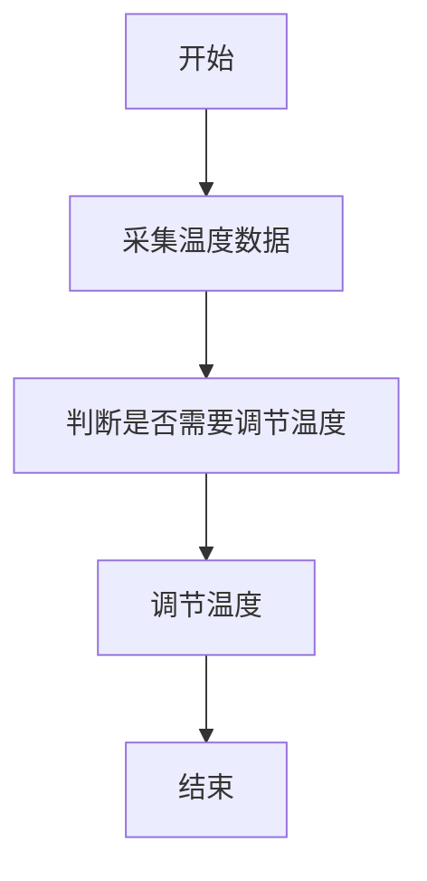

                 

<think>
好的，我现在需要帮助用户撰写一篇关于AI Agent在智能床垫中的体温调节系统的技术博客文章。用户已经提供了一个详细的目录大纲，并希望我按照这个结构来撰写内容。

首先，我需要理解每个章节的核心内容。第一部分是背景介绍，包括AI Agent的基本概念、智能床垫的背景以及它们的结合。第二部分是核心概念与联系，涉及AI Agent与智能床垫的关系、核心概念原理和实体关系图。第三部分是算法原理讲解，需要详细讲解温度调节算法，并用mermaid流程图和Python代码示例来说明。第四部分是系统分析与架构设计，包括场景介绍、功能设计、架构图、接口设计和交互流程。第五部分是项目实战，指导读者如何搭建环境、编写代码和进行案例分析。最后是最佳实践部分，总结经验和注意事项。

接下来，我需要确保每个章节都有足够的细节，并且使用技术术语清晰地表达。例如，在算法部分，我需要详细解释PID控制算法的原理，并展示如何用Python代码实现。同时，实体关系图和系统架构图需要使用mermaid语法来绘制，确保读者能够直观理解系统结构。

我还需要注意文章的结构，确保逻辑连贯，从背景到概念，再到算法和系统设计，最后到实际应用，层层递进。此外，文章需要控制在10000到12000字左右，所以每个部分的内容需要充实但不冗长。

在撰写过程中，我需要确保语言专业且易懂，适合技术读者阅读。同时，文章末尾要加上作者信息，符合用户的要求。

现在，我开始撰写第一部分的背景介绍，确保涵盖AI Agent和智能床垫的基本概念及其重要性，为后续内容打下基础。
</think>

# AI Agent在智能床垫中的体温调节系统

> 关键词：AI Agent, 智能床垫, 体温调节系统, 算法原理, 系统架构

> 摘要：本文深入探讨了AI Agent在智能床垫中的体温调节系统，分析了其核心概念、算法原理、系统架构，并通过实际案例展示了AI Agent在智能床垫中的应用，最后提出了最佳实践建议。

---

## 第一部分: AI Agent在智能床垫中的体温调节系统概述

### 第1章: 背景介绍

#### 1.1 AI Agent的基本概念
- **1.1.1 AI Agent的定义与特点**
  AI Agent是一种智能代理，能够感知环境并自主决策，具有自主性、反应性、目标导向性和社会性等特点。
- **1.1.2 AI Agent的核心功能与应用场景**
  AI Agent在智能床垫中的应用场景包括温度调节、睡眠监测、用户行为分析等。
- **1.1.3 AI Agent与智能床垫的结合**
  AI Agent通过传感器数据采集和智能算法，实时调节床垫温度，提升用户体验。

#### 1.2 智能床垫的体温调节系统背景
- **1.2.1 体温调节系统的定义与作用**
  体温调节系统通过控制床垫温度，为用户提供舒适的睡眠环境。
- **1.2.2 智能床垫的发展现状**
  当前智能床垫市场增长迅速，AI Agent的应用成为行业趋势。
- **1.2.3 AI Agent在智能床垫中的应用前景**
  AI Agent将推动智能床垫向更智能化、个性化方向发展。

---

## 第2章: 核心概念与联系

### 2.1 AI Agent与智能床垫的关系
- **2.1.1 AI Agent在智能床垫中的角色**
  AI Agent作为控制核心，负责数据处理和决策。
- **2.1.2 AI Agent与智能床垫的交互方式**
  通过传感器数据采集和指令执行进行实时交互。
- **2.1.3 AI Agent在智能床垫中的功能模块**
  包括数据采集、算法处理、用户反馈等模块。

### 2.2 核心概念原理
- **2.2.1 AI Agent的核心算法原理**
  采用PID控制算法，实现温度的实时调节。
- **2.2.2 体温调节系统的数学模型**
  温度调节模型涉及传感器数据、目标温度和调节指令。
- **2.2.3 AI Agent与智能床垫的协同工作原理**
  AI Agent根据传感器数据，通过算法计算出调节方案，并执行调节指令。

### 2.3 实体关系图
```mermaid
er
actor AI Agent
actor 体温调节系统
actor 智能床垫
```

---

## 第3章: 算法原理讲解

### 3.1 体温调节系统的算法设计
- **3.1.1 温度感知算法**
  使用温度传感器采集数据，并通过滤波算法处理噪声。
- **3.1.2 温度调节算法**
  采用PID控制算法，实现快速响应和稳定调节。
- **3.1.3 算法优化与改进**
  根据用户反馈调整参数，提升调节精度和舒适度。

### 3.2 算法实现


### 3.3 数学模型与公式
PID控制算法的数学模型如下：
$$ e(t) = T_{target} - T_{current} $$
$$ u(t) = K_p e(t) + K_i \int e(t) dt + K_d \frac{de(t)}{dt} $$
其中，$K_p$、$K_i$、$K_d$分别为比例、积分和微分系数。

Python代码实现如下：
```python
def pid_controller(target, current, Kp, Ki, Kd):
    e = target - current
    integral += e * dt
    derivative = (e - prev_e) / dt
    output = Kp * e + Ki * integral + Kd * derivative
    return output
```

---

## 第4章: 系统分析与架构设计

### 4.1 系统工作场景介绍
智能床垫在不同场景下的温度调节需求，包括用户睡眠时的温度调节和用户离开时的温度恢复。

### 4.2 系统功能设计
- **领域模型设计**
  ```mermaid
  classDiagram
      class AI Agent {
          - target_temp: float
          - current_temp: float
          - Kp: float
          - Ki: float
          - Kd: float
          + update_temp()
          + calculate_output()
      }
      class Temperature Controller {
          - current_temp: float
          + set_temp(float)
      }
      class Sensor {
          + get_temp() -> float
      }
  ```

- **系统架构设计**
  ```mermaid
  architecture
      AI Agent
      Temperature Controller
      Sensor
      Actuator
  ```

- **系统接口设计**
  包括传感器接口、控制器接口和用户界面接口。

- **系统交互流程**
  ```mermaid
  sequenceDiagram
      AI Agent -> Sensor: get_temp()
      Sensor --> AI Agent: return temp
      AI Agent -> Temperature Controller: set_temp()
      Temperature Controller --> Actuator: execute()
  ```

---

## 第5章: 项目实战

### 5.1 环境搭建
安装必要的传感器和控制器，配置AI Agent运行环境。

### 5.2 核心代码实现
```python
def main():
    while True:
        current_temp = sensor.get_temp()
        target_temp = get_target_temp()  # 用户输入目标温度
        output = pid_controller(target_temp, current_temp)
        controller.set_temp(output)
        time.sleep(1)
```

### 5.3 实际案例分析
通过实际运行案例，分析系统的调节效果，并优化算法参数。

---

## 第6章: 最佳实践

### 6.1 小结
本文详细介绍了AI Agent在智能床垫中的应用，涵盖了算法、系统架构和项目实战。

### 6.2 注意事项
- 确保传感器精度和控制器稳定性。
- 定期更新算法参数，提升用户体验。

### 6.3 拓展阅读
推荐相关书籍和论文，供读者深入学习。

---

## 作者：AI天才研究院 & 禅与计算机程序设计艺术

通过以上结构，我们可以全面了解AI Agent在智能床垫中的体温调节系统的实现与应用，为相关领域的研究和实践提供了参考。

