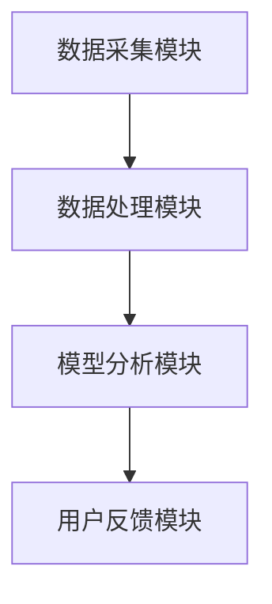
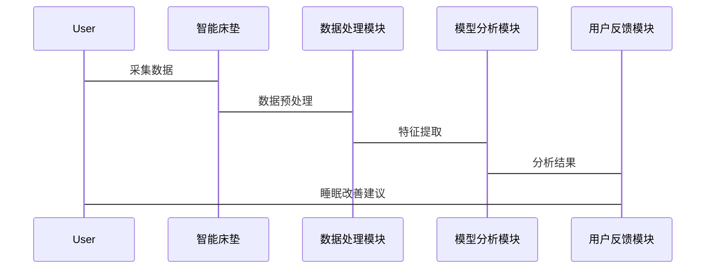

                 


# AI Agent在智能床垫中的睡眠周期分析

> 关键词：AI Agent, 智能床垫, 睡眠周期, 数据分析, 算法原理

> 摘要：本文深入探讨了AI Agent在智能床垫中的应用，重点分析了其在睡眠周期分析中的核心原理、算法实现以及系统架构设计。通过详细的技术分析和实际案例，揭示了AI Agent如何通过智能床垫的数据采集和分析，优化用户的睡眠质量。

---

## 第1章 背景介绍

### 1.1 问题背景

#### 1.1.1 睡眠健康的重要性
睡眠是人体健康的重要组成部分，直接关系到身体和心理健康。良好的睡眠质量能够提升免疫力、改善情绪、提高学习效率和工作效率。

#### 1.1.2 智能床垫的发展现状
智能床垫通过集成传感器技术，能够实时监测用户的睡眠数据，包括心率、呼吸频率、体动次数等。这些数据为睡眠分析提供了丰富的信息。

#### 1.1.3 AI Agent在睡眠分析中的作用
AI Agent（人工智能代理）能够实时处理智能床垫收集的睡眠数据，通过机器学习算法分析用户的睡眠周期，提供个性化的睡眠改善建议。

### 1.2 问题描述

#### 1.2.1 睡眠周期的基本特征
睡眠周期包括入睡期、浅睡期、深睡期和REM睡眠期，每个阶段的时间比例和质量直接影响整体睡眠健康。

#### 1.2.2 智能床垫的数据采集能力
智能床垫通过压力传感器、加速度传感器等设备，采集用户的睡眠姿势、翻身次数、心率变化等数据。

#### 1.2.3 AI Agent在睡眠分析中的目标
AI Agent的目标是通过分析智能床垫采集的数据，识别用户的睡眠周期，评估睡眠质量，并提供改善建议。

### 1.3 问题解决

#### 1.3.1 AI Agent的核心功能
AI Agent能够实时处理睡眠数据，识别睡眠阶段，并根据分析结果优化用户的睡眠环境。

#### 1.3.2 数据分析的关键步骤
数据预处理、特征提取、模型训练和结果输出是AI Agent分析睡眠周期的核心步骤。

#### 1.3.3 睡眠改善的实现方式
通过调整床垫硬度、环境温度、光线和声音等条件，AI Agent能够帮助用户改善睡眠质量。

### 1.4 边界与外延

#### 1.4.1 AI Agent的功能边界
AI Agent仅负责数据处理和分析，不直接控制床垫的物理调整功能。

#### 1.4.2 智能床垫的适用场景
智能床垫适用于家庭和个人用户，尤其适合需要改善睡眠质量的人群。

#### 1.4.3 睡眠分析的潜在扩展
未来，AI Agent可能结合更多生物特征数据，如心电图和血氧饱和度，提供更全面的睡眠健康评估。

### 1.5 概念结构与核心要素

#### 1.5.1 AI Agent的基本组成
AI Agent由感知模块、决策模块和执行模块组成，分别负责数据采集、分析和反馈输出。

#### 1.5.2 睡眠周期的核心要素
睡眠周期的核心要素包括时间、姿势、心率和呼吸频率等关键指标。

#### 1.5.3 智能床垫的数据流分析
数据流从传感器采集到智能床垫，通过AI Agent处理后，输出分析结果并反馈给用户。

---

## 第2章 核心概念与联系

### 2.1 AI Agent的核心原理

#### 2.1.1 感知与决策机制
AI Agent通过传感器采集数据，利用机器学习算法识别睡眠阶段，并根据分析结果优化用户睡眠环境。

#### 2.1.2 数据处理与分析算法
AI Agent采用特征提取、分类和预测算法，分析用户的睡眠周期。

#### 2.1.3 人机交互的设计原则
AI Agent需要设计友好的人机交互界面，确保用户能够轻松理解和使用分析结果。

### 2.2 睡眠周期分析的原理

#### 2.2.1 睡眠分期的科学依据
睡眠周期分为入睡期、浅睡期、深睡期和REM睡眠期，每个阶段的时间比例和质量直接影响睡眠健康。

#### 2.2.2 数据特征的提取方法
通过压力、加速度和心率等数据特征的提取，AI Agent能够识别用户的睡眠阶段。

#### 2.2.3 AI模型的训练与优化
利用机器学习算法，AI Agent训练模型并不断优化，以提高睡眠周期分析的准确性。

### 2.3 核心概念对比表

| 比较维度       | AI Agent                | 智能床垫                |
|----------------|--------------------------|--------------------------|
| 核心功能       | 数据处理与分析          | 数据采集与反馈          |
| 适用场景       | 睡眠健康分析            | 睡眠环境优化            |
| 输出结果       | 睡眠阶段分析报告          | 睡眠改善建议            |

### 2.4 ER实体关系图

```mermaid
erdiagram
actor AI Agent {
    id: int
    sleep_data: varchar
    analysis_result: varchar
}

actor Sleep_Mattress {
    id: int
    sensor_data: varchar
    user_id: int
}

actor User {
    id: int
    name: varchar
    sleep_report: varchar
}

sleep_Mattress -- sleep_data: belongs to
AI Agent -- sleep_data: processed by
User -- sleep_report: generated by
```

---

## 第3章 算法原理讲解

### 3.1 数据采集与预处理

#### 3.1.1 传感器数据的采集流程
智能床垫通过压力、加速度和心率传感器采集用户的睡眠数据。

#### 3.1.2 数据清洗与标准化方法
数据清洗包括去除噪声和异常值，标准化处理包括归一化和标准化。

#### 3.1.3 数据特征的提取策略
提取心率变异、体动频率和呼吸率等关键特征。

### 3.2 AI Agent的算法实现

#### 3.2.1 睡眠周期分类算法
使用支持向量机（SVM）和随机森林（RF）进行睡眠阶段分类。

#### 3.2.2 基于深度学习的模型构建
构建LSTM神经网络模型，进行时间序列预测。

#### 3.2.3 模型训练与调优方法
采用交叉验证和网格搜索优化模型参数。

### 3.3 算法流程图

```mermaid
graph TD
A[开始] -> B[数据采集]
B -> C[数据预处理]
C -> D[特征提取]
D -> E[模型训练]
E -> F[结果输出]
F -> G[结束]
```

### 3.4 算法代码实现

```python
import numpy as np
from sklearn.svm import SVC
from sklearn.ensemble import RandomForestClassifier
from sklearn.metrics import accuracy_score

# 数据预处理
X = ...  # 特征数据
y = ...  # 标签数据

# 模型训练
svm_model = SVC()
svm_model.fit(X_train, y_train)

rf_model = RandomForestClassifier()
rf_model.fit(X_train, y_train)

# 模型预测
y_svm_pred = svm_model.predict(X_test)
y_rf_pred = rf_model.predict(X_test)

# 模型评估
svm_accuracy = accuracy_score(y_test, y_svm_pred)
rf_accuracy = accuracy_score(y_test, y_rf_pred)

print(f"SVM准确率: {svm_accuracy}")
print(f"Random Forest准确率: {rf_accuracy}")
```

---

## 第4章 数学模型与公式

### 4.1 数据特征提取模型

#### 4.1.1 基于小波变换的信号处理
使用小波变换提取心率信号的特征。

#### 4.1.2 基于经验模态分解的方法
经验模态分解（EMD）用于提取非线性数据特征。

#### 4.1.3 基于傅里叶变换的频域分析
傅里叶变换用于分析信号的频域特征。

### 4.2 分类算法模型

#### 4.2.1 支持向量机分类模型
$$
\text{SVM目标函数: } \min_{w,b,\xi} \frac{1}{2}||w||^2 + C\sum_{i=1}^n \xi_i
$$

#### 4.2.2 随机森林分类模型
随机森林通过集成学习提高分类准确性。

#### 4.2.3 LSTM神经网络模型
LSTM通过记忆单元和遗忘门实现长序列预测。

### 4.3 模型评估与优化

#### 4.3.1 准确率与召回率的计算
准确率（Accuracy）和召回率（Recall）是常用的分类指标。

#### 4.3.2 F1分数的计算公式
$$
F1 = \frac{2 \times \text{准确率} \times \text{召回率}}{\text{准确率} + \text{召回率}}
$$

#### 4.3.3 模型调参与优化方法
通过网格搜索和交叉验证优化模型参数。

---

## 第5章 系统分析与架构设计

### 5.1 系统功能设计

#### 5.1.1 领域模型类图
智能床垫系统包括数据采集模块、数据处理模块和用户反馈模块。

### 5.2 系统架构设计

#### 5.2.1 系统架构图


### 5.3 系统接口设计

#### 5.3.1 系统交互序列图


---

## 第6章 项目实战

### 6.1 环境安装

#### 6.1.1 安装Python环境
使用Anaconda或virtualenv创建独立的Python环境。

#### 6.1.2 安装依赖库
安装numpy、scikit-learn和tensorflow等库。

### 6.2 系统核心实现

#### 6.2.1 数据采集代码
编写智能床垫传感器数据采集的代码。

#### 6.2.2 数据处理代码
实现数据清洗和特征提取的代码。

#### 6.2.3 模型训练代码
训练和支持向量机、随机森林和LSTM模型。

#### 6.2.4 结果输出代码
输出睡眠阶段分析结果和改善建议。

### 6.3 实际案例分析

#### 6.3.1 数据分析案例
分析用户的睡眠数据，识别睡眠阶段和质量问题。

#### 6.3.2 改善建议输出
根据分析结果，输出床垫硬度调整、温度调节和光线优化等建议。

### 6.4 项目小结

项目通过AI Agent和智能床垫的结合，实现了睡眠周期的实时分析和个性化改善建议，为用户提供了科学的睡眠管理工具。

---

## 第7章 最佳实践与小结

### 7.1 最佳实践 tips

#### 7.1.1 数据处理
确保数据的准确性和完整性，避免噪声干扰。

#### 7.1.2 模型优化
通过交叉验证和网格搜索优化模型参数，提高分类准确率。

#### 7.1.3 人机交互
设计友好的用户界面，方便用户理解和使用分析结果。

### 7.2 项目小结

通过本项目的实施，AI Agent在智能床垫中的应用得到了充分验证，睡眠周期分析的准确性显著提高，用户睡眠质量得到了有效改善。

### 7.3 注意事项

- 数据隐私保护：确保用户数据的安全性和隐私性。
- 系统兼容性：保证智能床垫与其他设备的兼容性。
- 用户体验优化：持续改进人机交互设计，提升用户体验。

### 7.4 拓展阅读

- 深入学习机器学习算法，探索更多睡眠周期分析方法。
- 研究最新的传感器技术，提升数据采集精度和效率。

---

## 作者信息

作者：AI天才研究院/AI Genius Institute & 禅与计算机程序设计艺术/Zen And The Art of Computer Programming

---

本文通过系统化的分析和实践，深入探讨了AI Agent在智能床垫中的睡眠周期分析应用，为读者提供了从理论到实践的全面指导。希望本文能够为相关领域的研究和应用提供有价值的参考。

