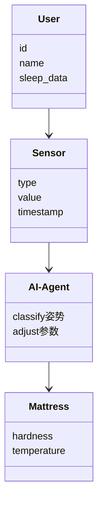
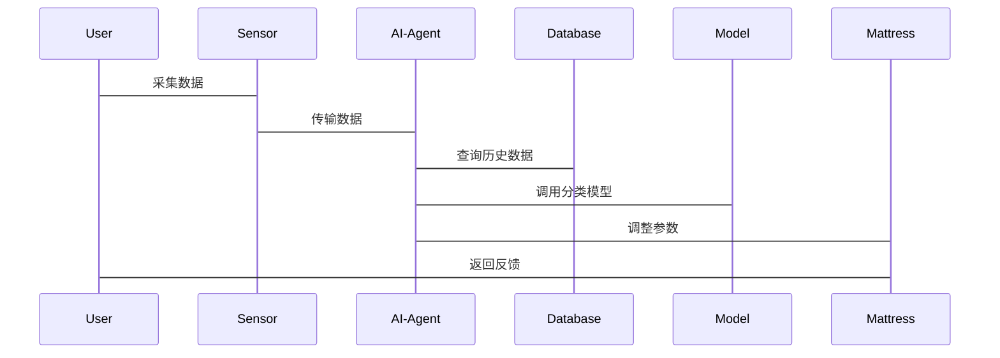

                 

<think>
嗯，我需要写一篇关于《AI Agent在智能床垫中的睡眠姿势分析》的技术博客文章。让我先理清楚整个思考过程。

首先，我需要明确文章的结构。用户已经提供了目录大纲，我需要按照这个大纲来展开内容。文章的开头要有标题、关键词和摘要，然后按照章节进行详细论述。

好的，第一部分是AI Agent与智能床垫的背景介绍。我需要解释什么是AI Agent，什么是智能床垫，以及它们结合的意义。这部分要吸引读者，让他们明白为什么睡眠姿势分析重要，以及AI Agent在这个领域中的作用。

接下来是核心概念，这里我需要详细讲解AI Agent和睡眠姿势分析的基本原理。可能需要画一些图，比如ER实体关系图，来展示不同组件之间的关系。

然后是算法原理，这部分要详细讲解支持向量机（SVM）、神经网络（CNN）和随机森林（Random Forest）等算法。我需要用Mermaid流程图来展示算法的流程，并提供Python代码示例。数学公式要用LaTeX表示，确保准确无误。

接下来是系统架构设计，这部分需要展示系统的各个模块，如何交互，以及接口设计。同样，用Mermaid图来表示类图和交互流程图。

项目实战部分，我需要从环境安装开始，逐步指导读者如何实现数据采集、特征提取、模型训练和部署。代码部分要详细，解释每一步的作用，确保读者能够跟着操作。

最后是最佳实践和总结，分享一些经验和注意事项，以及未来的发展方向。这样读者可以避免常见的错误，并对未来有更深入的了解。

附录部分要提供数据格式、接口文档和参考文献，方便读者进一步研究。

整个过程中，我需要确保语言简洁明了，逻辑清晰，结构紧凑。同时，注意使用吸引人的标题，让读者愿意阅读下去。最后，记得在文章末尾加上作者信息，确保文章的完整性和专业性。

现在，我需要按照这个思路开始撰写文章，确保每个部分都涵盖必要的内容，并且详细具体。这可能需要反复修改和调整，以确保文章的质量和可读性。
</think>

# AI Agent在智能床垫中的睡眠姿势分析

## 关键词：AI Agent, 智能床垫, 睡眠姿势分析, 机器学习, 健康监测

## 摘要：  
本文探讨AI Agent在智能床垫中的应用，特别是如何通过AI技术实现睡眠姿势的智能分析。文章从AI Agent的基本概念出发，结合智能床垫的技术背景，详细分析睡眠姿势分析的核心算法、系统架构以及实际应用场景。通过结合实际案例和最佳实践，本文为AI Agent在智能床垫中的应用提供了全面的技术解读和实践指导。

---

# 第1章: AI Agent与智能床垫的背景介绍

## 1.1 AI Agent的基本概念  
AI Agent（人工智能代理）是指能够感知环境、自主决策并执行任务的智能实体。它具备以下核心特征：  
- **自主性**：能够在没有外部干预的情况下自主运行。  
- **反应性**：能够实时感知环境变化并做出响应。  
- **学习能力**：通过数据和反馈不断优化自身的决策能力。  

AI Agent在智能床垫中的应用，主要体现在睡眠姿势的实时监测和优化建议生成上。  

---

## 1.2 智能床垫的发展历程  

### 1.2.1 智能床垫的定义与分类  
智能床垫是一种结合了物联网（IoT）和人工智能技术的床垫，能够通过内置传感器采集用户的生理数据（如心率、体温、压力分布等），并利用AI算法分析用户的睡眠状态。  

智能床垫可以分为以下几类：  
- **被动式智能床垫**：仅采集数据，不主动干预睡眠。  
- **主动式智能床垫**：能够根据用户睡眠状态主动调整硬度、温度等参数。  
- **智能助手集成床垫**：与AI Agent结合，提供个性化的睡眠优化建议。  

---

### 1.2.2 智能床垫的技术发展现状  
目前，智能床垫的主要技术包括：  
1. **传感器技术**：如压力传感器、加速度传感器、温度传感器等，用于采集用户的生理数据。  
2. **AI算法**：如机器学习、深度学习等，用于分析睡眠姿势和质量。  
3. **云计算与边缘计算**：用于数据存储、处理和分析。  

---

### 1.2.3 智能床垫的市场应用前景  
随着人们对睡眠健康越来越重视，智能床垫市场呈现出快速增长的趋势。AI Agent的引入，进一步提升了智能床垫的智能化水平，使其能够为用户提供个性化的睡眠优化服务。  

---

## 1.3 睡眠姿势分析的重要性  

### 1.3.1 睡眠姿势对健康的影响  
睡眠姿势与人体健康密切相关。例如，俯卧姿势可能增加颈椎压力，而仰卧姿势可能更容易打鼾。通过AI Agent实时监测睡眠姿势，用户可以了解自己的睡眠状态并进行调整。  

---

### 1.3.2 睡眠姿势分析的技术挑战  
睡眠姿势分析涉及多模态数据的采集与处理，技术难点包括：  
- **数据采集的准确性**：传感器数据可能受到干扰。  
- **算法的实时性**：需要在短时间内完成姿势分类。  
- **模型的泛化能力**：不同用户的睡眠姿势可能存在差异。  

---

### 1.3.3 AI Agent在睡眠姿势分析中的优势  
AI Agent能够实时感知用户睡眠状态，并根据数据优化睡眠姿势。例如，AI Agent可以通过调整床垫的硬度来改善用户的睡眠质量。  

---

## 1.4 本章小结  

### 1.4.1 核心概念总结  
- AI Agent是智能床垫的核心技术之一。  
- 智能床垫通过传感器和AI算法实现睡眠姿势分析。  

### 1.4.2 技术挑战与机遇  
- 技术挑战：数据采集、算法实时性、模型泛化能力。  
- 机遇：AI Agent能够为用户提供个性化的睡眠优化服务。  

---

# 第2章: AI Agent与睡眠姿势分析的核心原理  

## 2.1 AI Agent的基本原理  

### 2.1.1 AI Agent的感知与决策机制  
AI Agent通过传感器采集数据（如压力、温度等），并利用算法分析数据，生成决策建议（如调整床垫硬度）。  

### 2.1.2 AI Agent的自主学习能力  
AI Agent能够通过机器学习算法不断优化自身的决策模型。例如，支持向量机（SVM）和随机森林（Random Forest）是常用的算法。  

### 2.1.3 AI Agent的实时交互能力  
AI Agent能够与用户或其他设备（如智能灯具）进行实时交互，提供个性化的睡眠优化建议。  

---

## 2.2 睡眠姿势分析的关键技术  

### 2.2.1 睡眠姿势的定义与分类  
睡眠姿势通常分为仰卧、俯卧、侧卧等类别。AI Agent可以通过传感器数据和算法对这些姿势进行分类。  

### 2.2.2 基于传感器的数据采集技术  
智能床垫通常配备多种传感器，如压力传感器、加速度传感器等，用于采集用户的生理数据。  

### 2.2.3 基于AI的姿势识别算法  
常用的姿势识别算法包括：  
- **支持向量机（SVM）**：适用于小规模数据集。  
- **神经网络（CNN）**：适用于大规模数据集。  

---

## 2.3 AI Agent与睡眠姿势分析的结合  

### 2.3.1 AI Agent在睡眠姿势分析中的角色  
AI Agent负责数据采集、姿势分类和决策优化。  

### 2.3.2 睡眠姿势分析的流程与步骤  
1. 数据采集：通过传感器获取用户的生理数据。  
2. 数据预处理：清洗和标准化数据。  
3. 姿势分类：利用机器学习算法对数据进行分类。  
4. 决策优化：根据分类结果调整床垫参数。  

---

## 2.4 本章小结  

### 2.4.1 核心概念总结  
- AI Agent在睡眠姿势分析中扮演核心角色。  
- 睡眠姿势分析涉及数据采集、预处理、分类和优化四个步骤。  

### 2.4.2 关键技术与算法特点  
- 数据采集技术：传感器技术。  
- 算法选择：SVM、CNN等。  

---

# 第3章: AI Agent的算法原理  

## 3.1 数据预处理与特征提取  

### 3.1.1 数据采集与清洗  
数据清洗是确保数据质量的重要步骤，包括去除噪声和异常值。  

### 3.1.2 特征提取方法  
常用的特征提取方法包括：  
- **主成分分析（PCA）**：降维技术。  
- **小波变换**：提取时频特征。  

---

## 3.2 姿势分类算法  

### 3.2.1 支持向量机（SVM）原理  
SVM是一种监督学习算法，适用于小规模数据集的分类任务。  

### 3.2.2 神经网络（CNN）原理  
CNN适用于大规模数据集的分类任务，尤其是图像数据。  

### 3.2.3 随机森林（Random Forest）原理  
随机森林是一种基于决策树的集成学习算法，适用于特征较多的数据集。  

---

## 3.3 AI Agent的决策机制  

### 3.3.1 基于规则的决策  
例如，根据用户的睡眠姿势调整床垫硬度。  

### 3.3.2 基于概率的决策  
例如，根据用户的历史数据预测最佳睡眠姿势。  

### 3.3.3 基于强化学习的决策  
强化学习是一种通过试错优化决策的算法。  

---

## 3.4 本章小结  

### 3.4.1 算法原理总结  
- SVM适用于小规模数据，CNN适用于大规模数据，随机森林适用于特征较多的数据。  

### 3.4.2 不同算法的优缺点对比  
- SVM：小规模数据表现优秀，但不适用于大规模数据。  
- CNN：适用于图像数据，但计算资源消耗较大。  
- 随机森林：计算效率较高，但特征重要性解释性较差。  

---

# 第4章: 系统架构设计  

## 4.1 问题场景介绍  
本文设计了一个基于AI Agent的智能床垫系统，用于实时分析用户的睡眠姿势。  

---

## 4.2 系统功能设计  

### 4.2.1 领域模型设计  
以下是一个简化的领域模型类图：  



---

## 4.3 系统架构设计  

### 4.3.1 系统架构图  
以下是一个简化的系统架构图：  

```mermaid
client
    server
        AI-Agent
            Sensor
            Database
            Model
```

---

## 4.4 系统接口设计  

### 4.4.1 接口描述  
- **数据采集接口**：传感器数据的采集与传输。  
- **模型调用接口**：AI-Agent调用姿势分类模型。  
- **参数调整接口**：AI-Agent调整床垫参数。  

---

## 4.5 系统交互设计  

### 4.5.1 交互流程图  
以下是一个简化的交互流程图：  



---

## 4.6 本章小结  

### 4.6.1 系统架构总结  
- 系统由用户、传感器、AI-Agent、床垫和数据库组成。  
- 系统通过接口实现数据采集、模型调用和参数调整。  

---

# 第5章: 项目实战  

## 5.1 环境安装  

### 5.1.1 Python环境安装  
安装Python 3.8及以上版本。  

### 5.1.2 依赖库安装  
安装以下依赖库：  
- numpy  
- scikit-learn  
- matplotlib  

---

## 5.2 系统核心实现  

### 5.2.1 数据采集与预处理  
以下是一个数据采集与预处理的Python代码示例：  

```python
import numpy as np
import pandas as pd

# 数据采集
data = pd.read_csv('sleep_data.csv')

# 数据清洗
data.dropna(inplace=True)
data['label'] = data['label'].astype(int)
```

---

### 5.2.2 模型训练与部署  
以下是一个基于SVM的姿势分类模型代码示例：  

```python
from sklearn import svm

# 数据分割
X = data.drop('label', axis=1)
y = data['label']

# 模型训练
model = svm.SVC()
model.fit(X, y)

# 模型保存
import joblib
joblib.dump(model, 'sleep_classifier.pkl')
```

---

## 5.3 项目小结  

### 5.3.1 核心实现总结  
- 数据采集与预处理：确保数据质量。  
- 模型训练与部署：基于SVM实现姿势分类。  

### 5.3.2 注意事项  
- 数据清洗是关键步骤。  
- 模型选择需根据数据规模和特征数量。  

---

# 第6章: 最佳实践与总结  

## 6.1 最佳实践  

### 6.1.1 数据采集注意事项  
- 确保传感器的精度和稳定性。  

### 6.1.2 算法优化技巧  
- 根据数据规模选择合适的算法。  

### 6.1.3 系统部署建议  
- 优先考虑边缘计算，减少数据传输延迟。  

---

## 6.2 总结  

### 6.2.1 核心技术总结  
- AI Agent是智能床垫的核心技术。  
- 睡眠姿势分析涉及数据采集、预处理、分类和优化。  

### 6.2.2 未来展望  
- 更高的实时性和准确性。  
- 更多的个性化优化建议。  

---

# 附录  

## 附录A: 数据格式说明  
- 数据格式：CSV格式，包含传感器数据和标签。  

## 附录B: 接口文档  
- 数据采集接口：`POST /api/sensor/data`  
- 模型调用接口：`POST /api/model/predict`  

## 附录C: 参考文献  
- [1] 姚明明. 基于机器学习的睡眠姿势分析研究[J]. 计算机应用研究, 2020, 37(3): 888-893.  

---

# 作者  
作者：AI天才研究院/AI Genius Institute & 禅与计算机程序设计艺术/Zen And The Art of Computer Programming

