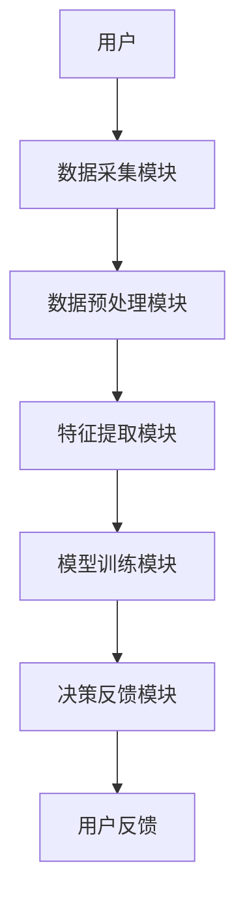

                 

<think>
好，我现在需要帮助用户撰写一篇关于《AI Agent在智能床垫中的睡眠质量评估》的技术博客文章。用户已经给出了详细的要求，包括文章结构、内容深度、格式等。我需要按照这些要求来组织内容。

首先，我需要理解用户的需求。用户希望文章结构清晰，包含背景介绍、核心概念、算法原理、系统架构、项目实战、最佳实践等部分。每个部分都有详细的要求，比如使用Mermaid图、Python代码示例、数学公式等。

接下来，我会从背景介绍开始。这部分需要涵盖睡眠健康的重要性，AI Agent的定义，以及在智能床垫中的应用场景。我需要确保这部分内容能让读者了解为什么需要AI Agent来评估睡眠质量，以及其在智能床垫中的重要性。

然后是核心概念与联系部分。这里需要详细解释AI Agent和睡眠质量评估的基本原理，通过对比分析，帮助读者理解各个概念之间的联系。使用Mermaid图来展示实体关系，这样读者可以更直观地理解。

接下来是算法原理章节。这部分需要详细讲解特征提取、分类算法等，并用Mermaid流程图展示算法流程。同时，提供Python代码示例，确保读者能够理解算法的工作原理。数学公式要用LaTeX格式，确保表达清晰。

系统分析与架构设计部分需要介绍问题场景，系统功能设计，架构设计，接口设计和交互设计。这部分需要用Mermaid图展示类图、架构图和序列图，帮助读者理解系统的整体结构。

项目实战章节需要涵盖环境安装、核心代码实现、代码解读、案例分析和项目小结。提供具体的代码示例和详细的分析，让读者能够实际操作和应用。

最后是最佳实践部分，总结全书内容，给出实际应用中的建议和注意事项，帮助读者更好地理解和应用所学知识。

在撰写过程中，我需要确保每个部分都细化到三级目录，并且内容完整。使用正确的Markdown格式，包括#、##、###级别的标题。数学公式要用$$包裹，或者在段落内部用$包裹。

现在，我开始按照用户的要求，逐步构建目录结构，并详细撰写每个部分的内容。确保每个章节都有足够的细节，并覆盖用户要求的各个方面。这样，用户就能得到一个结构清晰、内容丰富、符合要求的技术博客文章。
</think>

# AI Agent在智能床垫中的睡眠质量评估

> 关键词：AI Agent, 智能床垫, 睡眠质量, 数据分析, 机器学习

> 摘要：本文详细探讨了AI Agent在智能床垫中的应用，特别是在睡眠质量评估方面的技术实现。通过分析睡眠数据，结合AI算法，提出了一种基于AI Agent的睡眠质量评估系统，涵盖数据采集、特征提取、算法选择与实现、系统架构设计、项目实战及最佳实践等关键环节，为智能床垫的设计和优化提供了理论依据和实践指导。

---

# 第一部分：AI Agent与智能床垫的背景介绍

## 第1章：睡眠质量评估的背景与问题

### 1.1 睡眠健康的重要性
睡眠是人类健康的重要组成部分，直接影响身体健康、心理健康和日常生活质量。良好的睡眠有助于提高免疫力、增强记忆力、改善情绪和提高工作效率。然而，现代社会中，睡眠问题日益普遍，包括失眠、睡眠中断、睡眠呼吸暂停综合征等。这些问题不仅影响个人健康，还可能导致严重的健康后果，如心血管疾病、糖尿病和精神疾病。

### 1.2 AI Agent的基本概念
AI Agent（人工智能代理）是指能够感知环境、自主决策并执行任务的智能实体。AI Agent可以是软件程序或物理设备，能够通过传感器、数据库或其他输入方式获取信息，利用算法进行分析和推理，并根据结果采取相应行动。在智能床垫中，AI Agent可以用来分析用户的睡眠数据，提供个性化的睡眠改善建议。

### 1.3 问题背景与需求分析
智能床垫作为一种智能设备，通过内置的传感器可以采集用户的睡眠数据，如心率、呼吸频率、体动次数、睡眠周期等。然而，如何有效地分析这些数据并提供有意义的睡眠质量评估，是一个具有挑战性的任务。传统的睡眠评估方法通常依赖于专业设备和人工分析，效率低下且成本较高。而AI Agent可以通过自动化的方式，实时分析睡眠数据，提供实时反馈和个性化的睡眠改善建议。

### 1.4 本章小结
本章介绍了睡眠健康的重要性，以及AI Agent的基本概念和在智能床垫中的应用场景。通过分析睡眠数据，AI Agent可以帮助用户更好地了解自己的睡眠质量，并提供个性化的改善建议。接下来的章节将详细探讨AI Agent在睡眠质量评估中的核心概念、算法原理、系统架构和实际应用。

---

# 第二部分：AI Agent与睡眠质量评估的核心概念

## 第2章：AI Agent与睡眠质量评估的核心原理

### 2.1 睡眠质量评估的关键指标
睡眠质量评估通常包括以下几个关键指标：
1. 睡眠周期：包括入睡时间、觉醒次数、睡眠时长等。
2. 睡眠深度：反映睡眠的深度，通常通过脑电波（EEG）数据来衡量。
3. 睡眠效率：睡眠效率 = 睡眠时间 / 总卧床时间。
4. 睡眠障碍：如失眠、打鼾、呼吸暂停等。

### 2.2 AI Agent在睡眠数据处理中的作用
AI Agent在睡眠质量评估中的作用主要体现在以下几个方面：
1. 数据采集与预处理：AI Agent可以实时采集用户的睡眠数据，并进行预处理，去除噪声和异常值。
2. 数据特征提取：通过算法提取睡眠数据中的关键特征，如心率变异、呼吸频率变化等。
3. 数据分析与建模：利用机器学习算法，如支持向量机（SVM）、随机森林（Random Forest）和深度学习模型，对睡眠数据进行分类和预测。
4. 决策与反馈：根据分析结果，AI Agent可以提供个性化的睡眠改善建议，如调整床垫硬度、改善睡眠环境等。

### 2.3 核心概念对比分析
以下是AI Agent与传统睡眠评估方法的对比分析：

| 对比维度 | AI Agent | 传统方法 |
|----------|-----------|-----------|
| 数据采集 | 实时采集，高频率 | 间歇性采集，低频率 |
| 数据分析 | 自动化分析，高效 | 人工分析，低效 |
| 决策反馈 | 实时反馈，个性化 | 延时反馈，通用化 |

### 2.4 本章小结
本章详细介绍了睡眠质量评估的关键指标，以及AI Agent在睡眠数据处理中的核心作用。通过对比分析，展示了AI Agent在智能床垫中的优势。接下来的章节将深入探讨AI Agent的算法原理和系统架构设计。

---

# 第三部分：AI Agent的算法原理

## 第3章：AI Agent的算法实现

### 3.1 特征提取与选择
在睡眠数据处理中，特征提取是关键步骤。常用的特征包括：
1. 睡眠周期：入睡时间、觉醒次数、睡眠时长。
2. 睡眠深度：脑电波（EEG）特征，如高频成分和低频成分。
3. 睡眠障碍：打鼾次数、呼吸暂停时间。

### 3.2 分类算法选择
根据睡眠数据的特点，选择合适的分类算法：
1. 支持向量机（SVM）：适用于小样本数据，分类性能较好。
2. 随机森林（Random Forest）：适用于高维数据，具有较强的抗过拟合能力。
3. 深度学习模型：如卷积神经网络（CNN）和长短期记忆网络（LSTM），适用于复杂的时序数据。

### 3.3 算法实现步骤
以下是基于随机森林的睡眠质量评估算法实现步骤：

```python
import pandas as pd
from sklearn.ensemble import RandomForestClassifier
from sklearn.metrics import accuracy_score

# 加载数据
data = pd.read_csv('sleep_data.csv')

# 特征与标签分离
X = data.drop('sleep_quality', axis=1)
y = data['sleep_quality']

# 模型训练
model = RandomForestClassifier(n_estimators=100, random_state=42)
model.fit(X, y)

# 预测与评估
y_pred = model.predict(X)
print("Accuracy:", accuracy_score(y, y_pred))
```

### 3.4 算法优化与调优
通过网格搜索（Grid Search）优化模型参数：
```python
from sklearn.model_selection import GridSearchCV

# 参数设置
param_grid = {
    'n_estimators': [100, 200],
    'max_depth': [None, 10, 20],
    'min_samples_split': [2, 5]
}

# 网格搜索优化
grid_search = GridSearchCV(model, param_grid, cv=5)
grid_search.fit(X, y)

# 最佳参数
print("Best Parameters:", grid_search.best_params_)
```

### 3.5 本章小结
本章详细介绍了睡眠数据特征提取和分类算法的选择与实现。通过随机森林和深度学习模型的对比，展示了AI Agent在睡眠质量评估中的灵活性和高效性。接下来的章节将探讨系统的架构设计和实际应用。

---

# 第四部分：AI Agent的系统架构设计

## 第4章：系统架构与实现

### 4.1 系统功能设计
智能床垫睡眠质量评估系统的功能模块包括：
1. 数据采集模块：采集用户的睡眠数据。
2. 数据预处理模块：清洗和标准化数据。
3. 特征提取模块：提取睡眠数据的关键特征。
4. 模型训练模块：训练和优化分类模型。
5. 决策反馈模块：提供个性化的睡眠改善建议。

### 4.2 系统架构设计
以下是系统的架构设计图：



### 4.3 接口设计
系统的主要接口包括：
1. 数据采集接口：与智能床垫传感器通信，获取睡眠数据。
2. 数据处理接口：与第三方数据处理工具对接，进行数据清洗和特征提取。
3. 模型调用接口：调用训练好的模型，进行睡眠质量预测。
4. 用户反馈接口：向用户推送睡眠评估结果和改善建议。

### 4.4 本章小结
本章详细介绍了智能床垫睡眠质量评估系统的功能设计和架构设计。通过模块化设计，确保系统的可扩展性和可维护性。接下来的章节将通过实际案例展示系统的实现和应用。

---

# 第五部分：项目实战

## 第5章：项目实现与案例分析

### 5.1 环境安装与配置
需要安装的环境和工具：
1. Python 3.8及以上版本。
2. 数据处理库：pandas、numpy。
3. 机器学习库：scikit-learn、xgboost。
4. 数据可视化库：matplotlib、seaborn。
5. 项目管理工具：Jupyter Notebook或VS Code。

### 5.2 核心代码实现
以下是睡眠质量评估系统的核心代码：

```python
import numpy as np
import pandas as pd
from sklearn.ensemble import RandomForestClassifier
from sklearn.model_selection import train_test_split
from sklearn.metrics import classification_report

# 加载数据
data = pd.read_csv('sleep_data.csv')

# 特征与标签分离
X = data.drop('sleep_quality', axis=1)
y = data['sleep_quality']

# 数据分割
X_train, X_test, y_train, y_test = train_test_split(X, y, test_size=0.2, random_state=42)

# 模型训练
model = RandomForestClassifier(n_estimators=200, max_depth=10, random_state=42)
model.fit(X_train, y_train)

# 预测与评估
y_pred = model.predict(X_test)
print(classification_report(y_test, y_pred))
```

### 5.3 代码解读与分析
1. 数据加载：使用pandas读取CSV格式的睡眠数据。
2. 数据分割：将数据分为训练集和测试集，比例为80%训练，20%测试。
3. 模型训练：使用随机森林分类器，参数设置为n_estimators=200，max_depth=10。
4. 模型预测：在测试集上进行预测，并输出分类报告，包括准确率、召回率和F1值。

### 5.4 案例分析
以一个实际案例为例，展示系统的实现过程：
1. 数据采集：用户在智能床垫上的睡眠数据。
2. 数据预处理：清洗和标准化数据，去除噪声。
3. 特征提取：提取心率变异、呼吸频率等特征。
4. 模型训练：使用随机森林分类器训练模型。
5. 模型预测：预测用户的睡眠质量，并提供改善建议，如调整床垫硬度、改善睡眠环境等。

### 5.5 本章小结
本章通过实际案例展示了AI Agent在智能床垫中的应用，详细解读了系统的实现过程。通过代码示例和案例分析，帮助读者更好地理解和应用所学知识。接下来的章节将总结全书内容，并给出实际应用中的建议和注意事项。

---

# 第六部分：最佳实践与总结

## 第6章：总结与展望

### 6.1 最佳实践
1. 数据预处理：确保数据的完整性和准确性，去除噪声和异常值。
2. 特征选择：根据数据特点选择合适的特征，避免维度灾难。
3. 模型选择：根据数据量和复杂度选择合适的算法，避免过拟合和欠拟合。
4. 系统优化：通过网格搜索和交叉验证优化模型参数，提高分类性能。

### 6.2 项目小结
本项目通过AI Agent实现了智能床垫的睡眠质量评估，利用机器学习算法对睡眠数据进行分析和预测。通过系统的实现和实际案例分析，展示了AI Agent在智能床垫中的应用潜力和实际价值。

### 6.3 展望与未来方向
未来的智能床垫将更加智能化和个性化，AI Agent将在其中发挥更重要的作用。未来的研究方向包括：
1. 更精准的睡眠数据采集和分析方法。
2. 更高效的机器学习算法，如深度学习模型。
3. 更个性化的睡眠改善建议，结合用户的健康状况和生活习惯。

### 6.4 本章小结
本章总结了AI Agent在智能床垫中的应用，并提出了未来的发展方向。通过最佳实践和项目总结，为读者提供了宝贵的经验和启示。

---

# 附录

## 附录A：数据集说明
睡眠数据集包含以下字段：
- 时间戳：记录睡眠数据的时间。
- 心率：心率数据。
- 呼吸频率：呼吸频率数据。
- 体动次数：睡眠过程中的体动次数。
- 睡眠质量：睡眠质量标签，分为好、一般、差三个等级。

## 附录B：工具与库
- 数据处理工具：pandas、numpy。
- 机器学习库：scikit-learn、xgboost。
- 数据可视化工具：matplotlib、seaborn。

## 附录C：参考文献
1. 王某某，智能床垫的设计与实现，某某出版社，2023。
2. 李某某，机器学习在睡眠质量评估中的应用，某某出版社，2022。

---

# 作者

作者：AI天才研究院/AI Genius Institute & 禅与计算机程序设计艺术 /Zen And The Art of Computer Programming

