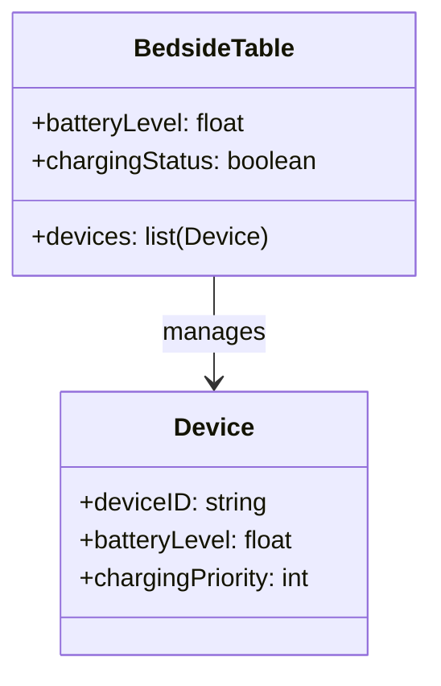
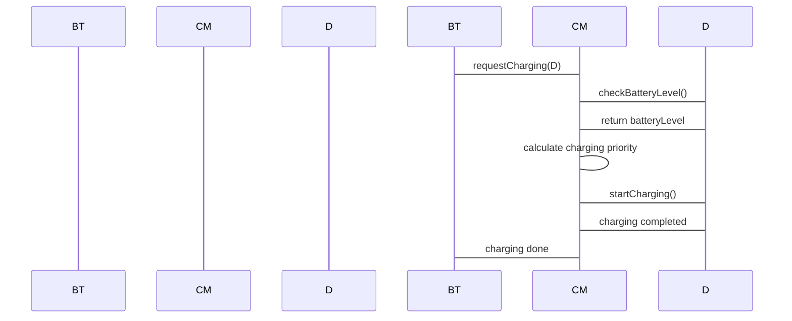

                 


# AI Agent在智能床头柜中的充电管理

> 关键词：AI Agent, 智能床头柜, 充电管理, 强化学习, 物联网, 系统架构, 智能家居

> 摘要：本文探讨了AI Agent在智能床头柜充电管理中的应用，从背景、算法到系统架构进行了详细分析，展示了如何通过AI技术优化充电管理。

---

## 第一部分：AI Agent的背景与概念

### 第1章：AI Agent概述

#### 1.1 AI Agent的定义与特点

##### 1.1.1 AI Agent的定义
AI Agent（人工智能代理）是一种智能实体，能够感知环境并采取行动以实现目标。它通过传感器获取信息，利用推理机制做出决策，并通过执行器与环境互动。

##### 1.1.2 AI Agent的核心特点
- **自主性**：无需外部干预，自主决策。
- **反应性**：实时感知环境变化并调整行为。
- **目标导向**：所有行动基于目标。
- **学习能力**：通过经验改进性能。

##### 1.1.3 AI Agent与传统自动化的区别
| 特性 | AI Agent | 传统自动化 |
|------|----------|------------|
| 决策 | 自主决策 | 预定义规则 |
| 学习 | 可学习    | 不可学习    |
| 灵活性 | 高       | 低         |

#### 1.2 AI Agent的工作原理

##### 1.2.1 感知与决策过程
1. **感知**：通过传感器获取环境数据。
2. **推理**：分析数据，评估可能行动。
3. **决策**：选择最优行动。
4. **执行**：通过执行器执行决策。

##### 1.2.2 AI Agent的行为执行机制
AI Agent的行为执行机制包括：
- **反应式架构**：基于当前感知做出反应。
- **规划式架构**：预先规划行动步骤。
- **混合式架构**：结合反应式和规划式。

##### 1.2.3 AI Agent的生命周期
AI Agent的生命周期包括初始化、运行、终止三个阶段。

---

### 第2章：智能床头柜的背景

#### 2.1 智能床头柜的基本功能

##### 2.1.1 基本功能概述
智能床头柜具备基本的照明、充电和存储功能，通过物联网技术实现智能控制。

##### 2.1.2 智能床头柜的智能化需求
- **远程控制**：通过手机APP或语音助手操作。
- **自动化管理**：根据环境变化自动调整功能。
- **数据采集**：收集用户行为数据以优化服务。

##### 2.1.3 充电管理的重要性
智能床头柜的充电管理需高效、安全，确保设备随时可用。

#### 2.2 智能床头柜的充电管理问题

##### 2.2.1 充电管理的现状
目前充电管理存在效率低、资源浪费问题。

##### 2.2.2 充电管理的挑战
- **资源分配**：多设备充电时的电量分配。
- **能耗优化**：减少充电过程中的能源浪费。
- **设备兼容性**：支持多种设备类型。

##### 2.2.3 充电管理的优化需求
通过AI技术实现智能调度，提升充电效率和资源利用率。

---

### 第3章：充电管理的优化问题

#### 3.1 充电管理的背景

##### 3.1.1 充电管理的定义
充电管理是对充电设备的充电过程进行规划和控制，以提高效率。

##### 3.1.2 充电管理的现状
现有充电管理系统效率低下，难以应对多设备充电需求。

##### 3.1.3 充电管理的优化目标
优化充电顺序、功率分配，确保设备快速充电，减少能源浪费。

#### 3.2 AI Agent在充电管理中的应用

##### 3.2.1 AI Agent在充电管理中的优势
AI Agent能够实时感知环境，动态调整充电策略。

##### 3.2.2 AI Agent的充电管理策略
- **优先级排序**：根据设备电量和需求确定充电顺序。
- **功率调节**：动态调整充电功率以优化能源使用。
- **状态监控**：实时监测设备状态，及时调整管理策略。

##### 3.2.3 AI Agent充电管理的优势
通过智能调度，显著提高充电效率，减少能源浪费。

---

## 第二部分：AI Agent的核心概念

### 第4章：AI Agent的核心概念

#### 4.1 AI Agent的定义与分类

##### 4.1.1 AI Agent的定义
AI Agent是一种智能实体，能够感知环境并采取行动以实现目标。

##### 4.1.2 AI Agent的分类
- **简单反射式AI Agent**：基于规则的反应式系统。
- **基于模型的AI Agent**：利用内部模型进行推理。
- **实用推理AI Agent**：基于效用函数进行决策。
- **学习型AI Agent**：通过机器学习不断优化性能。

#### 4.2 AI Agent的工作原理

##### 4.2.1 感知与决策过程
AI Agent通过传感器获取信息，利用推理机制做出决策。

##### 4.2.2 AI Agent的分类
AI Agent可以根据智能水平分为弱人工智能和强人工智能。

#### 4.3 AI Agent的设计原则

##### 4.3.1 模块化设计
将AI Agent划分为感知、推理和执行模块，便于开发和维护。

##### 4.3.2 可扩展性
确保系统能够轻松添加新功能或扩展规模。

##### 4.3.3 可靠性
确保系统在各种情况下都能稳定运行。

---

## 第三部分：算法原理

### 第5章：AI Agent的算法原理

#### 5.1 强化学习算法

##### 5.1.1 强化学习的基本原理
通过试错学习，AI Agent通过与环境互动，学习最优策略。

##### 5.1.2 强化学习的应用场景
适用于充电管理中需要动态调整的场景，如功率分配和设备优先级排序。

##### 5.1.3 强化学习的实现
通过Q-learning算法，AI Agent学习最优充电策略。

#### 5.2 监督学习算法

##### 5.2.1 监督学习的基本原理
基于历史数据，AI Agent学习充电管理的模式。

##### 5.2.2 监督学习的应用场景
适用于设备充电模式识别和预测。

##### 5.2.3 监督学习的实现
利用回归分析或分类算法，AI Agent预测设备充电需求。

#### 5.3 其他算法

##### 5.3.1 贪婪算法
在充电管理中，用于快速找到最优解。

##### 5.3.2 分支界限法
适用于复杂充电环境中的决策问题。

---

## 第四部分：系统分析与架构设计

### 第6章：系统分析与架构设计

#### 6.1 问题场景介绍

##### 6.1.1 项目背景
智能床头柜充电管理系统的开发背景和目标。

##### 6.1.2 项目目标
实现高效、智能的充电管理，提升用户体验。

#### 6.2 系统功能设计

##### 6.2.1 领域模型


##### 6.2.2 系统架构


#### 6.3 接口设计

##### 6.3.1 充电管理接口
定义API用于设备连接、充电状态查询和充电控制。

##### 6.3.2 设备状态接口
提供设备信息获取和状态更新的接口。

#### 6.4 交互流程

##### 6.4.1 充电流程


---

## 第五部分：项目实战

### 第7章：项目实战

#### 7.1 环境安装

##### 7.1.1 系统需求
- 操作系统：Linux/Windows/MacOS
- Python版本：3.6+
- 依赖库：Python的AI框架（如TensorFlow、Keras）

##### 7.1.2 安装步骤
```bash
pip install numpy
pip install matplotlib
pip install scikit-learn
```

#### 7.2 核心代码实现

##### 7.2.1 强化学习充电管理
```python
import numpy as np
from collections import deque

class ChargerManager:
    def __init__(self, num_devices):
        self.num_devices = num_devices
        self.devices = [{'battery': 0.0, 'priority': 0} for _ in range(num_devices)]
        self.recharge = 0.1  # 充电速率

    def charge(self, device_id):
        if self.devices[device_id]['battery'] < 1.0:
            self.devices[device_id]['battery'] += self.recharge

    def get_device_status(self):
        return {i: d['battery'] for i, d in enumerate(self.devices)}
```

##### 7.2.2 监督学习充电预测
```python
from sklearn.linear_model import LinearRegression

model = LinearRegression()
X = np.array([[100], [200], [300]])
y = np.array([20, 40, 60])
model.fit(X, y)
```

#### 7.3 代码解读与分析

##### 7.3.1 强化学习实现
通过强化学习算法，AI Agent动态调整充电策略，优化充电效率。

##### 7.3.2 监督学习实现
利用监督学习预测设备充电需求，优化充电顺序。

#### 7.4 案例分析与实际应用
分析具体案例，展示AI Agent在智能床头柜充电管理中的实际应用效果。

---

## 第六部分：最佳实践与总结

### 第8章：总结与展望

#### 8.1 最佳实践

##### 8.1.1 注意事项
- 确保充电过程安全。
- 定期更新AI算法模型。
- 优化系统架构设计。

##### 8.1.2 小结
通过AI Agent实现智能充电管理，显著提升了充电效率和用户体验。

#### 8.2 未来展望

##### 8.2.1 技术发展
随着AI技术进步，充电管理将更加智能化、个性化。

##### 8.2.2 拓展阅读
建议深入研究强化学习和分布式系统在充电管理中的应用。

---

## 结语

通过AI Agent技术，智能床头柜的充电管理变得更加高效和智能，为智能家居的发展提供了新的可能性。

---

**作者：AI天才研究院/AI Genius Institute & 禅与计算机程序设计艺术 /Zen And The Art of Computer Programming**

---

以上是《AI Agent在智能床头柜中的充电管理》的完整目录和内容概览，您可以根据需要进一步扩展每个部分的内容。

