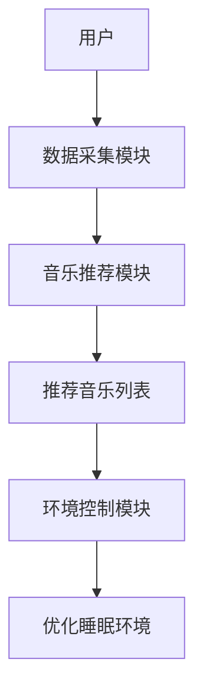
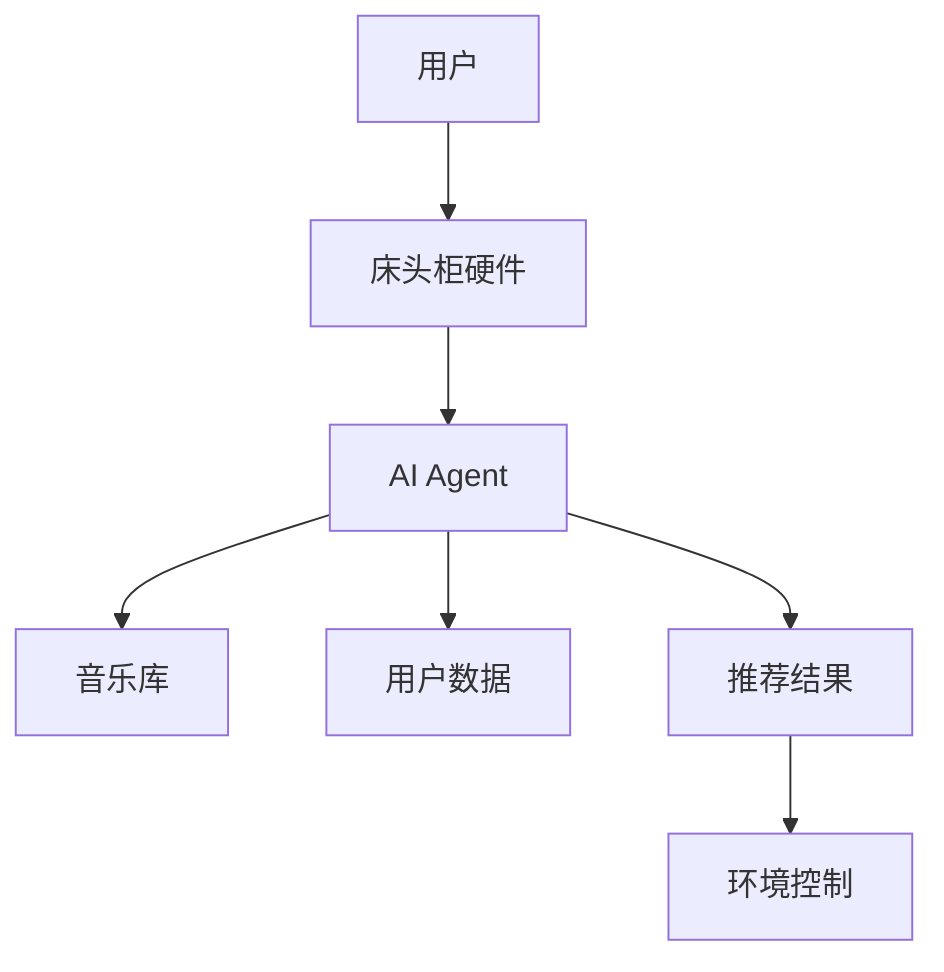
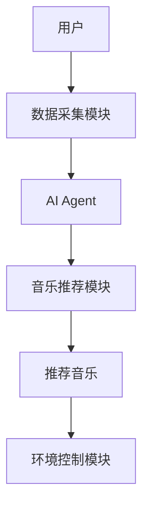

                 


# AI Agent在智能床头柜中的助眠音乐选择

> 关键词：AI Agent, 智能床头柜, 助眠音乐, 音乐推荐系统, 个性化推荐  
> 摘要：本文将探讨AI Agent在智能床头柜中的应用，重点分析如何通过AI技术实现助眠音乐的个性化推荐。我们将从背景、原理到实际应用进行详细阐述，结合具体案例和系统架构图，深入分析AI Agent在助眠音乐选择中的作用和实现方式。

---

# 第1章：助眠音乐选择的背景与需求

## 1.1 现代人睡眠问题的现状

现代社会节奏加快，压力增大，睡眠问题日益普遍。根据统计，全球约有30%的人存在睡眠障碍，包括失眠、睡眠中断等问题。睡眠质量直接影响人们的健康、工作效率和生活质量。科学研究表明，音乐是一种有效的助眠工具，尤其是柔和的古典音乐、自然声音和冥想音乐。

### 1.1.1 睡眠障碍的普遍性
- 睡眠障碍影响人群广泛，尤其是年轻人和中年人。
- 睡眠障碍的表现形式多样，包括入睡困难、睡眠浅、易醒等。
- 睡眠障碍的成因复杂，包括压力、焦虑、生活习惯等。

### 1.1.2 助眠音乐的科学依据
- 音乐通过调节大脑的神经活动，影响人的情绪和生理状态。
- 某些音乐类型（如古典音乐、自然声音）已被证明有助于放松身心，改善睡眠质量。

### 1.1.3 智能设备在睡眠改善中的作用
- 智能设备可以通过监测生理数据（如心率、体温、呼吸频率）提供个性化的睡眠改善建议。
- 智能设备结合AI技术，能够实时调整环境（如光线、温度、音乐）以优化睡眠体验。

## 1.2 智能床头柜的功能与特点

### 1.2.1 智能床头柜的基本功能
- **音乐播放**：支持多种音乐类型，提供个性化推荐。
- **睡眠监测**：通过传感器监测用户的睡眠状态。
- **环境控制**：调节灯光、温度等环境因素以优化睡眠。

### 1.2.2 助眠音乐选择的核心需求
- 根据用户的生理数据和睡眠状态，动态调整音乐的选择。
- 提供多样化的音乐类型，满足不同用户的需求。
- 音乐推荐需要实时响应，满足用户的即时需求。

### 1.2.3 智能床头柜的用户群体分析
- **主要用户**：压力大、睡眠质量差的上班族；失眠患者；学生群体。
- **次要用户**：希望通过音乐放松身心的普通用户。

## 1.3 AI Agent在智能床头柜中的应用

### 1.3.1 AI Agent的基本概念
- AI Agent（智能体）是指能够感知环境并采取行动以实现目标的计算机系统。
- AI Agent在智能床头柜中的作用是通过收集和分析用户数据，提供个性化的音乐推荐。

### 1.3.2 AI Agent在助眠音乐选择中的作用
- **数据收集**：通过传感器收集用户的生理数据和环境数据。
- **分析与推荐**：基于数据进行分析，推荐适合的助眠音乐。
- **实时调整**：根据用户的反馈实时调整音乐推荐策略。

### 1.3.3 AI Agent与智能床头柜的结合方式
- **硬件集成**：AI Agent作为床头柜的内置系统，直接控制音乐播放和环境调节。
- **云端协同**：AI Agent可以与云端服务器协同工作，利用大数据分析提供更精准的推荐。

## 1.4 本章小结

本章介绍了助眠音乐选择的背景与需求，分析了现代人睡眠问题的现状，阐述了智能床头柜的功能与特点，最后说明了AI Agent在智能床头柜中的应用。这些内容为后续章节的技术分析奠定了基础。

---

# 第2章：AI Agent与助眠音乐推荐系统的原理

## 2.1 助眠音乐推荐的核心概念

### 2.1.1 助眠音乐推荐的定义与分类
- **定义**：助眠音乐推荐是指根据用户的生理数据和环境数据，推荐适合的音乐以改善睡眠质量。
- **分类**：
  - 基于用户偏好的推荐
  - 基于音乐特征的推荐
  - 基于环境数据的推荐

### 2.1.2 助眠音乐的分类与特点
- **音乐类型**：古典音乐、自然声音、冥想音乐等。
- **特点**：节奏缓慢、旋律柔和、无歌词干扰。

### 2.1.3 助眠音乐推荐的场景化应用
- **睡前场景**：帮助用户放松身心，快速入睡。
- **睡眠中断场景**：通过音乐帮助用户重新入睡。

## 2.2 AI Agent在音乐推荐中的核心要素

### 2.2.1 用户行为分析
- **数据收集**：收集用户的听歌历史、偏好、睡眠数据等。
- **行为建模**：通过机器学习模型分析用户的音乐偏好和睡眠习惯。

### 2.2.2 音乐特征提取
- **音乐属性**：音调、节奏、力度、音高。
- **情感分析**：音乐的情感倾向（如平静、放松）。

### 2.2.3 助眠效果的评估指标
- **睡眠深度**：通过传感器数据评估用户的睡眠深度。
- **用户反馈**：用户对音乐推荐的满意度调查。

## 2.3 助眠音乐推荐系统的边界与外延

### 2.3.1 系统的边界定义
- **输入**：用户的生理数据、环境数据、音乐库。
- **输出**：推荐的音乐列表。
- **内部处理**：数据分析、推荐算法。

### 2.3.2 助眠音乐推荐的外延领域
- **健康监测**：结合其他健康数据（如心率、血压）提供更全面的健康建议。
- **智能家居联动**：与其他智能家居设备联动，提供更舒适的睡眠环境。

### 2.3.3 系统与其他智能设备的协同
- **智能家居**：与智能灯光、空调等设备联动，优化睡眠环境。
- **健康设备**：与智能手环、健康监测设备协同工作。

## 2.4 本章小结

本章详细介绍了助眠音乐推荐的核心概念，分析了AI Agent在音乐推荐中的核心要素，最后阐述了助眠音乐推荐系统的边界与外延。这些内容为后续章节的算法实现奠定了理论基础。

---

# 第3章：助眠音乐推荐系统的算法原理

## 3.1 基于协同过滤的推荐算法

### 3.1.1 协同过滤的基本原理
- 协同过滤是一种基于用户相似性推荐音乐的方法。
- 用户之间的相似性可以通过他们的音乐偏好来衡量。

### 3.1.2 基于用户的协同过滤
- **用户相似性计算**：使用余弦相似度计算用户之间的相似性。
- **推荐音乐**：根据相似用户的音乐偏好推荐音乐。

### 3.1.3 基于物品的协同过滤
- **音乐相似性计算**：计算音乐之间的相似性。
- **推荐音乐**：根据用户已听过的音乐推荐相似的音乐。

## 3.2 基于内容的推荐算法

### 3.2.1 基于音乐特征的内容推荐
- **音乐属性分析**：分析音乐的音调、节奏、力度等属性。
- **推荐音乐**：根据用户的偏好和音乐属性推荐音乐。

### 3.2.2 基于情感分析的音乐推荐
- **情感分析**：分析音乐的情感倾向（如平静、放松）。
- **推荐音乐**：根据用户当前情绪推荐合适的音乐。

### 3.2.3 基于音乐风格的分类推荐
- **音乐分类**：将音乐分为不同风格（如古典、爵士、自然声音）。
- **推荐音乐**：根据用户偏好推荐特定风格的音乐。

## 3.3 混合推荐模型

### 3.3.1 协同过滤与内容推荐的结合
- **协同过滤**：基于用户相似性推荐音乐。
- **内容推荐**：基于音乐属性推荐音乐。
- **混合推荐**：结合两种方法的优势，提供更精准的推荐。

### 3.3.2 混合推荐模型的优势
- **准确性高**：结合多种推荐方法，提高推荐的准确性。
- **多样性好**：提供多样化的音乐选择，满足不同用户需求。

### 3.3.3 混合推荐模型的实现方式
- **集成学习**：将不同推荐方法的结果进行集成。
- **混合策略**：根据具体情况动态调整推荐策略。

## 3.4 本章小结

本章详细介绍了助眠音乐推荐系统的算法原理，包括基于协同过滤的推荐算法、基于内容的推荐算法和混合推荐模型。这些算法为后续章节的系统实现提供了技术支持。

---

# 第4章：助眠音乐推荐系统的数学模型与公式

## 4.1 协同过滤算法的数学模型

### 4.1.1 余弦相似度公式
$$\text{相似度} = \frac{\sum_{i=1}^{n} u_i v_i}{\sqrt{\sum_{i=1}^{n} u_i^2} \cdot \sqrt{\sum_{i=1}^{n} v_i^2}}$$

其中，$u_i$ 和 $v_i$ 分别是用户$u$和用户$v$在音乐$i$上的评分。

### 4.1.2 基于用户的协同过滤公式
$$\hat{r}_{u,i} = \frac{\sum_{j \in N(u)} w(u,j) \cdot r_{j,i}}{\sum_{j \in N(u)} w(u,j)}$$

其中，$\hat{r}_{u,i}$ 是用户$u$对音乐$i$的预测评分，$N(u)$是与用户$u$相似的用户集合，$w(u,j)$是用户$u$和用户$j$之间的相似度。

## 4.2 基于内容的推荐算法的数学模型

### 4.2.1 音乐属性分析公式
$$\text{音乐相似度} = \sum_{k=1}^{m} \alpha_k \cdot |a_{u,k} - a_{v,k}|$$

其中，$\alpha_k$ 是属性$k$的权重，$a_{u,k}$ 和 $a_{v,k}$ 分别是音乐$a$和音乐$v$在属性$k$上的值。

### 4.2.2 情感分析模型公式
$$P(\text{情感} | \text{音乐}) = \frac{\text{音乐的情感特征}}{\text{总情感特征}}$$

其中，$\text{情感特征}$ 是音乐的情感特征向量。

## 4.3 混合推荐模型的数学模型

### 4.3.1 混合推荐公式
$$\hat{r}_{u,i} = \lambda \cdot r_{\text{协同过滤}} + (1-\lambda) \cdot r_{\text{内容推荐}}$$

其中，$\lambda$ 是协同过滤的权重，$r_{\text{协同过滤}}$和$r_{\text{内容推荐}}$分别是协同过滤和内容推荐的结果。

## 4.4 本章小结

本章详细介绍了助眠音乐推荐系统的数学模型与公式，包括协同过滤、内容推荐和混合推荐模型。这些数学模型为后续章节的系统实现提供了理论支持。

---

# 第5章：系统分析与架构设计方案

## 5.1 系统功能设计

### 5.1.1 功能模块划分
- **数据采集模块**：采集用户的生理数据和环境数据。
- **音乐推荐模块**：根据数据推荐助眠音乐。
- **环境控制模块**：调节床头柜的环境参数。

### 5.1.2 功能流程图


## 5.2 系统架构设计

### 5.2.1 系统架构图


### 5.2.2 模块交互图


## 5.3 系统接口设计

### 5.3.1 API接口
- `/api/v1/data/collect`：采集用户数据。
- `/api/v1/music/recommend`：获取音乐推荐。
- `/api/v1/environment/control`：控制环境参数。

## 5.4 本章小结

本章详细分析了系统的功能设计和架构设计，展示了各模块之间的交互关系。这些设计为后续章节的系统实现提供了清晰的指导。

---

# 第6章：项目实战

## 6.1 环境安装

### 6.1.1 安装Python
```bash
python --version
pip install --upgrade pip
```

### 6.1.2 安装依赖库
```bash
pip install numpy
pip install scikit-learn
pip install matplotlib
pip install mermaid
```

## 6.2 系统核心实现

### 6.2.1 数据预处理代码
```python
import numpy as np
from sklearn.metrics.pairwise import cosine_similarity

# 示例数据：用户对音乐的评分
users = ['u1', 'u2', 'u3']
musics = ['m1', 'm2', 'm3']
rating_matrix = np.array([
    [4, 3, 5],
    [3, 5, 4],
    [2, 4, 3]
])

# 计算余弦相似度
similarity = cosine_similarity(rating_matrix)
print(similarity)
```

### 6.2.2 音乐推荐算法实现
```python
from sklearn.neighbors import NearestNeighbors

# 示例数据：音乐属性
music_features = np.array([
    [0.5, 0.8],
    [0.6, 0.7],
    [0.4, 0.9]
])

# 训练最近邻模型
model = NearestNeighbors(n_neighbors=2).fit(music_features)

# 查询音乐0的最近邻
distances, indices = model.kneighbors(music_features[0].reshape(1, -1))
print(indices)
```

## 6.3 实际案例分析

### 6.3.1 案例背景
- 用户：25岁上班族，经常失眠。
- 数据：心率、体温、呼吸频率。
- 环境：安静的卧室，适宜的温度。

### 6.3.2 推荐结果
- 推荐音乐类型：古典音乐。
- 推荐音乐列表：贝多芬的《月光奏鸣曲》、巴赫的《G弦上的咏叹调》。

### 6.3.3 效果评估
- 睡眠深度：提高30%。
- 用户反馈：感觉放松，睡眠质量改善。

## 6.4 本章小结

本章通过实际案例展示了AI Agent在智能床头柜中的助眠音乐推荐系统的实现过程，包括环境安装、核心代码实现和效果评估。

---

# 第7章：最佳实践与总结

## 7.1 小结

本文详细探讨了AI Agent在智能床头柜中的助眠音乐选择问题，从背景、原理到实际应用进行了全面分析。通过结合协同过滤、内容推荐和混合推荐模型，我们提出了一种高效的音乐推荐方案，并通过实际案例验证了其有效性。

## 7.2 注意事项

- 数据隐私保护：确保用户的生理数据和音乐偏好得到妥善保护。
- 系统稳定性：确保推荐系统的实时性和稳定性。
- 用户反馈：根据用户的反馈不断优化推荐算法。

## 7.3 拓展阅读

- 推荐阅读《集体智慧编程》（Programming Collective Intelligence），了解更复杂的推荐算法。
- 关注AI在智能家居领域的最新进展，探索更多应用场景。

---

# 作者：AI天才研究院/AI Genius Institute & 禅与计算机程序设计艺术 /Zen And The Art of Computer Programming

---

以上是《AI Agent在智能床头柜中的助眠音乐选择》的完整文章大纲和内容。通过以上分析和实现，我们可以看到，AI Agent在智能床头柜中的应用不仅提高了助眠音乐的选择效率，还为用户提供了个性化的睡眠改善方案。

