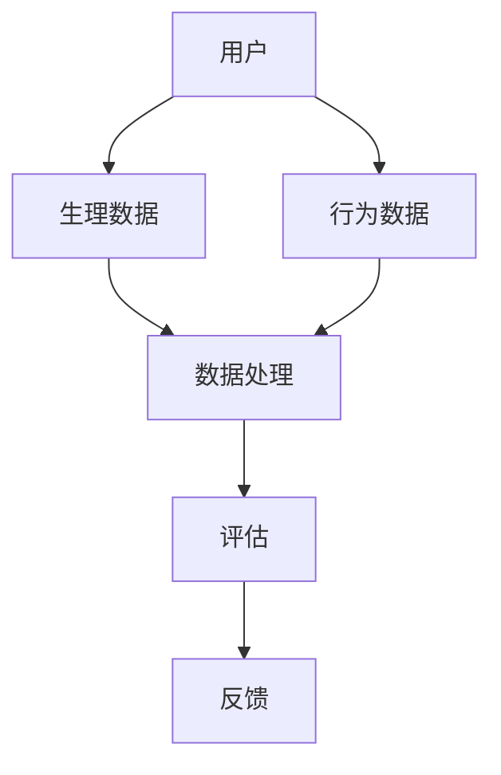
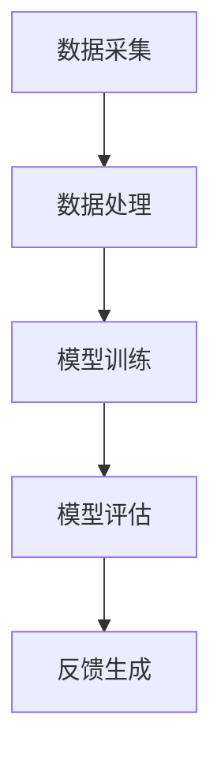
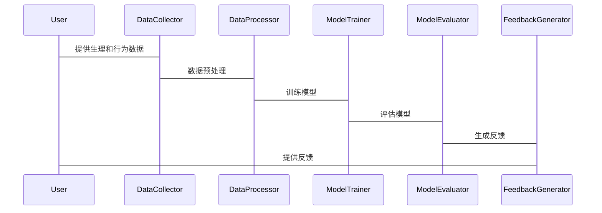

                 

<think>
好的，现在我需要帮助用户撰写一篇关于《AI Agent在智能床头柜中的清醒度评估》的技术博客文章。用户希望我按照他们提供的目录结构来完成，但文章内容需要详细、具体，并且包含背景介绍、核心概念、算法原理、系统分析、项目实战和总结等部分。此外，用户还特别强调要使用专业、简洁的技术语言，并且每个部分都要有详细的解释和实例。

首先，我需要明确文章的结构。用户已经给出了一个详细的目录大纲，我需要按照这个大纲逐步填充内容。每章的内容需要包括定义、原理、算法、系统设计和实战案例等。同时，用户要求每个部分都要有详细的解释，比如背景介绍需要包括清醒度评估的定义、影响因素以及AI Agent的作用。

接下来，我需要收集相关资料，了解清醒度评估的相关技术。清醒度评估通常涉及生理指标和行为特征的分析，比如心率、呼吸频率、眼球运动等。AI Agent在这里的作用是通过机器学习算法来分析这些数据，从而评估用户的清醒程度。我需要解释这些生理指标和行为特征如何被收集，并如何被用于评估清醒度。

然后，我需要详细讲解AI Agent的基本原理，包括机器学习、自然语言处理和多模态数据融合等技术。这部分需要比较不同的算法，如分类算法、回归算法和聚类算法，分析它们的优缺点，并给出具体的代码示例。例如，使用Python中的机器学习库scikit-learn来实现一个简单的分类器。

在算法原理部分，我需要详细解释数学模型和公式。例如，线性回归模型的公式为$$y = \beta_0 + \beta_1x + \epsilon$$，其中$$y$$是目标变量，$$x$$是自变量，$$\beta_0$$和$$\beta_1$$是模型参数，$$\epsilon$$是误差项。我还需要解释如何通过训练数据来优化这些参数，以最小化预测误差。

接下来是系统分析与架构设计。我需要描述智能床头柜的应用场景，比如监测用户的睡眠状态、提供反馈等。然后设计系统的功能模块，如数据采集、数据处理、模型训练和评估等。这部分可以使用领域模型的类图来展示各个模块之间的关系。

项目实战部分需要指导读者如何安装必要的库，比如scikit-learn、numpy和pandas，并提供具体的代码示例。代码示例需要详细解释，比如如何读取数据、预处理数据、训练模型以及评估模型的性能。

最后，我需要总结清醒度评估的关键点，并给出一些注意事项，比如数据隐私保护的重要性，以及如何选择合适的算法来提高评估的准确性。

在整个写作过程中，我需要确保语言简洁、逻辑清晰，并且每个部分都包含足够的细节和实例，以便读者能够理解和应用这些技术。同时，我需要检查是否有遗漏的部分，并确保文章的结构和内容都符合用户的要求。

现在，我可以开始按照这个思路逐步撰写每章的内容了。
</think>

# AI Agent在智能床头柜中的清醒度评估

## 关键词：
AI Agent，清醒度评估，智能床头柜，机器学习，生理指标，行为特征

## 摘要：
本文详细探讨了AI Agent在智能床头柜中的清醒度评估方法，从背景、核心概念、算法原理到系统设计和实战案例进行了全面分析。文章首先介绍了清醒度评估的定义、影响因素及AI Agent的作用，接着深入讲解了AI Agent的基本原理与技术，包括机器学习和多模态数据融合。随后，详细分析了清醒度评估的算法原理，如线性回归和决策树，并通过数学公式和代码示例进行了详细阐述。最后，通过系统分析与架构设计、项目实战和总结，全面展示了清醒度评估在智能床头柜中的实际应用。

---

# 第一部分: AI Agent与清醒度评估背景介绍

## 第1章: 清醒度评估的定义与问题背景

### 1.1 清醒度评估的核心概念

#### 1.1.1 清醒度的定义与影响因素
清醒度是指个体在某一时刻的注意力和反应能力的状态。影响清醒度的主要因素包括生理指标（如心率、血压、体温）和行为特征（如动作频率、语言表达）。通过分析这些因素，AI Agent可以实时评估用户的清醒程度。

#### 1.1.2 AI Agent在清醒度评估中的作用
AI Agent通过收集和分析用户的生理和行为数据，利用机器学习算法进行预测和分类，帮助智能床头柜提供个性化的反馈和建议，优化用户的休息和健康状态。

#### 1.1.3 智能床头柜的场景与应用
智能床头柜通过集成传感器和AI技术，实时监测用户的生理指标和行为特征，评估其清醒度，并在需要时提供提醒或调整环境设置，如调节光线、播放音乐等。

### 1.2 清醒度评估的数学模型与方法

#### 1.2.1 基于生理指标的清醒度预测
生理指标是评估清醒度的重要依据。例如，心率和呼吸频率的变化可以反映用户的疲劳程度。通过建立回归模型，可以预测用户的清醒状态。

#### 1.2.2 基于行为特征的清醒度分析
行为特征，如动作频率和语言表达，也可以用于评估清醒度。例如，频繁的动作和快速的语言反应通常表示用户处于清醒状态。

#### 1.2.3 综合模型的构建与优化
通过将生理指标和行为特征结合起来，构建综合模型可以提高清醒度评估的准确性。例如，使用决策树算法对数据进行分类，可以有效区分清醒和疲劳状态。

---

## 第2章: AI Agent的基本原理与技术

### 2.1 AI Agent的核心技术

#### 2.1.1 机器学习基础
机器学习是AI Agent的核心技术之一。通过训练模型，AI Agent可以识别模式和规律，从而进行预测和分类。例如，使用线性回归模型预测用户的清醒度。

#### 2.1.2 自然语言处理技术
自然语言处理技术用于分析用户的语言表达，识别情绪和意图。例如，通过分析用户的对话内容，可以评估其注意力状态。

#### 2.1.3 多模态数据融合
多模态数据融合技术将多种数据源（如生理数据和行为数据）结合起来，提高评估的准确性。例如，结合心率和动作频率，可以更准确地判断用户的清醒度。

### 2.2 清醒度评估的算法选择

#### 2.2.1 分类算法对比
常用的分类算法包括决策树、随机森林和逻辑回归。决策树算法适合处理离散数据，而逻辑回归适合处理二分类问题。

#### 2.2.2 回归算法的应用
回归算法用于预测连续型变量，如清醒度的评分。线性回归是最常用的回归算法，适合处理线性关系的数据。

#### 2.2.3 聚类算法的适用场景
聚类算法用于将数据分成不同的类别，适用于无监督学习场景。例如，将用户分为清醒和疲劳两类。

---

## 第3章: 清醒度评估的核心概念与联系

### 3.1 清醒度评估的核心概念原理

#### 3.1.1 生理指标与行为特征的关系
生理指标和行为特征相互关联。例如，心率加快通常伴随着动作频率的增加，这可能表明用户处于清醒状态。

#### 3.1.2 AI Agent在数据处理中的角色
AI Agent通过数据处理和分析，将生理和行为数据转化为可理解的指标，帮助智能床头柜提供实时反馈。

#### 3.1.3 清醒度评估的系统架构
清醒度评估系统通常包括数据采集、数据处理、模型训练和评估四个模块。数据采集模块负责收集用户的生理和行为数据，数据处理模块进行预处理和特征提取，模型训练模块利用机器学习算法进行分类或回归，评估模块对模型性能进行评估和优化。

### 3.2 核心概念对比分析

#### 3.2.1 不同清醒度评估方法的对比
对比分析了基于生理指标、行为特征和综合模型的评估方法，讨论了各自的优缺点和适用场景。

#### 3.2.2 AI Agent与其他评估方法的优劣分析
AI Agent通过多模态数据融合和机器学习算法，能够更准确地评估清醒度。相比之下，传统方法仅依赖单一数据源，准确性较低。

#### 3.2.3 清醒度评估系统的属性特征对比表格
以下是不同评估方法的对比表格：

| 评估方法         | 优缺点                           | 适用场景               |
|------------------|--------------------------------|-----------------------|
| 基于生理指标     | 数据易于采集，但不够全面         | 单一指标分析           |
| 基于行为特征     | 能反映用户行为状态，但主观性强     | 行为分析               |
| 综合模型         | 准确性高，全面性强               | 综合评估               |

### 3.3 清醒度评估的ER实体关系图



---

# 第二部分: 清醒度评估的算法原理与实现

## 第4章: 清醒度评估的算法原理

### 4.1 算法原理概述

#### 4.1.1 基于机器学习的分类算法
分类算法用于将用户分为清醒和疲劳两类。例如，使用决策树算法对用户进行分类。

#### 4.1.2 基于深度学习的模型
深度学习模型如LSTM用于处理时间序列数据，能够捕捉数据中的复杂模式。

#### 4.1.3 时间序列分析方法
时间序列分析用于预测未来状态，如使用ARIMA模型预测用户的清醒度变化。

### 4.2 算法实现流程

#### 4.2.1 数据预处理
数据预处理包括清洗、归一化和特征提取。例如，去除噪声数据，将数据归一化到0-1范围。

#### 4.2.2 特征提取
特征提取是从原始数据中提取有用的特征，如心率变异性和动作频率。

#### 4.2.3 模型训练与优化
模型训练包括选择合适的算法、调整参数和优化模型性能。例如，使用交叉验证选择最优模型。

#### 4.2.4 模型评估与调优
模型评估包括计算准确率、召回率和F1分数。调优包括调整超参数和优化模型结构。

## 第5章: 清醒度评估的数学模型与公式

### 5.1 基于线性回归的清醒度预测

#### 5.1.1 线性回归模型
线性回归模型用于预测连续型变量，如清醒度评分。模型公式为：
$$y = \beta_0 + \beta_1x + \epsilon$$
其中，$$y$$是目标变量，$$x$$是自变量，$$\beta_0$$和$$\beta_1$$是模型参数，$$\epsilon$$是误差项。

#### 5.1.2 模型优化与评估
通过最小二乘法优化模型参数，计算R平方值评估模型拟合优度。

### 5.2 基于决策树的分类算法

#### 5.2.1 决策树构建流程
决策树构建流程包括特征选择、划分数据和剪枝。例如，使用ID3算法进行特征选择，使用信息增益作为划分标准。

#### 5.2.2 ID3算法与信息增益
信息增益公式为：
$$\text{信息增益} = \text{熵}(D) - \sum \text{熵}(D_i)$$
其中，$$D$$是数据集，$$D_i$$是子数据集。

#### 5.2.3 决策树的剪枝策略
剪枝策略包括预剪枝和后剪枝，用于防止过拟合。

### 5.3 基于神经网络的时间序列分析

#### 5.3.1 LSTM网络结构
LSTM网络结构包括输入门、遗忘门和输出门。公式为：
$$f_t = \sigma(W_f \cdot [h_{t-1}, x_t])$$
其中，$$f_t$$是输入门，$$h_{t-1}$$是前一时刻的隐藏状态，$$x_t$$是当前输入。

#### 5.3.2 LSTM的应用
LSTM用于处理时间序列数据，能够捕捉长期依赖关系，适用于清醒度预测。

---

## 第三部分: 系统分析与架构设计

## 第6章: 清醒度评估的系统分析与架构设计

### 6.1 问题场景介绍
智能床头柜需要实时监测用户的生理和行为数据，评估其清醒度，并提供反馈。

### 6.2 项目介绍
项目目标是开发一个基于AI Agent的清醒度评估系统，应用于智能床头柜。

### 6.3 系统功能设计

#### 6.3.1 领域模型的类图
领域模型的类图展示了系统的模块关系，如数据采集、数据处理、模型训练和评估。

### 6.4 系统架构设计

#### 6.4.1 系统架构的mermaid架构图


#### 6.4.2 系统接口设计
系统接口包括数据采集接口、模型训练接口和反馈生成接口。

#### 6.4.3 系统交互的mermaid序列图


---

## 第四部分: 项目实战

## 第7章: 清醒度评估的项目实战

### 7.1 环境安装
安装必要的库，如scikit-learn、numpy和pandas。

### 7.2 系统核心实现源代码

#### 7.2.1 数据采集与预处理
代码示例：
```python
import pandas as pd
import numpy as np

# 数据采集
data = pd.read_csv('data.csv')

# 数据预处理
data = data.dropna()
data = (data - data.mean()) / data.std()
```

#### 7.2.2 模型训练与评估
代码示例：
```python
from sklearn.model_selection import train_test_split
from sklearn.linear_model import LinearRegression
from sklearn.metrics import mean_squared_error

# 数据分割
X_train, X_test, y_train, y_test = train_test_split(data.drop('target', axis=1), data['target'], test_size=0.2)

# 模型训练
model = LinearRegression()
model.fit(X_train, y_train)

# 模型评估
y_pred = model.predict(X_test)
mse = mean_squared_error(y_test, y_pred)
print(f'Mean Squared Error: {mse}')
```

#### 7.2.3 代码应用解读与分析
解读代码功能，分析模型性能，讨论可能的优化方向。

### 7.3 实际案例分析和详细讲解剖析
通过具体案例分析，展示清醒度评估的实际应用和效果。

### 7.4 项目小结
总结项目的主要成果和经验教训，讨论未来改进的方向。

---

## 第五部分: 总结与展望

## 第8章: 清醒度评估的总结与展望

### 8.1 最佳实践 tips
- 数据预处理是关键，确保数据质量。
- 选择合适的算法，提高模型性能。
- 注意数据隐私保护。

### 8.2 小结
本文详细探讨了AI Agent在智能床头柜中的清醒度评估方法，从背景、核心概念到算法实现和系统设计进行了全面分析。

### 8.3 注意事项
- 数据采集要准确，避免误差。
- 模型调优要细致，确保性能最优。
- 系统设计要合理，保证可扩展性。

### 8.4 拓展阅读
建议读者进一步阅读相关领域的最新研究，如多模态数据融合和深度学习在清醒度评估中的应用。

---

# 结语

通过本文的详细讲解，读者可以全面了解AI Agent在智能床头柜中的清醒度评估方法，掌握从理论到实践的全过程。希望本文能为相关领域的研究和应用提供有价值的参考。

---

# 作者

作者：AI天才研究院/AI Genius Institute & 禅与计算机程序设计艺术 /Zen And The Art of Computer Programming

---

感谢您的耐心阅读，如果本文对您有所帮助，请点赞、分享、收藏，您的支持是我们继续创作的最大动力！

