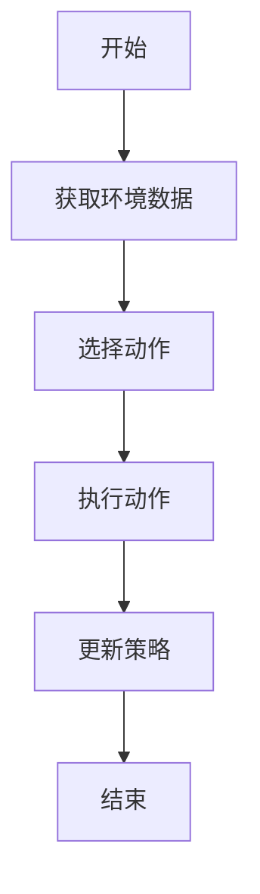
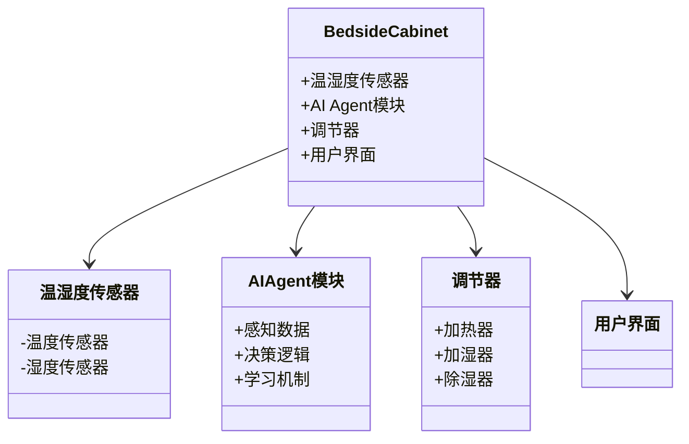
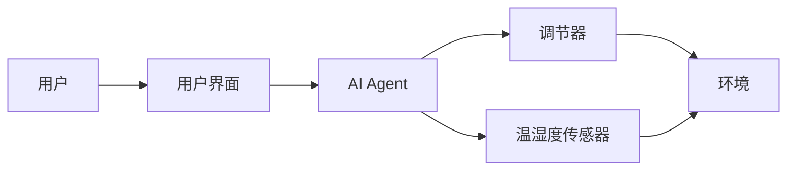
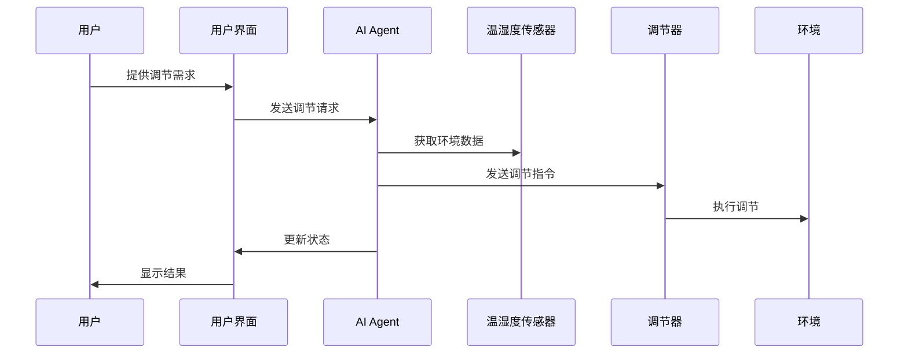

                 


# AI Agent在智能床头柜中的温湿度调节

## 关键词：AI Agent、智能床头柜、温湿度调节、强化学习、系统架构、算法原理

## 摘要：本文探讨AI Agent在智能床头柜中的温湿度调节应用，详细分析其背景、核心概念、算法原理、系统架构及项目实现，结合实际案例，提供深度解析和实践指导。

---

# 第1章: AI Agent与温湿度调节概述

## 1.1 问题背景与描述

### 1.1.1 智能床头柜的发展现状
现代智能家居设备的发展使得床头柜不仅仅是一个摆设，而是集成了多种智能功能的平台。温湿度调节作为提升居住舒适度的重要方面，成为智能床头柜的核心功能之一。AI Agent（人工智能代理）的引入，使得床头柜能够更加智能地感知环境并自主调节温湿度，满足用户个性化需求。

### 1.1.2 温湿度调节的重要性
温湿度对人类的健康和舒适度有着重要影响。过高或过低的温湿度可能导致身体不适，甚至引发健康问题。通过智能调节，可以保持理想的温湿度环境，提升生活品质。

### 1.1.3 AI Agent在智能床头柜中的应用价值
AI Agent能够实时感知环境变化，结合用户习惯和偏好，自主决策调节策略，实现高效、精准的温湿度控制。与传统被动调节方式相比，AI Agent能够主动适应环境变化，提供更智能的服务。

## 1.2 问题解决与边界

### 1.2.1 温湿度调节的核心问题
温湿度调节的核心问题包括：如何准确感知环境温湿度数据，如何根据用户需求制定调节策略，如何优化调节过程以达到最佳效果。

### 1.2.2 AI Agent在调节中的作用
AI Agent通过数据采集、分析和决策，实现对温湿度的智能调节。其作用包括数据采集与处理、决策制定和执行控制。

### 1.2.3 系统的边界与外延
系统的边界包括床头柜内部的传感器、执行器和AI Agent模块。外延部分则涉及与智能家居其他设备的联动，如空调、加湿器等。

## 1.3 核心概念与组成

### 1.3.1 AI Agent的定义与属性
AI Agent是一种能够感知环境、自主决策并执行任务的智能实体。其核心属性包括感知能力、决策能力和执行能力。

### 1.3.2 温湿度调节的实现机制
温湿度调节通过传感器采集数据，AI Agent分析数据并制定调节策略，执行器根据策略调整环境温湿度。

### 1.3.3 系统的核心要素组成
系统的核心要素包括传感器、AI Agent、执行器和用户界面。

---

# 第2章: AI Agent与温湿度调节的核心概念

## 2.1 核心概念原理

### 2.1.1 AI Agent的基本原理
AI Agent通过感知环境数据，利用算法进行分析和决策，执行相应的操作以实现目标。其基本原理包括数据采集、分析与决策、执行反馈。

### 2.1.2 温湿度调节的实现原理
温湿度调节通过传感器采集数据，AI Agent分析数据，制定调节策略，执行器执行调节操作，形成闭环控制系统。

## 2.2 核心概念属性对比

### 表2-1: AI Agent与传统控制算法的对比

| 特性                | AI Agent                          | 传统控制算法                     |
|---------------------|------------------------------------|-----------------------------------|
| 感知能力            | 强，能实时感知环境变化             | 依赖预设传感器数据               |
| 决策能力            | 高度智能，能自主学习和优化         | 基于预设规则，决策能力有限       |
| 执行能力            | 能够自主执行调节操作               | 需要人工或固定程序控制           |
| 适应性              | 能够自适应环境变化                 | 适应性较低，需人工调整           |

## 2.3 ER实体关系图

```mermaid
er
actor: 用户
agent: AI Agent
sensor: 温湿度传感器
actuator: 调节器
goal: 温湿度目标
rule: 调节规则
```

---

# 第3章: AI Agent的算法原理

## 3.1 算法原理讲解

### 3.1.1 基于强化学习的调节算法
强化学习是一种通过试错机制优化决策的算法。AI Agent通过与环境互动，不断优化调节策略，以实现温湿度控制目标。



### 3.1.2 算法实现代码
以下是基于强化学习的AI Agent算法实现示例：

```python
import numpy as np

class AI-Agent:
    def __init__(self):
        self.state_space = 5  # 状态空间定义
        self.action_space = 3  # 动作空间定义
        self.learning_rate = 0.01  # 学习率
        self.Q_table = np.zeros((self.state_space, self.action_space))  # Q表初始化

    def act(self, state):
        # ε-greedy策略选择动作
        epsilon = 0.1
        if np.random.random() < epsilon:
            return np.random.randint(0, self.action_space)
        else:
            return np.argmax(self.Q_table[state])

    def learn(self, state, action, reward, next_state):
        # Q-learning算法更新Q表
        self.Q_table[state][action] += self.learning_rate * (reward + np.max(self.Q_table[next_state]) - self.Q_table[state][action])

# 示例用法
agent = AI-Agent()
state = 2
action = agent.act(state)
reward = 0.5
next_state = 3
agent.learn(state, action, reward, next_state)
```

### 3.1.3 算法的数学模型
强化学习算法的数学模型通常涉及Q值更新公式：

$$ Q(s, a) = Q(s, a) + \alpha (r + \gamma \max Q(s', a') - Q(s, a)) $$

其中：
- \( Q(s, a) \) 是当前状态下动作 \( a \) 的Q值。
- \( \alpha \) 是学习率。
- \( r \) 是奖励。
- \( \gamma \) 是折扣因子。
- \( s' \) 是下一个状态。
- \( \max Q(s', a') \) 是下一个状态下动作的最大Q值。

---

# 第4章: 系统分析与架构设计

## 4.1 问题场景介绍
智能床头柜需要在不同环境下自动调节温湿度，以满足用户的舒适需求。系统需要集成传感器、AI Agent和执行器，形成一个闭环控制系统。

## 4.2 项目介绍

### 4.2.1 系统功能设计
系统功能包括温湿度数据采集、AI Agent分析与决策、调节器执行操作、用户交互界面。

### 4.2.2 系统架构设计
系统架构采用模块化设计，包括数据采集模块、AI Agent模块、执行器模块和用户界面模块。

### 4.2.3 系统功能设计的领域模型类图



### 4.2.4 系统架构图



### 4.2.5 系统接口设计
系统接口包括：
- 用户界面接口：用户输入需求和查看状态。
- 传感器接口：采集温湿度数据。
- 调节器接口：接收调节指令。

### 4.2.6 系统交互序列图



---

# 第5章: 项目实战

## 5.1 环境安装

### 5.1.1 系统环境
- 操作系统：Windows 10或更高版本
- 开发工具：Python 3.8+
- 依赖库：numpy, matplotlib

### 5.1.2 硬件环境
- 温湿度传感器：DHT22
- 微控制器：Raspberry Pi 4
- 调节器：加热器、加湿器、除湿器

## 5.2 系统核心实现源代码

### 5.2.1 AI Agent实现代码
```python
import numpy as np
import RPi.GPIO as GPIO

class AI-Agent:
    def __init__(self):
        self.GPIOpins = [12, 16, 20]  # 加热器、加湿器、除湿器引脚
        self.learning_rate = 0.01
        self.Q_table = np.zeros((5, 3))  # 状态空间：5种，动作空间：3种

    def setup_GPIO(self):
        GPIO.setmode(GPIO.BCM)
        for pin in self.GPIOpins:
            GPIO.setup(pin, GPIO.OUT)
            GPIO.output(pin, GPIO.LOW)

    def act(self, state):
        epsilon = 0.1
        if np.random.random() < epsilon:
            return np.random.randint(0, 3)
        else:
            return np.argmax(self.Q_table[state])

    def learn(self, state, action, reward, next_state):
        self.Q_table[state][action] += self.learning_rate * (reward + np.max(self.Q_table[next_state]) - self.Q_table[state][action])

    def execute_action(self, action):
        for i in range(3):
            if i == action:
                GPIO.output(self.GPIOpins[i], GPIO.HIGH)
            else:
                GPIO.output(self.GPIOpins[i], GPIO.LOW)

    def stop(self):
        GPIO.cleanup()
```

### 5.2.2 温湿度传感器数据采集代码
```python
import Adafruit_DHT
import time

def get_humidity_temperature():
    DHT_SENSOR = Adafruit_DHT.DHT22
    DHT_PIN = 4
    humidity, temperature = Adafruit_DHT.read_retry(DHT_SENSOR, DHT_PIN)
    return humidity, temperature
```

### 5.2.3 系统主程序代码
```python
import time

def main():
    agent = AI-Agent()
    agent.setup_GPIO()
    while True:
        humidity, temperature = get_humidity_temperature()
        state = (int(humidity) // 2) + (int(temperature) // 2)
        action = agent.act(state)
        agent.execute_action(action)
        time.sleep(1)
        # 模拟奖励函数，可以根据实际环境反馈调整
        reward = 1.0 if (humidity >= 50 and humidity <= 60) and (temperature >= 20 and temperature <= 26) else 0.5
        next_humidity, next_temperature = get_humidity_temperature()
        next_state = (int(next_humidity) // 2) + (int(next_temperature) // 2)
        agent.learn(state, action, reward, next_state)

if __name__ == "__main__":
    main()
```

## 5.3 代码应用解读与分析

### 5.3.1 AI Agent实现解读
AI Agent通过GPIO控制调节器，基于强化学习算法实现温湿度调节。系统通过DHT22传感器采集数据，根据当前状态选择动作，并通过Q-learning算法不断优化调节策略。

### 5.3.2 系统主程序分析
主程序实现数据采集、状态转换、动作选择和策略学习。系统根据当前环境数据选择调节动作，并通过反馈不断优化Q表。

## 5.4 实际案例分析与详细讲解

### 5.4.1 案例分析
假设用户希望将温湿度维持在20-26℃和50-60%之间。系统通过传感器采集数据，AI Agent选择调节动作，执行器执行操作，并根据反馈调整策略。

### 5.4.2 详细讲解
系统通过闭环控制实现温湿度调节。传感器数据输入AI Agent，Agent分析后选择调节动作，调节器执行操作，系统根据反馈更新Q表，优化调节策略。

## 5.5 项目小结

### 5.5.1 项目总结
通过AI Agent实现智能床头柜的温湿度调节，系统能够自主感知环境变化，优化调节策略，实现精准的温湿度控制。

### 5.5.2 注意事项
- 硬件安装需要注意传感器和调节器的正确接线。
- 系统需要根据实际环境调整参数和策略。
- 系统需要定期维护和更新。

### 5.5.3 未来改进方向
- 引入更复杂的强化学习算法，如Deep Q-Learning。
- 增加用户偏好学习功能，提升个性化调节能力。
- 实现多设备联动，构建完整的智能家居调节系统。

---

# 第6章: 总结与展望

## 6.1 核心总结
本文详细探讨了AI Agent在智能床头柜中的温湿度调节应用，分析了系统架构、算法原理和实现方案，并通过实际案例展示了系统的功能和性能。

## 6.2 未来展望
随着AI技术的不断发展，智能床头柜的调节系统将更加智能化和个性化。未来的研究方向包括更高效的算法、更精准的传感器和更智能的执行器。

## 6.3 最佳实践 tips
- 在实际应用中，建议根据具体需求调整系统参数。
- 定期维护和更新系统，确保其稳定性和性能。
- 注意硬件安装和接线的正确性，确保系统安全运行。

---

# 作者：AI天才研究院/AI Genius Institute & 禅与计算机程序设计艺术 /Zen And The Art of Computer Programming

