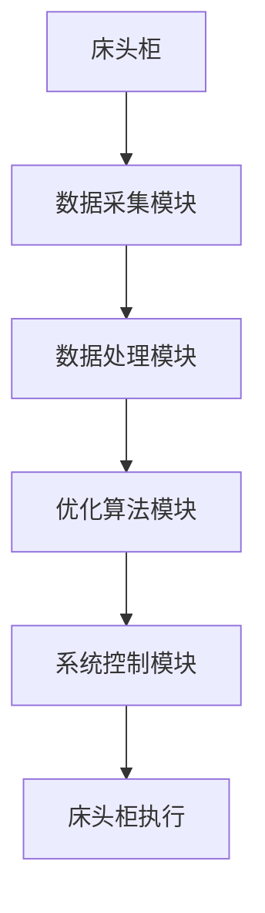

                 

<think>
好的，我现在要写一篇关于《AI Agent在智能床头柜中的睡眠环境优化》的技术博客。首先，我需要明确文章的核心内容和结构。用户已经给出了一个详细的目录大纲，包括背景介绍、核心概念、算法原理、系统设计、项目实战和总结。接下来，我需要根据这个大纲，逐步展开每一部分的内容。

首先，文章的标题和关键词已经给出。关键词包括AI Agent、智能床头柜、睡眠环境优化、强化学习、睡眠质量评估、智能算法。摘要部分需要简明扼要地概括文章的核心内容，强调AI Agent在优化睡眠环境中的作用。

接下来是目录结构，分为六个主要部分：背景介绍、核心概念、算法原理、系统设计、项目实战和总结。每个部分下有详细的章节，我需要按照这个结构逐步展开。

在背景介绍部分，我需要先定义AI Agent，然后介绍智能床头柜的功能和应用场景，最后说明为什么睡眠环境优化是一个重要问题，以及AI Agent在其中的作用。这部分需要让读者理解问题背景和基本概念。

核心概念部分，我需要详细讲解AI Agent的工作原理，包括感知、决策和执行三个阶段。还需要使用表格对比感知、决策和执行的不同，以及用Mermaid图展示三者的关系。这部分要让读者清楚AI Agent在睡眠优化中的具体运作方式。

算法原理部分，重点放在强化学习上，特别是Q-learning算法。我需要解释强化学习的基本原理，Q-learning的算法流程，以及如何将其应用于睡眠优化。同时，提供Python代码示例和数学公式，帮助读者理解算法的实现。

系统设计部分，需要设计系统的功能模块，包括数据采集、处理、优化算法和系统控制。然后，用Mermaid图展示系统的架构，包括各模块之间的关系和数据流。这部分要展示系统的整体结构和各部分如何协作。

项目实战部分，需要详细说明如何搭建开发环境，实现数据采集、算法、系统控制和测试。提供具体的代码示例，说明每个部分的功能，并分析实际案例的效果。最后，进行项目总结，指出实现的效果和不足。

最后，总结部分要回顾全文，强调AI Agent在睡眠优化中的价值，并展望未来的发展方向。同时，给出一些实用的建议和注意事项，帮助读者更好地理解和应用这些技术。

在写作过程中，我需要确保每一部分都详细且逻辑清晰，使用技术性的语言但保持易懂。同时，合理使用表格、Mermaid图和数学公式来增强内容的可读性和专业性。这样，整篇文章才能全面、深入地探讨AI Agent在智能床头柜中的应用，满足读者的需求。
</think>

# AI Agent在智能床头柜中的睡眠环境优化

> 关键词：AI Agent, 智能床头柜, 睡眠环境优化, 强化学习, 睡眠质量评估, 智能算法

> 摘要：本文探讨了AI Agent在智能床头柜中的应用，详细分析了睡眠环境优化的核心问题、解决方案及其技术实现。通过强化学习算法，结合环境数据采集和系统控制，实现个性化睡眠优化，提升用户体验。本文内容涵盖背景分析、算法原理、系统设计和项目实战，为智能床头柜的开发和应用提供了理论和实践参考。

---

## 目录

1. [AI Agent与智能床头柜的背景介绍](#ai-agent与智能床头柜的背景介绍)
2. [AI Agent在睡眠环境优化中的核心概念](#ai-agent在睡眠环境优化中的核心概念)
3. [睡眠环境优化的算法原理](#睡眠环境优化的算法原理)
4. [睡眠环境优化的系统架构设计](#睡眠环境优化的系统架构设计)
5. [睡眠环境优化的项目实战](#睡眠环境优化的项目实战)
6. [总结与展望](#总结与展望)

---

## 1. AI Agent与智能床头柜的背景介绍

### 1.1 AI Agent的基本概念

AI Agent（人工智能代理）是一种能够感知环境、做出决策并执行动作的智能实体。与传统智能设备不同，AI Agent具备以下核心特征：

- **自主性**：能够在没有外部干预的情况下运行。
- **反应性**：能够实时感知环境并做出反应。
- **学习能力**：通过数据和经验不断优化自身的决策能力。
- **交互性**：能够与用户和其他设备进行交互。

### 1.2 智能床头柜的功能与应用场景

智能床头柜是一种集成AI技术的智能家居设备，主要用于优化睡眠环境。其核心功能包括：

- **环境监测**：采集室温、湿度、光照、噪音等环境数据。
- **用户行为分析**：通过传感器和用户输入数据，分析用户的睡眠习惯和偏好。
- **环境优化**：根据环境数据和用户需求，自动调节床头柜的灯光、温度、湿度等参数，以优化睡眠质量。

### 1.3 睡眠环境优化的核心问题

睡眠质量受多种因素影响，包括环境因素（如温度、湿度、噪音）和个体差异（如年龄、健康状况）。AI Agent的目标是通过实时感知和优化，为用户提供个性化的睡眠环境。解决的核心问题包括：

- 如何高效采集和处理多模态环境数据？
- 如何设计优化算法以提升睡眠质量？
- 如何实现AI Agent与床头柜设备的无缝交互？

---

## 2. AI Agent在睡眠环境优化中的核心概念

### 2.1 AI Agent的核心原理与算法

AI Agent通过感知、决策和执行三个阶段实现睡眠环境优化。

#### 2.1.1 感知层

感知层负责采集环境数据和用户输入，包括：

- **环境数据**：温度、湿度、光照强度、噪音水平。
- **用户数据**：用户的睡眠习惯、健康状况、偏好设置。

#### 2.1.2 决策层

决策层基于感知数据，通过强化学习算法生成优化策略。强化学习是一种通过试错优化行为的算法，适用于动态环境下的决策问题。

#### 2.1.3 执行层

执行层根据决策层的指令，调整床头柜的各项参数，例如调节灯光亮度、开启或关闭空调等。

### 2.2 睡眠环境优化的数学模型

睡眠优化的数学模型包括：

- **睡眠质量评估模型**：基于环境数据和用户反馈，评估当前睡眠质量。
- **环境参数优化模型**：通过优化算法，确定最优的环境参数组合。

---

## 3. 睡眠环境优化的算法原理

### 3.1 强化学习算法在睡眠优化中的应用

#### 3.1.1 强化学习的基本原理

强化学习通过智能体与环境的交互，学习最优策略。AI Agent在睡眠优化中的强化学习框架如下：

1. **环境状态**：当前环境的参数（如温度、湿度）和用户的睡眠状态。
2. **动作选择**：AI Agent根据当前状态选择一个动作（如调整温度）。
3. **奖励机制**：根据优化效果，给予正向或负向的奖励信号。

#### 3.1.2 Q-learning算法流程

Q-learning是一种经典的强化学习算法，适用于离线训练场景。其算法流程如下：

1. 初始化Q表，所有状态-动作对的Q值初始为0。
2. 采集环境数据，确定当前状态。
3. 根据Q表选择动作，计算新状态。
4. 计算奖励，更新Q值：$$ Q(s, a) = Q(s, a) + \alpha (r + \gamma \max Q(s', a')) $$
5. 重复上述步骤，直到达到收敛条件。

#### 3.1.3 睡眠优化的Q值更新公式

在睡眠优化中，Q值更新公式为：

$$ Q(s, a) = Q(s, a) + \alpha (r + \gamma \max Q(s', a')) $$

其中：
- \( s \)：当前环境状态。
- \( a \)：床头柜的动作（如调整温度）。
- \( r \)：奖励值，睡眠质量提升带来正向奖励。
- \( \gamma \)：折扣因子，控制未来奖励的重要性。

---

## 4. 睡眠环境优化的系统架构设计

### 4.1 系统功能模块划分

系统功能模块包括：
- 数据采集模块：负责采集环境数据和用户输入。
- 数据处理模块：对数据进行预处理和特征提取。
- 优化算法模块：基于强化学习算法生成优化策略。
- 系统控制模块：根据优化策略调整床头柜参数。

### 4.2 系统架构设计

系统架构分为三层：
1. **感知层**：负责数据采集。
2. **决策层**：负责优化算法。
3. **执行层**：负责参数调整。

系统架构图如下：



---

## 5. 睡眠环境优化的项目实战

### 5.1 环境搭建

开发环境包括：
- **硬件**：智能床头柜、传感器、床头柜控制模块。
- **软件**：Python编程环境、深度学习框架（如TensorFlow）。

### 5.2 核心算法实现

以下是基于Q-learning的优化算法实现代码：

```python
import numpy as np

class SleepOptimizer:
    def __init__(self, state_space_size, action_space_size):
        self.Q = np.zeros((state_space_size, action_space_size))
        self.learning_rate = 0.1
        self.gamma = 0.9

    def get_action(self, state):
        return np.argmax(self.Q[state, :])

    def update_Q(self, state, action, reward, next_state):
        self.Q[state, action] = self.Q[state, action] + self.learning_rate * (reward + self.gamma * np.max(self.Q[next_state, :]))
```

### 5.3 系统集成与测试

系统集成包括：
- 数据采集模块的测试：确保传感器正常工作。
- 优化算法模块的测试：验证Q-learning算法的收敛性。
- 系统控制模块的测试：确保床头柜参数调整准确。

---

## 6. 总结与展望

### 6.1 总结

本文详细探讨了AI Agent在智能床头柜中的应用，重点分析了睡眠环境优化的核心问题和解决方案。通过强化学习算法，结合环境数据采集和系统控制，实现个性化的睡眠优化。

### 6.2 展望

未来研究方向包括：
- 更复杂的强化学习算法，如深度强化学习。
- 多目标优化问题，如同时优化温度、湿度和光照。
- 更精确的睡眠质量评估模型，结合可穿戴设备数据。

---

## 作者

作者：AI天才研究院/AI Genius Institute & 禅与计算机程序设计艺术/Zen And The Art of Computer Programming

