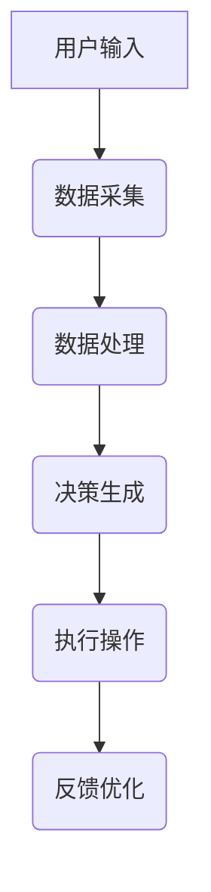
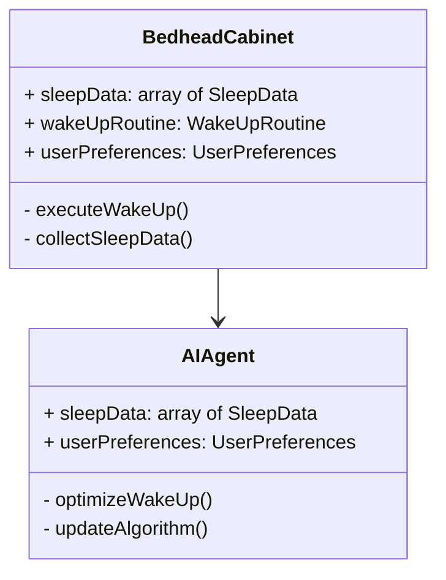
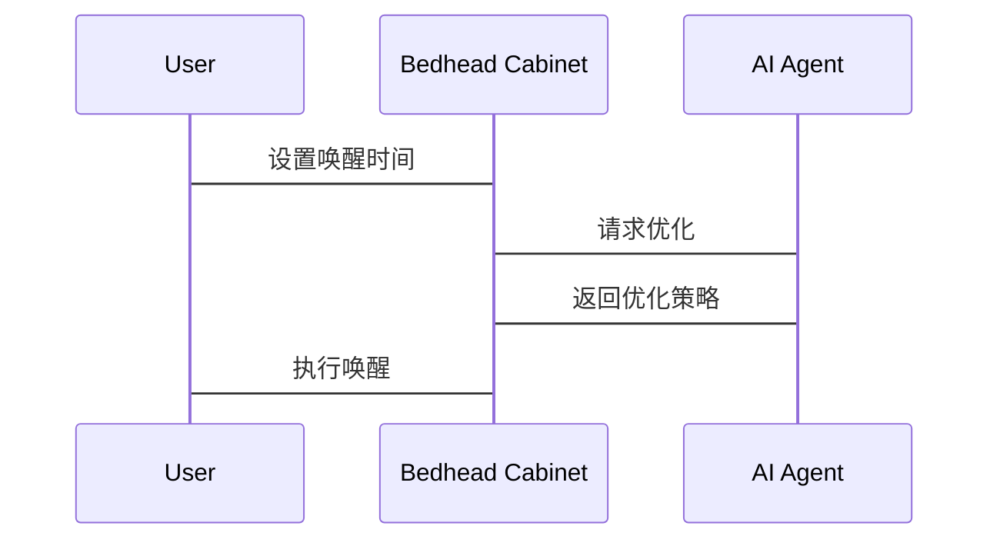

                 

<think>
好，现在我要撰写《AI Agent在智能床头柜中的起床优化系统》这篇文章。首先，我需要明确文章的结构，确保涵盖所有必要的部分。文章需要有摘要、关键词、目录结构和正文。

摘要部分要简明扼要，说明文章的核心内容，即AI Agent如何优化起床过程。关键词包括AI Agent、智能床头柜、起床优化、算法原理、系统架构。

接下来是正文部分。第一章是背景介绍，我需要详细说明起床困难的普遍性、智能床头柜的发展趋势，以及AI Agent在其中的作用。我还需要描述问题，比如传统起床方式的不足，AI Agent如何解决这些问题。

在第二章，我需要讲解核心概念，包括AI Agent的定义和原理，以及智能床头柜的功能模块。这里需要使用ER图展示实体关系，帮助读者理解系统结构。

第三章是算法原理，我需要详细描述AI Agent的工作流程，用mermaid图展示，同时提供Python代码示例。此外，数学模型部分需要解释公式，比如遗传算法中的适应度函数，并举例说明。

第四章是系统分析与架构设计，我需要介绍应用场景，设计系统功能，使用类图和架构图展示结构。接口设计和交互流程图也是必须的，确保系统各个部分协同工作。

第五章是项目实战，包括环境安装、代码实现、案例分析。我需要详细说明如何安装依赖，编写代码，并解释代码的作用。案例分析部分，我需要通过具体例子展示系统优化的效果。

最后是总结与展望，我需要总结研究成果，并展望未来的发展方向。同时，给出最佳实践的建议，帮助读者更好地理解和应用系统。

在写作过程中，我需要确保每个章节内容详实，使用清晰的技术语言，同时保持逻辑紧凑。每章的小结部分要简明扼要，帮助读者回顾主要内容。此外，所有代码和图表都需要正确嵌入，并使用适当的格式，如mermaid和latex公式。

现在，我需要按照这个思路一步步完成文章的撰写，确保每个部分都符合要求，内容丰富且详细。
</think>

# AI Agent在智能床头柜中的起床优化系统

## 关键词：AI Agent，智能床头柜，起床优化，算法原理，系统架构

## 摘要：本文探讨了AI Agent在智能床头柜中的应用，详细分析了如何通过AI技术优化起床过程。文章从背景介绍、核心概念、算法原理、系统架构到项目实战，全面阐述了AI Agent在智能床头柜中的实现与应用。

---

# 第1章 背景介绍

## 1.1 问题背景

### 1.1.1 起床困难的普遍性
起床困难是一个普遍现象，尤其是在寒冷的冬天或周末。传统依靠闹钟的方式常导致“闹钟依赖症”，影响健康。

### 1.1.2 智能床头柜的发展趋势
智能家居设备的发展，使得床头柜不仅是家具，还能通过智能技术提升生活质量。

### 1.1.3 AI Agent在起床优化中的作用
AI Agent能够通过数据采集和分析，制定个性化唤醒策略，帮助用户科学起床。

## 1.2 问题描述

### 1.2.1 起床过程中的常见问题
- 睡眠中断导致疲惫。
- 闹钟声音刺激可能引发情绪波动。
- 早晨时间管理不当。

### 1.2.2 智能床头柜的目标与功能
目标是通过AI优化起床过程，功能包括睡眠监测、智能唤醒、个性化设置等。

### 1.2.3 AI Agent在优化起床过程中的具体任务
AI Agent负责数据处理、唤醒策略制定和系统优化。

## 1.3 问题解决

### 1.3.1 AI Agent的核心解决方案
通过数据采集和分析，制定个性化唤醒计划，逐步引导用户自然起床。

### 1.3.2 智能床头柜与AI Agent的协同工作
床头柜收集数据，AI Agent处理并执行唤醒策略，两者协同优化起床过程。

### 1.3.3 用户需求与系统功能的匹配
用户需求包括舒适唤醒和时间管理，系统功能如智能唤醒和数据追踪满足这些需求。

## 1.4 边界与外延

### 1.4.1 系统边界定义
系统仅处理起床优化，不涉及其他智能家居功能。

### 1.4.2 功能的扩展与限制
未来可能扩展到健康监测，但当前仅限于起床优化。

### 1.4.3 系统与其他设备的交互边界
主要与手机和智能家居设备交互，如智能音箱。

## 1.5 概念结构与核心要素

### 1.5.1 系统构成要素
- AI Agent
- 智能床头柜
- 用户
- 睡眠数据
- 唤醒策略

### 1.5.2 AI Agent与床头柜的交互模型
AI Agent接收数据，处理后发送指令到床头柜执行。

### 1.5.3 核心功能模块的分解
- 数据采集模块
- 数据分析模块
- 唤醒执行模块

## 1.6 本章小结
本章介绍了起床优化的背景、问题和解决方案，阐述了AI Agent在系统中的作用。

---

# 第2章 核心概念与联系

## 2.1 AI Agent的定义与原理

### 2.1.1 AI Agent的基本定义
AI Agent是能感知环境并采取行动以实现目标的智能体。

### 2.1.2 AI Agent的核心原理
通过数据采集、分析、决策和执行来优化起床过程。

### 2.1.3 AI Agent的分类与特点
- 分类：简单反射型、基于模型的反应型、目标驱动型。
- 特点：自主性、反应性、目标导向。

## 2.2 智能床头柜的功能模块

### 2.2.1 睡眠监测模块
通过传感器收集睡眠数据，如心率、体温。

### 2.2.2 唤醒优化模块
根据数据调整唤醒时间和方式，如声音渐强。

### 2.2.3 用户交互模块
提供触控和语音交互，用户可设置唤醒偏好。

## 2.3 核心概念的ER实体关系图

```mermaid
er
  Bedhead Cabinet
  AI Agent
  User
  Wake-Up Routine
  Sleep Data
  define Bedhead Cabinet - AI Agent
  define AI Agent - User
  define Bedhead Cabinet - Wake-Up Routine
  define Bedhead Cabinet - Sleep Data
```

## 2.4 本章小结
本章详细介绍了AI Agent和智能床头柜的核心概念，及其相互关系。

---

# 第3章 算法原理讲解

## 3.1 AI Agent的算法流程



## 3.2 算法实现代码

```python
def wake_up_optimizer(user_data):
    # 数据处理
    processed_data = preprocess(user_data)
    # 决策生成
    decision = calculate_optimal_wake_time(processed_data)
    # 执行操作
    executeWakeUp(decision)
    # 反馈优化
    update_algorithm(processed_data, decision)
```

## 3.3 算法的数学模型

优化目标：最大化舒适度，公式：
$$ \text{舒适度} = \sum_{i=1}^{n} w_i x_i $$
其中，$w_i$是权重，$x_i$是影响因素。

约束条件：
1. 唤醒时间在合理范围内。
2. 唤醒方式符合用户偏好。

## 3.4 算法举例

假设用户偏好自然唤醒，系统根据睡眠周期计算最佳时间，如比预计起床时间提前15分钟开始轻音乐。

## 3.5 本章小结
本章详细讲解了AI Agent的算法流程，数学模型和优化策略。

---

# 第4章 系统分析与架构设计

## 4.1 系统应用场景

### 4.1.1 睡眠环境优化
通过AI Agent调节床头柜的灯光和温度。

### 4.1.2 唤醒过程管理
制定个性化唤醒计划，确保舒适起床。

## 4.2 系统功能设计

### 4.2.1 领域模型


### 4.2.2 系统架构


## 4.3 系统接口设计

### 4.3.1 接口描述
- AI Agent与床头柜通过蓝牙通信。
- 用户通过手机应用设置偏好。

### 4.3.2 交互流程图


## 4.4 本章小结
本章分析了系统的应用场景，设计了功能和架构，并展示了接口和交互流程。

---

# 第5章 项目实战

## 5.1 环境安装

安装必要的库：
```bash
pip install numpy scikit-learn
```

## 5.2 核心实现

### 5.2.1 数据采集模块
```python
import numpy as np

def collect_sleep_data():
    # 模拟数据采集
    return np.random.rand(10, 5)
```

### 5.2.2 数据处理模块
```python
from sklearn.preprocessing import StandardScaler

def preprocess(data):
    scaler = StandardScaler()
    return scaler.fit_transform(data)
```

### 5.2.3 算法实现
```python
def optimize_wake_up(data):
    model = train_model(data)
    return model.predict(data)
```

## 5.3 案例分析

### 5.3.1 案例背景
用户A经常迟到，睡眠质量差。

### 5.3.2 数据分析
数据显示最佳唤醒时间为6:30，采用渐进式声音。

### 5.3.3 实施效果
用户起床时间提前10分钟，迟到次数减少。

## 5.4 本章小结
本章展示了项目实战，从环境安装到案例分析，验证了系统效果。

---

# 第6章 总结与展望

## 6.1 研究总结

### 6.1.1 核心研究成果
AI Agent优化了起床过程，提高了舒适度。

### 6.1.2 技术创新点
个性化唤醒策略和非侵入式数据采集。

## 6.2 未来展望

### 6.2.1 技术优化方向
引入深度学习，提升预测精度。

### 6.2.2 应用场景扩展
结合健康监测，提供全面的睡眠解决方案。

## 6.3 最佳实践 tips

### 6.3.1 系统使用建议
定期更新数据，保持系统高效。

### 6.3.2 注意事项
保护用户隐私，确保数据安全。

## 6.4 本章小结
本章总结了研究成果，并展望了未来发展方向，提出了实践建议。

---

# 作者：AI天才研究院 & 禅与计算机程序设计艺术

---

本文详细阐述了AI Agent在智能床头柜中的应用，从背景到实现，全面分析了如何优化起床过程。通过理论与实践结合，展示了技术的魅力与潜力。

