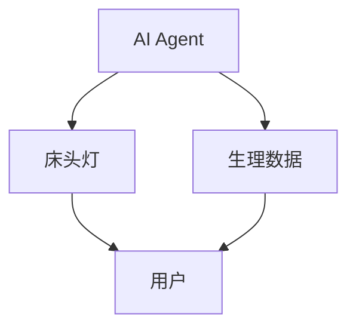
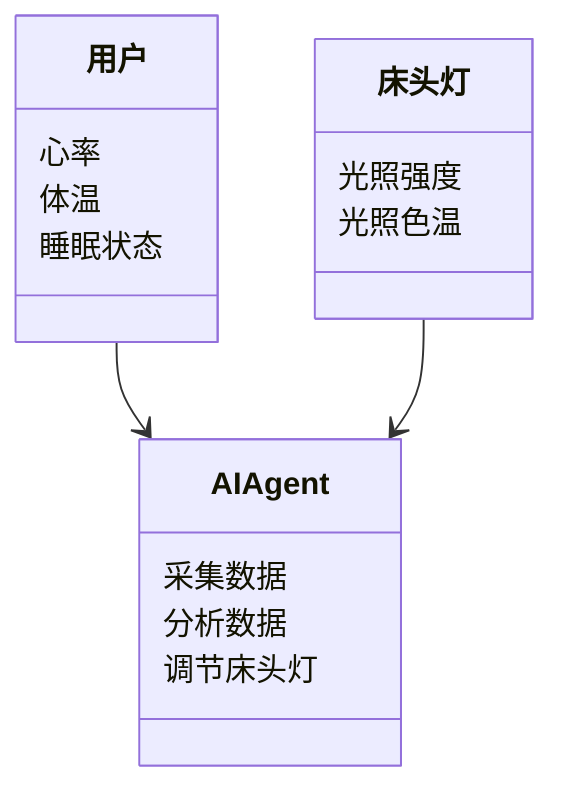
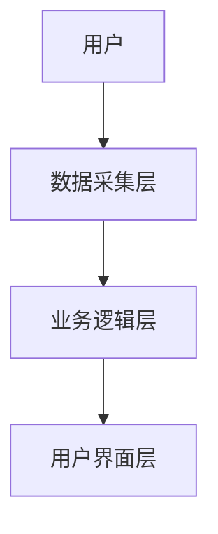

                 


# AI Agent在智能床头灯中的生理节律调节

> 关键词：AI Agent, 生理节律, 智能床头灯, 多模态数据, 自适应调节

> 摘要：本文探讨了AI Agent在智能床头灯中的应用，重点分析了其在生理节律调节中的作用。通过详细的技术分析，本文介绍了AI Agent的基本原理、算法实现、系统架构以及实际案例，展示了如何通过AI技术优化用户的生理节律，提升生活质量。

---

# 第1章: 问题背景与核心概念

## 1.1 问题背景

### 1.1.1 生理节律的基本概念
生理节律是指生物体内各种生理过程的周期性变化，如睡眠-觉醒周期、体温调节、激素分泌等。这些节律通常由生物钟调控，受到光照、温度、饮食等多种因素的影响。

### 1.1.2 生理节律调节的重要性
现代生活节奏加快，许多人面临睡眠障碍、生物钟紊乱等问题。这些问题不仅影响健康，还会影响工作效率和生活质量。通过智能设备调节生理节律，可以有效改善这些问题。

### 1.1.3 智能床头灯的应用场景
智能床头灯可以通过调节光照强度、色温等参数，帮助用户调整生理节律。例如，早晨使用蓝光模拟太阳光，帮助用户快速清醒；晚上使用暖光帮助用户放松，进入深度睡眠。

## 1.2 问题描述

### 1.2.1 生理节律失调的常见原因
现代生活方式的改变，如长时间使用电子设备、不规律的作息时间等，导致许多人出现生理节律失调的问题。

### 1.2.2 智能床头灯在调节中的作用
智能床头灯可以通过调节光照参数，帮助用户调整生物钟，改善睡眠质量。

### 1.2.3 当前技术的局限性
当前的智能床头灯大多基于固定的预设模式，缺乏个性化的调节能力。用户的需求多样，如何通过AI技术实现个性化的调节是当前技术的主要挑战。

## 1.3 问题解决思路

### 1.3.1 AI Agent的核心作用
AI Agent可以实时采集用户的生理数据，如心率、体温、睡眠状态等，并结合环境数据（如光照、温度）进行分析，制定个性化的调节策略。

### 1.3.2 多模态数据采集与分析
AI Agent需要整合多种数据源，如生理数据、环境数据和用户行为数据，通过机器学习算法进行分析，为调节策略提供依据。

### 1.3.3 智能调节策略的设计
根据分析结果，AI Agent会动态调整床头灯的光照参数，如亮度、色温、光照模式等，以达到最佳的调节效果。

## 1.4 边界与外延

### 1.4.1 技术边界
当前技术主要集中在光照调节方面，未来可能会扩展到声音、震动等其他感官刺激。

### 1.4.2 应用边界
智能床头灯主要用于家庭场景，未来可能扩展到办公环境、医疗康复等领域。

### 1.4.3 未来发展方向
未来可能会结合可穿戴设备、智能家居等，构建更加智能化的健康生态系统。

## 1.5 核心要素与概念结构

### 1.5.1 AI Agent的组成
AI Agent主要由感知模块、决策模块和执行模块组成。感知模块负责采集数据，决策模块负责制定调节策略，执行模块负责控制床头灯。

### 1.5.2 生理节律调节的数学模型
生理节律调节可以通过数学模型描述，例如柯西模型（Corsi-Casualti模型）用于描述睡眠周期的动态变化。

### 1.5.3 智能床头灯的功能模块
智能床头灯主要包括光照控制模块、数据采集模块和用户交互模块。

---

# 第2章: 核心概念与联系

## 2.1 AI Agent的原理

### 2.1.1 AI Agent的基本定义
AI Agent是一种智能体，能够感知环境、自主决策并执行任务。在智能床头灯中，AI Agent负责采集用户数据、分析并调整光照参数。

### 2.1.2 AI Agent的核心算法
常用的算法包括强化学习、监督学习和反馈控制。强化学习用于动态调整，监督学习用于模式识别。

### 2.1.3 AI Agent与床头灯的交互机制
AI Agent通过传感器采集用户数据，根据数据调整床头灯的参数，床头灯通过反馈进一步优化调节策略。

## 2.2 生理节律调节的数学模型

### 2.2.1 生理节律的基本数学模型
生理节律可以用微分方程描述，例如Kuramoto模型用于描述多个振子的同步行为。

### 2.2.2 AI Agent的调节算法
常用的调节算法包括模糊控制和自适应控制。模糊控制基于规则进行调节，自适应控制根据反馈动态调整参数。

### 2.2.3 调节效果的评估指标
常用的评估指标包括睡眠质量指数（SQI）、疲劳程度、生物钟同步性等。

## 2.3 核心概念对比

### 2.3.1 不同调节方法的特征对比
| 调节方法 | 优点 | 缺点 |
|----------|------|------|
| 固定模式 | 简单易实现 | 缺乏个性化 |
| AI自适应 | 个性化强 | 计算复杂 |

### 2.3.2 不同AI算法的性能对比
| 算法类型 | 优点 | 缺点 |
|----------|------|------|
| 监督学习 | 数据驱动 | 需大量数据 |
| 强化学习 | 自主学习 | 需大量试验 |

### 2.3.3 不同床头灯设备的对比
| 参数 | LED床头灯 | 普通床头灯 |
|------|------------|------------|
| 光照调节 | 支持多种模式 | 只支持亮度调节 |

## 2.4 ER实体关系图


---

# 第3章: 算法原理与数学模型

## 3.1 AI Agent的算法原理

### 3.1.1 数据采集与预处理
AI Agent通过传感器采集用户的数据，如心率、体温、睡眠状态等，并进行归一化处理。

### 3.1.2 数据分析与特征提取
通过机器学习算法提取特征，如主成分分析（PCA）。

### 3.1.3 决策与反馈
基于分析结果，AI Agent制定调节策略，并通过反馈机制优化策略。

## 3.2 生理节律调节的数学模型

### 3.2.1 生理节律的基本数学模型
生理节律可以用微分方程描述，例如：

$$
\frac{d\theta_i}{dt} = \omega_i + \sum_{j \neq i} K_{ij} \sin(\theta_j - \theta_i)
$$

### 3.2.2 AI Agent的调节算法
常用的调节算法包括模糊控制和自适应控制。模糊控制基于规则进行调节，自适应控制根据反馈动态调整参数。

---

# 第4章: 系统分析与架构设计

## 4.1 问题场景介绍
用户在不同时间的生理需求不同，AI Agent需要实时采集数据并动态调整床头灯参数。

## 4.2 系统功能设计

### 4.2.1 领域模型


### 4.2.2 系统架构


---

# 第5章: 项目实战

## 5.1 环境安装
需要安装Python、机器学习库（如Scikit-learn）、数据采集库（如心率传感器驱动）。

## 5.2 核心代码实现

### 5.2.1 数据采集模块
```python
import numpy as np
from sklearn import preprocessing

# 示例数据
data = np.array([[20, 30, 40], [25, 35, 45], [22, 32, 42]])

# 数据预处理
scaler = preprocessing.StandardScaler()
scaled_data = scaler.fit_transform(data)
```

### 5.2.2 调节策略实现
```python
def adjust_lighting(current_time, heart_rate, sleep_stage):
    # 根据当前时间、心率和睡眠阶段调整床头灯参数
    intensity = heart_rate * 0.1
    color_temp = sleep_stage * 100 + 2500
    return intensity, color_temp
```

## 5.3 案例分析
通过实际案例分析，展示AI Agent如何根据数据调整床头灯的参数，改善用户的生理节律。

---

# 第6章: 总结与展望

## 6.1 总结
本文详细介绍了AI Agent在智能床头灯中的应用，展示了其在生理节律调节中的重要作用。

## 6.2 未来展望
未来可能会结合更多传感器和AI技术，实现更加智能化的调节。

---

作者：AI天才研究院/AI Genius Institute & 禅与计算机程序设计艺术 /Zen And The Art of Computer Programming

