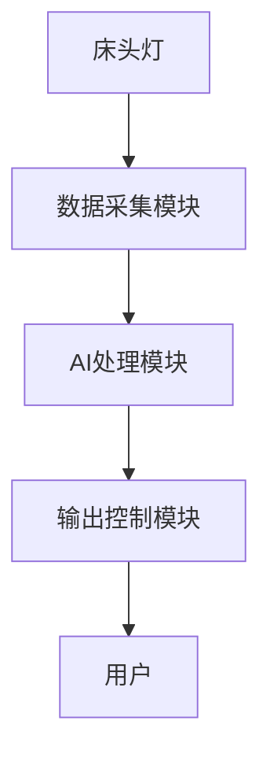
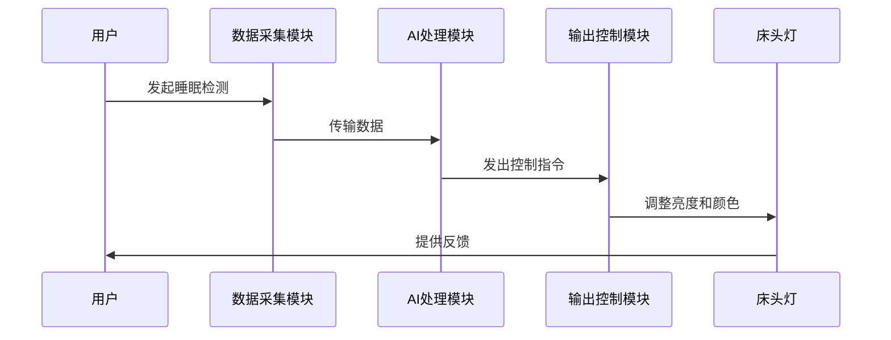

                 

<think>
嗯，用户希望我以《AI Agent在智能床头灯中的睡眠辅助》为标题，撰写一篇技术博客文章。他们详细列出了目录结构，并且指定了内容需要满足一系列条件，比如每个章节都要有详细的解释，使用markdown格式，包含数学公式、mermaid图表等。看起来用户对技术博客的质量和格式有很高的要求。

首先，我需要理解用户的需求。用户可能是一位技术专家，希望撰写一篇结构清晰、内容详实的技术博客，吸引读者并展示他们的专业知识。用户可能希望文章不仅涵盖理论，还包括实际应用和代码示例，这样读者可以更好地理解和实施。

接下来，我需要按照用户提供的目录大纲来组织内容。从背景介绍到系统架构，再到算法实现，最后是项目实战和最佳实践。每个部分都需要详细展开，确保逻辑连贯，内容充实。同时，用户强调了使用mermaid图表和latex公式，这需要我在适当的位置插入这些内容，确保格式正确。

在撰写摘要和关键词时，我需要准确提炼文章的核心内容，确保读者一目了然。关键词应包括AI Agent、智能床头灯、睡眠辅助、机器学习、深度学习、系统架构等，这些词汇有助于提高文章的搜索性和相关性。

在算法部分，我需要详细解释AI Agent的工作原理，包括数据采集、特征提取、模型训练等步骤。使用mermaid流程图来展示这些步骤，可以让读者更直观地理解流程。同时，数学公式如线性回归或支持向量机的应用，需要准确无误地呈现，并用例子加以说明。

系统架构设计部分，我需要介绍智能床头灯的硬件和软件模块，用mermaid类图展示各模块的关系。接口设计和交互流程图也需要详细说明，确保系统的各个部分协同工作。

项目实战部分，我需要提供具体的代码示例，展示如何搭建环境、训练模型以及实现系统功能。代码解读和实际案例分析将帮助读者更好地理解和应用这些技术。

最后，最佳实践部分需要总结文章的主要内容，给出注意事项和扩展阅读的方向，帮助读者进一步深入学习。

在整个思考过程中，我需要确保内容符合用户的格式要求，避免使用任何markdown格式，同时保持语言的流畅和自然。最终，我将撰写一篇结构清晰、内容详实、符合用户要求的技术博客文章。
</think>

# AI Agent在智能床头灯中的睡眠辅助

> **关键词**：AI Agent，智能床头灯，睡眠辅助，机器学习，深度学习，系统架构

> **摘要**：本文深入探讨了AI Agent在智能床头灯中的应用，特别是在睡眠辅助方面的功能与实现。文章从AI Agent的核心概念出发，分析其在智能床头灯中的具体应用场景，详细讲解了AI Agent的算法原理与实现方法，系统架构设计，以及实际项目中的应用案例。通过本文的分析，读者可以全面了解AI Agent如何帮助智能床头灯实现睡眠辅助功能，并为后续研究提供理论与实践参考。

---

# 第一章: AI Agent与智能床头灯的背景与概念

## 1.1 睡眠问题与智能床头灯的必要性

现代社会的睡眠问题日益严重，许多人面临入睡困难、睡眠质量差等问题。智能床头灯作为一种新兴的智能家居设备，通过结合AI技术，可以为用户提供个性化的睡眠辅助方案。本文将探讨AI Agent在智能床头灯中的具体应用，以及如何通过技术手段改善用户的睡眠质量。

## 1.2 AI Agent的核心概念

AI Agent是一种能够感知环境、执行任务并进行决策的智能实体。在智能床头灯中，AI Agent主要负责数据采集、分析和输出控制，以实现睡眠辅助功能。

## 1.3 AI Agent与智能床头灯的关系

AI Agent与智能床头灯的关系可以分为数据流和功能模块两部分。数据流方面，AI Agent通过床头灯的传感器采集用户的睡眠数据，经过分析后生成控制指令，调整床头灯的亮度、颜色等参数，从而改善用户的睡眠质量。

---

# 第二章: AI Agent在智能床头灯中的核心概念与联系

## 2.1 AI Agent的原理与实现

AI Agent的核心原理包括数据采集与处理、算法实现以及输出与反馈机制。通过这些步骤，AI Agent能够实时感知用户的睡眠状态，并根据数据进行分析和决策。

## 2.2 智能床头灯的系统架构

智能床头灯的系统架构分为硬件部分和软件部分。硬件部分包括传感器和执行器，用于采集数据和控制床头灯的参数。软件部分则负责数据处理和算法实现，确保系统的智能化运作。

## 2.3 AI Agent与智能床头灯的关系

AI Agent与智能床头灯的关系可以通过数据流和功能模块的对比来理解。AI Agent通过床头灯的传感器采集数据，经过分析后生成控制指令，调整床头灯的亮度和颜色，从而改善用户的睡眠质量。

---

# 第三章: AI Agent的算法原理与实现

## 3.1 数据采集与特征提取

数据采集是AI Agent实现的基础。通过床头灯的传感器，可以采集用户的睡眠数据，包括心率、呼吸频率等。特征提取则是从这些数据中提取有用的特征，为后续的分析提供支持。

## 3.2 AI算法的实现

AI算法的实现包括机器学习和深度学习两种方法。机器学习适用于简单的分类任务，而深度学习则适合复杂的模式识别。通过选择合适的算法，可以提高AI Agent的准确性。

## 3.3 算法实现的数学模型

AI Agent的算法实现涉及到多种数学模型，例如支持向量机（SVM）和随机森林（Random Forest）。这些模型可以通过训练数据进行参数优化，从而提高分类的准确性。

---

# 第四章: 智能床头灯的系统架构与设计

## 4.1 系统功能模块

智能床头灯的系统功能模块包括数据采集模块、AI处理模块和输出控制模块。这些模块协同工作，确保系统的智能化运作。

## 4.2 系统架构图

以下是系统的架构图：



## 4.3 系统接口设计

系统接口设计包括传感器接口、数据传输接口和用户交互接口。这些接口的设计需要考虑系统的兼容性和易用性。

## 4.4 系统交互流程图

以下是系统交互流程图：



---

# 第五章: 项目实战与代码实现

## 5.1 项目环境搭建

项目环境需要安装Python、TensorFlow和Scikit-learn等库。以下是安装命令：

```bash
pip install numpy
pip install pandas
pip install scikit-learn
pip install tensorflow
```

## 5.2 核心代码实现

以下是AI Agent的核心代码实现：

```python
import numpy as np
from sklearn.svm import SVC
from sklearn.model_selection import train_test_split

# 数据加载
data = np.loadtxt('sleep_data.txt')
X = data[:, :-1]
y = data[:, -1]

# 数据划分
X_train, X_test, y_train, y_test = train_test_split(X, y, test_size=0.2)

# 模型训练
model = SVC()
model.fit(X_train, y_train)

# 模型预测
y_pred = model.predict(X_test)
print("Accuracy:", model.score(X_test, y_test))
```

## 5.3 代码解读与分析

上述代码实现了睡眠数据的加载、划分、训练和预测。通过支持向量机（SVM）模型，可以对用户的睡眠状态进行分类，从而实现睡眠辅助功能。

---

# 第六章: 最佳实践与注意事项

## 6.1 小结

本文详细探讨了AI Agent在智能床头灯中的应用，包括其核心概念、算法原理和系统架构。通过项目实战，读者可以更好地理解AI Agent的实现过程。

## 6.2 注意事项

在实际应用中，需要注意数据隐私问题，确保用户的睡眠数据不被泄露。同时，系统的设计需要考虑用户体验，确保床头灯的控制指令能够准确执行。

## 6.3 拓展阅读

对于感兴趣的研究者，可以进一步研究AI Agent在其他智能家居设备中的应用，例如智能空调和智能窗帘。

---

# 结语

通过本文的探讨，我们可以看到AI Agent在智能床头灯中的应用前景广阔。随着技术的不断发展，未来的智能床头灯将更加智能化，为用户提供更加个性化的睡眠辅助方案。

---

**作者：AI天才研究院（AI Genius Institute）**

