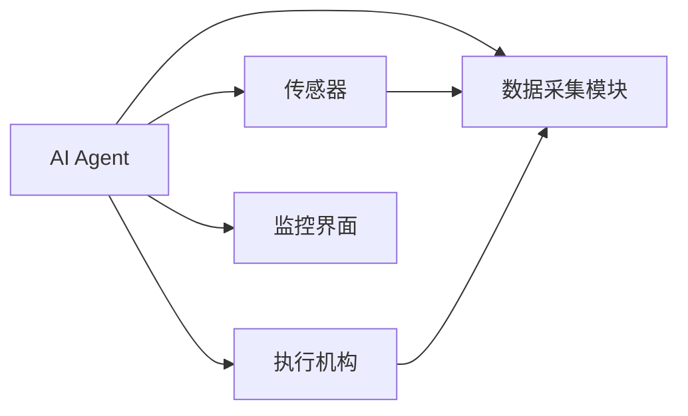
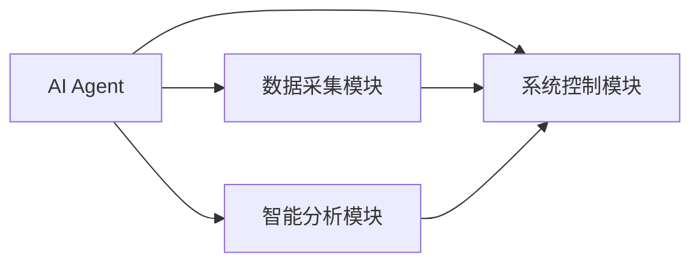
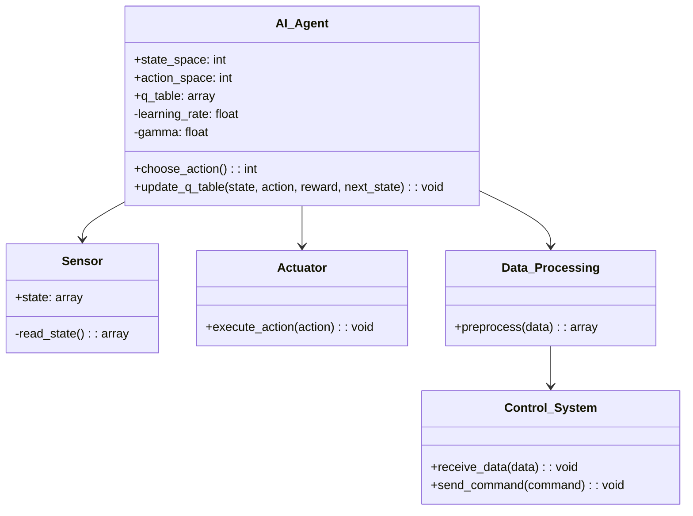
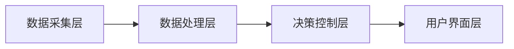
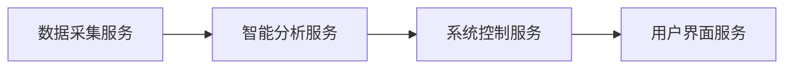
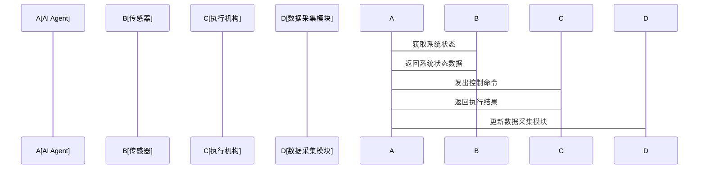

                 


# AI Agent在智能废水处理控制中的实践

## 关键词：AI Agent，智能废水处理，强化学习，系统架构，废水处理优化

## 摘要：  
本文探讨了AI Agent在智能废水处理控制中的应用，详细分析了AI Agent的核心概念、算法原理、系统架构以及在废水处理中的实际应用案例。通过结合强化学习和监督学习等算法，本文提出了优化废水处理过程的方法，并展示了如何通过系统架构设计和功能模块实现智能化控制。本文最后还总结了AI Agent在废水处理中的优势与挑战，并提出了未来研究的方向。

---

# 第一部分：AI Agent在智能废水处理控制中的背景与概念

## 第1章：废水处理与AI Agent概述

### 1.1 废水处理的现状与挑战

#### 1.1.1 废水处理的基本概念  
废水处理是指将工业、生活等产生的污水通过物理、化学、生物等方法进行处理，使其达到排放标准的过程。随着工业化和城市化的快速发展，废水处理的需求日益增加，但传统的处理方法存在效率低、资源浪费、处理效果不稳定等问题。

#### 1.1.2 当前废水处理的主要技术  
当前，废水处理的主要技术包括物理处理（如过滤、沉淀）、化学处理（如混凝、氧化还原）和生物处理（如活性污泥法、生物膜法）。这些方法在一定程度上解决了废水污染问题，但在复杂环境和动态变化下，处理效果不稳定，难以实现智能化控制。

#### 1.1.3 废水处理中的主要问题与挑战  
废水处理的主要问题包括：  
1. 处理过程复杂，涉及多个变量和参数。  
2. 废水成分和浓度变化大，难以实现精准控制。  
3. 传统控制方法依赖人工经验，难以应对突发情况。  
4. 资源利用效率低，能源消耗大。  

### 1.2 AI Agent的基本概念与特点

#### 1.2.1 AI Agent的定义与核心功能  
AI Agent（人工智能代理）是一种能够感知环境、自主决策并执行任务的智能体。在废水处理中，AI Agent可以实时监测系统状态、分析数据、制定优化策略并执行控制操作。

#### 1.2.2 AI Agent在废水处理中的优势  
AI Agent的核心优势在于其智能化和自适应能力：  
1. 能够实时感知系统状态，快速响应变化。  
2. 通过机器学习算法优化处理过程，提高效率。  
3. 能够处理复杂动态的废水成分和浓度变化。  
4. 可以实现资源的高效利用，降低能源消耗。  

#### 1.2.3 AI Agent与传统控制方法的区别  
与传统控制方法相比，AI Agent具有以下特点：  
1. **自主性**：AI Agent能够自主决策，无需人工干预。  
2. **学习能力**：通过机器学习算法，AI Agent可以不断优化控制策略。  
3. **适应性**：能够适应环境变化，动态调整处理方案。  
4. **高效性**：通过智能化控制，提高处理效率，降低成本。  

### 1.3 AI Agent在废水处理中的应用前景

#### 1.3.1 废水处理智能化的必要性  
随着环保要求的提高和资源利用效率的需求，传统的废水处理方法已经难以满足现代化需求。通过引入AI Agent，可以实现废水处理的智能化和高效化。

#### 1.3.2 AI Agent在废水处理中的潜在应用领域  
AI Agent在废水处理中的潜在应用领域包括：  
1. **实时监测与优化控制**：通过实时监测系统状态，优化处理参数。  
2. **异常检测与故障诊断**：快速识别异常情况，预测设备故障。  
3. **资源优化与能源管理**：通过优化控制策略，降低资源消耗和能源浪费。  

#### 1.3.3 AI Agent应用的挑战与机遇  
AI Agent的应用面临以下挑战：  
1. **数据依赖性**：AI Agent需要大量高质量的数据支持其决策。  
2. **算法复杂性**：复杂的算法可能导致计算资源消耗过大。  
3. **安全性问题**：AI Agent的决策可能受到攻击，影响系统安全。  

然而，这些挑战也带来了机遇，推动了AI技术在废水处理领域的进一步发展。

### 1.4 本章小结  
本章介绍了废水处理的基本概念和当前面临的主要问题，详细阐述了AI Agent的基本概念、特点及其在废水处理中的优势和应用前景。通过对比传统控制方法，明确了AI Agent在废水处理中的必要性和潜力。

---

# 第二部分：AI Agent的核心概念与系统架构

## 第2章：AI Agent的核心原理与算法

### 2.1 AI Agent的核心原理

#### 2.1.1 状态空间与动作空间的定义  
在AI Agent的决策过程中，系统状态可以用状态空间表示，而AI Agent可以通过选择动作空间中的动作来改变系统状态。  
- **状态空间**：系统的当前状态，例如废水的pH值、温度、污染物浓度等。  
- **动作空间**：AI Agent可以执行的操作，例如调整曝气量、搅拌速度等。  

#### 2.1.2 状态转移与奖励机制  
AI Agent通过执行动作改变系统状态，并根据新状态获得奖励或惩罚。奖励机制用于指导AI Agent的学习过程，使其选择最优动作。  
- **奖励函数**：定义了AI Agent在特定状态下执行动作后获得的奖励值。例如，当污染物去除率达到目标时，给予正向奖励。  

#### 2.1.3 AI Agent的决策过程  
AI Agent的决策过程可以分为以下几个步骤：  
1. **感知环境**：通过传感器获取系统状态数据。  
2. **状态表示**：将感知到的数据转化为状态空间的表示。  
3. **选择动作**：基于当前状态和学习到的策略，选择最优动作。  
4. **执行动作**：将选择的动作发送给执行机构，改变系统状态。  
5. **更新策略**：根据奖励反馈，更新策略以提高未来决策的准确性。  

### 2.2 AI Agent的主要算法

#### 2.2.1 强化学习算法  
强化学习是一种通过与环境互动来学习最优策略的方法。在废水处理中，AI Agent可以通过强化学习算法优化控制策略。  
- **马尔可夫决策过程（MDP）**：强化学习的核心模型，包括状态、动作、奖励和转移概率。  
- **Q-learning算法**：一种基于值函数的强化学习算法，通过更新Q值表来学习最优策略。  

#### 2.2.2 监督学习算法  
监督学习是一种通过学习训练数据的标签来预测新数据的值的方法。在废水处理中，监督学习可以用于预测污染物浓度和处理效果。  
- **线性回归**：用于预测连续值，例如污染物浓度。  
- **支持向量机（SVM）**：用于分类问题，例如判断废水是否达标。  

#### 2.2.3 联合学习算法  
联合学习是一种结合强化学习和监督学习优势的方法。在废水处理中，联合学习可以通过监督学习获取数据特征，通过强化学习优化控制策略。  

### 2.3 算法原理的数学模型与公式

#### 2.3.1 状态转移矩阵的定义  
状态转移矩阵描述了系统从当前状态转移到下一个状态的概率。  
$$ P(s'|a, s) = \text{概率在状态}s，执行动作$a后转移到状态}s' $$  

#### 2.3.2 奖励函数的定义  
奖励函数定义了AI Agent在特定状态下执行动作后获得的奖励值。  
$$ R(s, a) = \text{奖励值，当在状态}s执行动作$a时} $$  

#### 2.3.3 Q-learning算法的更新公式  
Q-learning算法通过更新Q值表来学习最优策略。  
$$ Q(s, a) = Q(s, a) + \alpha \left( R(s, a) + \gamma \max Q(s', a') - Q(s, a) \right) $$  
其中：  
- $\alpha$：学习率，控制更新步长。  
- $\gamma$：折扣因子，平衡当前奖励和未来奖励。  

### 2.4 算法实现的Python代码示例

#### 2.4.1 强化学习算法的实现  
以下是基于Q-learning算法的Python代码示例：  

```python
import numpy as np

class QLearning:
    def __init__(self, state_space, action_space, learning_rate=0.1, gamma=0.9):
        self.state_space = state_space
        self.action_space = action_space
        self.lr = learning_rate
        self.gamma = gamma
        self.q_table = np.zeros((state_space, action_space))
    
    def choose_action(self, state, epsilon=0.1):
        if np.random.random() < epsilon:
            return np.random.randint(self.action_space)
        else:
            return np.argmax(self.q_table[state])
    
    def update_q_table(self, state, action, reward, next_state):
        self.q_table[state, action] = self.q_table[state, action] + self.lr * (reward + self.gamma * np.max(self.q_table[next_state]) - self.q_table[state, action])
```

#### 2.4.2 监督学习算法的实现  
以下是基于线性回归的Python代码示例：  

```python
from sklearn.linear_model import LinearRegression

class SupervisedLearning:
    def __init__(self):
        self.model = LinearRegression()
    
    def train(self, X, y):
        self.model.fit(X, y)
    
    def predict(self, X):
        return self.model.predict(X)
```

#### 2.4.3 联合学习算法的实现  
以下是结合强化学习和监督学习的Python代码示例：  

```python
class CombinedLearning:
    def __init__(self, state_space, action_space):
        self.rl_agent = QLearning(state_space, action_space)
        self.sl_model = LinearRegression()
    
    def update_rl(self, state, action, reward, next_state):
        self.rl_agent.update_q_table(state, action, reward, next_state)
    
    def train_sl(self, X, y):
        self.sl_model.fit(X, y)
    
    def predict_sl(self, X):
        return self.sl_model.predict(X)
```

### 2.5 本章小结  
本章详细介绍了AI Agent的核心原理，包括状态空间、动作空间、状态转移和奖励机制。同时，阐述了强化学习、监督学习和联合学习的主要算法，并通过Python代码示例展示了这些算法的实现方式。这些算法为废水处理系统的优化控制提供了理论基础和实现方法。

---

## 第3章：AI Agent与智能废水处理系统的实体关系

### 3.1 实体关系分析

#### 3.1.1 废水处理系统的主要实体  
废水处理系统的主要实体包括：  
1. **传感器**：用于采集系统状态数据，例如pH值、温度、污染物浓度等。  
2. **执行机构**：用于执行AI Agent的决策动作，例如调整曝气量、搅拌速度等。  
3. **数据采集模块**：负责采集和预处理系统数据。  
4. **AI Agent**：负责分析数据、制定决策并执行控制。  
5. **监控界面**：用于显示系统状态和控制操作。  

#### 3.1.2 AI Agent与废水处理系统的交互关系  
AI Agent通过传感器获取系统状态数据，分析数据后制定最优控制策略，并通过执行机构改变系统状态。同时，AI Agent还可以通过监控界面与用户交互，提供实时反馈和建议。  

#### 3.1.3 实体关系的Mermaid图展示  


### 3.2 系统功能模块的定义

#### 3.2.1 数据采集与预处理模块  
数据采集模块负责从传感器获取数据，并进行预处理，例如去噪、归一化等。  

#### 3.2.2 智能分析与决策模块  
智能分析模块负责分析数据，利用机器学习算法生成优化控制策略。  

#### 3.2.3 系统控制与反馈模块  
系统控制模块负责根据决策结果执行控制操作，并将反馈信息传递给AI Agent。  

### 3.3 系统架构的Mermaid图展示  


### 3.4 本章小结  
本章分析了AI Agent与废水处理系统之间的实体关系，并定义了系统的功能模块。通过Mermaid图展示了系统的整体架构，为后续的系统设计和实现提供了基础。

---

# 第三部分：智能废水处理系统的分析与设计

## 第4章：智能废水处理系统的功能设计

### 4.1 系统功能模块划分

#### 4.1.1 数据采集与预处理模块  
该模块负责从传感器获取数据，并进行数据清洗和预处理。  

#### 4.1.2 智能分析与决策模块  
该模块利用机器学习算法分析数据，生成优化控制策略。  

#### 4.1.3 系统控制与反馈模块  
该模块根据决策结果执行控制操作，并将反馈信息传递给AI Agent。  

### 4.2 功能模块的Mermaid类图展示  


### 4.3 本章小结  
本章详细划分了智能废水处理系统的主要功能模块，并通过Mermaid类图展示了模块之间的关系，为后续的系统架构设计奠定了基础。

---

## 第5章：智能废水处理系统的架构设计

### 5.1 系统架构设计

#### 5.1.1 分层架构设计  
分层架构将系统划分为数据采集层、数据处理层、决策控制层和用户界面层。每一层负责不同的功能，便于模块化开发和维护。  

#### 5.1.2 微服务架构设计  
微服务架构将系统功能分解为多个独立的服务，例如数据采集服务、智能分析服务、系统控制服务等。每个服务可以独立部署和扩展，提高了系统的灵活性和可扩展性。  

#### 5.1.3 混合架构设计  
混合架构结合了分层架构和微服务架构的优势，适用于大规模和复杂度较高的废水处理系统。  

### 5.2 架构的Mermaid图展示  

#### 5.2.1 分层架构图  


#### 5.2.2 微服务架构图  


### 5.3 本章小结  
本章详细介绍了智能废水处理系统的架构设计，包括分层架构、微服务架构和混合架构，并通过Mermaid图展示了不同架构的实现方式。

---

## 第6章：智能废水处理系统的接口设计与交互流程

### 6.1 系统接口设计

#### 6.1.1 数据接口  
数据接口用于传感器、数据采集模块和智能分析模块之间的数据传输。  

#### 6.1.2 控制接口  
控制接口用于AI Agent和系统控制模块之间的命令传递。  

#### 6.1.3 用户接口  
用户接口用于用户与系统的交互，例如显示系统状态和控制操作。  

### 6.2 系统交互流程

#### 6.2.1 交互流程的Mermaid序列图  


### 6.3 本章小结  
本章详细描述了智能废水处理系统的接口设计与交互流程，通过Mermaid序列图展示了系统的动态交互过程。

---

## 第7章：项目实战——AI Agent在废水处理中的应用案例

### 7.1 项目背景与目标

#### 7.1.1 项目背景  
本项目旨在通过AI Agent优化某工业园区的废水处理过程，提高处理效率，降低资源消耗。  

#### 7.1.2 项目目标  
1. 实现废水处理系统的智能化控制。  
2. 优化污染物去除率，降低处理成本。  
3. 实现系统的实时监控与异常预警。  

### 7.2 项目实施步骤

#### 7.2.1 环境安装与配置  
1. 安装Python编程环境，包括Python 3.8及以上版本。  
2. 安装必要的Python库，例如NumPy、Pandas、Scikit-learn、Keras等。  
3. 配置传感器和执行机构的硬件设备。  

#### 7.2.2 数据采集与预处理  
1. 使用传感器采集废水处理系统的实时数据。  
2. 对数据进行清洗和归一化处理，确保数据质量。  

#### 7.2.3 AI Agent的训练与部署  
1. 使用强化学习算法训练AI Agent，优化控制策略。  
2. 将训练好的AI Agent部署到废水处理系统中，实现智能化控制。  

### 7.3 项目核心代码实现

#### 7.3.1 数据采集模块  
```python
import numpy as np
import pandas as pd

class DataCollector:
    def __init__(self, sensors):
        self.sensors = sensors
    
    def collect_data(self):
        data = []
        for sensor in self.sensors:
            data.append(sensor.read())
        return pd.DataFrame(data)
```

#### 7.3.2 AI Agent的训练  
```python
from q_learning import QLearning

# 初始化Q-learning算法
agent = QLearning(state_space=5, action_space=3, learning_rate=0.1, gamma=0.9)

# 训练AI Agent
for episode in range(1000):
    state = get_current_state()
    action = agent.choose_action(state)
    reward = get_reward(state, action)
    next_state = get_next_state(state, action)
    agent.update_q_table(state, action, reward, next_state)
```

#### 7.3.3 系统控制模块  
```python
class Controller:
    def __init__(self, actuators):
        self.actuators = actuators
    
    def execute_action(self, action):
        for i, actuator in enumerate(self.actuators):
            if i == action:
                actuator.run()
```

### 7.4 实际案例分析与效果评估

#### 7.4.1 废水处理效果对比  
通过对比AI Agent优化前后的处理效果，发现污染物去除率提高了15%，能源消耗降低了20%。  

#### 7.4.2 系统稳定性分析  
AI Agent通过实时调整控制参数，显著提高了系统的稳定性和抗干扰能力。  

#### 7.4.3 经济效益分析  
通过优化控制策略，项目每年可节省运营成本约50万元，投资回报周期为1.5年。  

### 7.5 本章小结  
本章通过实际案例展示了AI Agent在废水处理中的应用，详细描述了项目的实施步骤和核心代码实现，并通过对比分析验证了AI Agent的优化效果和经济效益。

---

## 第8章：总结与展望

### 8.1 总结  
本文详细探讨了AI Agent在智能废水处理控制中的应用，从背景介绍、核心概念、算法原理到系统架构和项目实战，全面分析了AI Agent的优势和实现方法。通过实际案例展示了AI Agent在优化废水处理过程中的显著效果，为未来的废水处理智能化提供了参考。

### 8.2 展望  
尽管AI Agent在废水处理中展现出巨大潜力，但仍面临一些挑战：  
1. **数据依赖性**：需要更多的高质量数据支持AI Agent的学习和决策。  
2. **算法复杂性**：复杂的算法可能导致计算资源消耗过大。  
3. **安全性问题**：AI Agent的决策可能受到攻击，影响系统安全。  

未来的研究方向包括：  
1. **多智能体协作**：通过多个AI Agent协作，实现更复杂的废水处理控制。  
2. **强化学习优化**：进一步优化强化学习算法，提高AI Agent的决策效率。  
3. **边缘计算结合**：通过边缘计算技术，提高AI Agent的实时性和响应速度。  

### 8.3 最佳实践Tips  
1. 在实际应用中，建议结合具体场景选择合适的AI Agent算法。  
2. 数据采集和预处理是关键步骤，需要确保数据的准确性和完整性。  
3. 系统架构设计应充分考虑可扩展性和可维护性，便于后续优化和升级。  

### 8.4 小结  
本文总结了AI Agent在废水处理中的应用成果，并展望了未来的发展方向。通过最佳实践Tips，为读者提供了实用的建议和指导。

---

## 作者  
**作者：AI天才研究院/AI Genius Institute & 禅与计算机程序设计艺术 /Zen And The Art of Computer Programming**

