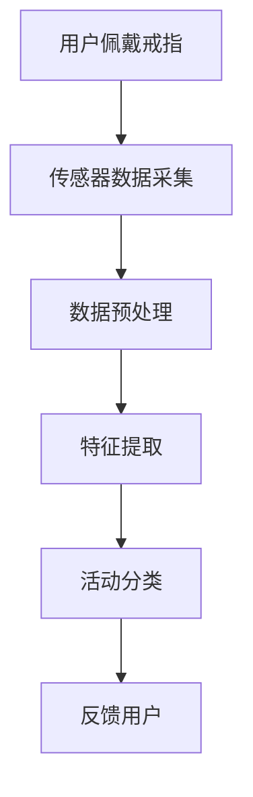
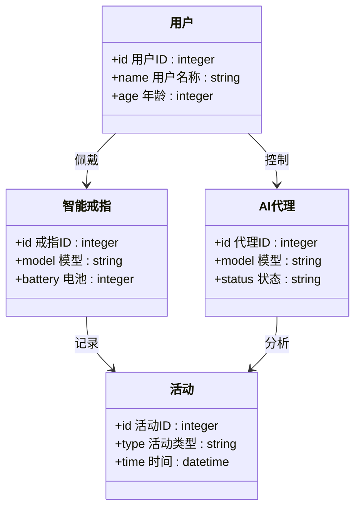
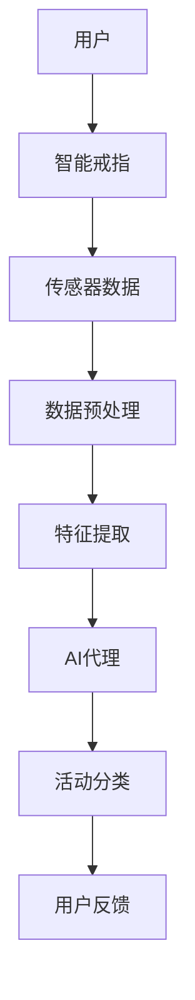
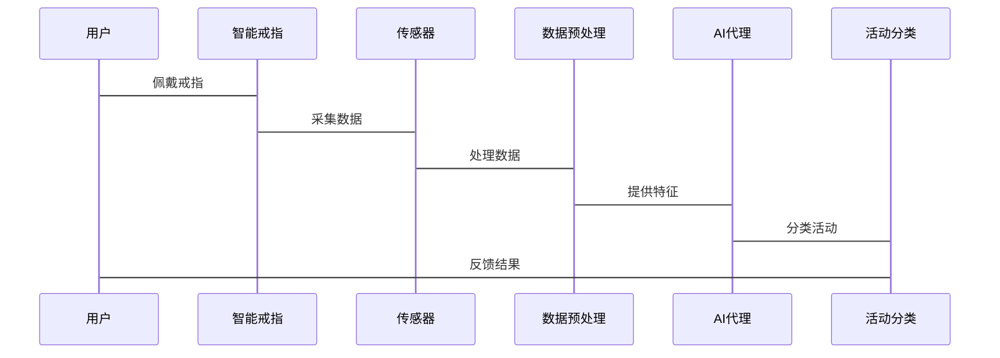

                 

<think>
嗯，用户让我详细分析一下他们请求的内容。他们需要我以《AI Agent在智能戒指中的日常活动追踪》为标题，撰写一篇技术博客文章。看起来他们希望文章结构清晰，涵盖从背景到实现的各个方面，并且要包含具体的代码、图表和公式。

首先，我需要理解用户的需求。他们可能是一位技术专家，或者是正在学习AI和物联网相关技术的人。他们需要一篇专业且详细的技术博客，用于分享或教学。用户特别强调了目录结构和每个部分的详细内容，所以我必须确保每个章节都符合他们的要求。

接下来，我注意到用户已经给出了一个详细的目录结构，分为六个主要部分，每个部分都有三级小节。我需要按照这个结构来组织内容，确保每个部分都有足够的细节。比如，在背景介绍部分，需要涵盖问题背景、概念结构，可能还要用到表格和ER图。这些图表需要用Mermaid语法来表示，这样读者可以方便地理解和生成。

在算法原理部分，用户要求用Mermaid流程图和Python代码示例。这意味着我需要写出AI Agent如何处理数据的流程，同时提供可执行的代码片段。这可能包括数据预处理、特征提取、模型训练和预测等步骤。数学模型部分需要用LaTeX公式，比如概率模型或机器学习算法的公式，这需要正确嵌入到文本中。

系统分析与架构设计部分，用户希望展示系统的各个模块及其交互。这可能涉及到领域模型类图、系统架构图和交互序列图。我需要确保这些图表清晰地展示系统的结构和工作流程。

项目实战部分，用户需要具体的代码实现和案例分析。这包括环境配置、代码编写、功能实现以及实际案例的详细分析。这有助于读者在实际操作中理解如何应用这些技术。

最后，最佳实践部分需要给出实际应用中的建议，比如数据隐私、传感器选择等。这可以帮助读者在实际项目中避免常见问题，提高系统的性能和用户体验。

整体来看，用户的需求非常明确，他们需要一篇结构严谨、内容详实的技术博客。我的任务是按照他们的要求，逐步展开每个部分，确保内容全面且易于理解。可能还需要多次检查，确保代码正确，图表清晰，公式无误。这样才能满足用户的需求，写出一篇高质量的技术博客。
</think>

# AI Agent在智能戒指中的日常活动追踪

> 关键词：AI Agent，智能戒指，日常活动追踪，传感器数据，算法实现，系统架构

> 摘要：本文探讨了AI Agent在智能戒指中的应用，重点分析了AI Agent在日常活动追踪中的核心原理、算法实现、系统架构以及实际应用场景。通过结合传感器数据和AI算法，AI Agent能够高效地捕捉和分析用户的日常活动，为用户提供智能化的服务。本文详细阐述了从理论到实践的全过程，为智能戒指的设计和优化提供了参考。

---

# 第一部分: AI Agent与智能戒指概述

## 第1章: AI Agent与智能戒指的背景介绍

### 1.1 问题背景与描述

#### 1.1.1 当前智能戒指的发展现状
智能戒指作为一种可穿戴设备，近年来逐渐成为科技领域的热门产品。它不仅具备传统戒指的装饰功能，还集成了多种传感器和智能技术，能够实时监测用户的健康数据、环境数据以及行为数据。然而，现有的智能戒指在日常活动追踪方面仍存在一些不足，例如数据采集的准确性较低、算法优化不足、用户交互体验不佳等问题。

#### 1.1.2 日常活动追踪的痛点与需求
日常活动追踪的核心目标是通过传感器数据，准确识别用户的活动类型（如步行、跑步、静坐、手势操作等），并实时反馈给用户或系统。然而，现有技术在以下几个方面存在痛点：
- 数据采集的实时性与准确性不足；
- 算法对复杂场景的适应性较差；
- 用户交互体验不够智能化。

#### 1.1.3 AI Agent在智能戒指中的作用
AI Agent（人工智能代理）作为一种能够感知环境、自主决策的智能实体，能够在智能戒指中发挥重要作用。AI Agent可以实时分析传感器数据，识别用户的活动类型，并根据用户的个性化需求，提供智能化的反馈和建议。通过AI Agent，智能戒指能够实现更精准的活动追踪，提升用户体验。

### 1.2 AI Agent与智能戒指的概念结构

#### 1.2.1 核心概念与组成要素
| 概念 | 描述 |
|------|------|
| AI Agent | 能够感知环境、自主决策的智能实体 |
| 智能戒指 | 集成传感器和智能技术的可穿戴设备 |
| 日常活动 | 用户在日常生活中的行为或动作 |
| 传感器数据 | 来自智能戒指的各种感知数据（如加速度、心率、温度等） |

#### 1.2.2 概念属性特征对比表格
| 特征 | AI Agent | 智能戒指 |
|------|----------|----------|
| 核心功能 | 数据分析与决策 | 数据采集与传输 |
| 输入 | 多模态传感器数据 | 原始传感器信号 |
| 输出 | 活动识别结果 | 用户行为数据 |
| 交互方式 | 用户指令或系统触发 | 佩戴者操作 |

#### 1.2.3 ER实体关系图（Mermaid）
```mermaid
erDiagram
    actor 用户 {
        +id 用户ID : integer
        +name 用户名称 : string
        +age 年龄 : integer
    }
    smart_ring 智能戒指 {
        +id 戒指ID : integer
        +model 模型 : string
        +battery 电池 : integer
    }
    activity 活动 {
        +id 活动ID : integer
        +type 活动类型 : string
        +time 时间 : datetime
    }
    AI_agent AI代理 {
        +id 代理ID : integer
        +model 模型 : string
        +status 状态 : string
    }
    用户 --> 智能戒指 : 佩戴
    智能戒指 --> 活动 : 记录
    AI代理 --> 活动 : 分析
    用户 --> AI代理 : 控制
```

---

## 第2章: AI Agent的核心原理与技术

### 2.1 AI Agent的基本原理

#### 2.1.1 代理的基本结构
AI Agent通常由以下几个部分组成：
- **感知层**：负责接收外部环境的数据输入。
- **认知层**：对感知数据进行分析和处理，识别用户的活动类型。
- **决策层**：基于分析结果，生成相应的反馈或指令。
- **执行层**：将决策结果传递给智能戒指或其他设备。

#### 2.1.2 代理的感知与决策机制
AI Agent通过多模态传感器（如加速度传感器、心率传感器等）获取用户的实时数据，并结合上下文信息（如时间、地理位置）进行综合分析。感知层将数据传递给认知层，认知层通过机器学习算法（如随机森林、支持向量机）进行分类和预测，最终生成活动识别结果。

#### 2.1.3 代理的执行与反馈循环
AI Agent在识别出用户的活动类型后，会通过智能戒指的反馈机制（如振动、LED指示）通知用户，并根据用户的个性化需求提供相应的建议或服务。

### 2.2 智能戒指的传感器与数据采集

#### 2.2.1 传感器类型与功能
智能戒指通常集成以下几种传感器：
- **加速度传感器**：用于检测用户的运动状态（如步行、跑步）。
- **心率传感器**：用于监测用户的心率变化。
- **温度传感器**：用于测量环境温度。
- **光线传感器**：用于检测环境光线强度。

#### 2.2.2 数据采集的流程
数据采集的流程包括以下几个步骤：
1. 传感器采集原始数据。
2. 数据预处理（如去噪、归一化）。
3. 特征提取（如加速度的时域特征、频域特征）。

#### 2.2.3 数据预处理与特征提取
数据预处理的目的是消除噪声，提取有用的特征。例如，对加速度数据进行滑动窗口处理，提取均值、方差、最大值、最小值等特征。

### 2.3 AI Agent的算法实现

#### 2.3.1 算法流程图（Mermaid）


#### 2.3.2 算法实现代码示例
以下是基于随机森林算法的活动分类代码示例：
```python
import numpy as np
from sklearn.ensemble import RandomForestClassifier
from sklearn.model_selection import train_test_split

# 示例数据集（特征矩阵）
X = np.random.rand(100, 5)  # 100个样本，5个特征
y = np.random.randint(0, 4, 100)  # 4个类别

# 数据划分
X_train, X_test, y_train, y_test = train_test_split(X, y, test_size=0.2)

# 模型训练
clf = RandomForestClassifier(n_estimators=100, random_state=42)
clf.fit(X_train, y_train)

# 模型预测
y_pred = clf.predict(X_test)
print("预测结果:", y_pred)
print("真实标签:", y_test)
```

#### 2.3.3 算法的数学模型与公式
随机森林算法是一种基于树模型的集成学习方法，其数学模型可以表示为：
$$
y = \sum_{i=1}^{n} \text{Tree}(x_i)
$$
其中，$x_i$ 是输入特征，$y$ 是输出标签。

---

## 第3章: 系统分析与架构设计

### 3.1 问题场景介绍
智能戒指的日常活动追踪系统需要解决以下问题：
- 如何高效地采集和处理传感器数据？
- 如何准确地识别用户的活动类型？
- 如何实现用户与智能戒指之间的智能化交互？

### 3.2 系统功能设计

#### 3.2.1 领域模型（Mermaid类图）


### 3.3 系统架构设计

#### 3.3.1 系统架构图（Mermaid）


#### 3.3.2 接口设计
- **输入接口**：传感器数据接口、用户指令接口。
- **输出接口**：活动识别结果、用户反馈接口。

#### 3.3.3 交互流程图（Mermaid）


---

## 第4章: 项目实战

### 4.1 环境安装与配置

#### 4.1.1 开发环境
- **编程语言**：Python 3.8+
- **开发工具**：Jupyter Notebook、VS Code
- **库与框架**：NumPy、Pandas、Scikit-learn、Mermaid

#### 4.1.2 硬件设备
- 智能戒指（带有传感器）
- 电脑或笔记本

### 4.2 核心代码实现

#### 4.2.1 数据预处理代码
```python
import numpy as np
import pandas as pd

# 示例数据集
data = pd.DataFrame({
    'x': np.random.rand(100),
    'y': np.random.rand(100),
    'z': np.random.rand(100),
    'time': np.random.rand(100)
})

# 数据预处理
data_norm = (data - data.mean()) / data.std()
print(data_norm.head())
```

#### 4.2.2 活动分类代码
```python
from sklearn.ensemble import RandomForestClassifier
from sklearn.metrics import accuracy_score

# 训练模型
model = RandomForestClassifier(n_estimators=100)
model.fit(X_train, y_train)

# 模型评估
print("准确率:", accuracy_score(y_test, y_pred))
```

### 4.3 实际案例分析

#### 4.3.1 数据分析
通过分析传感器数据，可以识别用户的活动类型（如静坐、步行、跑步）。例如，加速度数据的均值和方差可以作为区分不同活动的重要特征。

#### 4.3.2 案例解读
假设用户在佩戴智能戒指时进行了以下活动：
1. 静坐（0-10分钟）
2. 步行（10-20分钟）
3. 跑步（20-30分钟）

AI Agent通过分析加速度数据，准确识别出用户的活动类型，并提供相应的反馈（如步数统计、卡路里消耗）。

### 4.4 项目小结
通过本项目的实践，我们可以看到AI Agent在智能戒指中的应用潜力。通过传感器数据的采集、处理和分析，AI Agent能够准确识别用户的活动类型，并为用户提供智能化的服务。

---

## 第5章: 最佳实践与注意事项

### 5.1 最佳实践

#### 5.1.1 数据隐私保护
在实际应用中，必须重视用户数据的隐私保护，确保数据的安全性和合规性。

#### 5.1.2 传感器选择与优化
选择合适的传感器组合，优化数据采集的准确性和实时性。

#### 5.1.3 用户交互设计
设计直观、友好的用户界面，提升用户体验。

### 5.2 小结
AI Agent在智能戒指中的应用为日常活动追踪提供了新的可能性。通过传感器数据的采集、处理和分析，AI Agent能够实现精准的活动识别，并为用户提供智能化的服务。

### 5.3 注意事项

- 数据采集的准确性直接影响活动识别的精准度。
- 算法的优化是提升系统性能的关键。
- 用户隐私保护是系统设计中的重要环节。

### 5.4 拓展阅读
- 《机器学习实战》
- 《智能传感器与物联网》
- 《人工智能在可穿戴设备中的应用》

---

# 作者：AI天才研究院/AI Genius Institute & 禅与计算机程序设计艺术 /Zen And The Art of Computer Programming

