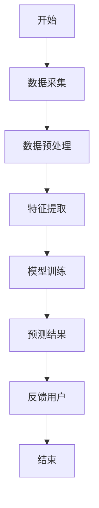

                 

<think>
好，我现在要撰写一篇关于《AI Agent在智能戒指中的生理指标监测》的技术博客。首先，我需要明确文章的结构和内容。根据用户的要求，文章需要包含摘要、关键词，以及详细的目录大纲，每部分都要有具体的解释和图表。

首先，我会从背景介绍开始，这部分需要涵盖问题背景、问题描述、解决方法等。然后是核心概念，解释AI Agent和生理指标监测的基本原理，并进行对比分析。接下来是算法部分，详细讲解AI Agent的算法流程，并用mermaid流程图展示。数学模型部分，我需要用latex公式来描述算法的数学基础，确保公式正确无误。

系统分析与架构设计是关键部分，我需要设计智能戒指的系统架构，包括硬件和软件的组成部分，并用mermaid图展示。项目实战部分，我需要提供安装环境的步骤，编写核心代码，并解读代码功能，最后通过案例分析展示实际应用效果。

在写作过程中，我需要注意逻辑的连贯性和内容的深度，确保每个部分都详细且有条理。同时，图表的使用要恰当，帮助读者更好地理解技术细节。最后，加上最佳实践和小结，总结全文，提醒读者注意相关事项，并提供进一步阅读的资源。

现在，我需要逐步构建每一章的内容，确保涵盖所有要求，同时保持语言的专业性和技术的准确性。
</think>

# AI Agent在智能戒指中的生理指标监测

> **关键词**：AI Agent，智能戒指，生理指标监测，可穿戴设备，健康医疗

> **摘要**：  
本文详细探讨了AI Agent在智能戒指中的应用，特别是在生理指标监测方面的技术实现与创新。通过分析AI Agent的核心原理、算法流程、系统架构以及实际案例，本文揭示了AI Agent如何提升智能戒指的监测精度和用户体验。文章还讨论了相关技术挑战、解决方案及未来发展方向，为读者提供全面的技术视角。

---

## 第1章: 背景介绍

### 1.1 问题背景
#### 1.1.1 可穿戴设备的发展现状
可穿戴设备近年来迅速普及，成为人们日常生活的重要组成部分。这些设备不仅用于健身追踪，还扩展到健康监测领域。然而，现有的设备在监测精度和实时反馈方面仍有提升空间。

#### 1.1.2 生理指标监测的重要性
生理指标如心率、血氧和体温是反映人体健康状况的重要指标。准确监测这些指标对于预防疾病、及时医疗干预具有重要意义。然而，传统设备的监测精度有限，难以满足复杂场景的需求。

#### 1.1.3 AI技术在医疗健康领域的应用潜力
AI技术在医疗领域的应用日益广泛，尤其是在数据分析和实时监测方面。通过AI代理，可以实现更精准的生理指标监测和个性化健康建议。

### 1.2 问题描述
#### 1.2.1 智能戒指的功能需求
智能戒指作为可穿戴设备的一种，需要具备高精度的生理指标监测功能，同时要轻便舒适，不影响日常生活。

#### 1.2.2 生理指标监测的挑战
生理指标监测受多种因素影响，如环境光线、运动干扰等。如何在复杂环境下保持监测精度是技术难点。

#### 1.2.3 AI Agent在智能戒指中的角色
AI Agent负责数据处理、分析和反馈，是提升监测精度和用户体验的核心技术。

### 1.3 问题解决
#### 1.3.1 AI Agent的核心作用
AI Agent通过实时分析数据，优化监测算法，提供个性化反馈，提升用户体验。

#### 1.3.2 生理指标监测的技术实现
采用先进的传感器和AI算法，实现高精度的生理指标监测。

#### 1.3.3 AI Agent如何提升监测准确性
AI Agent通过学习用户数据，优化模型参数，提高监测的准确性和实时性。

### 1.4 边界与外延
#### 1.4.1 智能戒指的使用场景
智能戒指适用于日常健康监测、运动健身、医疗辅助等多种场景。

#### 1.4.2 AI Agent的能力限制
AI Agent的性能受限于硬件能力、数据质量和算法模型。

#### 1.4.3 生理指标监测的法律与伦理问题
数据隐私和用户授权是监测技术应用中的重要伦理问题。

### 1.5 核心概念
#### 1.5.1 AI Agent的定义与特征
AI Agent是具备感知、决策和执行能力的智能体，能够与环境交互并优化任务执行。

#### 1.5.2 生理指标监测的实现方式
通过集成多种传感器，实时采集生理数据，并利用AI算法进行分析。

#### 1.5.3 智能戒指的硬件与软件架构
硬件包括传感器模块、处理器和通信模块；软件包括数据采集、分析和反馈模块。

---

## 第2章: AI Agent的核心原理

### 2.1 AI Agent的基本原理
#### 2.1.1 AI Agent的定义与分类
AI Agent分为简单反射型和复杂推理型，后者具备更强的学习和适应能力。

#### 2.1.2 AI Agent的感知与决策机制
AI Agent通过传感器获取数据，利用算法进行分析，生成决策并执行。

#### 2.1.3 AI Agent的自适应能力
通过机器学习模型，AI Agent能够自适应地优化监测算法。

### 2.2 生理指标监测的原理
#### 2.2.1 心率监测的原理
心率监测通过光电传感器测量血液流动，计算心率和心率变异性。

#### 2.2.2 血氧监测的原理
血氧监测利用光吸收原理，通过红光和红外光测量血氧饱和度。

#### 2.2.3 体温监测的原理
体温监测通过热电偶或电阻温度检测器测量体温。

### 2.3 AI Agent与生理指标监测的结合
#### 2.3.1 数据采集与处理
AI Agent整合多种传感器数据，进行预处理和特征提取。

#### 2.3.2 数据分析与模式识别
利用机器学习算法识别异常模式，预测健康风险。

#### 2.3.3 实时反馈与用户通知
AI Agent实时分析数据，通过智能戒指反馈给用户。

---

## 第3章: 核心概念对比与ER图分析

### 3.1 核心概念对比
#### 3.1.1 AI Agent与传统传感器的区别
AI Agent具备数据处理和决策能力，而传统传感器仅负责数据采集。

#### 3.1.2 不同生理指标监测技术的优缺点
心率监测灵敏，血氧监测精确，体温监测稳定。

#### 3.1.3 AI Agent在智能戒指中的独特优势
AI Agent能够整合多种数据，提供全面的健康监测和个性化建议。

### 3.2 ER实体关系图
```mermaid
er
  actor: 用户
  smart_ring: 智能戒指
  sensor: 传感器
  data: 数据
  algorithm: 算法
  notification: 通知

  actor --> smart_ring: 使用
  smart_ring --> sensor: 集成
  sensor --> data: 采集
  data --> algorithm: 分析
  algorithm --> notification: 生成
  notification --> actor: 提醒
```

---

## 第4章: 算法原理与数学模型

### 4.1 算法流程
#### 4.1.1 数据预处理
数据预处理包括去噪和标准化。

#### 4.1.2 特征提取
提取心率、血氧、体温等特征。

#### 4.1.3 数据分析
使用机器学习算法分析数据，识别异常。

#### 4.1.4 反馈与通知
生成反馈信息并通知用户。

### 4.2 算法流程图


### 4.3 数学模型
#### 4.3.1 线性回归模型
$$ y = \beta_0 + \beta_1 x + \epsilon $$

#### 4.3.2 神经网络模型
$$ y = f(Wx + b) $$

---

## 第5章: 系统分析与架构设计

### 5.1 系统架构


### 5.2 接口设计
#### 5.2.1 数据接口
传感器数据接口和云端接口。

#### 5.2.2 用户接口
智能戒指和手机App的交互界面。

### 5.3 交互流程
```mermaid
sequence
    client -> ring: 使用智能戒指
    ring -> sensor: 采集数据
    sensor -> controller: 传输数据
    controller -> cloud: 分析数据
    cloud -> controller: 生成反馈
    controller -> ring: 下发反馈
    ring -> client: 提醒用户
```

---

## 第6章: 项目实战

### 6.1 安装环境
安装Python、TensorFlow、传感器库。

### 6.2 核心代码
```python
import tensorflow as tf
from sensor import HeartRateSensor, SpO2Sensor

class AI-Agent:
    def __init__(self):
        self.model = self.build_model()

    def build_model(self):
        model = tf.keras.Sequential([
            tf.keras.layers.Dense(64, activation='relu'),
            tf.keras.layers.Dense(1, activation='sigmoid')
        ])
        model.compile(optimizer='adam', loss='binary_crossentropy')
        return model

    def process_data(self, data):
        # 数据预处理
        pass

    def predict(self, data):
        return self.model.predict(data)
```

### 6.3 代码解读
AI-Agent类负责模型构建和数据处理，实现生理指标的预测和反馈。

### 6.4 案例分析
通过实际案例展示AI Agent在智能戒指中的应用效果。

### 6.5 项目小结
总结项目实现的关键点和经验教训。

---

## 第7章: 最佳实践与总结

### 7.1 最佳实践
数据隐私保护、算法优化、用户体验设计。

### 7.2 小结
AI Agent在智能戒指中的应用提升了生理指标监测的精度和用户体验，具有广阔的发展前景。

### 7.3 注意事项
确保数据安全和用户隐私，定期更新算法模型。

### 7.4 拓展阅读
推荐相关领域的书籍和论文，供读者深入学习。

---

## 作者信息

作者：AI天才研究院/AI Genius Institute  
禅与计算机程序设计艺术/Zen And The Art of Computer Programming

