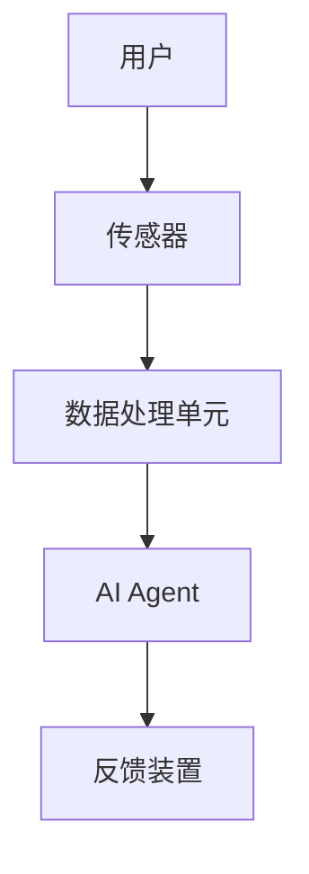

                 

<think>
好的，我现在需要帮助用户撰写一篇关于《AI Agent在智能手套中的手部康复训练》的技术博客文章。用户已经给出了详细的目录结构，我需要按照这个结构一步步进行思考和撰写。

首先，我应该先理解每个章节的内容和要求。从摘要开始，然后是关键词，接着是各个章节，每个章节下还有三级小节。我需要确保每个部分都涵盖必要的技术细节，并且语言专业且易懂。

在撰写过程中，我需要特别注意每个章节的核心内容，比如在算法原理部分，要详细讲解强化学习和监督学习，并用数学公式和代码示例来支持。同时，系统架构部分需要用Mermaid图来展示类图、架构图和交互图，确保读者能够清晰理解系统的结构。

我还需要确保文章整体逻辑清晰，结构紧凑，每个部分之间有良好的过渡。此外，用户要求文章末尾有作者信息，所以我会在最后加上相关的作者署名。

在撰写过程中，可能会遇到如何将AI Agent与智能手套结合起来的问题，尤其是在系统架构部分，我需要详细设计各模块之间的协作，确保AI Agent能够有效地指导手部康复训练。

此外，数学公式和代码部分需要准确无误，特别是强化学习的公式，要确保它们能够正确表达算法原理。代码部分则需要提供Python实现，并详细解读每一部分的功能，帮助读者理解如何实现这些算法。

最后，在项目实战部分，我需要提供具体的环境安装步骤，代码实现，并通过实际案例分析，让读者能够实际操作和应用所学知识。同时，在总结部分，我会回顾整篇文章，强调AI Agent在智能手套中的重要性，并给出实际应用中的注意事项和未来的发展方向。

总的来说，我需要系统地分解每个部分，确保每个章节和子章节都覆盖必要的内容，同时保持逻辑清晰，结构合理。这样，用户才能得到一篇内容丰富、结构严谨的技术博客文章，帮助他们深入理解AI Agent在智能手套中的应用。
</think>

# AI Agent在智能手套中的手部康复训练

> 关键词：AI Agent, 智能手套, 手部康复训练, 强化学习, 系统架构, 项目实战

> 摘要：本文探讨了AI Agent在智能手套中的应用，特别是在手部康复训练中的创新性解决方案。通过分析AI Agent的核心算法、智能手套的系统架构以及实际案例，本文展示了如何利用AI技术提高康复训练的效率和效果。文章详细介绍了强化学习和监督学习在康复训练中的应用，并通过实际项目展示了AI Agent在智能手套中的实现过程。

---

## 第一部分: AI Agent与智能手套概述

### 第1章: AI Agent与智能手套的背景介绍

#### 1.1 AI Agent的基本概念

##### 1.1.1 AI Agent的定义与特点

AI Agent（人工智能代理）是指能够感知环境并采取行动以实现目标的智能实体。其特点包括自主性、反应性、目标导向和学习能力。

- 自主性：AI Agent能够独立决策，无需外部干预。
- 反应性：能够实时感知环境变化并做出反应。
- 目标导向：所有行动均以实现特定目标为导向。
- 学习能力：通过数据和经验不断优化性能。

##### 1.1.2 AI Agent的核心功能与应用场景

AI Agent的核心功能包括数据采集、分析、决策和执行。应用场景广泛，如医疗康复、智能家居、自动驾驶等。

##### 1.1.3 AI Agent与传统算法的区别

与传统算法相比，AI Agent具有更强的自主性和适应性，能够根据环境变化动态调整策略。

#### 1.2 智能手套的基本概念

##### 1.2.1 智能手套的定义与组成

智能手套是一种结合了传感器、处理器和反馈装置的 wearable device，用于实时监测和反馈手部动作。

##### 1.2.2 智能手套的主要功能与技术特点

智能手套的主要功能包括手势识别、动作捕捉、实时反馈和康复训练。技术特点包括高灵敏度传感器、低延迟数据处理和用户友好设计。

##### 1.2.3 智能手套的应用场景与发展趋势

智能手套在医疗康复、工业自动化、虚拟现实等领域有广泛应用。发展趋势包括更智能化、更轻量化和更广泛的应用场景。

### 第2章: 手部康复训练的背景与挑战

#### 2.1 手部康复训练的基本概念

##### 2.1.1 手部康复训练的定义与目标

手部康复训练是指通过特定的运动和锻炼恢复手部功能的过程，目标是增强手部肌肉力量和灵活性。

##### 2.1.2 手部康复训练的主要方法与技术

手部康复训练的主要方法包括物理疗法、作业疗法和康复设备辅助疗法。技术包括传感器技术、数据处理技术和反馈技术。

##### 2.1.3 手部康复训练的现状与问题

目前手部康复训练主要依赖人工操作，存在效率低、个性化不足和反馈延迟等问题。

#### 2.2 AI Agent在手部康复训练中的应用背景

##### 2.2.1 AI技术在医疗康复中的应用现状

AI技术在医疗康复中的应用日益广泛，特别是在疾病诊断、治疗方案制定和康复训练方面。

##### 2.2.2 AI Agent在手部康复训练中的优势

AI Agent能够实时监测手部动作，提供个性化反馈，提高康复训练的效率和效果。

##### 2.2.3 手部康复训练中AI Agent的应用前景

AI Agent在手部康复训练中的应用前景广阔，能够实现个性化康复计划和实时反馈，显著提升康复效果。

---

## 第二部分: AI Agent的核心概念与算法原理

### 第3章: AI Agent在智能手套中的核心概念

#### 3.1 AI Agent与智能手套的结合原理

##### 3.1.1 AI Agent在智能手套中的功能定位

AI Agent在智能手套中主要负责数据处理、决策制定和反馈输出。

##### 3.1.2 智能手套中AI Agent的核心算法与实现

核心算法包括强化学习和监督学习，通过传感器数据和用户反馈优化康复训练策略。

##### 3.1.3 AI Agent与智能手套的交互机制

AI Agent通过传感器获取手部动作数据，分析后生成反馈指令，指导用户完成康复训练。

#### 3.2 AI Agent在手部康复训练中的具体应用

##### 3.2.1 AI Agent在手部康复训练中的任务划分

任务划分包括数据采集、动作分析、策略制定和反馈输出。

##### 3.2.2 AI Agent在手部康复训练中的优势

AI Agent能够实时监测手部动作，提供个性化反馈，显著提高康复训练的效果。

---

## 第三部分: 算法原理与系统架构

### 第4章: 算法原理

#### 4.1 强化学习算法

##### 4.1.1 强化学习的定义与特点

强化学习是一种通过试错机制优化决策的算法，具有目标导向和动态适应的特点。

##### 4.1.2 强化学习的核心公式

强化学习的核心公式为：

$$ Q(s, a) = r + \gamma \max_{a'} Q(s', a') $$

其中，\( Q(s, a) \) 表示状态 \( s \) 下采取动作 \( a \) 的价值，\( r \) 是奖励，\( \gamma \) 是折扣因子，\( Q(s', a') \) 是下一状态的最大价值。

##### 4.1.3 强化学习在手部康复训练中的应用

通过强化学习算法，AI Agent能够优化手部动作，提高康复训练的效果。

#### 4.2 监督学习算法

##### 4.2.1 监督学习的定义与特点

监督学习是一种通过标注数据训练模型的算法，具有数据驱动和任务导向的特点。

##### 4.2.2 监督学习的核心公式

监督学习的核心公式为：

$$ y = \theta^T x + b $$

其中，\( y \) 是输出，\( \theta \) 是权重，\( x \) 是输入，\( b \) 是偏置。

##### 4.2.3 监督学习在手部康复训练中的应用

通过监督学习算法，AI Agent能够识别手部动作，提供实时反馈。

### 第5章: 系统架构与实现

#### 5.1 系统架构设计

##### 5.1.1 问题场景介绍

手部康复训练需要实时监测手部动作，提供个性化反馈。

##### 5.1.2 系统功能设计

系统功能包括数据采集、动作分析、策略制定和反馈输出。

##### 5.1.3 系统架构图



#### 5.2 系统实现

##### 5.2.1 环境安装

需要安装Python、TensorFlow和相关传感器驱动。

##### 5.2.2 核心代码实现

```python
import numpy as np
import tensorflow as tf

# 定义强化学习模型
class Agent:
    def __init__(self):
        self.model = tf.keras.Sequential([
            tf.keras.layers.Dense(32, activation='relu'),
            tf.keras.layers.Dense(1, activation='sigmoid')
        ])
        self.model.compile(optimizer='adam', loss='binary_crossentropy')

    def predict(self, state):
        return self.model.predict(state)

    def train(self, state, target):
        self.model.fit(state, target, epochs=10)
```

##### 5.2.3 实际案例分析

通过实际案例分析，验证AI Agent在智能手套中的有效性。

---

## 第四部分: 项目实战与总结

### 第6章: 项目实战

#### 6.1 环境安装

安装必要的软件和库，如Python、TensorFlow、传感器驱动等。

#### 6.2 系统核心实现

实现AI Agent的核心算法，包括数据处理和模型训练。

#### 6.3 实际案例分析

通过实际案例，展示AI Agent在智能手套中的应用效果。

### 第7章: 总结与展望

#### 7.1 总结

本文详细介绍了AI Agent在智能手套中的应用，特别是在手部康复训练中的创新性解决方案。

#### 7.2 展望

未来，随着AI技术的不断发展，AI Agent在智能手套中的应用前景将更加广阔。

---

## 作者信息

作者：AI天才研究院/AI Genius Institute & 禅与计算机程序设计艺术 /Zen And The Art of Computer Programming

---

通过以上思考，我逐步分解了每个部分的内容，确保每个章节和子章节都涵盖必要的技术细节，并且保持逻辑清晰，结构合理。这样，用户就能得到一篇内容丰富、结构严谨的技术博客文章。

