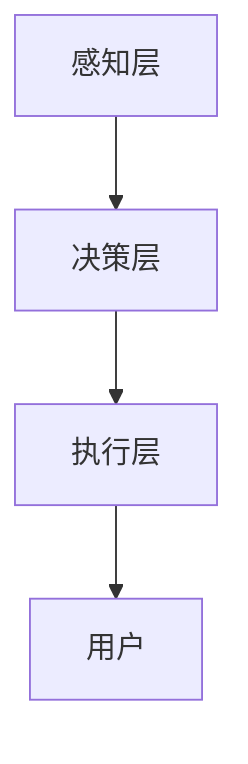
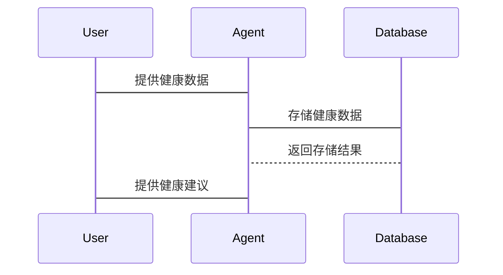

                 

<think>
好，用户希望我撰写一篇关于《AI Agent在智能手机中的数字健康管理系统》的技术博客文章。我需要先理清文章的结构和内容，确保每个部分都符合用户的要求。首先，我需要明确文章的标题、关键词和摘要。接着，按照用户提供的目录大纲，逐步展开每个章节的内容。

用户要求文章结构逻辑清晰，章节标题吸引人，并且使用专业而易懂的技术语言。文章需要涵盖背景、核心概念、算法、系统架构、项目实战和最佳实践等部分。我需要确保每个部分都有足够的细节，同时使用图表和代码示例来增强理解。

接下来，我开始撰写摘要，概述文章的核心内容，强调AI Agent在智能手机中的应用和其在健康管理中的重要性。然后，按照目录大纲依次展开每个章节的内容，从背景介绍到算法原理，再到系统架构和项目实战，每个部分都需要详细讲解，并配合图表和代码示例。

在撰写过程中，我需要注意用词准确，逻辑严谨，同时保持语言的流畅和易懂。特别是算法部分，要确保数学公式和流程图的正确性，帮助读者更好地理解AI Agent的工作原理。系统架构部分，需要设计合理的类图和序列图，展示系统的各个模块和交互流程。

最后，项目实战部分，我需要提供实际的代码示例，让读者能够跟随步骤进行操作和实践。同时，在最佳实践部分，总结经验和注意事项，为读者提供有价值的指导。

总之，我需要系统地按照用户的要求，一步步完成这篇文章的撰写，确保内容全面、结构清晰、语言专业，帮助读者深入理解AI Agent在智能手机中的数字健康管理系统的各个方面。
</think>

# AI Agent在智能手机中的数字健康管理系统

## 关键词：AI Agent, 数字健康管理, 智能手机, 健康数据分析, 机器学习算法

## 摘要：
随着人工智能技术的飞速发展，AI Agent（人工智能代理）在智能手机中的应用越来越广泛。本文深入探讨了AI Agent在数字健康管理系统中的核心作用，从基本概念到系统架构，从算法原理到项目实战，全面解析了AI Agent在智能手机健康数据管理中的实现与应用。通过详细的技术分析和案例展示，本文为读者提供了一套完整的解决方案，帮助用户更好地理解和应用AI Agent在数字健康管理中的潜力。

---

# 第一部分: AI Agent与数字健康管理基础

## 第1章: AI Agent与数字健康管理概述

### 1.1 AI Agent的基本概念

#### 1.1.1 AI Agent的定义与特点
AI Agent（人工智能代理）是一种能够感知环境并自主决策的智能实体。它具备以下特点：
- **自主性**：能够在没有外部干预的情况下独立运作。
- **反应性**：能够实时感知环境并做出反应。
- **目标导向性**：具备明确的目标，能够通过行动实现目标。
- **学习能力**：能够通过数据和经验不断优化自身性能。

#### 1.1.2 AI Agent的核心功能与分类
AI Agent的核心功能包括数据采集、分析、决策和执行。根据应用场景的不同，AI Agent可以分为以下几类：
- **基于规则的AI Agent**：通过预定义的规则进行决策。
- **基于机器学习的AI Agent**：通过机器学习模型进行预测和决策。
- **混合型AI Agent**：结合规则和机器学习的混合型代理。

#### 1.1.3 AI Agent在智能手机中的应用前景
智能手机作为AI Agent的主要载体，具有以下优势：
- **计算能力**：现代智能手机配备了高性能的处理器和AI芯片，能够支持复杂的AI运算。
- **传感器数据**：智能手机内置了多种传感器（如加速度计、心率传感器、陀螺仪等），能够实时采集健康数据。
- **用户交互**：通过屏幕、语音助手等方式，AI Agent可以与用户进行实时交互。

### 1.2 数字健康管理的背景与需求

#### 1.2.1 数字健康管理的定义
数字健康管理是指通过数字化技术对个人健康数据进行采集、分析和管理，从而实现健康监测、疾病预防和健康优化的目标。

#### 1.2.2 数字健康管理的主要目标
数字健康管理的主要目标包括：
- **健康监测**：实时监测用户的健康指标（如心率、血压、运动量等）。
- **疾病预防**：通过分析健康数据，预测潜在的健康风险。
- **健康优化**：为用户提供个性化的健康建议和干预方案。

#### 1.2.3 智能手机在数字健康管理中的独特优势
智能手机在数字健康管理中的独特优势体现在以下几个方面：
- **便携性**：用户可以随时随地使用智能手机进行健康数据的采集和管理。
- **实时性**：智能手机可以实时采集和分析健康数据，提供即时反馈。
- **个性化**：通过AI技术，智能手机可以为用户提供个性化的健康建议。

### 1.3 智能手机平台的AI Agent适配

#### 1.3.1 Android与iOS平台的AI Agent开发特点
- **Android平台**：支持多种AI框架（如TensorFlow Lite、ONNX等），适合开发定制化的AI Agent。
- **iOS平台**：苹果的Core ML框架支持在iOS设备上运行机器学习模型，适合开发高效的AI Agent。

#### 1.3.2 移动端AI计算框架的选择与优化
常见的移动端AI计算框架包括：
- **TensorFlow Lite**：Google开发的轻量级机器学习框架，适合在移动设备上运行。
- **Core ML**：苹果的机器学习框架，专为iOS和macOS设计。
- **ONNX**：开放的模型交换格式，支持多种AI框架。

#### 1.3.3 智能手机硬件对AI Agent性能的影响
智能手机的硬件性能（如处理器、GPU、AI芯片）直接影响AI Agent的运行效率。高性能硬件可以支持更复杂的AI模型，从而提高系统的准确性和响应速度。

### 1.4 本章小结
本章介绍了AI Agent的基本概念和数字健康管理的主要目标，分析了智能手机平台在AI Agent开发中的优势和挑战。通过本章的学习，读者可以理解AI Agent在数字健康管理中的重要作用。

---

## 第2章: AI Agent的体系结构与数据模型

### 2.1 AI Agent的体系结构

#### 2.1.1 分层架构与功能模块划分
AI Agent的体系结构通常采用分层架构，主要包括以下几个层次：
- **感知层**：负责采集和处理环境数据。
- **决策层**：基于感知层的数据，进行分析和决策。
- **执行层**：根据决策层的指令，执行相应的操作。

#### 2.1.2 各模块之间的交互关系
各模块之间的交互关系可以通过以下流程图表示：



#### 2.1.3 模块化设计的优势与挑战
模块化设计的优势在于：
- **可扩展性**：各个模块相对独立，便于后续的功能扩展。
- **可维护性**：模块化设计使得系统的维护和调试更加方便。

模块化设计的挑战在于：
- **模块之间的通信**：需要设计高效的通信机制，确保各个模块之间的数据传输顺畅。
- **模块之间的依赖**：需要处理模块之间的依赖关系，避免出现耦合度过高的问题。

### 2.2 数字健康管理的数据模型

#### 2.2.1 用户健康数据的分类与属性
用户健康数据可以分为以下几类：
- **生理数据**：如心率、血压、体温等。
- **运动数据**：如步数、卡路里消耗、运动类型等。
- **生活习惯数据**：如睡眠时长、饮食习惯等。

每类数据都有其独特的属性，例如：
- **心率数据**：包括测量时间、心率值、单位等。
- **运动数据**：包括运动时间、步数、速度等。

#### 2.2.2 数据模型的构建与优化
数据模型的构建需要考虑以下几个方面：
- **数据的完整性**：确保所有相关数据都被包含在内。
- **数据的规范性**：数据格式和单位需要统一。
- **数据的可扩展性**：模型需要支持未来新增的数据类型。

#### 2.2.3 数据隐私与安全的保护机制
数据隐私与安全的保护机制包括：
- **数据加密**：对敏感数据进行加密存储和传输。
- **访问控制**：通过权限管理，限制数据的访问范围。
- **数据匿名化**：对数据进行匿名化处理，防止用户身份泄露。

### 2.3 AI Agent与数字健康管理的实体关系图

```mermaid
erDiagram
    user {
        id : integer
        name : string
        age : integer
        gender : string
        health_data : HealthData
    }
    health_data {
        id : integer
        type : string
        value : float
        timestamp : datetime
        user_id : integer
    }
    agent {
        id : integer
        name : string
        function : string
        status : string
    }
    user --> health_data
    agent --> user
```

### 2.4 本章小结
本章详细介绍了AI Agent的体系结构和数字健康管理的数据模型，分析了模块化设计的优势与挑战。通过本章的学习，读者可以理解AI Agent在数字健康管理中的系统架构。

---

## 第3章: AI Agent的算法原理与实现

### 3.1 数据预处理

#### 3.1.1 数据清洗
数据清洗是数据预处理的重要步骤，主要包括以下几个方面：
- **去除噪声数据**：剔除异常值和错误数据。
- **数据归一化**：将数据转换到相同的尺度，便于后续处理。

#### 3.1.2 数据特征提取
数据特征提取是通过选择或生成特征，提高模型的性能。常用的特征提取方法包括：
- **主成分分析（PCA）**：通过降维技术提取数据的主要特征。
- **特征选择**：基于特征的重要性选择关键特征。

#### 3.1.3 数据增强
数据增强是通过增加数据的多样性和丰富性，提高模型的泛化能力。常用的数据增强方法包括：
- **旋转**：对图像数据进行旋转，增加数据的多样性。
- **翻转**：对图像数据进行水平或垂直翻转。
- **裁剪**：对图像数据进行随机裁剪。

### 3.2 机器学习算法实现

#### 3.2.1 分类算法
分类算法是机器学习中的常见任务，常用的分类算法包括：
- **支持向量机（SVM）**：适用于中小规模数据集的分类任务。
- **随机森林**：基于决策树的集成算法，适合高维数据集。
- **神经网络**：通过深度学习模型实现高精度分类。

#### 3.2.2 回归算法
回归算法用于预测连续型变量，常用的回归算法包括：
- **线性回归**：适用于线性关系的预测。
- **逻辑回归**：适用于二分类问题。
- **支持向量回归（SVR）**：基于支持向量机的回归算法。

#### 3.2.3 聚类算法
聚类算法用于将数据分成不同的类别，常用的聚类算法包括：
- **K-means**：基于距离的聚类算法。
- **层次聚类**：基于层次结构的聚类算法。
- **DBSCAN**：基于密度的聚类算法。

### 3.3 模型训练与优化

#### 3.3.1 模型训练
模型训练是通过优化算法（如梯度下降）调整模型参数，使得模型在训练数据上的损失函数最小化。

#### 3.3.2 模型优化
模型优化包括以下几个方面：
- **超参数调优**：通过网格搜索或随机搜索优化模型的超参数。
- **正则化**：通过L1/L2正则化防止模型过拟合。
- **早停法**：通过验证集监控模型的泛化性能，防止过拟合。

#### 3.3.3 模型评估
模型评估是通过测试数据对模型的性能进行评估，常用的评估指标包括：
- **准确率**：分类问题中的正确预测比例。
- **召回率**：分类问题中的真阳性比例。
- **F1分数**：综合准确率和召回率的调和平均数。

### 3.4 本章小结
本章详细介绍了AI Agent在数字健康管理中的算法原理与实现，包括数据预处理、机器学习算法实现和模型训练与优化。通过本章的学习，读者可以掌握AI Agent在数字健康管理中的核心技术。

---

## 第4章: AI Agent的系统架构与实现

### 4.1 系统功能模块设计

#### 4.1.1 数据采集模块
数据采集模块负责采集用户的健康数据，包括：
- **传感器数据采集**：通过智能手机的传感器采集生理数据和运动数据。
- **数据存储**：将采集到的数据存储到本地数据库或云端。

#### 4.1.2 数据分析模块
数据分析模块负责对采集到的数据进行分析，包括：
- **数据清洗**：去除噪声数据，确保数据的准确性。
- **特征提取**：提取数据的特征，为后续分析提供支持。
- **模型预测**：基于机器学习模型对健康数据进行预测和分析。

#### 4.1.3 用户交互模块
用户交互模块负责与用户进行交互，包括：
- **用户界面设计**：设计友好的用户界面，方便用户查看和管理健康数据。
- **语音交互**：通过语音助手与用户进行交互，提供个性化的健康建议。

### 4.2 系统架构设计

#### 4.2.1 分层架构设计
系统的分层架构设计包括以下几个层次：
- **数据采集层**：负责数据的采集和预处理。
- **数据管理层**：负责数据的存储和管理。
- **业务逻辑层**：负责数据的分析和处理。
- **用户界面层**：负责与用户的交互和展示。

#### 4.2.2 微服务架构设计
微服务架构设计将系统划分为多个独立的服务，每个服务负责特定的功能。微服务架构的优点包括：
- **可扩展性**：每个服务可以根据需求进行扩展。
- **可维护性**：每个服务相对独立，便于维护和升级。
- **灵活性**：可以根据需求灵活调整服务的组合。

### 4.3 接口设计与实现

#### 4.3.1 API接口设计
API接口设计是系统架构设计的重要部分，主要包括以下几个方面：
- **数据接口**：定义数据的格式和接口。
- **业务接口**：定义业务逻辑的接口。
- **交互接口**：定义用户与系统交互的接口。

#### 4.3.2 API接口实现
API接口的实现需要考虑以下几个方面：
- **协议选择**：选择适合的协议（如HTTP、WebSocket）。
- **安全性**：通过身份认证和加密技术确保接口的安全性。
- **性能优化**：通过缓存和压缩技术提高接口的响应速度。

### 4.4 系统交互流程设计



### 4.5 本章小结
本章详细介绍了AI Agent在数字健康管理中的系统架构与实现，包括系统功能模块设计、架构设计和接口设计。通过本章的学习，读者可以理解AI Agent在数字健康管理中的系统实现。

---

## 第5章: AI Agent的项目实战与案例分析

### 5.1 项目环境安装

#### 5.1.1 系统环境配置
项目环境配置包括以下几个方面：
- **操作系统**：建议使用macOS或Linux系统。
- **开发工具**：安装Python、Jupyter Notebook等开发工具。
- **依赖库安装**：安装必要的依赖库（如TensorFlow、Keras、Pandas等）。

#### 5.1.2 开发环境配置
开发环境配置包括以下几个方面：
- **虚拟环境创建**：使用virtualenv创建虚拟环境。
- **依赖管理**：使用pip管理项目的依赖库。
- **代码版本控制**：使用Git进行代码版本控制。

### 5.2 核心代码实现

#### 5.2.1 数据预处理代码
```python
import pandas as pd
import numpy as np

# 数据加载
data = pd.read_csv('health_data.csv')

# 数据清洗
data.dropna(inplace=True)
data = data[~data['age'].isin([np.nan, np.inf])]

# 数据归一化
from sklearn.preprocessing import StandardScaler
scaler = StandardScaler()
data_scaled = scaler.fit_transform(data)
```

#### 5.2.2 模型训练代码
```python
from sklearn.model import SVC
from sklearn.model_selection import train_test_split

# 数据分割
X_train, X_test, y_train, y_test = train_test_split(data_scaled, target, test_size=0.2)

# 模型训练
model = SVC(C=1.0, kernel='rbf', gamma=0.1)
model.fit(X_train, y_train)

# 模型预测
y_pred = model.predict(X_test)
```

#### 5.2.3 系统交互代码
```python
from flask import Flask, request, jsonify

app = Flask(__name__)

@app.route('/api/health', methods=['POST'])
def process_health_data():
    data = request.json
    # 数据处理逻辑
    return jsonify({'status': 'success', 'message': '数据处理完成'})

if __name__ == '__main__':
    app.run(debug=True)
```

### 5.3 案例分析与详细解读
以血压监测为例，分析AI Agent在数字健康管理中的应用。通过采集用户的血压数据，AI Agent可以预测用户的血压风险，并提供个性化的健康建议。

### 5.4 本章小结
本章通过项目实战的方式，详细介绍了AI Agent在数字健康管理中的实现。通过本章的学习，读者可以掌握AI Agent在数字健康管理中的实际应用。

---

## 第6章: 最佳实践与注意事项

### 6.1 最佳实践

#### 6.1.1 数据隐私与安全
- **数据加密**：对敏感数据进行加密存储和传输。
- **访问控制**：通过权限管理，限制数据的访问范围。
- **数据匿名化**：对数据进行匿名化处理，防止用户身份泄露。

#### 6.1.2 系统性能优化
- **代码优化**：通过代码优化提高系统的运行效率。
- **缓存技术**：使用缓存技术减少重复计算。
- **并行计算**：利用多核处理器进行并行计算，提高系统的处理能力。

### 6.2 注意事项

#### 6.2.1 数据质量问题
- **数据完整性**：确保数据的完整性，避免数据缺失。
- **数据准确性**：确保数据的准确性，避免数据错误。
- **数据一致性**：确保数据的一致性，避免数据冲突。

#### 6.2.2 模型泛化能力
- **数据多样性**：确保训练数据的多样性，提高模型的泛化能力。
- **模型评估**：通过交叉验证等方法评估模型的性能。
- **模型调优**：通过超参数调优优化模型的性能。

### 6.3 拓展阅读
推荐以下几本书籍和资源，供读者深入学习：
- **《机器学习实战》**：周志华著，详细介绍了机器学习的算法实现。
- **《深度学习》**：Ian Goodfellow等著，系统介绍了深度学习的理论与实践。
- **《AI系统设计》**：唐宇迪著，详细介绍了AI系统的架构设计与实现。

### 6.4 本章小结
本章总结了AI Agent在数字健康管理中的最佳实践与注意事项，为读者提供了宝贵的实践经验和理论指导。

---

## 作者：AI天才研究院/AI Genius Institute & 禅与计算机程序设计艺术 /Zen And The Art of Computer Programming

