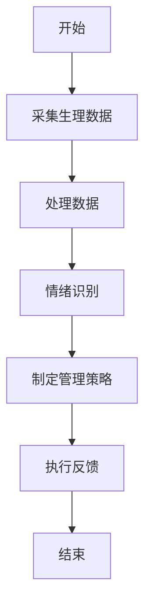
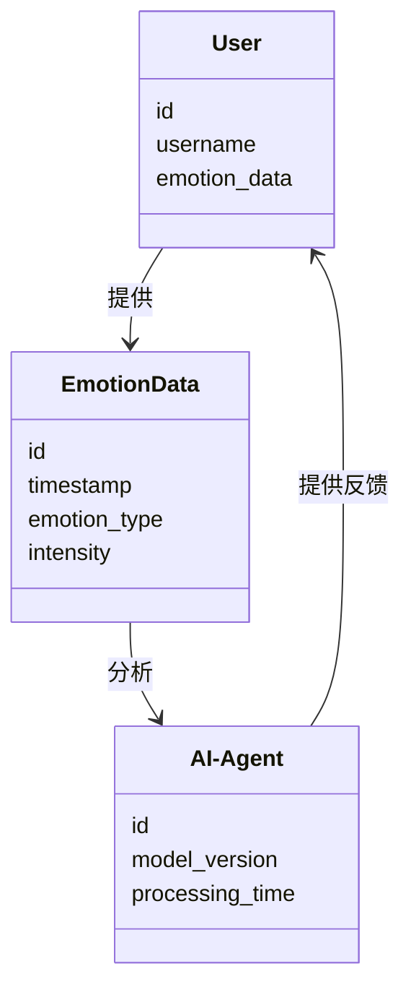
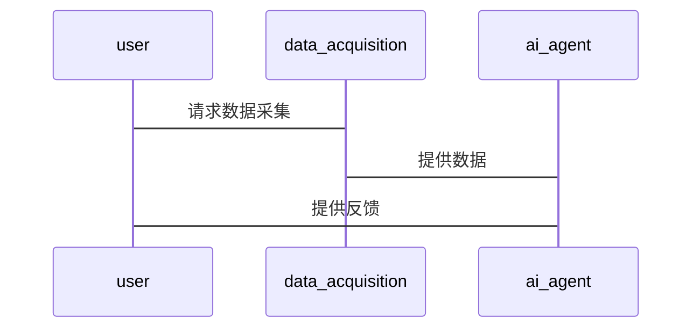

                 


# AI Agent在智能手环中的情绪管理助手

## 关键词：AI Agent, 智能手环, 情绪管理, 机器学习, 情绪识别, 数据隐私

## 摘要：  
本文探讨了AI Agent在智能手环中的情绪管理助手的应用，从背景、核心概念、算法原理、系统架构到实际案例，详细分析了AI Agent在情绪管理中的作用。文章通过具体的技术实现和案例分析，展示了如何利用AI技术帮助用户有效管理情绪，并提出了数据隐私保护和系统安全的最佳实践。

---

# 第1章: AI Agent与情绪管理助手的背景介绍

## 1.1 AI Agent的基本概念

### 1.1.1 AI Agent的定义  
AI Agent（人工智能代理）是指能够感知环境、执行任务并做出决策的智能实体。它通过传感器获取数据，利用算法进行分析，并通过执行器采取行动。AI Agent的核心目标是帮助人类完成复杂的任务或提供智能化的服务。

### 1.1.2 情绪管理助手的功能与作用  
情绪管理助手是一种基于AI Agent的辅助工具，旨在通过分析用户的情绪数据（如心率、皮肤温度、运动数据等）来识别情绪状态，并提供相应的反馈或建议。其主要功能包括：  
1. 实时监测情绪变化；  
2. 分析情绪波动的原因；  
3. 提供情绪调节建议（如放松训练、冥想指导等）。

### 1.1.3 AI Agent在智能手环中的应用背景  
智能手环作为一种可穿戴设备，能够采集用户的生理数据（如心率、皮肤电活动、运动数据等），为情绪管理提供了丰富的数据源。结合AI Agent的强大分析能力，智能手环可以成为用户情绪管理的重要工具。

---

## 1.2 情绪管理的基本概念

### 1.2.1 情绪的定义与分类  
情绪是人类对特定情境的主观感受，通常分为正面情绪（如快乐、兴奋）和负面情绪（如焦虑、悲伤）。情绪的强度和持续时间因人而异。

### 1.2.2 情绪管理的目标与方法  
情绪管理的目标是帮助用户识别和调节情绪，避免情绪失控或过度消极。常见的方法包括：  
1. 认知行为疗法（CBT）：通过改变思维方式来调节情绪；  
2. 放松训练：通过深呼吸、冥想等方式缓解紧张情绪；  
3. 情绪记录：通过记录情绪变化，找到情绪波动的规律。

### 1.2.3 情绪管理在智能手环中的应用场景  
智能手环可以结合用户的生理数据和行为数据，提供个性化的的情绪管理服务。例如：  
- 在用户压力较大时，智能手环可以通过振动或提醒功能，建议用户进行放松训练；  
- 在用户情绪低落时，智能手环可以推荐适合的音乐或冥想课程。

---

## 1.3 AI Agent与情绪管理的结合

### 1.3.1 AI Agent在情绪管理中的优势  
AI Agent能够快速分析大量数据，并根据结果做出决策。其在情绪管理中的优势包括：  
1. 实时性：能够快速响应用户的情绪变化；  
2. 智能性：能够根据数据自动生成情绪管理策略；  
3. 个性化：能够根据用户的特点提供定制化的服务。

### 1.3.2 情绪管理助手的核心功能  
情绪管理助手的核心功能包括：  
1. 数据采集：通过传感器获取用户的生理数据；  
2. 数据分析：利用AI算法识别用户的情绪状态；  
3. 决策与反馈：根据情绪状态提供相应的管理策略。

### 1.3.3 本章小结  
本章介绍了AI Agent的基本概念、情绪管理的基本概念以及AI Agent在情绪管理中的应用背景。通过这些内容，读者可以理解AI Agent在智能手环中的情绪管理助手的核心作用。

---

# 第2章: AI Agent与情绪管理助手的核心概念与联系

## 2.1 AI Agent的核心原理

### 2.1.1 AI Agent的基本原理  
AI Agent的核心原理包括：  
1. 数据采集：通过传感器获取数据；  
2. 数据分析：利用机器学习算法对数据进行分析；  
3. 决策与执行：根据分析结果做出决策并执行相应的动作。

### 2.1.2 基于生理数据的情绪识别算法  
情绪识别算法主要基于用户的生理数据，例如心率变异性（HRV）、皮肤电活动（EDA）等。通过分析这些数据，AI Agent可以识别用户的情绪状态。

### 2.1.3 AI Agent的决策机制  
AI Agent的决策机制通常基于规则或强化学习。例如：  
- 基于规则的决策：根据预设的规则（如“如果心率显著升高，则建议用户放松”）做出决策；  
- 基于强化学习的决策：通过学习历史数据，优化决策策略。

---

## 2.2 情绪管理助手的核心功能

### 2.2.1 情绪数据的采集与处理  
情绪数据的采集包括：  
1. 心率数据：通过心率传感器获取；  
2. 皮肤电活动：通过EDA传感器获取；  
3. 运动数据：通过加速度传感器获取。  

数据处理包括数据清洗、特征提取等步骤。

### 2.2.2 情绪分析与预测  
情绪分析主要基于机器学习算法，例如支持向量机（SVM）或随机森林（Random Forest）。情绪预测则是通过时间序列分析（如LSTM）来预测未来的情绪状态。

### 2.2.3 情绪管理策略的制定与执行  
情绪管理策略的制定基于用户的个人特点和情绪状态。例如：  
- 如果用户处于焦虑状态，系统可以推荐放松训练或冥想课程；  
- 如果用户处于兴奋状态，系统可以建议用户进行呼吸训练以保持冷静。

---

## 2.3 AI Agent与情绪管理助手的实体关系图

```mermaid
erDiagram
    user {
        id
        username
        emotion_data
    }
    emotion_data {
        id
        timestamp
        emotion_type
        intensity
    }
    ai_agent {
        id
        model_version
        processing_time
    }
    user --> emotion_data: 提供
    emotion_data --> ai_agent: 分析
    ai_agent --> user: 提供反馈
```

---

## 2.4 本章小结  
本章详细介绍了AI Agent的核心原理和情绪管理助手的核心功能，并通过实体关系图展示了AI Agent与情绪管理助手之间的关系。通过这些内容，读者可以理解AI Agent在情绪管理中的具体作用。

---

# 第3章: AI Agent在情绪管理中的算法原理

## 3.1 情绪识别算法

### 3.1.1 基于生理数据的分类算法  
基于生理数据的分类算法主要包括：  
1. 支持向量机（SVM）：用于分类情绪状态；  
2. K近邻算法（KNN）：用于分类情绪状态。

### 3.1.2 基于机器学习的情绪识别模型  
基于机器学习的情绪识别模型主要包括：  
1. 线性回归：用于预测情绪强度；  
2. 神经网络：用于复杂的情绪分类任务。

### 3.1.3 情绪识别算法的实现步骤  
情绪识别算法的实现步骤如下：  
1. 数据采集：获取用户的生理数据；  
2. 数据预处理：清洗数据并提取特征；  
3. 模型训练：利用训练数据训练模型；  
4. 模型测试：利用测试数据验证模型性能；  
5. 模型部署：将模型部署到智能手环中。

---

## 3.2 AI Agent的决策算法

### 3.2.1 基于规则的决策算法  
基于规则的决策算法是一种简单的决策方法，例如：  
- 如果用户的心率显著升高，则建议用户进行放松训练。

### 3.2.2 基于强化学习的决策算法  
基于强化学习的决策算法是一种更复杂的决策方法，例如：  
- 使用Q-learning算法，通过奖励机制优化决策策略。

### 3.2.3 决策算法的实现流程  
决策算法的实现流程如下：  
1. 数据采集：获取用户的情绪数据；  
2. 数据分析：识别用户的情绪状态；  
3. 决策制定：根据情绪状态制定管理策略；  
4. 决策执行：执行相应的管理策略。

---

## 3.3 情绪管理助手的算法流程图



---

## 3.4 本章小结  
本章详细介绍了情绪识别算法和AI Agent的决策算法，并通过流程图展示了情绪管理助手的算法实现流程。通过这些内容，读者可以理解AI Agent在情绪管理中的具体算法实现。

---

# 第4章: 系统分析与架构设计方案

## 4.1 系统应用场景

### 4.1.1 用户场景  
- 用户在工作压力下需要放松；  
- 用户在情绪低落时需要心理支持；  
- 用户在运动时需要情绪调节。

### 4.1.2 场景分析  
- 工作压力：通过心率和皮肤电活动识别压力状态；  
- 情绪低落：通过分析用户的运动数据和社交数据；  
- 运动调节：通过推荐适当的运动量来调节情绪。

---

## 4.2 系统功能设计

### 4.2.1 领域模型类图



### 4.2.2 系统架构图


---

## 4.3 系统接口设计

### 4.3.1 API接口  
- 数据采集接口：`/api/data/acquire`  
- 情绪识别接口：`/api/emotion/identify`  
- 决策反馈接口：`/api/feedback/execute`

### 4.3.2 接口交互流程图



---

## 4.4 本章小结  
本章详细介绍了系统应用场景、系统功能设计和系统架构设计。通过这些内容，读者可以理解AI Agent在智能手环中的情绪管理助手的整体架构。

---

# 第5章: 项目实战

## 5.1 环境安装

### 5.1.1 安装Python环境  
- 安装Python 3.8或更高版本；  
- 安装Jupyter Notebook用于数据分析。

### 5.1.2 安装相关库  
- 安装传感器数据处理库：`pybluez`；  
- 安装机器学习库：`scikit-learn`；  
- 安装数据可视化库：`matplotlib`。

---

## 5.2 核心代码实现

### 5.2.1 数据采集代码

```python
import pybluez

# 读取心率数据
def get_heart_rate():
    device = pybluezHCI.dev_list()[0]
    with pybluezHCI.Device(device) as dev:
        dev.write_cmd(b"\x02\x03\x00\x00")  # 命令：读取心率特征
        data = dev.read_cmd(0x11)
        heart_rate = data[1]
        return heart_rate
```

### 5.2.2 情绪识别代码

```python
from sklearn.svm import SVC
from sklearn.model_selection import train_test_split

# 数据预处理
X = ...  # 特征数据
y = ...  # 标签数据（情绪类别）

# 划分训练集和测试集
X_train, X_test, y_train, y_test = train_test_split(X, y, test_size=0.2)

# 训练模型
model = SVC()
model.fit(X_train, y_train)

# 模型预测
y_pred = model.predict(X_test)
print("准确率：", accuracy_score(y_test, y_pred))
```

### 5.2.3 决策反馈代码

```python
from sklearn.reccomendation import DecisionTreeClassifier

# 数据预处理
X = ...  # 特征数据
y = ...  # 标签数据（情绪类别）

# 训练决策树模型
model = DecisionTreeClassifier()
model.fit(X, y)

# 预测情绪状态
predicted_emotion = model.predict(new_data)
print("预测情绪：", predicted_emotion)
```

---

## 5.3 实际案例分析

### 5.3.1 案例背景  
用户A在工作压力下情绪紧张，心率显著升高，皮肤电活动增强。

### 5.3.2 数据分析  
- 心率：90次/分钟（高于正常值）；  
- 皮肤电活动：100 microsiemens（高于正常值）。

### 5.3.3 决策反馈  
系统识别用户处于焦虑状态，建议用户进行放松训练。

---

## 5.4 本章小结  
本章通过实际案例展示了AI Agent在情绪管理中的具体应用。通过这些内容，读者可以理解AI Agent在智能手环中的情绪管理助手的实际操作流程。

---

# 第6章: 最佳实践与总结

## 6.1 最佳实践

### 6.1.1 数据隐私保护  
- 加密用户数据；  
- 遵守数据隐私法规。

### 6.1.2 系统安全  
- 定期更新系统漏洞；  
- 采用多因素认证。

## 6.2 小结  
通过本文的介绍，读者可以全面了解AI Agent在智能手环中的情绪管理助手的核心概念、算法原理和系统架构。AI Agent的强大分析能力为情绪管理提供了新的可能性。

## 6.3 注意事项  
- 确保数据采集的准确性；  
- 定期更新模型以提高识别精度。

## 6.4 拓展阅读  
- 情绪识别的最新研究；  
- 强化学习在情绪管理中的应用。

---

# 作者：AI天才研究院/AI Genius Institute & 禅与计算机程序设计艺术 /Zen And The Art of Computer Programming

