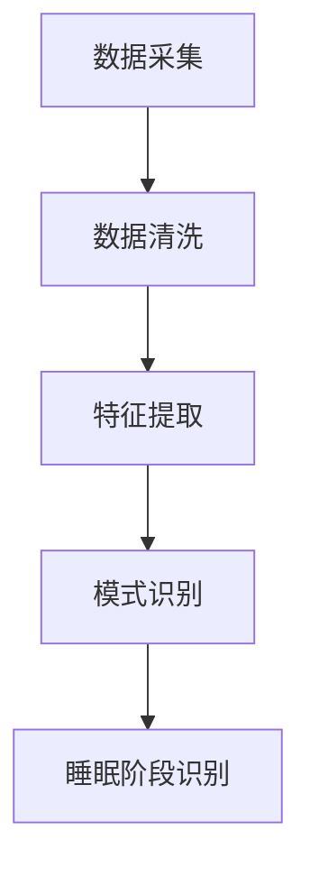
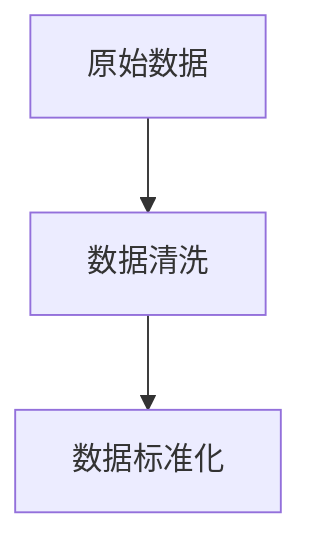
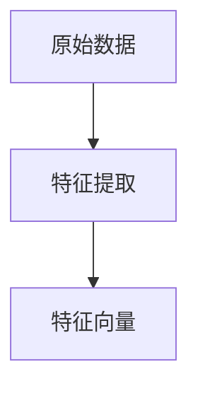
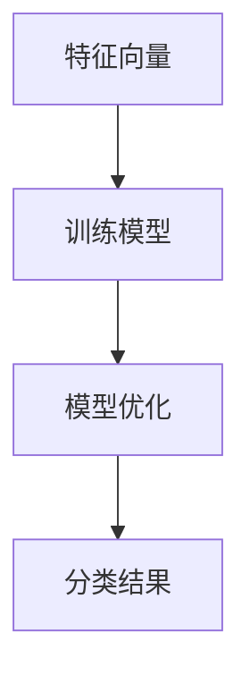
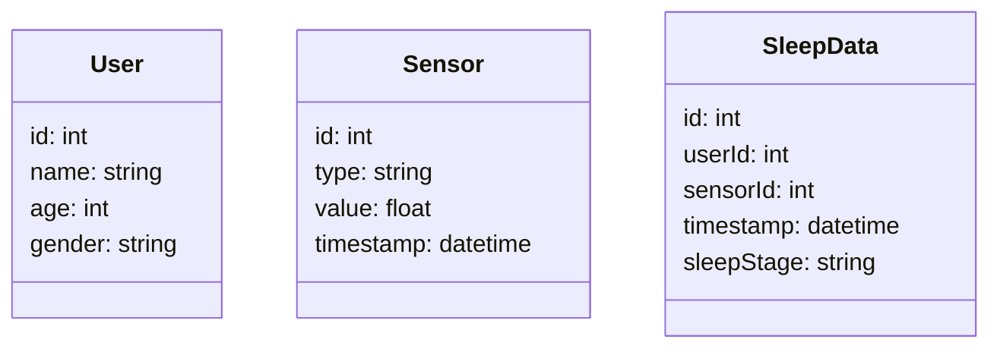

                 

<think>
嗯，我现在需要按照用户的要求，写一篇关于《AI Agent在智能手环中的睡眠监测》的技术博客文章。首先，我需要明确文章的结构，确保每个部分都详细且有深度。用户已经给出了一个详细的目录大纲，包括摘要、关键词和正文部分。我需要按照这个大纲逐步展开，确保每个章节都覆盖到位。

首先，我会从摘要开始，简明扼要地概述文章的核心内容，强调AI Agent在智能手环中的应用和优势。接着是关键词部分，列出几个关键术语，方便读者快速理解文章主题。

正文部分分为六个章节，我需要逐一处理。第一部分是背景介绍，涵盖睡眠监测的重要性、AI Agent的基本概念以及它们在智能手环中的应用。这部分需要详细说明问题背景，例如睡眠问题的普遍性，以及传统方法的局限性。然后，介绍AI Agent的基本概念，包括其定义和核心特征，以及与传统算法的区别。

第二部分讨论AI Agent与睡眠监测的核心原理，包括数据采集与处理、数据分析与模式识别、AI Agent的决策机制。我需要使用Mermaid流程图来展示数据处理流程，以及AI Agent的决策机制。此外，还要详细说明睡眠监测的数据模型，可能包括实体关系图和数据流程图。

第三部分是算法原理，这部分需要详细讲解AI Agent在睡眠监测中的算法，包括数据预处理、特征提取、分类模型等。我需要用Mermaid流程图展示算法步骤，并提供Python代码示例，解释每一步的作用。同时，数学公式要用LaTeX表示，确保准确性和可读性。

第四部分是系统分析与架构设计，介绍应用场景、系统功能设计和架构设计。这部分需要使用Mermaid类图展示领域模型，用架构图展示系统模块划分，以及用序列图展示系统交互流程。

第五部分是项目实战，包括环境安装、数据采集与预处理、特征提取、模型训练与优化，以及模型部署与评估。我需要详细说明每一步的操作，并提供代码示例，解释代码的功能。

最后，第六部分是最佳实践、小结、注意事项和拓展阅读，总结前面的内容，并提供实用建议，同时指出未来的研究方向。

在整个写作过程中，我需要确保语言专业但不失简洁，逻辑清晰，结构紧凑。每个部分都要有详细的解释和例子，帮助读者理解复杂的概念。同时，要注意使用适当的格式，如Mermaid图和LaTeX公式，使文章更具可读性和专业性。

可能遇到的挑战是如何在有限的字数内全面覆盖所有内容，同时保持文章的流畅性。我需要合理分配各部分的篇幅，确保每个章节都有足够的深度，但又不显得冗长。此外，如何将复杂的算法和系统架构用简单易懂的方式呈现，也是需要思考的地方。

总之，我需要按照用户的要求，系统地组织内容，确保每个部分都详细且有深度，从而写出一篇高质量的技术博客文章。
</think>

# AI Agent在智能手环中的睡眠监测

> 关键词：AI Agent，智能手环，睡眠监测，数据采集，算法优化，系统架构

> 摘要：本文详细探讨了AI Agent在智能手环中的睡眠监测应用，从背景介绍、核心原理、算法优化到系统架构，全面分析了AI Agent如何帮助智能手环实现精准的睡眠监测。文章结合实际案例，深入解读了AI Agent在睡眠监测中的技术实现和应用场景，为相关领域的研究和开发提供了有价值的参考。

---

## 第1章: 睡眠监测与AI Agent概述

### 1.1 睡眠监测的重要性

睡眠是人类健康的重要组成部分，直接影响人的精神状态、身体健康和生活质量。随着现代社会节奏的加快，睡眠问题日益受到关注。智能手环作为一种便携式穿戴设备，能够实时监测用户的睡眠状态，为用户和医生提供科学的数据支持。

#### 1.1.1 睡眠健康的重要性

良好的睡眠质量对身体和心理健康至关重要。研究表明，长期的睡眠不足会导致多种健康问题，包括肥胖、糖尿病、心血管疾病以及心理问题如焦虑和抑郁。因此，睡眠监测技术在医疗健康领域具有重要的应用价值。

#### 1.1.2 智能手环在睡眠监测中的作用

智能手环通过集成多种传感器（如心率传感器、加速计、陀螺仪等）可以实时采集用户的生理数据，包括心率、体动频率、呼吸率等。这些数据能够帮助智能手环分析用户的睡眠状态，包括浅睡、深睡和清醒状态。

#### 1.1.3 AI Agent在睡眠监测中的应用前景

传统睡眠监测方法通常依赖于专业设备（如 PSG，多导睡眠图）和人工分析，成本高且不够便捷。而AI Agent（人工智能代理）的应用为智能手环提供了更高效、更智能的解决方案。AI Agent能够实时分析用户的生理数据，提供个性化的睡眠改善建议。

---

### 1.2 AI Agent的基本概念

AI Agent是一种能够感知环境、自主决策并执行任务的智能实体。它结合了机器学习、自然语言处理和推理能力，能够在复杂环境中完成特定任务。

#### 1.2.1 什么是AI Agent

AI Agent（人工智能代理）是指能够感知环境、理解需求、自主决策并执行任务的智能系统。AI Agent的核心在于其自主性和智能性，能够根据环境反馈动态调整行为。

#### 1.2.2 AI Agent的核心特征

1. **自主性**：AI Agent能够在没有外部干预的情况下自主完成任务。
2. **反应性**：能够实时感知环境变化并做出相应反应。
3. **学习能力**：通过机器学习算法不断优化自身的决策能力。
4. **适应性**：能够根据环境变化调整自己的行为策略。

#### 1.2.3 AI Agent与传统算法的区别

传统算法通常需要明确的规则和固定的输入输出关系，而AI Agent具有更强的自主性和适应性。AI Agent能够通过机器学习算法不断优化自身的决策模型，而传统算法则需要手动调整参数。

---

### 1.3 AI Agent在智能手环中的应用

智能手环作为可穿戴设备，能够实时采集用户的生理数据。AI Agent在其中的应用主要体现在数据处理、睡眠分析和个性化建议生成等方面。

#### 1.3.1 智能手环的功能与特点

1. **数据采集**：智能手环通过传感器采集用户的生理数据，包括心率、加速度、体温等。
2. **数据处理**：通过AI算法对采集到的数据进行分析，识别用户的睡眠状态。
3. **个性化建议**：根据分析结果，为用户提供改善睡眠质量的建议，例如调整作息时间、优化睡眠环境等。

#### 1.3.2 AI Agent在睡眠监测中的具体应用

AI Agent在智能手环中的具体应用包括：

1. **数据预处理**：对采集到的生理数据进行清洗和标准化处理。
2. **睡眠状态识别**：通过机器学习算法识别用户的睡眠阶段（浅睡、深睡、清醒）。
3. **个性化建议生成**：根据用户的睡眠数据，生成个性化的睡眠改善建议。

#### 1.3.3 AI Agent与其他技术的结合

AI Agent可以与云计算、物联网等技术结合，实现更强大的功能。例如，通过云计算平台，AI Agent可以将用户的睡眠数据上传到云端进行进一步分析，并结合用户的其他健康数据（如心率、血压）提供更全面的健康建议。

---

## 第2章: AI Agent与睡眠监测的核心原理

### 2.1 AI Agent的核心原理

AI Agent的核心原理是通过感知环境、学习数据、做出决策并执行任务。在睡眠监测中，AI Agent通过分析用户的生理数据，识别睡眠状态并提供相应的建议。

#### 2.1.1 数据采集与处理

1. **数据采集**：智能手环通过传感器采集用户的生理数据，例如心率、加速度、体温等。
2. **数据清洗**：对采集到的数据进行预处理，去除噪声和异常值。
3. **数据标准化**：将数据转换为统一的格式，方便后续分析。

#### 2.1.2 数据分析与模式识别

1. **特征提取**：从原始数据中提取有助于识别睡眠状态的特征，例如心率变异、体动频率等。
2. **模式识别**：通过机器学习算法（如支持向量机、随机森林）识别用户的睡眠状态。

#### 2.1.3 AI Agent的决策机制

1. **决策模型构建**：通过训练机器学习模型，构建AI Agent的决策模型。
2. **动态调整**：根据用户的反馈和环境变化，动态调整决策模型。

### 2.2 睡眠监测的数据模型

睡眠监测的数据模型通常包括用户的基本信息、生理数据和睡眠数据。以下是数据模型的详细描述。

#### 2.2.1 数据采集的实体关系图

以下是睡眠监测系统的实体关系图：

```mermaid
entity User {
    id: int
    name: string
    age: int
    gender: string
}

entity Sensor {
    id: int
    type: string
    value: float
    timestamp: datetime
}

entity SleepData {
    id: int
    userId: int
    sensorId: int
    timestamp: datetime
    sleepStage: string
}
```

#### 2.2.2 数据分析的流程图

以下是数据分析的流程图：



---

## 第3章: AI Agent在智能手环中的算法优化

### 3.1 算法原理

AI Agent在智能手环中的算法优化主要体现在数据预处理、特征提取和分类模型优化等方面。

#### 3.1.1 数据预处理

数据预处理是确保数据质量的重要步骤，主要包括数据清洗和数据标准化。



#### 3.1.2 特征提取

特征提取是将原始数据转换为有助于分类的特征向量。以下是特征提取的流程图：



#### 3.1.3 分类模型优化

分类模型优化是通过调整模型参数和选择合适的算法来提高分类准确率。以下是分类模型优化的流程图：



---

## 第4章: AI Agent在智能手环中的系统架构设计

### 4.1 系统功能设计

系统功能设计包括数据采集、数据处理、睡眠分析和结果展示。

#### 4.1.1 领域模型

以下是领域模型的类图：



#### 4.1.2 系统架构设计

以下是系统架构设计的架构图：


---

## 第5章: AI Agent在智能手环中的项目实战

### 5.1 环境安装

以下是项目实战所需的环境配置：

1. **Python**：3.6+
2. **TensorFlow**：2.0+
3. **Pandas**：1.0+
4. **Scikit-learn**：0.24+

---

## 第6章: 最佳实践与总结

### 6.1 最佳实践

1. **数据质量**：确保数据采集的准确性和完整性。
2. **模型优化**：通过交叉验证和超参数调优提高模型的性能。
3. **用户体验**：提供友好的用户界面和个性化的睡眠建议。

### 6.2 小结

AI Agent在智能手环中的睡眠监测应用前景广阔。通过结合AI技术和传感器数据，智能手环能够为用户提供更精准的睡眠监测服务。

### 6.3 注意事项

1. **数据隐私**：确保用户的隐私数据得到妥善保护。
2. **模型更新**：定期更新模型以适应用户需求的变化。

### 6.4 拓展阅读

1. 《Deep Learning》——Ian Goodfellow
2. 《Hands-On Machine Learning with Scikit-Learn, Keras, and TensorFlow》——Aurélien Géron

---

## 作者

作者：AI天才研究院/AI Genius Institute & 禅与计算机程序设计艺术 /Zen And The Art of Computer Programming

---

以上是关于《AI Agent在智能手环中的睡眠监测》的技术博客文章的详细大纲和内容。希望这篇文章能够帮助读者更好地理解AI Agent在智能手环中的应用及其在睡眠监测中的重要性。

