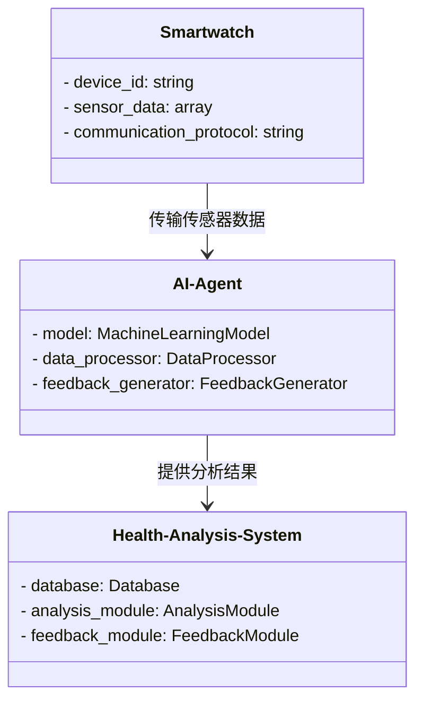
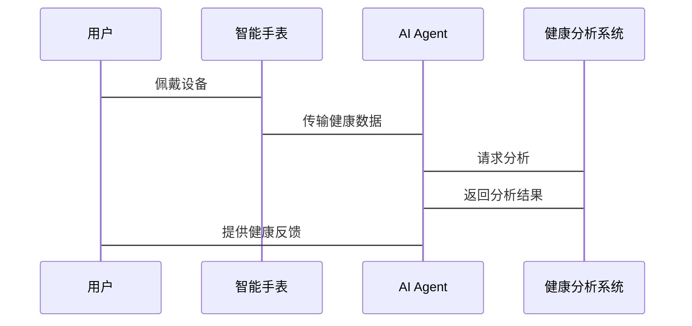

                 

<think>
好的，我现在需要帮用户设计一本关于《AI Agent在智能手表中的健康监测》的目录大纲。用户希望这个大纲详细且逻辑清晰，覆盖从背景到实际应用的各个方面。我得仔细分析用户的需求，确保每个部分都涵盖必要的内容。

首先，用户明确指出要以《AI Agent在智能手表中的健康监测》为标题，并给出了关键词和摘要部分。关键词需要5-7个，我可能需要包括AI Agent、智能手表、健康监测、机器学习、算法原理、系统架构等。摘要部分需要简明扼�地概括文章的核心内容，即AI Agent如何在智能手表中实现健康监测，并结合实际案例进行分析。

接下来，用户希望目录大纲结构详细，分为多个章节，每个章节下还有子章节。我应该先考虑整体结构是否合理，是否覆盖了理论和实践两个方面。从背景介绍到算法原理，再到系统分析和项目实战，最后总结与展望，这样的结构比较合理。

在背景介绍部分，我需要涵盖AI Agent和智能手表的基本概念，以及它们在健康监测中的应用背景。这部分需要让读者了解AI Agent和智能手表的基本知识，以及它们结合的重要性。

核心概念部分，我需要详细讲解AI Agent的工作原理，健康监测的指标，以及两者如何结合。这部分可能需要使用图表来展示实体之间的关系，比如ER图或流程图，帮助读者更好地理解。

算法原理部分，我需要详细讲解AI Agent如何处理健康数据，可能涉及机器学习模型，比如分类和回归算法。我需要用mermaid流程图来展示算法的流程，并附上数学公式，比如线性回归的公式，来解释模型的工作原理。

系统分析与架构设计部分，我需要介绍系统架构，可能包括数据采集、处理、分析和反馈模块。用mermaid的架构图来展示各个模块之间的关系，以及接口设计和交互流程，比如用户佩戴设备，系统采集数据并分析，然后反馈结果。

项目实战部分，我需要提供具体的实现步骤，比如环境配置、数据预处理、模型训练和部署。这部分可能需要Python代码示例，展示如何处理数据和训练模型。同时，还要分析实际案例，比如心率监测，详细说明数据如何被处理和分析。

最后，总结与展望部分，回顾整个内容，并讨论未来的发展方向，比如更精准的模型或多模态数据的融合。同时，加入一些最佳实践和注意事项，帮助读者更好地理解和应用这些技术。

在编写目录时，我需要确保每一章都有足够的细节，涵盖从理论到实践的各个方面。同时，要遵循用户的要求，使用markdown格式，细化到三级目录，并且总字数控制在2000字以内。这样，目录大纲不仅结构清晰，而且内容全面，能够帮助作者全面覆盖主题内容。

总结一下，我的思考过程是从用户的需求出发，分析每个部分需要包含的内容，确保结构合理，内容详实，同时满足格式和字数要求。接下来，我会根据这个思路，逐步展开每个章节，确保覆盖所有必要的细节，帮助用户完成一篇高质量的技术博客文章。
</think>

```markdown
# AI Agent在智能手表中的健康监测

> 关键词：AI Agent，智能手表，健康监测，机器学习，算法原理，系统架构

> 摘要：本文将探讨AI Agent在智能手表中的健康监测应用，从背景介绍到算法原理，再到系统架构设计和项目实战，详细分析AI Agent如何在智能手表中实现健康监测，并结合实际案例进行详细解读。

---

## 第一部分: AI Agent在智能手表中的健康监测概述

### 第1章: 背景介绍

#### 1.1 AI Agent与智能手表的结合
- 1.1.1 AI Agent的基本概念
  - AI Agent的定义
  - AI Agent的分类
  - AI Agent与传统算法的区别

- 1.1.2 智能手表的发展历程
  - 智能手表的发展阶段
  - 智能手表的主要功能

- 1.1.3 AI Agent在智能手表中的应用背景
  - 健康监测的需求增长
  - AI技术在智能手表中的应用趋势

#### 1.2 健康监测的核心概念
- 1.2.1 健康监测的定义与目标
  - 健康监测的定义
  - 健康监测的目标

- 1.2.2 智能手表健康监测的主要指标
  - 心率监测
  - 血氧监测
  - 体温监测
  - 其他健康指标（如运动数据、睡眠质量等）

- 1.2.3 AI Agent在健康监测中的作用
  - 数据处理与分析
  - 个性化健康反馈

---

## 第2章: AI Agent与健康监测的核心概念

### 2.1 AI Agent的基本原理
#### 2.1.1 AI Agent的定义与分类
- AI Agent的定义
- AI Agent的分类（基于智能水平、应用场景等）

#### 2.1.2 AI Agent的核心功能与属性
- 数据采集与处理
- 自动学习与优化
- 个性化反馈

#### 2.1.3 AI Agent与传统算法的区别
- 传统算法的特点
- AI Agent的优势

### 2.2 健康监测的指标与方法
#### 2.2.1 心率监测
- 心率监测的原理
- 心率监测的实现方法

#### 2.2.2 血氧监测
- 血氧监测的原理
- 血氧监测的实现方法

#### 2.2.3 体温监测
- 体温监测的原理
- 体温监测的实现方法

#### 2.2.4 其他健康指标
- 运动数据监测
- 睡眠质量监测

### 2.3 AI Agent与健康监测的结合
#### 2.3.1 AI Agent在健康监测中的核心作用
- 数据的智能处理
- 实时健康反馈

#### 2.3.2 AI Agent与健康监测指标的关系
- 数据输入与输出的关系
- AI Agent对健康指标的优化

#### 2.3.3 AI Agent在健康监测中的边界与外延
- AI Agent的应用范围
- AI Agent的局限性

---

## 第3章: AI Agent与健康监测的核心概念联系

### 3.1 AI Agent与健康监测的核心要素
#### 3.1.1 数据采集与处理
- 数据采集的流程
- 数据预处理的方法

#### 3.1.2 数据分析与决策
- 数据分析的算法选择
- 数据分析的决策逻辑

#### 3.1.3 个性化健康反馈
- 反馈机制的设计
- 个性化反馈的实现

### 3.2 AI Agent与健康监测的实体关系图
```mermaid
er
  actor: 用户
  smartwatch: 智能手表
  health_data: 健康数据
  ai_agent: AI Agent
  health_analysis: 健康分析结果
  feedback: 健康反馈
  用户 --> 智能手表: 佩戴设备
  智能手表 --> 健康数据: 采集数据
  健康数据 --> AI Agent: 传输数据
  AI Agent --> 健康分析结果: 处理数据
  健康分析结果 --> 健康反馈: 提供反馈
```

---

## 第4章: AI Agent健康监测算法原理

### 4.1 AI Agent算法的基本原理
#### 4.1.1 基于机器学习的AI Agent
- 机器学习的定义
- 常见的机器学习算法

#### 4.1.2 基于深度学习的AI Agent
- 深度学习的定义
- 常见的深度学习模型

#### 4.1.3 算法选择与优化
- 算法选择的依据
- 算法优化的方法

### 4.2 健康监测算法的实现流程
#### 4.2.1 数据预处理
- 数据清洗
- 数据标准化

#### 4.2.2 模型训练
- 数据特征提取
- 模型训练过程

#### 4.2.3 模型评估
- 评估指标的选择
- 模型调优

---

## 第5章: 系统分析与架构设计方案

### 5.1 问题场景介绍
- 智能手表健康监测的典型场景
- AI Agent在健康监测中的应用场景

### 5.2 项目介绍
- 项目目标
- 项目范围
- 项目需求

### 5.3 系统功能设计


### 5.4 系统架构设计


### 5.5 系统接口设计
- 接口定义
- 接口实现

### 5.6 系统交互流程


---

## 第6章: 项目实战

### 6.1 环境安装
- 开发工具的安装与配置
- 数据集的准备

### 6.2 系统核心实现源代码
```python
# 示例代码：AI Agent健康监测算法实现
class AI-Agent:
    def __init__(self, model):
        self.model = model

    def process_data(self, data):
        # 数据预处理
        processed_data = self._preprocess(data)
        return processed_data

    def _preprocess(self, data):
        # 数据清洗和标准化
        return data

    def analyze(self, processed_data):
        # 数据分析
        result = self.model.predict(processed_data)
        return result

    def generate_feedback(self, result):
        # 生成健康反馈
        feedback = self._generate_feedback(result)
        return feedback

    def _generate_feedback(self, result):
        # 反馈生成逻辑
        return "您的健康数据正常，请继续保持。"
```

### 6.3 代码应用解读与分析
- 代码功能模块的解读
- 代码实现细节的分析

### 6.4 实际案例分析
- 实际案例的背景介绍
- 数据处理与分析过程
- 结果展示与解读

### 6.5 项目小结
- 项目实现的总结
- 经验与教训

---

## 第7章: 总结与展望

### 7.1 总结
- AI Agent在智能手表中的健康监测应用总结
- 项目实现的主要成果

### 7.2 未来展望
- AI Agent在健康监测中的发展方向
- 智能手表健康监测的未来趋势

### 7.3 最佳实践 tips
- 开发中的注意事项
- 使用中的注意事项

### 7.4 小结
- 重申文章的核心观点
- 展望未来的研究方向

---

## 作者：AI天才研究院/AI Genius Institute & 禅与计算机程序设计艺术 /Zen And The Art of Computer Programming

---

> 本文基于《AI Agent在智能手表中的健康监测》这一主题，从背景介绍到算法原理，再到系统架构设计和项目实战，全面深入地探讨了AI Agent在智能手表中的健康监测应用。通过本文的分析与解读，读者可以系统地了解AI Agent在健康监测中的核心作用及其实际应用场景。

```

