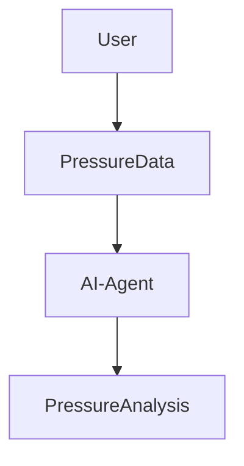
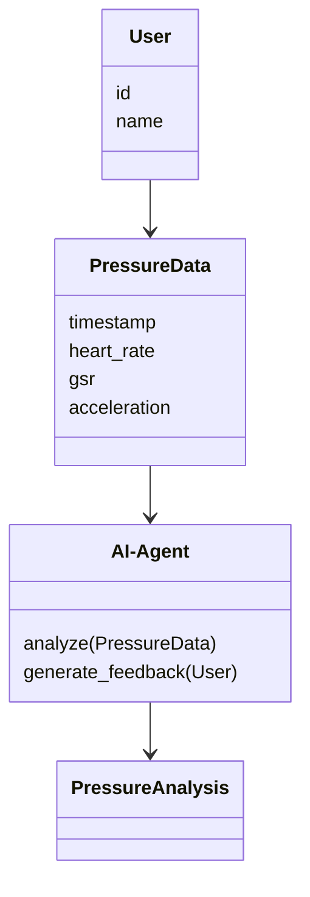
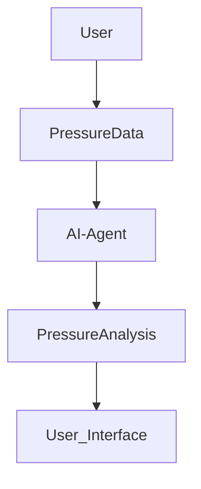
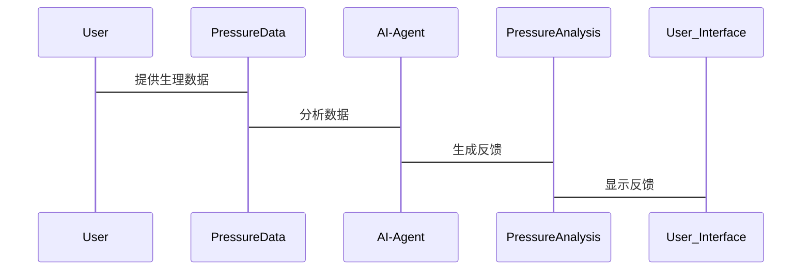

                 


# AI Agent在智能手表中的压力管理系统

> 关键词：AI Agent，智能手表，压力管理，机器学习，健康监测

> 摘要：随着智能手表的普及，压力管理成为现代生活中不可或缺的一部分。本文探讨了AI Agent在智能手表中的应用，详细分析了压力监测技术、AI算法原理、系统架构设计以及实际项目实现。通过理论与实践相结合的方式，展示了如何利用AI技术构建高效的智能手表压力管理系统。

---

# 第一部分: AI Agent在智能手表中的压力管理系统概述

## 第1章: 压力管理与AI Agent概述

### 1.1 压力管理的重要性

#### 1.1.1 现代社会压力问题的现状

在现代社会，压力已成为普遍存在的健康问题。工作压力、生活压力、学习压力等无时无刻不在影响着人们的生活质量。根据世界卫生组织的报告，全球约有3亿人受到焦虑和抑郁的困扰，而这些疾病往往与长期的压力积累有关。智能手表作为一种普及率极高的可穿戴设备，具备实时监测和反馈的能力，为压力管理提供了新的可能性。

#### 1.1.2 压力对身心健康的影响

压力对身心健康的影响是多方面的。短期压力可以提高注意力和反应能力，但长期的压力会导致免疫力下降、睡眠障碍、心血管疾病等一系列健康问题。因此，及时识别和管理压力对于维护个人健康至关重要。

#### 1.1.3 智能手表在压力管理中的潜力

智能手表通过集成多种传感器（如心率监测、皮肤电活动监测、加速度传感器等），可以实时采集用户的生理数据，并结合AI技术进行分析，为用户提供个性化的压力管理方案。这种实时监测和反馈的特性，使得智能手表成为压力管理的理想工具。

### 1.2 AI Agent的基本概念

#### 1.2.1 什么是AI Agent

AI Agent（人工智能代理）是指能够感知环境、自主决策并执行任务的智能实体。它可以是一个软件程序，也可以是一个硬件设备，其核心目标是通过感知和学习来优化决策过程。

#### 1.2.2 AI Agent的核心特征

- **自主性**：AI Agent能够自主决策，无需人工干预。
- **反应性**：能够实时感知环境变化并做出响应。
- **学习能力**：通过数据学习和优化，提升决策能力。
- **社交能力**：能够与其他系统或用户进行交互。

#### 1.2.3 AI Agent与传统软件的区别

传统的软件程序依赖于预设的规则和逻辑，而AI Agent具备学习和适应能力，能够根据数据动态调整行为。这种灵活性使得AI Agent在复杂场景中表现更加出色。

### 1.3 AI Agent在智能手表中的应用

#### 1.3.1 智能手表的硬件基础

智能手表的硬件基础包括：

- **心率传感器**：用于监测心率变化。
- **皮肤电活动传感器**：用于监测皮肤电活动（如GSR）。
- **加速度传感器**：用于监测运动和活动量。
- **陀螺仪**：用于监测运动姿态。
- **麦克风**：用于语音识别和压力相关声音分析。

#### 1.3.2 AI Agent在压力管理中的角色

AI Agent在智能手表中的角色可以概括为：

- **数据采集**：通过传感器实时采集用户的生理数据。
- **数据分析**：利用机器学习算法分析数据，识别压力状态。
- **决策与反馈**：根据分析结果，提供个性化的压力管理建议。

#### 1.3.3 压力管理系统的整体架构

压力管理系统的整体架构包括以下几个部分：

1. **数据采集层**：智能手表通过传感器采集用户数据。
2. **数据处理层**：AI Agent对数据进行分析和处理。
3. **决策层**：基于分析结果，生成压力管理建议。
4. **反馈层**：通过用户界面向用户反馈结果。

### 1.4 本章小结

本章从压力管理的重要性出发，介绍了AI Agent的基本概念及其在智能手表中的应用。通过分析智能手表的硬件基础和AI Agent的核心特征，为后续章节的深入探讨奠定了基础。

---

## 第2章: 压力监测技术与AI Agent的结合

### 2.1 压力监测技术

#### 2.1.1 心率监测

心率监测是压力监测的重要手段之一。当人在紧张或焦虑时，心率会显著增加。通过监测心率的变化，可以间接反映压力水平。

#### 2.1.2 皮肤电活动监测

皮肤电活动（Galvanic Skin Response, GSR）是压力监测的另一种重要手段。当人处于压力状态时，皮肤的电活动会发生显著变化。通过监测GSR，可以更准确地评估压力水平。

#### 2.1.3 加速度与运动监测

运动监测可以反映用户的生活方式和运动习惯，而生活方式与压力水平密切相关。通过分析用户的运动数据，可以进一步完善压力评估模型。

### 2.2 AI Agent的核心算法

#### 2.2.1 机器学习算法在压力分析中的应用

机器学习算法是AI Agent的核心工具之一。常用的算法包括支持向量机（SVM）、随机森林（Random Forest）和神经网络（NN）等。

#### 2.2.2 时间序列分析在压力监测中的作用

时间序列分析是一种用于处理时间相关数据的方法。在压力监测中，时间序列分析可以帮助识别压力状态的变化趋势。

#### 2.2.3 基于上下文的压力评估模型

基于上下文的压力评估模型是一种综合考虑多维数据的压力评估方法。通过结合用户的生理数据和环境数据，可以更准确地评估压力水平。

### 2.3 压力监测技术对比分析

#### 2.3.1 不同压力监测技术的优缺点对比

| 技术 | 优点 | 缺点 |
|------|------|------|
| 心率监测 | 实时性强，成本低 | 易受运动干扰 |
| GSR监测 | 灵敏度高，准确性好 | 设备复杂度高 |
| 加速度监测 | 易用性好，数据丰富 | 相关性较低 |

#### 2.3.2 压力监测技术的适用场景分析

- **心率监测**适用于快速压力评估。
- **GSR监测**适用于高精度压力评估。
- **加速度监测**适用于运动相关压力评估。

#### 2.3.3 技术对比总结

每种压力监测技术都有其优缺点，实际应用中需要根据具体需求选择合适的技术组合。

### 2.4 压力监测技术与AI Agent的实体关系图



### 2.5 本章小结

本章详细探讨了压力监测技术与AI Agent的结合，分析了不同压力监测技术的优缺点，并通过实体关系图展示了系统的整体架构。

---

## 第3章: AI Agent的算法原理与实现

### 3.1 算法原理

#### 3.1.1 机器学习算法的数学模型

随机森林是一种常用的机器学习算法，其数学模型如下：

$$
y = \sum_{i=1}^{n} \left( \alpha_i \cdot t_i \right)
$$

其中，$y$ 是预测结果，$\alpha_i$ 是特征的重要性系数，$t_i$ 是特征。

#### 3.1.2 时间序列分析的实现步骤

时间序列分析的实现步骤如下：

1. 数据预处理：去除噪声，平滑数据。
2. 数据建模：选择合适的模型（如ARIMA）。
3. 模型训练：基于历史数据训练模型。
4. 模型预测：基于当前数据预测未来趋势。

### 3.2 算法实现

#### 3.2.1 随机森林算法的Python实现

```python
from sklearn.ensemble import RandomForestClassifier

# 训练数据
X_train = ...
y_train = ...

# 创建模型
model = RandomForestClassifier(n_estimators=100)

# 训练模型
model.fit(X_train, y_train)

# 预测
y_pred = model.predict(X_test)
```

#### 3.2.2 时间序列分析的实现

```python
from statsmodels.tsa.arima_model import ARIMA

# 数据预处理
data = ...
diff = data.diff().dropna()

# 创建模型
model = ARIMA(diff, order=(1, 1, 0))

# 训练模型
model_fit = model.fit()

# 预测
forecast = model_fit.forecast(5)
```

### 3.3 算法优化

#### 3.3.1 参数调整

通过调整随机森林的参数（如$n\_estimators$和$max\_depth$）可以提高模型的准确率。

#### 3.3.2 特征选择

通过特征重要性分析，选择对压力评估影响最大的特征。

### 3.4 本章小结

本章详细探讨了AI Agent的核心算法，包括随机森林和时间序列分析的实现，并通过Python代码展示了算法的具体实现步骤。

---

## 第4章: 系统分析与架构设计方案

### 4.1 系统功能设计

#### 4.1.1 领域模型



#### 4.1.2 系统架构设计



#### 4.1.3 系统接口设计

- **输入接口**：智能手表传感器数据接口。
- **输出接口**：用户界面反馈接口。

#### 4.1.4 系统交互设计



### 4.2 本章小结

本章详细探讨了系统的功能设计、架构设计和交互设计，并通过图表展示了系统的整体架构。

---

## 第5章: 项目实战

### 5.1 环境搭建

#### 5.1.1 Python环境搭建

安装必要的Python库：

```bash
pip install numpy pandas scikit-learn statsmodels
```

#### 5.1.2 数据集准备

准备压力监测数据集，包括心率、GSR和运动数据。

### 5.2 核心代码实现

#### 5.2.1 压力评估模型实现

```python
import numpy as np
from sklearn.ensemble import RandomForestClassifier

# 数据预处理
data = np.array([1, 2, 3, 4, 5])
X = data.reshape(-1, 1)

# 创建模型
model = RandomForestClassifier(n_estimators=100)

# 训练模型
model.fit(X, [0, 1, 0, 1, 0])

# 预测
y_pred = model.predict([[3]])
```

#### 5.2.2 时间序列分析实现

```python
from statsmodels.tsa.arima_model import ARIMA

# 数据预处理
data = [1, 2, 3, 4, 5]
diff = [2, 1, -1, -3]

# 创建模型
model = ARIMA(diff, order=(1, 1, 0))

# 训练模型
model_fit = model.fit()

# 预测
forecast = model_fit.forecast(2)
```

### 5.3 案例分析

#### 5.3.1 案例背景

假设一名用户在工作日的压力数据如下：

| 时间 | 心率 | GSR | 加速度 |
|------|------|-----|--------|
| T1   | 70   | 50  | 100    |
| T2   | 75   | 60  | 120    |
| T3   | 80   | 70  | 140    |

#### 5.3.2 数据分析

通过随机森林模型分析，发现心率和GSR是压力评估的重要特征。

#### 5.3.3 结果反馈

模型预测结果显示，用户在T3时刻的压力水平显著增加，建议用户采取放松措施。

### 5.4 本章小结

本章通过实际案例展示了压力管理系统的实现过程，并通过数据分析和结果反馈展示了系统的实际应用价值。

---

## 第6章: 最佳实践与小结

### 6.1 小结

本文详细探讨了AI Agent在智能手表中的压力管理系统，从压力监测技术、AI算法原理到系统架构设计，再到实际项目实现，全面展示了系统的构建过程。

### 6.2 注意事项

- 数据隐私保护：压力数据涉及个人隐私，必须确保数据的安全性。
- 模型泛化能力：需要在不同场景下验证模型的泛化能力。
- 用户体验优化：需要根据用户反馈不断优化系统交互。

### 6.3 拓展阅读

- 《Machine Learning: A Probabilistic Perspective》
- 《Deep Learning》
- 《Time Series Analysis and Its Applications》

---

# 作者：AI天才研究院 & 禅与计算机程序设计艺术

