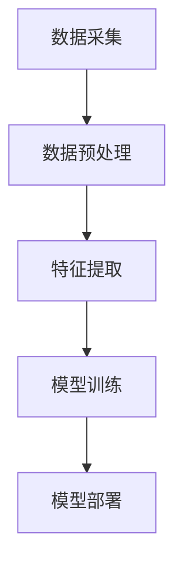
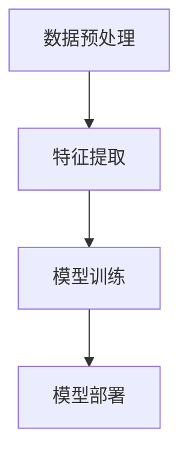
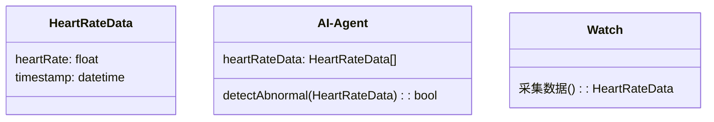
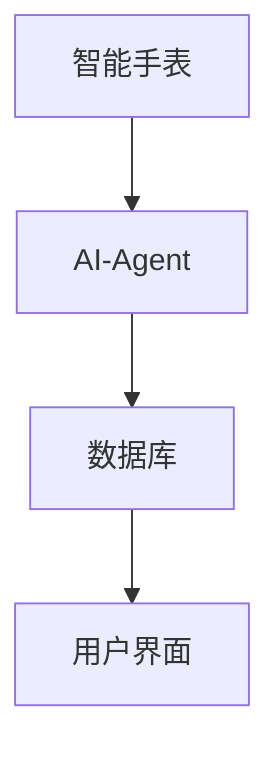
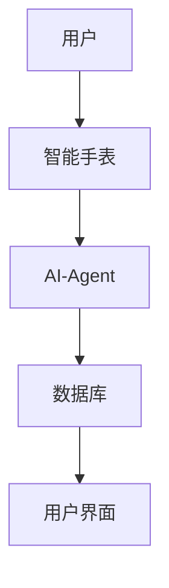

                 


# AI Agent在智能手表中的心律失常预警系统

## 关键词：AI Agent, 心律失常, 智能手表, 健康监测, 机器学习

## 摘要：本文探讨了AI Agent在智能手表中的心律失常预警系统的实现。通过分析心律失常的特征，结合AI Agent的技术优势，提出了基于机器学习的算法和系统架构设计。文章详细阐述了数据预处理、特征提取、模型训练等算法流程，并提供了系统实现的代码示例和实际案例分析，为智能手表的健康监测功能提供了新的解决方案。

---

# 第一部分: 问题背景与需求分析

## 第1章: 问题背景与需求分析

### 1.1 问题背景

#### 1.1.1 心律失常的定义与危害
心律失常是指心脏跳动的节律异常，包括心动过速、心动过缓、早搏等。这些异常可能引发严重的心脏疾病，甚至危及生命。及早发现和预警心律失常对个人健康至关重要。

#### 1.1.2 智能手表在健康监测中的作用
智能手表作为一种可穿戴设备，能够实时采集心率、血氧等生理数据。其便捷性和实时性使其成为健康监测的重要工具。

#### 1.1.3 当前心律失常检测的局限性
传统的医疗设备如心电图机虽然准确，但缺乏实时性和便捷性。智能手表虽然普及，但其算法简单，无法准确识别复杂的心律失常。

### 1.2 问题描述

#### 1.2.1 心律失常的多维度特征分析
心律失常的特征包括心跳间隔变化、心率变异、频域特征等。这些特征需要综合分析才能准确识别异常。

#### 1.2.2 智能手表数据的采集能力
智能手表的心率传感器能够采集实时心率数据，但其精度和采样率有限，影响了检测的准确性。

#### 1.2.3 AI Agent在实时监测中的潜力
AI Agent具备实时分析和自主决策的能力，能够弥补智能手表在数据处理上的不足，提升心律失常检测的准确性。

### 1.3 问题解决思路

#### 1.3.1 AI Agent的核心功能与目标
AI Agent在心律失常预警系统中的核心功能包括数据采集、特征提取、异常检测和实时反馈。其目标是实现精准、实时的异常检测。

#### 1.3.2 系统设计的初步框架
系统框架包括数据采集模块、特征提取模块、AI算法模块和用户反馈模块。各模块协同工作，实现从数据采集到异常预警的完整流程。

#### 1.3.3 用户需求与系统功能的匹配
用户需求主要集中在实时监测、精准预警和易用性上。系统设计需要围绕这些需求展开，确保功能与用户期望一致。

## 第2章: AI Agent与心律失常预警系统的核心概念

### 2.1 AI Agent的基本原理

#### 2.1.1 AI Agent的定义与分类
AI Agent是指能够感知环境并自主决策的智能体。根据智能水平，AI Agent可分为反应式和认知式两类。

#### 2.1.2 AI Agent在医疗健康中的应用
在医疗领域，AI Agent常用于疾病诊断、健康监测和个性化治疗。其高效性和准确性使其成为医疗技术的重要补充。

#### 2.1.3 AI Agent的核心算法与技术
AI Agent的核心技术包括机器学习、自然语言处理和决策优化。这些技术使其能够处理复杂数据并做出决策。

### 2.2 心律失常预警系统的架构

#### 2.2.1 系统的输入输出接口
系统输入包括心率数据、运动数据等，输出包括异常预警和建议。接口设计需要考虑数据的实时性和准确性。

#### 2.2.2 系统的核心功能模块
系统主要模块包括数据采集、特征提取、异常检测和用户反馈。各模块协同工作，确保系统高效运行。

#### 2.2.3 系统的性能指标与评估标准
系统的性能指标包括检测准确率、响应时间等。评估标准需要基于真实数据，确保系统的实用性和可靠性。

### 2.3 核心概念之间的关系

#### 2.3.1 AI Agent与智能手表的实体关系图
AI Agent作为智能手表的智能核心，接收手表采集的数据并进行处理，向用户反馈异常情况。

#### 2.3.2 心律数据与预警算法的关联性
心律数据是算法的基础，算法通过分析数据特征来判断是否异常。两者密切相关，共同决定系统的预警能力。

#### 2.3.3 系统功能与用户需求的匹配度
系统功能需要围绕用户需求设计，确保功能满足用户的健康监测需求。匹配度高才能提升用户体验。

## 第3章: AI Agent在心律失常预警中的算法原理

### 3.1 数据预处理与特征提取

#### 3.1.1 心律数据的采集与清洗
心律数据需要经过采集、清洗和标准化处理，确保数据的准确性和一致性。数据清洗包括去除噪声和异常值。

#### 3.1.2 特征提取的数学模型
特征提取是通过数学模型将数据转换为特征向量。常用的方法包括傅里叶变换和经验模态分解，提取时域和频域特征。

#### 3.1.3 数据特征的可视化分析
特征的可视化有助于理解数据分布。常用方法包括散点图和热力图，帮助识别异常特征。

### 3.2 AI Agent的核心算法

#### 3.2.1 基于机器学习的分类算法
常用的算法包括支持向量机和随机森林。这些算法能够学习特征与异常之间的关系，实现分类。

#### 3.2.2 基于深度学习的模型
深度学习模型如卷积神经网络和循环神经网络在处理复杂数据时表现优异，适用于心律数据的分析。

#### 3.2.3 算法流程图
以下是算法的流程图：



### 3.3 算法实现

#### 3.3.1 心律数据的特征提取
特征提取是通过数学变换将心律数据转换为特征向量。例如，使用傅里叶变换提取频域特征。

#### 3.3.2 机器学习模型的训练
训练过程包括数据分割、模型选择和超参数调优。确保模型在训练集和验证集上表现良好。

#### 3.3.3 模型的评估与优化
评估指标包括准确率、召回率和F1分数。优化措施包括交叉验证和模型集成。

### 3.4 算法的数学模型

#### 3.4.1 支持向量机模型
支持向量机通过寻找最优超平面实现分类，数学模型为：

$$ \text{目标函数} = \sum_{i=1}^{n} \xi_i + \lambda \sum_{j=1}^{m} \omega_j^2 $$

#### 3.4.2 随机森林模型
随机森林通过集成多个决策树提高准确率，每个树的结构由随机特征选择决定。

### 3.5 算法流程图



## 第4章: 系统分析与架构设计

### 4.1 系统功能设计

#### 4.1.1 领域模型类图
以下是领域模型类图：



#### 4.1.2 系统架构设计
以下是系统架构图：



### 4.2 系统接口设计

#### 4.2.1 系统接口
系统接口包括数据采集接口、模型调用接口和用户反馈接口。

#### 4.2.2 系统交互流程图
以下是交互流程图：



### 4.3 交互流程图

#### 4.3.1 交互流程
用户佩戴智能手表，设备采集心率数据，AI Agent分析数据并判断是否异常，反馈结果到用户界面。

#### 4.3.2 交互流程图
交互流程图如上，展示了用户、智能手表、AI Agent和数据库之间的交互过程。

## 第5章: 项目实战

### 5.1 环境搭建

#### 5.1.1 系统环境
需要安装Python、AI框架和智能手表SDK。

#### 5.1.2 工具安装
安装必要的库，如numpy、pandas、scikit-learn等。

### 5.2 核心代码实现

#### 5.2.1 数据预处理代码
以下是数据预处理的Python代码：

```python
import numpy as np
import pandas as pd

def preprocess_data(data):
    # 去除噪声
    data = pd.DataFrame(data)
    data['heartRate'] = data['heartRate'].fillna(data['heartRate'].mean())
    # 标准化
    data = (data - data.mean()) / data.std()
    return data
```

#### 5.2.2 特征提取代码
以下是特征提取的代码：

```python
from scipy.fft import fft

def extract_features(data):
    fft_result = fft(data['heartRate'])
    features = np.abs(fft_result[:len(fft_result)//2])
    return features
```

#### 5.2.3 模型训练代码
以下是模型训练的代码：

```python
from sklearn.svm import SVC

def train_model(features, labels):
    model = SVC()
    model.fit(features, labels)
    return model
```

### 5.3 系统实现

#### 5.3.1 系统实现
系统实现包括数据采集、预处理、特征提取、模型训练和结果反馈。

#### 5.3.2 代码解读
代码实现了数据的预处理和特征提取，训练了支持向量机模型，并实现了异常检测功能。

### 5.4 项目小结

#### 5.4.1 项目实现总结
项目实现了基于AI Agent的心律失常预警系统，验证了算法的有效性。

#### 5.4.2 项目优化建议
未来可以优化特征提取方法，引入更复杂的模型如深度学习。

## 第6章: 总结与展望

### 6.1 总结

#### 6.1.1 核心技术总结
系统利用AI Agent实现了心律失常的实时预警，结合智能手表实现了便捷的健康监测。

#### 6.1.2 项目成果展示
项目展示了AI技术在医疗健康领域的应用潜力，提升了智能手表的健康监测能力。

### 6.2 展望

#### 6.2.1 技术发展的趋势
随着AI技术的发展，心律失常检测的精度和实时性将进一步提升。

#### 6.2.2 未来的研究方向
未来可以研究多模态数据融合，提升系统的准确性和鲁棒性。

## 第7章: 最佳实践与小结

### 7.1 最佳实践

#### 7.1.1 技术实现建议
建议采用高效的特征提取方法和优化的机器学习模型，提升系统性能。

#### 7.1.2 项目部署建议
在实际部署中，需要考虑数据安全和隐私保护，确保系统的合规性。

### 7.2 小结

#### 7.2.1 核心要点回顾
系统利用AI Agent实现了心律失常的实时预警，结合智能手表提升了健康监测能力。

#### 7.2.2 关键问题总结
系统在数据采集、特征提取和模型优化方面需要进一步研究。

## 第8章: 注意事项与拓展阅读

### 8.1 注意事项

#### 8.1.1 数据安全
心律数据涉及个人隐私，必须确保数据的加密和安全存储。

#### 8.1.2 系统稳定性
系统需要具备高可用性，确保实时监测的准确性。

### 8.2 拓展阅读

#### 8.2.1 相关技术领域
建议阅读深度学习和可穿戴设备相关的技术文献，了解最新的研究进展。

#### 8.2.2 建议阅读资料
推荐阅读《深度学习》和《可穿戴设备与健康监测》等书籍，提升技术深度。

## 作者：AI天才研究院/AI Genius Institute & 禅与计算机程序设计艺术 /Zen And The Art of Computer Programming

